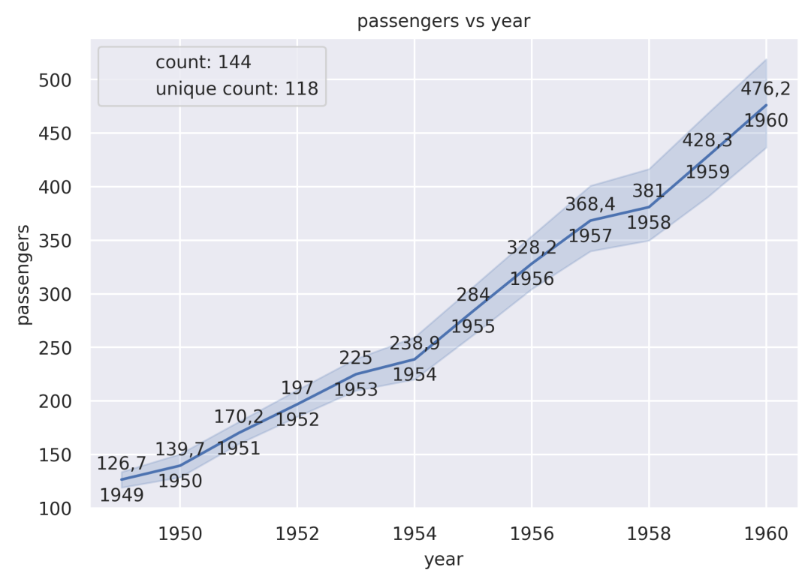
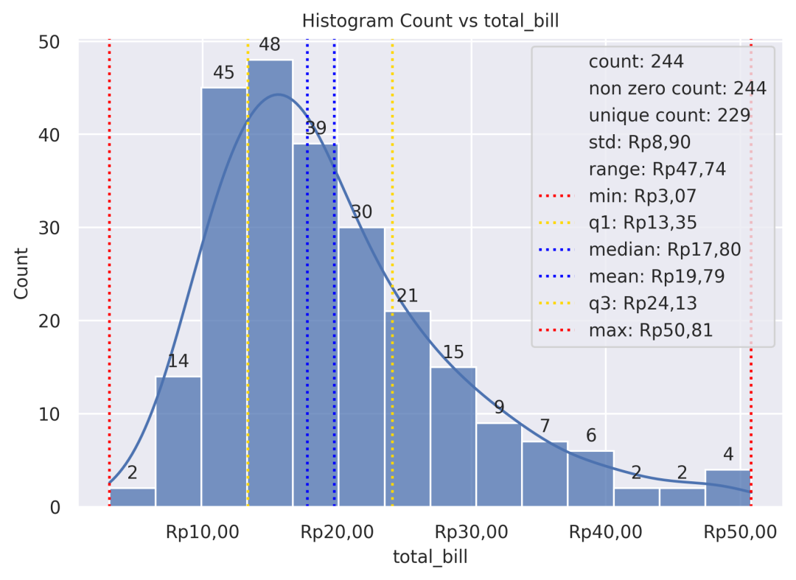
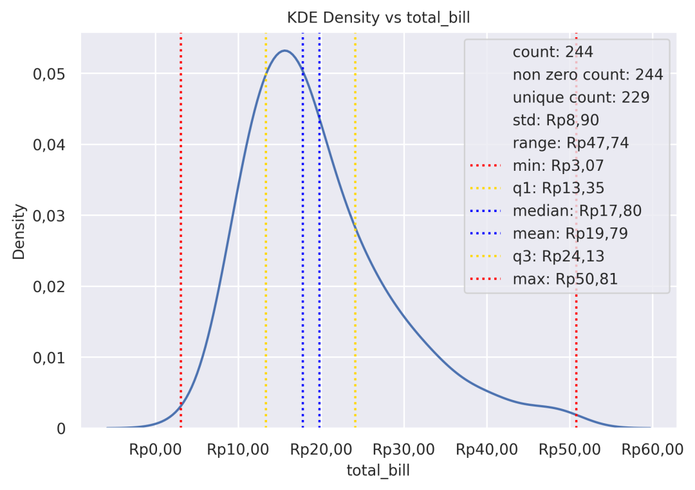
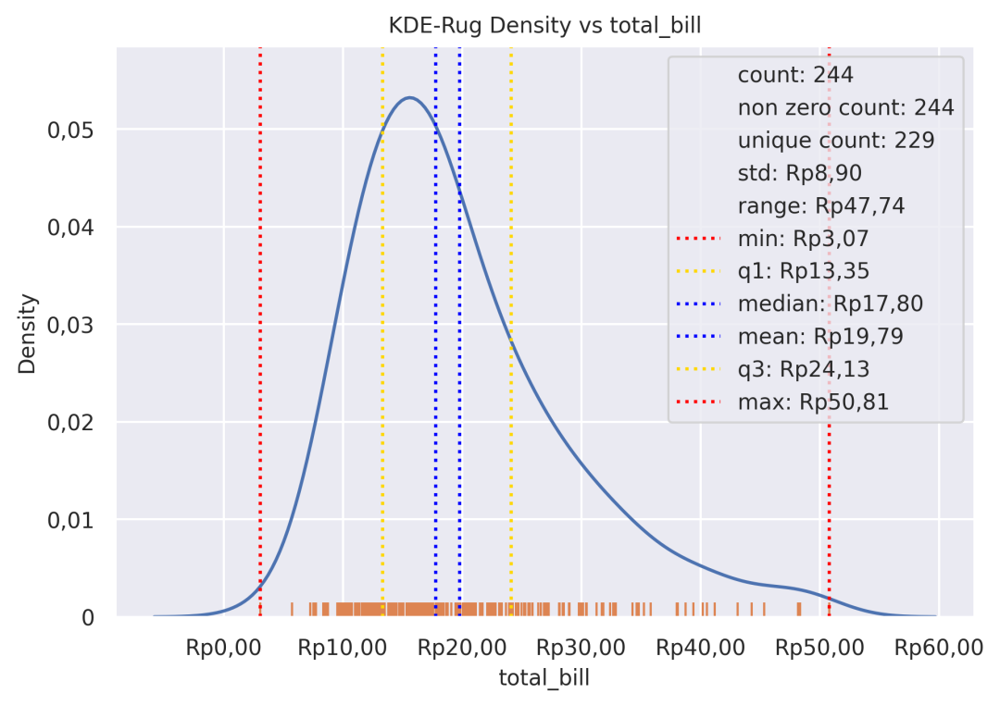
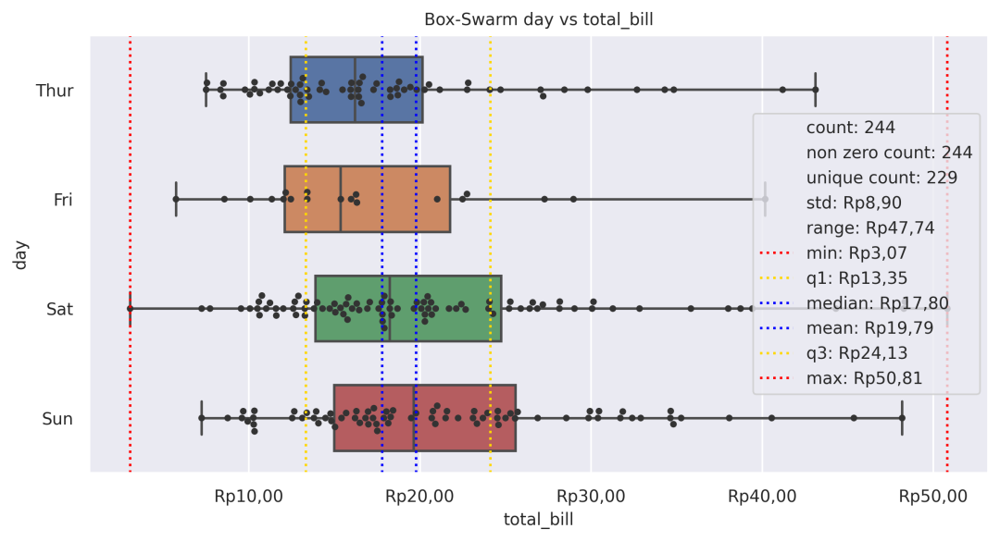
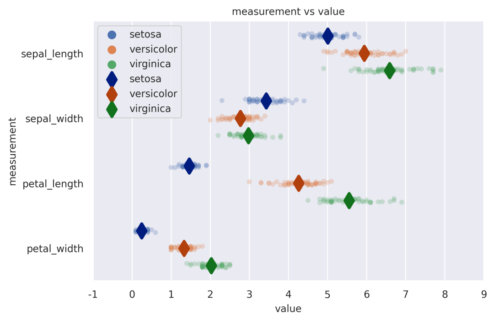
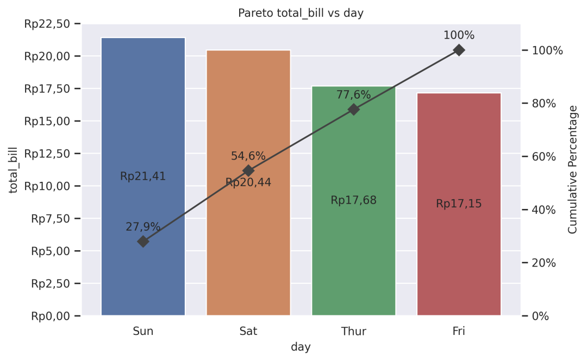
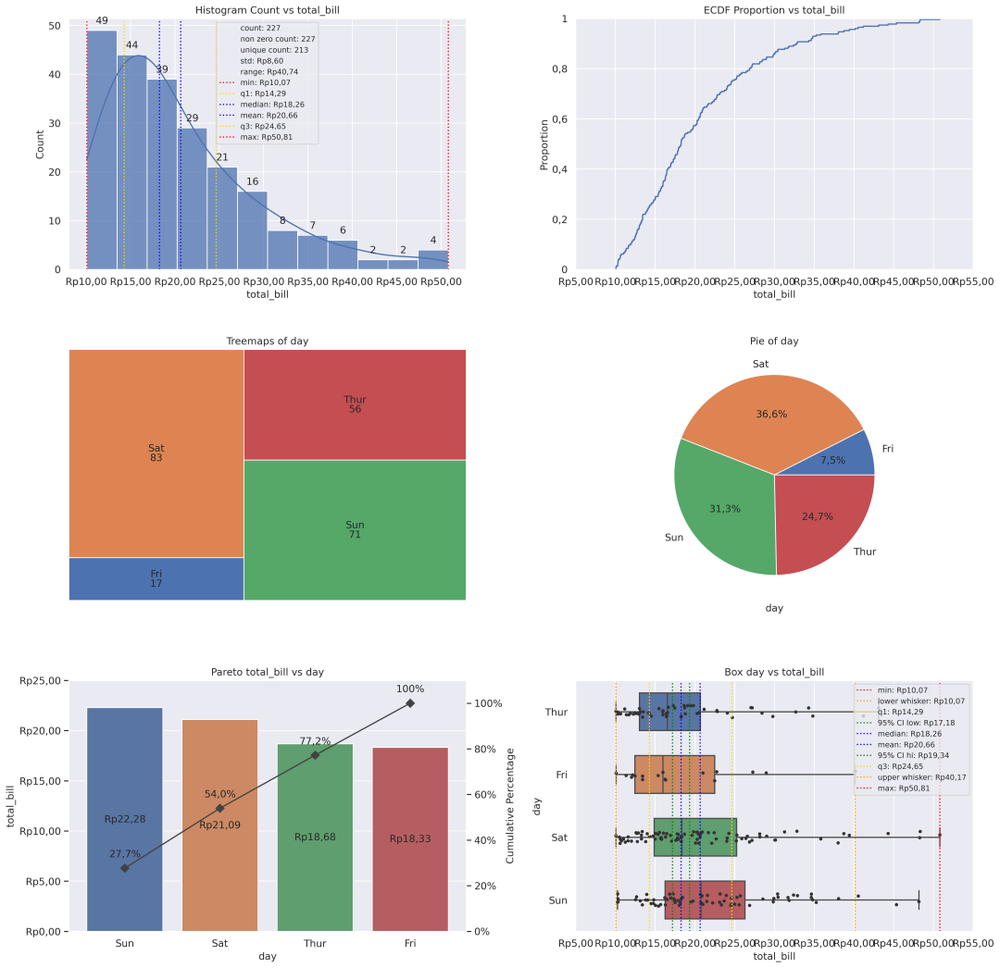

<a name="B9r1M"></a>
## Python-grplot包介绍
介绍一个Python语言中不常用但非常好用的统计分析可视化包-grplot，它可以快速帮助使用者构建出好看的统计插图，基于 numpy、scipy、matplotlib、seaborn、squarify以及pandas等拓展库，只需一行代码，就能绘制出完整、美观的统计图。
<a name="WQhPk"></a>
### 安装依赖
grplot 支持 Python 3.6 以上版本。<br />安装时需要使用 numpy、scipy、matplotlib、pandas 和 ipython。如果安装了 statsmodels，某些函数将选择使用 statsmodels。
<a name="x2fbw"></a>
### 安装方式
可以使用 pip 或conda命令来安装 grplot：
```bash
pip install grplot
#或者
conda install -c conda-forge grplot
```
<a name="wpneg"></a>
## 可视化案例
<a name="pU1e5"></a>
### lineplot
```python
from grplot import plot2d
import grplot_seaborn as gs
gs.set_theme(context='notebook', style='darkgrid', palette='deep')


flights = gs.load_dataset('flights')
ax = plot2d(plot='lineplot',
            df=flights,
            x='year',
            y='passengers',
            sep={'passengers':'.', 'year':None},
            text=True,
            ystatdesc='count+unique',
            title='passengers vs year',
            legend_loc='upper left',
            ci=95)
```

<a name="xI3VM"></a>
### histplot
```python
from grplot import plot2d
import grplot_seaborn as gs
gs.set_theme(context='notebook', style='darkgrid', palette='deep')


tips = gs.load_dataset('tips')
ax = plot2d(plot='histplot',
            df=tips,
            x='total_bill',
            xsep='.c',
            ysep='.',
            statdesc={'total_bill':'general'},
            xtick_add='Rp(_)',
            ytext='h',
            title='Histogram Count vs total_bill',
            kde=True,
            alpha=0.75)
```

<a name="ryCh5"></a>
### KDE plot
```python
from grplot import plot2d
import grplot_seaborn as gs
gs.set_theme(context='notebook', style='darkgrid', palette='deep')


tips = gs.load_dataset('tips')
ax = plot2d(plot='kdeplot',
            df=tips,
            x='total_bill',
            xsep='.c',
            ysep='.',
            statdesc={'total_bill':'general'},
            xtick_add='Rp(_)',
            title='KDE Density vs total_bill')
```

<a name="M8yJc"></a>
### Rug plot
```python
from grplot import plot2d
import grplot_seaborn as gs
gs.set_theme(context='notebook', style='darkgrid', palette='deep')


tips = gs.load_dataset('tips')
ax = plot2d(plot='kdeplot+rugplot',
            df=tips,
            x='total_bill',
            xsep='.c',
            ysep='.',
            statdesc={'total_bill':'general'},
            xtick_add='Rp(_)',
            title='KDE-Rug Density vs total_bill')
```

<a name="qd5Gm"></a>
### Swarm plot
```python
from grplot import plot2d
import grplot_seaborn as gs
gs.set_theme(context='notebook', style='darkgrid', palette='deep')


tips = gs.load_dataset('tips')
ax = plot2d(plot='boxplot+swarmplot',
            df=tips,
            x='total_bill',
            y='day',
            figsize=[10,6],
            sep='.c',
            xstatdesc='general',
            xtick_add='Rp(_)',
            title='Box-Swarm day vs total_bill')
```

<a name="zVa0q"></a>
### Point plot
```python
from grplot import plot2d
import grplot_seaborn as gs
import pandas as pd
gs.set_theme(context='notebook', style='darkgrid', palette='deep')


iris = gs.load_dataset('iris')
iris = pd.melt(iris, 'species', var_name='measurement')
ax = plot2d(plot='stripplot+pointplot',
            df=iris,
            x='value',
            y='measurement',
            sep='.',
            title='measurement vs value',
            hue='species')
```

<a name="bCz8k"></a>
### Pareto plot
```python
from grplot import plot2d
import grplot_seaborn as gs
gs.set_theme(context='notebook', style='darkgrid', palette='deep')


tips = gs.load_dataset('tips')
ax = plot2d(plot='paretoplot',
            df=tips,
            x='day',
            y='total_bill',
            sep='.c',
            ytick_add='Rp(_)',
            ytext='h+i',
            title='Pareto total_bill vs day')
```
<br />除了上述介绍的图形之外，grplot包还可以绘制二维多姿图样式，可视化结果如下：<br />更多关于grplot包的语法和其他案例，可参考：**grplot包官网**
<a name="MTYQB"></a>
## 参考资料
grplot包官网：[https://github.com/ghiffaryr/grplot](https://github.com/ghiffaryr/grplot)
