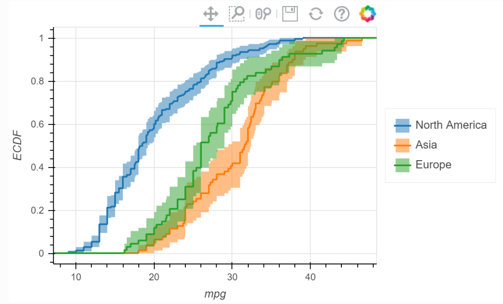

Python<br />一个优秀绘制统计图表的第三方库-iqplot，该库是基于Python语言的，其所提供的图表类型虽然不多，但在科研学术绘图任务中出现的频次较多，本期就其基本情况和可绘制的图表类型做一个简单介绍，主要内容如下：

- Python-iqplot库介绍
- Python-iqplot库示例演示
<a name="fPEbV"></a>
## Python-iqplot库介绍
Python的iqplot库是基于功能更加强大的bokeh库上，但其所绘制的图表又是常见的统计图表，特别是在一些科研绘图任务中。iqplot库的主要功能是实现对一个定量变量和任意多个分类变量的数据集进行高级绘图。其所提供的图表类型主要包括带有分类轴的图(Plots with a categorical axis) 和不带分类轴的图(Plots without a categorical axis)。<br />具体图表类型有：**Box plots**、**Strip plots**、**Strip-box plots**、**Histograms**和**ECDFs**。更多详细内容查看：[**Python-iqplot库官网**](https://iqplot.github.io/index.html)
<a name="Wugia"></a>
## Python-iqplot库示例演示
这一部分将列举Python-iqplot库所能绘制的图表类型，对其有一定的了解。
<a name="LZzBt"></a>
### 「Box plots」
```python
import numpy as np
import pandas as pd
import iqplot
import bokeh.sampledata.autompg
import bokeh.io
bokeh.io.output_notebook()

p_box = iqplot.box(data=df, q="mpg", cats="origin", title="box")
```

```python
p = iqplot.box(
    data=df,
    q="mpg",
    cats="origin",
    whisker_caps=True,
    outlier_marker="diamond",
    box_kwargs=dict(fill_color="#7C0000"),
    whisker_kwargs=dict(line_color="#7C0000", line_width=2),
)

bokeh.io.show(p)
```

<a name="qVyV6"></a>
###  「Strip plots」
```python
p_strip = iqplot.strip(data=df, q="mpg", cats="origin", title="strip")
```

```python
p = iqplot.strip(
    data=df,
    q="mpg",
    cats="origin",
    marker="dash",
    marker_kwargs=dict(alpha=0.3),
)

bokeh.io.show(p)
```

```python
p = iqplot.strip(
    df_pc,
    q="val",
    cats=["day", "exp"],
    q_axis="y",
    frame_width=500,
    color_column="exp",
    parcoord_column="trial",
)

bokeh.io.show(p)
```

<a name="vv1zb"></a>
### 「Strip-box plots」
```python
p_stripbox = iqplot.stripbox(data=df, q="mpg", cats="origin", title="strip-box")
```

<a name="d0d9t"></a>
### 「Histograms」
```python
p_histogram = iqplot.histogram(data=df, q="mpg", cats="origin", title="histogram")
```

```python
bins = np.arange(8, 50, 3)

p = iqplot.histogram(
    data=df, q="mpg", cats="origin", bins=bins, density=True, frame_width=550,
    legend_location="right",
)

bokeh.io.show(p)
```

<a name="jQC8Y"></a>
### 「ECDFs」
```python
p_ecdf = iqplot.ecdf(data=df, q="mpg", cats="origin", title="ecdf")
```

```python
p = iqplot.ecdf(data=df, q="mpg", cats="origin", style="staircase", conf_int=True)

bokeh.io.show(p)
```
<br />更多样例小伙伴们可参考：[**Python-iqplot库样例**](https://iqplot.github.io/user_guide/user_guide.html#Quick-start)
<a name="LE67v"></a>
## 总结
介绍了一个小众的Python绘制单变量或者分类数据的可视化库，对一些出现频次较高的科研图表来说不失为一个不错的绘图选择。
<a name="L2xLJ"></a>
## 参考资料
**Python-iqplot库官网: **[**https://iqplot.github.io/index.html**](https://iqplot.github.io/index.html)<br />**Python-iqplot库样例: **[**https://iqplot.github.io/user_guide/user_guide.html#Quick-start**](https://iqplot.github.io/user_guide/user_guide.html#Quick-start)
