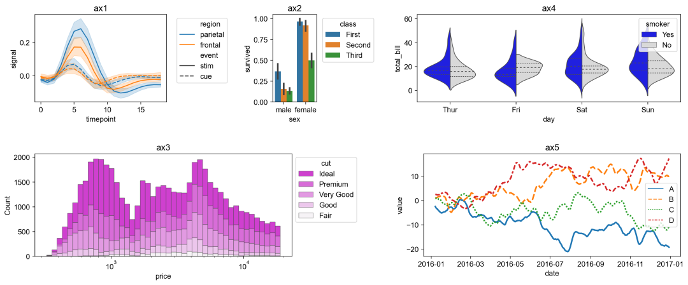
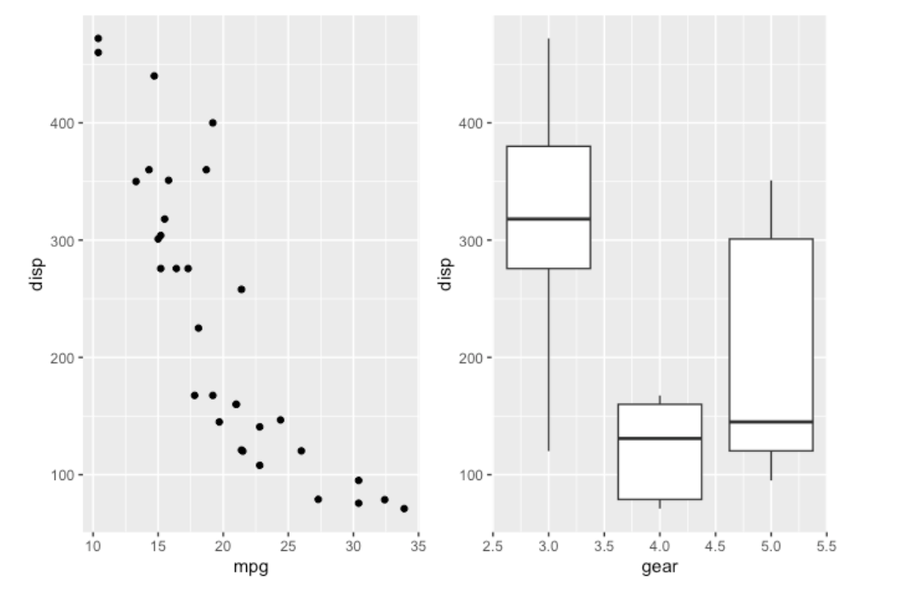
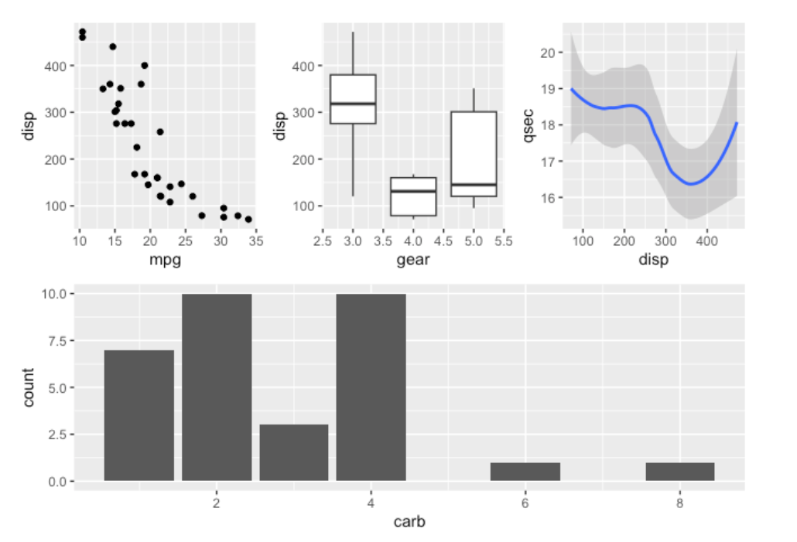
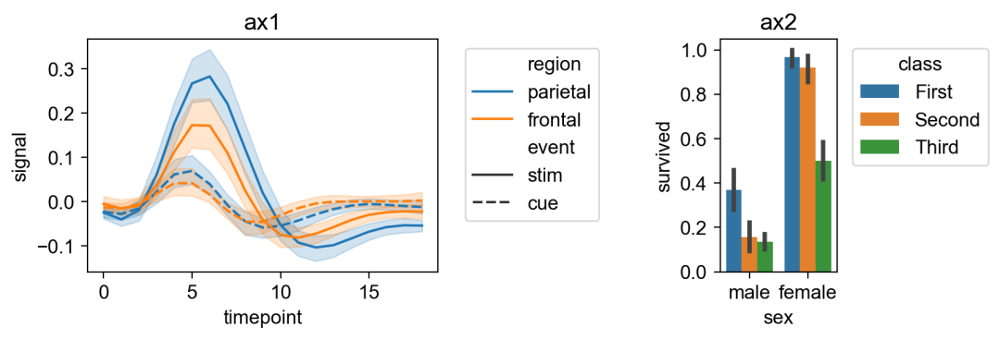
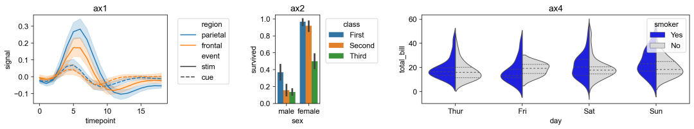

<a name="SGULy"></a>
## 一、问题
如果想把多个图合并放在一个图里，如图，该如何实现<br /><br />好在R语言 和 Python 都有对应的解决方案， 分别是patchwork包和patchworklib库。
<a name="U72ec"></a>
## 二、R语言
安装
```r
# install.packages("devtools")
devtools::install_github("thomasp85/patchwork")
```
两个图并排在一行，只需要导入patchwork， 然后相加即可
```r
library(ggplot2)
library(patchwork)

p1 <- ggplot(mtcars) + geom_point(aes(mpg, disp))
p2 <- ggplot(mtcars) + geom_boxplot(aes(gear, disp, group = gear))

p1 + p2
```


两行，第一行三个图，第二行一个图
```r
p3 <- ggplot(mtcars) + geom_smooth(aes(disp, qsec))
p4 <- ggplot(mtcars) + geom_bar(aes(carb))

(p1 | p2 | p3) /
      p4
```

<a name="UO1l9"></a>
## 三、Python
Patchworklib 是与 matplotlib 相关的绘图（简单 matplotlib 绘图、Seaborn 绘图（轴级和图形级）和plotnine 绘图）的通用编辑器。这个库的灵感来自于 ggplot2 的patchwork。因此，作为原始拼凑，用户可以轻松地仅使用 /和 | 对齐 matplotlib 图。<br />Patchworklib 提供了该问题的解决方案。通过使用 patchworklib，任何类型的seaborn 和plotnine 图都可以作为matplotlib 子图进行处理。安装
```bash
pip3 install patchworklib
```
```python
import patchworklib as pw
import seaborn as sns 

fmri = sns.load_dataset("fmri")
ax1 = pw.Brick(figsize=(3,2))
sns.lineplot(x="timepoint", y="signal", hue="region", style="event", data=fmri, ax=ax1)
ax1.legend(bbox_to_anchor=(1.05, 1.0), loc='upper left')
ax1.set_title("ax1")

titanic = sns.load_dataset("titanic")
ax2 = pw.Brick(figsize=(1,2))
sns.barplot(x="sex", y="survived", hue="class", data=titanic, ax=ax2)
ax2.move_legend(new_loc='upper left', bbox_to_anchor=(1.05, 1.0))
ax2.set_title("ax2")

ax12 = ax1|ax2
ax12.savefig("ax12.png")
```

```python
#省略 ax1、ax2、ax4绘制过程

ax124 = ax1|ax2|ax4
ax124.savefig("../img/ax124.png")
```

```python
#省略 ax124、ax3、ax5绘制过程
ax12435 = ax124/(ax3|ax5)
ax12435.savefig("../img/ax12435.png")
```

