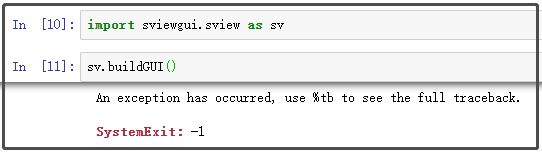
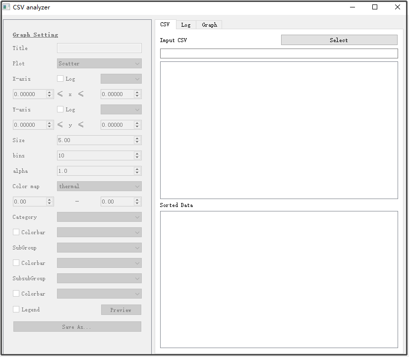
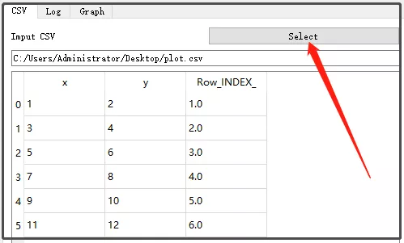
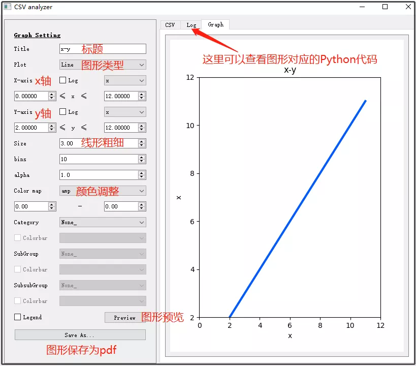
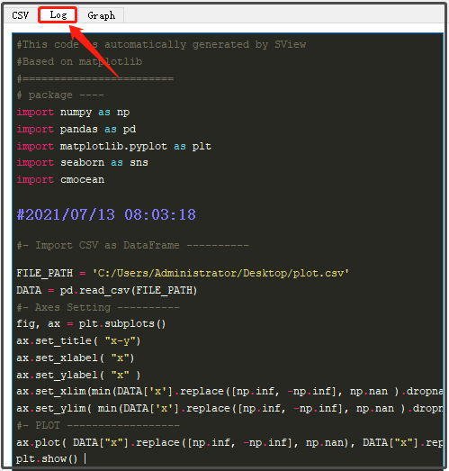

Python 可视化
<a name="khUFS"></a>
## sviewgui介绍
sviewgui是一个基于 PyQt 的 GUI，用于 csv 文件或 Pandas 的 DataFrame 的数据可视化。此 GUI 基于 matplotlib，可以通过多种方式可视化 csv 文件。主要特点：

- Ⅰ 散点图、线图、密度图、直方图和箱线图类型；
- Ⅱ 标记大小、线宽、直方图的 bin 数量、颜色图的设置（来自 cmocean）；
- Ⅲ 将图另存为可编辑的 PDF；
- Ⅳ 绘制图形的代码可用，以便它可以在 sviewgui 之外重用和修改；

项目地址：[https://github.com/SojiroFukuda/sview-gui](https://github.com/SojiroFukuda/sview-gui)<br />这个包用法超级简单，它只有一种方法：`buildGUI()`。此方法可以传入零个或一个参数。您可以使用 csv 文件的文件路径作为参数，或者使用 pandas 的DataFrame对象作为参数。类似代码写法如下：
```python
# 第一种形式
import sviewgui.sview as sv
sv.buildGUI()

# 第二种形式
import sviewgui.sview as sv
FILE_PATH = "User/Documents/yourdata.csv"
sv.buildGUI(FILE_PATH)

# 第三种形式
import sviewgui.sview as sv
import pandas as pd

FILE_PATH = "User/Documents/yourdata.csv"
df = pd.read_csv(FILE_PATH)
sv.buildGUI(df)
```
上面代码，只是帮助驱动打开这个GuI可视化界面。<br />最后强调一点，由于这个库是基于matplotlib可视化的，因此seaborn风格同样适用于这里，因为seaborn也是基于matplotlib可视化的。
<a name="fvY2j"></a>
## sviewgui安装
这个库的依赖库相当多，因此大家直接采用下面这行代码安装sviewgui库。
```bash
pip install sviewgui -i https://pypi.tuna.tsinghua.edu.cn/simple/ --ignore-installed
```
后面这个-`-ignore-installed`，最开始是没加的，但是报错了，大致错误如下：
```bash
ERROR: Cannot uninstall 'certifi'. It is a distutils installed project and thus we cannot 
accurately determine which files belong to it which would lead to only a partial uninstall.
```
直到加这个就行！
<a name="lhngT"></a>
## sviewgui使用
上面介绍了3种打开GUI图形界面窗口的代码，这里仅介绍下面这种方法：
```python
import sviewgui.sview as sv
sv.buildGUI()
```
截图如下：<br /><br />当在命令行输入上述代码后，会驱动后台打开这个图形化界面窗口，初始化状态大致是这样的：<br /><br />点击上述select，可以选择数据源：<br /><br />然后可以点击左侧菜单栏，生成对应的图形。但是有一点，貌似不支持中文！！！<br /><br />如果觉得这里不足以完善想要的图形，可以复制图形所对应的Python代码，简单修改即可。<br /><br />然后，拿着下面的代码，简单修改，就可以生成漂亮的Matplotlib图形了。
```python
import numpy as np
import pandas as pd
import matplotlib.pyplot as plt
import seaborn as sns
import cmocean

#2021/07/13 08:03:18 
#- Import CSV as DataFrame ---------- 
FILE_PATH = 'C:/Users/Administrator/Desktop/plot.csv'
DATA = pd.read_csv(FILE_PATH)
#- Axes Setting ---------- 
fig, ax = plt.subplots()
ax.set_title( "x-y")
ax.set_xlabel( "x")
ax.set_ylabel( "x" )
ax.set_xlim(min(DATA['x'].replace([np.inf, -np.inf], np.nan ).dropna() ) - abs( min(DATA['x'].replace([np.inf, -np.inf], np.nan ).dropna() )/10), max(DATA['x'].replace([np.inf, -np.inf], np.nan).dropna()) + abs(max(DATA['x'].replace([np.inf, -np.inf], np.nan).dropna())/10)  )
ax.set_ylim( min(DATA['x'].replace([np.inf, -np.inf], np.nan ).dropna() ) - abs( min(DATA['x'].replace([np.inf, -np.inf], np.nan ).dropna() )/10), max(DATA['x'].replace([np.inf, -np.inf], np.nan).dropna()) + abs(max(DATA['x'].replace([np.inf, -np.inf], np.nan).dropna())/10)  )
#- PLOT ------------------ 
ax.plot( DATA["x"].replace([np.inf, -np.inf], np.nan), DATA["x"].replace([np.inf, -np.inf], np.nan), linewidth = 3.0, alpha =1.0, color = "#005AFF" )
plt.show() 
```
