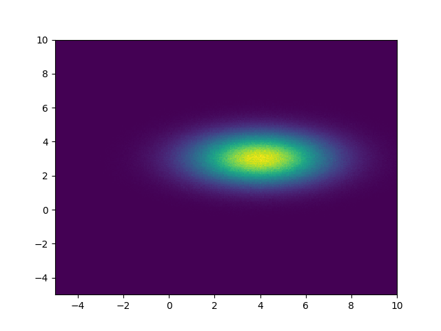
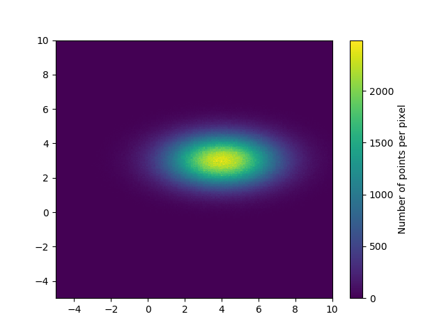

一个好用的散点密度图绘制工具-**「mpl-scatter-density」**<br />mpl-scatter-density 包提供的功能可让您轻松制作自己的散点密度图，既可用于交互式使用，也可用于非交互式使用。
<a name="yRRHr"></a>
## 安装
```bash
pip install mpl-scatter-density
```
<a name="wg0Ns"></a>
## 可视化案例
```python
import numpy as np
import mpl_scatter_density
import matplotlib.pyplot as plt

# Generate fake data

N = 10000000
x = np.random.normal(4, 2, N)
y = np.random.normal(3, 1, N)

# Make the plot - note that for the projection option to work, the
# mpl_scatter_density module has to be imported above.

fig = plt.figure()
ax = fig.add_subplot(1, 1, 1, projection='scatter_density')
ax.scatter_density(x, y)
ax.set_xlim(-5, 10)
ax.set_ylim(-5, 10)
```

```python
import numpy as np
import mpl_scatter_density
import matplotlib.pyplot as plt

N = 10000000
x = np.random.normal(4, 2, N)
y = np.random.normal(3, 1, N)

fig = plt.figure()
ax = fig.add_subplot(1, 1, 1, projection='scatter_density')
density = ax.scatter_density(x, y)
ax.set_xlim(-5, 10)
ax.set_ylim(-5, 10)
fig.colorbar(density, label='Number of points per pixel')
```
<br />更多该工具包的用法和样例，可参考：[**mpl-scatter-density官网**](https://github.com/astrofrog/mpl-scatter-density)
<a name="wnhAx"></a>
## 参考资料
**mpl-scatter-density官网：**[**https://github.com/astrofrog/mpl-scatter-density**](https://github.com/astrofrog/mpl-scatter-density)
