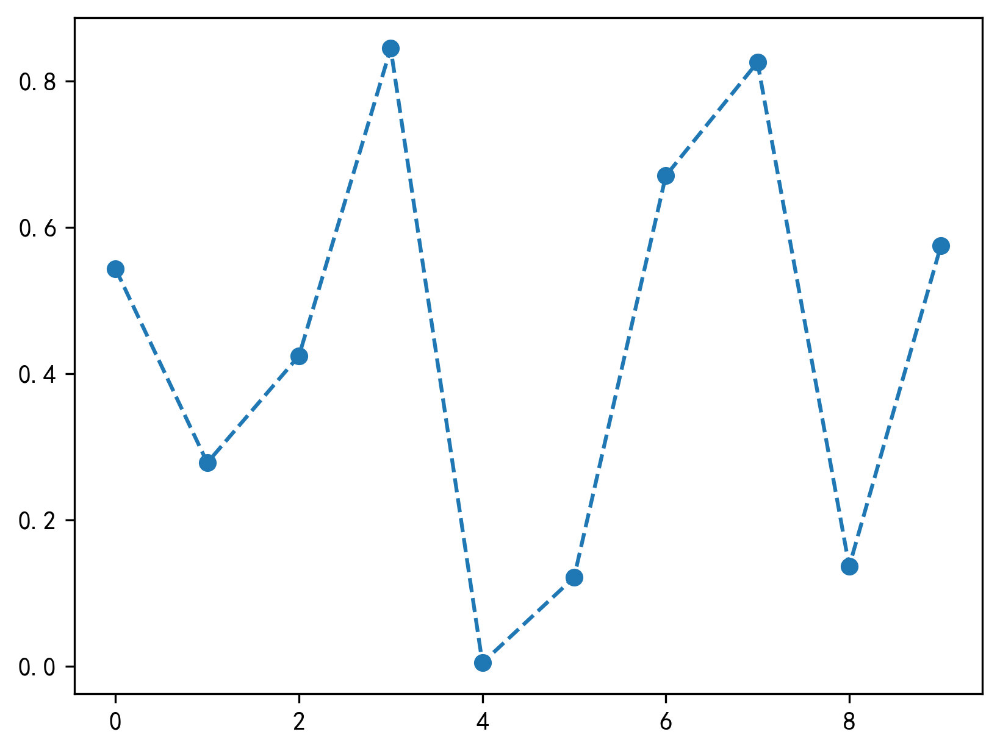

Matplotlib
<a name="FLTur"></a>
### 1、添加文本框
为文本添加添加背景框
```python
import matplotlib.pyplot as plt
plt.rcParams['font.sans-serif'] = ['SimHei']
fig=plt.figure()
fig,axe=plt.subplots()
axe.text(0.5,0.5,'我是文本框',bbox={'facecolor':'cyan','alpha':0.5,'pad':0.7})  #添加文本框
plt.savefig('outbox_legend.png', dpi = 300, bbox_inches = 'tight', pad_inches = .1)
```

<a name="o1Tci"></a>
### 2、添加指示箭头
```python
import matplotlib.pyplot as plt
import numpy as np
plt.rcParams['axes.unicode_minus'] = False
fig=plt.figure()
fig,axe=plt.subplots()
t=np.arange(0.0,2.0,0.01)
s=np.sin(2*np.pi*t)
axe.plot(t,s,linestyle='-',label='line1')
axe.annotate('我是正弦函数',xy=(1.25,1),xytext=(1.9,1),
                  arrowprops=dict(facecolor='red',shrink=0.2),
                 horizontalalignment='center',verticalalignment='center')
plt.savefig('outbox_legend.png', dpi = 300, bbox_inches = 'tight', pad_inches = .1)
```

<a name="BtxBE"></a>
### 3、改变折线形状
```python
fig,axe=plt.subplots()
np.random.seed(100)
x=np.arange(0, 10, 1)
y1=np.random.rand(10)
axe.plot(x, y1, '--o')
plt.savefig('outbox_legend.png', dpi = 300, bbox_inches = 'tight', pad_inches = .1)
```

<a name="68URk"></a>
### 4、柱状图横置
```python
fig,axe=plt.subplots()
data_m=(40, 60, 120, 180, 20, 200)
index = np.arange(6)
width=0.4
axe.barh(index, data_m, width,align='center',alpha=0.8, label='men')
plt.savefig('outbox_legend.png', dpi = 300, bbox_inches = 'tight', pad_inches = .1)
```

<a name="0AiyO"></a>
### 5、移动坐标轴位置
```python
import matplotlib.pyplot as plt
import numpy as np
fig=plt.figure()
fig,axe=plt.subplots()
axe.spines['right'].set_color('none')
axe.spines['top'].set_color('none')
axe.spines['bottom'].set_position(('data',1))
axe.spines['left'].set_position(('data',1))
plt.savefig('outbox_legend.png', dpi = 300, bbox_inches = 'tight', pad_inches = .1)
```

<a name="N2nI9"></a>
### 6、设置坐标轴范围
```python
fig=plt.figure()
fig,axe=plt.subplots()
plt.xlim(0,10)
plt.ylim(0,8000)
plt.savefig('outbox_legend.png', dpi = 300, bbox_inches = 'tight', pad_inches = .1)
```

<a name="sXHPr"></a>
### 7、改变坐标轴颜色
```python
import matplotlib.pyplot as plt
import numpy as np
fig=plt.figure()
fig,axe=plt.subplots()
axe.spines['right'].set_color('yellow')
axe.spines['top'].set_color('red')
plt.savefig('outbox_legend.png', dpi = 300, bbox_inches = 'tight', pad_inches = .1)
```

<a name="yXWLR"></a>
### 8、设置坐标轴刻度
```python
fig=plt.figure()
fig,axe=plt.subplots()
axe.set_xticks([0,1,2,3,4,5])
plt.savefig('outbox_legend.png', dpi = 300, bbox_inches = 'tight', pad_inches = .1)
```

<a name="8Ngm0"></a>
### 9、改变刻度
```python
fig=plt.figure()
fig,axe=plt.subplots()
axe.set_xticks([0,1,2,3,4,5])
axe.set_xticklabels(['Taxi','Metro','Walk','Bus','Bicycle','Driving'])
plt.savefig('outbox_legend.png', dpi = 300, bbox_inches = 'tight', pad_inches = .1)
```

<a name="pt06k"></a>
### 9、坐标倾斜
```python
fig=plt.figure()
fig,axe=plt.subplots()
axe.set_xticks([0,1,2,3,4,5])
axe.set_xticklabels(['Taxi','Metro','Walk','Bus','Bicycle','Driving'],rotation=45)
plt.savefig('outbox_legend.png', dpi = 300, bbox_inches = 'tight', pad_inches = .1)
```

<a name="j7Nta"></a>
### 10、绘制子图
```python
fig=plt.figure()
fig,axe=plt.subplots(4,4,figsize=(10,10))
plt.savefig('outbox_legend.png', dpi = 300, bbox_inches = 'tight', pad_inches = .1)
```

<a name="ToMFk"></a>
### 11、加网格线
```python
fig=plt.figure()
fig,axe=plt.subplots()
axe.grid(True)
plt.savefig('outbox_legend.png', dpi = 300, bbox_inches = 'tight', pad_inches = .1)
```

<a name="LEyYp"></a>
### 12、改变图形颜色
```python
fig,axe=plt.subplots()
data_m=(40, 60, 120, 180, 20, 200)
index = np.arange(6)
axe.bar(index, data_m,color='y')
plt.savefig('outbox_legend.png', dpi = 300, bbox_inches = 'tight', pad_inches = .1)
```

<a name="w69Xu"></a>
### 13、改变样式
```python
fig,axe=plt.subplots()
data_m=(40, 60, 120, 180, 20, 200)
index = np.arange(6)
axe.bar(index, data_m)
plt.style.use('fivethirtyeight')
plt.savefig('outbox_legend.png', dpi = 300, bbox_inches = 'tight', pad_inches = .1)
```
<br />样式列表：
```python
plt.style.available
```
```
['bmh',
 'classic',
 'dark_background',
 'fast',
 'fivethirtyeight',
 'ggplot',
 'grayscale',
 'seaborn-bright',
 'seaborn-colorblind',
 'seaborn-dark-palette',
 'seaborn-dark',
 'seaborn-darkgrid',
 'seaborn-deep',
 'seaborn-muted',
 'seaborn-notebook',
 'seaborn-paper',
 'seaborn-pastel',
 'seaborn-poster',
 'seaborn-talk',
 'seaborn-ticks',
 'seaborn-white',
 'seaborn-whitegrid',
 'seaborn',
 'Solarize_Light2',
 'tableau-colorblind10',
 '_classic_test'
]
```
<a name="WBDvb"></a>
### 14、添加表格
```python
fig,axe=plt.subplots()
data_m=(40, 60, 120, 180, 20, 200)
data_f=(30, 100, 150, 30, 20, 50)
index = np.arange(6)
width=0.4
#bar charts
axe.bar(index, data_m, width, color='c', label='men')
axe.bar(index, data_f, width, color='b', bottom=data_m, label='women')
axe.set_xticks([])
axe.legend()
#table
data=(data_m,data_f)
rows=('male','female')
columns=('Taxi','Metro','Walk','Bus','Bicycle','Driving')
axe.table(cellText=data, rowLabels=rows, colLabels=columns)
plt.savefig('outbox_legend.png', dpi = 300, bbox_inches = 'tight', pad_inches = .1)
```

<a name="EKd8B"></a>
### 15、饼状图分离
```python
fig, axe = plt.subplots()
labels = 'Taxi', 'Metro', 'Walk', 'Bus','Bicycle','Drive'
sizes = [10, 30, 5, 25, 5, 25]
explode = (0.1, 0.1, 0.5, 0.1, 0.1, 0.1)   #控制分隔距离
axe.pie(sizes, explode=explode, labels=labels, autopct='%1.1f%%',
        shadow=True, startangle=90)
axe.axis('equal')
plt.savefig('outbox_legend.png', dpi = 300, bbox_inches = 'tight', pad_inches = .1)
```

<a name="sq2hO"></a>
### 16、保存绘制的图片
```python
fig, axe = plt.subplots()
labels = 'Taxi', 'Metro', 'Walk', 'Bus','Bicycle','Drive'
sizes = [10, 30, 5, 25, 5, 25]
explode = (0.1, 0.1, 0.5, 0.1, 0.1, 0.1)   #控制分隔距离
axe.pie(sizes, explode=explode, labels=labels, autopct='%1.1f%%',
        shadow=True, startangle=90)
axe.axis('equal')
plt.savefig('outbox_legend.png', dpi = 300, bbox_inches = 'tight', pad_inches = .1)
```
