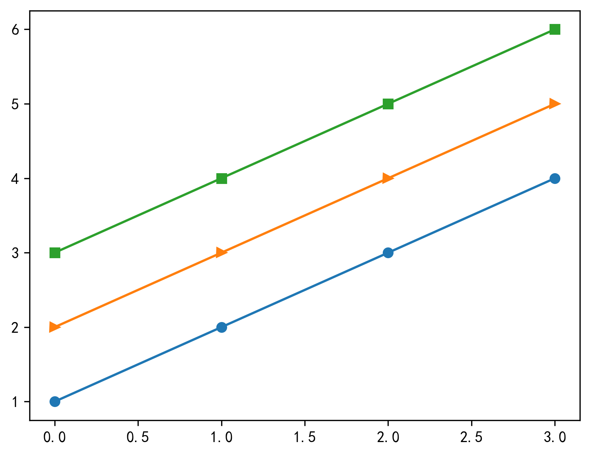

Python Matplotlib
<a name="Q4y8V"></a>
## 1、添加标题-`title`
`matplotlib.pyplot` 对象中有个 `title()` 可以设置表格的标题。
```python
import numpy as np
import matplotlib.pyplot as plt
# 显示中文
plt.rcParams['font.sans-serif'] = [u'SimHei']
plt.rcParams['axes.unicode_minus'] = False
x = np.arange(0, 10)
plt.title('这是一个示例标题')
plt.plot(x, x * x)
plt.savefig('outbox_legend.png', dpi=300, bbox_inches='tight', pad_inches=.1)
```
具体实现效果：<br />
<a name="UPJWk"></a>
## 2、添加文字-`text`
设置坐标和文字，可以使用 `matplotlib.pyplot` 对象中 `text()` 接口。其中 第一、二个参数来设置坐标，第三个参数是设置显示文本内容。
```python
import numpy as np
import matplotlib.pyplot as plt

# 显示中文
plt.rcParams['font.sans-serif'] = [u'SimHei']
plt.rcParams['axes.unicode_minus'] = False
x = np.arange(-10, 11, 1)
y = x * x
plt.plot(x, y)
plt.title('这是一个示例标题')
# 添加文字
plt.text(-2.5, 30, 'function y=x*x')
plt.savefig('outbox_legend.png', dpi=300, bbox_inches='tight', pad_inches=.1)
```
具体实现效果：<br />
<a name="qhVv0"></a>
## 3、添加注释-`annotate`
使用 `annotate()` 接口可以在图中增加注释说明。其中：

- `xy` 参数：备注的坐标点
- `xytext` 参数：备注文字的坐标(默认为xy的位置)
- `arrowprops` 参数：在 `xy` 和 `xytext` 之间绘制一个箭头。
```python
import numpy as np
import matplotlib.pyplot as plt

# 显示中文
plt.rcParams['font.sans-serif'] = [u'SimHei']
plt.rcParams['axes.unicode_minus'] = False
x = np.arange(-10, 11, 1)
y = x * x
plt.title('这是一个示例标题')
plt.plot(x, y)
# 添加注释
plt.annotate('这是一个示例注释', xy=(0, 1), xytext=(-2, 22), arrowprops={'headwidth': 10, 'facecolor': 'r'})
plt.savefig('outbox_legend.png', dpi=300, bbox_inches='tight', pad_inches=.1)
```
具体实现效果：<br />
<a name="i1zfU"></a>
## 4、设置坐标轴名称-`xlabel`/`ylabel`
二维坐标图形中，需要在横轴和竖轴注明名称以及数量单位。设置坐标轴名称使用的接口是 `xlabel()` 和 `ylable()`。
```python
import numpy as np
import matplotlib.pyplot as plt

# 显示中文
plt.rcParams['font.sans-serif'] = [u'SimHei']
plt.rcParams['axes.unicode_minus'] = False
x = np.arange(1, 20)
plt.xlabel('示例x轴')
plt.ylabel('示例y轴')
plt.plot(x, x * x)
plt.savefig('outbox_legend.png', dpi=300, bbox_inches='tight', pad_inches=.1)
```
具体实现效果：<br />
<a name="OZPag"></a>
## 5、添加图例-`legend`
当线条过多时，设置不同颜色来区分不同线条。因此，需要对不同颜色线条做下标注，使用 `legend()` 接口来实现。
```python
import numpy as np
import matplotlib.pyplot as plt

# 显示中文
plt.rcParams['font.sans-serif'] = [u'SimHei']
plt.rcParams['axes.unicode_minus'] = False
x = np.arange(1, 5)
plt.plot(x, x)
plt.plot(x, x * 2)
plt.plot(x, x * 3)
plt.plot(x, x * 4)
# 直接传入legend
plt.legend(['生活', '颜值', '工作', '金钱'])
plt.savefig('outbox_legend.png', dpi=300, bbox_inches='tight', pad_inches=.1)
```
具体实现效果：<br />
<a name="I5fja"></a>
## 6、调整颜色-color
传颜色参数，使用 plot() 中的 color 属性来设置，color 支持以下几种方式
```python
import numpy as np
import matplotlib.pyplot as plt

# 显示中文
plt.rcParams['font.sans-serif'] = [u'SimHei']
plt.rcParams['axes.unicode_minus'] = False
x = np.arange(1, 5)
# 颜色的几种方式
plt.plot(x, color='g')
plt.plot(x + 1, color='0.5')
plt.plot(x + 2, color='#FF00FF')
plt.plot(x + 3, color=(0.1, 0.2, 0.3))
plt.savefig('outbox_legend.png', dpi=300, bbox_inches='tight', pad_inches=.1)
```
具体实现效果：<br />
<a name="SyE70"></a>
## 7、切换线条样式-marker
如果想改变线条的样式，我们可以使用修改 plot() 绘图接口中 mark 参数，具体实现效果：
```python
import numpy as np
import matplotlib.pyplot as plt

# 显示中文
plt.rcParams['font.sans-serif'] = [u'SimHei']
plt.rcParams['axes.unicode_minus'] = False
x = np.arange(1, 5)
plt.plot(x, marker='o')
plt.plot(x + 1, marker='>')
plt.plot(x + 2, marker='s')
plt.savefig('outbox_legend.png', dpi=300, bbox_inches='tight', pad_inches=.1)
```
具体实现效果：<br />
<a name="tlTTD"></a>
### 其中 marker 支持的类型：
```python
'.'：点(point marker)
','：像素点(pixel marker)
'o'：圆形(circle marker)
'v'：朝下三角形(triangle_down marker)
'^'：朝上三角形(triangle_up marker)
'<'：朝左三角形(triangle_left marker)
'>'：朝右三角形(triangle_right marker)
'1'：(tri_down marker)
'2'：(tri_up marker)
'3'：(tri_left marker)
'4'：(tri_right marker)
's'：正方形(square marker)
'p'：五边星(pentagon marker)
'*'：星型(star marker)
'h'：1号六角形(hexagon1 marker)
'H'：2号六角形(hexagon2 marker)
'+'：+号标记(plus marker)
'x'：x号标记(x marker)
'D'：菱形(diamond marker)
'd'：小型菱形(thin_diamond marker)
'|'：垂直线形(vline marker)
'_'：水平线形(hline marker)
```
具体各个效果类型如下<br />
<a name="UCZJQ"></a>
## 8、显示数学公式-`mathtext`
格式如下： `\omega $`，中间的将解析出公式中的符号
```python
import matplotlib.pyplot as plt

# 显示中文
plt.rcParams['font.sans-serif'] = [u'SimHei']
plt.rcParams['axes.unicode_minus'] = False
plt.title('标题')
plt.xlim([1, 8])
plt.ylim([1, 5])
plt.text(2, 4, r'$ \alpha \beta \pi \lambda \omega $', size=25)
plt.text(4, 4, r'$ \sin(0)=\cos(\frac{\pi}{2}) $', size=25)
plt.text(2, 2, r'$ \lim_{x \rightarrow y} \frac{1}{x^3} $', size=25)
plt.text(4, 2, r'$ \sqrt[4]{x}=\sqrt{y} $', size=25)
plt.savefig('outbox_legend.png', dpi=300, bbox_inches='tight', pad_inches=.1)
```
具体实现效果：<br />
<a name="migM1"></a>
## 9、显示网格-`grid`
<a name="wNFsE"></a>
### `grid()` 接口可以用来设置背景图为网格。
```python
import matplotlib.pyplot as plt

x = 'a', 'b', 'c', 'd'
y = [15, 30, 45, 10]
plt.grid()
# 也可以设置颜色、线条宽度、线条样式
# plt.grid(color='g',linewidth='1',linestyle='-.')
plt.plot(x, y)
plt.savefig('outbox_legend.png', dpi=300, bbox_inches='tight', pad_inches=.1)
```
具体实现效果：<br />
<a name="WGf42"></a>
## 10、调整坐标轴刻度-`locator_params`
坐标图的刻度可以使用 `locator_params` 接口来调整显示颗粒。<br />同时调整 x 轴和 y 轴：`plt.locator_params(nbins=20)`<br />只调整 x 轴：`plt.locator_params(‘'x',nbins=20)`<br />只调整 y 轴：`plt.locator_params(‘'y',nbins=20)`
```python
import numpy as np
import matplotlib.pyplot as plt

x = np.arange(0, 30, 1)
plt.plot(x, x)
# x轴和y轴分别显示20个
plt.locator_params(nbins=20)
plt.savefig('outbox_legend.png', dpi=300, bbox_inches='tight', pad_inches=.1)
```
具体实现效果：<br />
<a name="uPUOz"></a>
## 11、调整坐标轴范围-`axis`/`xlim`/`ylim`
`axis`：[0,5,0,10]，x从0到5，y从0到10<br />`xlim`：对应参数有`xmin`和`xmax`，分别能调整最大值最小值<br />`ylim`：同`xlim`用法
```python
import numpy as np
import matplotlib.pyplot as plt

x = np.arange(0, 30, 1)
plt.plot(x, x * x)
# 显示坐标轴，plt.axis(),4个数字分别代表x轴和y轴的最小坐标，最大坐标
# 调整x为10到25
plt.xlim(xmin=10, xmax=25)
plt.plot(x, x * x)
plt.savefig('outbox_legend.png', dpi=300, bbox_inches='tight', pad_inches=.1)
```
具体实现效果：<br />
<a name="w4S1C"></a>
## 12、调整日期自适应-`autofmt_xdate`
有时候显示日期会重叠在一起，非常不友好，调用`plt.gcf().autofmt_xdate()`，将自动调整角度
```python
import numpy as np
import pandas as pd
import matplotlib.pyplot as plt

x = pd.date_range('2020/01/01', periods=30)
y = np.arange(0, 30, 1)
plt.plot(x, y)
plt.gcf().autofmt_xdate()
plt.savefig('outbox_legend.png', dpi=300, bbox_inches='tight', pad_inches=.1)
```
具体实现效果：<br />
<a name="zR2UR"></a>
## 13、添加双坐标轴-`twinx`
```python
import numpy as np
import matplotlib.pyplot as plt

x = np.arange(1, 20)
y1 = x * x
y2 = np.log(x)
plt.plot(x, y1)
# 添加一个坐标轴，默认0到1
plt.twinx()
plt.plot(x, y2, 'r')
plt.savefig('outbox_legend.png', dpi=300, bbox_inches='tight', pad_inches=.1)
```
具体实现效果：<br />
<a name="SOLSd"></a>
## 14、填充区域-`fill`/`fill_beween`
`fill` 填充函数区域
```python
import numpy as np
import matplotlib.pyplot as plt

# 显示中文
plt.rcParams['font.sans-serif'] = [u'SimHei']
plt.rcParams['axes.unicode_minus'] = False
x = np.linspace(0, 5 * np.pi, 1000)
y1 = np.sin(x)
y2 = np.sin(2 * x)
plt.plot(x, y1)
plt.plot(x, y2)
# 填充
plt.fill(x, y1, 'g')
plt.fill(x, y2, 'r')
plt.title('这是一个示例标题')
plt.savefig('outbox_legend.png', dpi=300, bbox_inches='tight', pad_inches=.1)
```
具体实现效果：<br /><br />`fill_beween`填充函数交叉区域
```python
import numpy as np
import matplotlib.pyplot as plt

# 显示中文
plt.rcParams['font.sans-serif'] = [u'SimHei']
plt.rcParams['axes.unicode_minus'] = False
plt.title('这是一个示例标题')
x = np.linspace(0, 5 * np.pi, 1000)
y1 = np.sin(x)
y2 = np.sin(2 * x)
plt.plot(x, y1)
plt.plot(x, y2)
# 填充
plt.fill_between(x, y1, y2, where=y1 > y2, interpolate=True)
plt.savefig('outbox_legend.png', dpi=300, bbox_inches='tight', pad_inches=.1)
```
具体实现效果：<br />
<a name="AgyHa"></a>
## 15、画一个填充好的形状-`matplotlib.patche`
```python
import numpy as np
import matplotlib.pyplot as plt
import matplotlib.patches as mptaches
%matplotlib inline
xy1=np.array([0.2,0.2])
xy2=np.array([0.2,0.8])
xy3=np.array([0.8,0.2])
xy4=np.array([0.8,0.8])
fig,ax=plt.subplots()
#圆形,指定坐标和半径
circle=mptaches.Circle(xy1,0.15)
ax.add_patch(circle)
#长方形
rect=mptaches.Rectangle(xy2,0.2,0.1,color='r')
ax.add_patch(rect)
#多边形
polygon=mptaches.RegularPolygon(xy3,6,0.1,color='g')
ax.add_patch(polygon)
# 椭圆
ellipse=mptaches.Ellipse(xy4,0.4,0.2,color='c')
ax.add_patch(ellipse)
ax.axis('equal')
```
具体实现效果：<br />
<a name="kwuPP"></a>
## 16、切换样式-`plt.style.use`
matplotlib支持多种样式，可以通过`plt.style.use`切换样式，例如：`plt.style.use('ggplot')`输入 `plt.style.available` 可以查看所有的样式:
```python
import matplotlib.pyplot as plt
plt.style.available
```
具体实现效果：<br /><br />示例代码，`ggplot`样式：
```python
import numpy as np
import matplotlib.pyplot as plt
import matplotlib.patches as mptaches

plt.style.use('ggplot')
# 新建4个子图
fig, axes = plt.subplots(2, 2)
ax1, ax2, ax3, ax4 = axes.ravel()
# 第一个图
x, y = np.random.normal(size=(2, 100))
ax1.plot(x, y, 'o')
# 第二个图
x = np.arange(0, 10)
y = np.arange(0, 10)
colors = plt.rcParams['axes.prop_cycle']
length = np.linspace(0, 10, len(colors))
for s in length:
    ax2.plot(x, y + s, '-')
# 第三个图
x = np.arange(5)
y1, y2, y3 = np.random.randint(1, 25, size=(3, 5))
width = 0.25
ax3.bar(x, y1, width)
ax3.bar(x + width, y2, width)
ax3.bar(x + 2 * width, y3, width)
# 第四个图
for i, color in enumerate(colors):
    xy = np.random.normal(size=2)
ax4.add_patch(plt.Circle(xy, radius=0.3, color=color['color']))
ax4.axis('equal')
plt.show()
```

