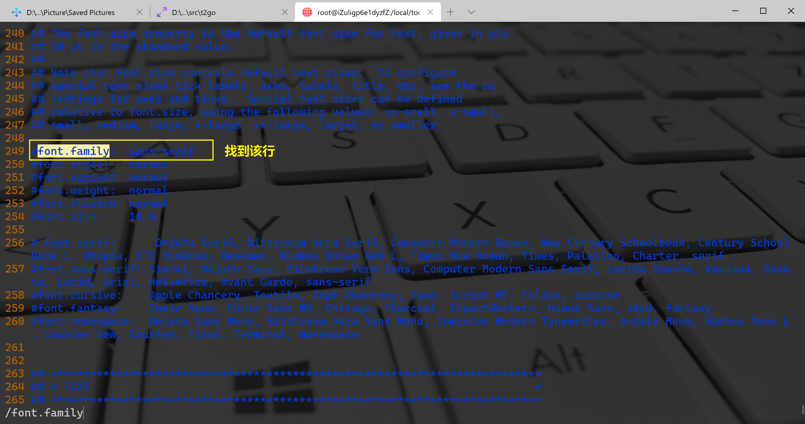

Python Matplotlib Linux 乱码问题
<a name="p66UE"></a>
## 报错详情如下
```python
/local/tools/Python-3.8.0/lib/python3.8/site-packages/matplotlib/backends/backend_agg.py:238: RuntimeWarning: Glyph 26124 missing from current font.
  font.set_text(s, 0.0, flags=flags)
/local/tools/Python-3.8.0/lib/python3.8/site-packages/matplotlib/backends/backend_agg.py:238: RuntimeWarning: Glyph 26080 missing from current font.
  font.set_text(s, 0.0, flags=flags)
```
<a name="3pUNy"></a>
## 问题分析
在Linux环境下没有中文字体，使用使用了默认的字体，但是默认的字体不支持中文，产生了乱码。
<a name="qKUlJ"></a>
## 解决方法
:::tips
乱码问题在IPython或者Jupyter Notebook中，需要操作1-5步骤<br />如果只是Python程序则可以省略2、3步<br />注意：1和4操作是必要条件。
:::
<a name="9MdXa"></a>
### 1、将中文字体保存至Linux环境下的Matplotlib字体库中
使用较多的是SimHei.ttf字体，根据上面的报错日志可以知道Matplotlib的库路径为 `/local/tools/Python-3.8.0/lib/python3.8/site-packages/matplotlib/` 然后，只需要将字体通过下载、上传至该目录下的 `mpl-data/fonts/ttf` 文件中。<br />如果在Window环境中，可以直接进入 `C:\Windows\Fonts` 该目录下找到SimHei.ttf字体文件，然后上传至Matplotlib库路径下
```bash
scp -r C:\Windows\Fonts\simhei.ttf root@127.0.0.1:/local/tools/Python-3.8.0/lib/python3.8/site-packages/matplotlib/mpl-data/fonts/ttf
```

<a name="WmgzB"></a>
### 2、查看Matplotlib库配置文件所在的路径
```python
import matplotlib
print(matplotlib.matplotlib_fname())
```

<a name="E5kHq"></a>
### 3、修改Matplotlib库配置文件
编辑第二步输出的文件
```bash
vim /local/tools/Python-3.8.0/lib/python3.8/site-packages/matplotlib/mpl-data/matplotlibrc
```
:::info
以下A/B两种方法都可以，推荐A操作，比较方便。
:::
<a name="EeqkM"></a>
#### A.方式1：在配置文件添加配置内容
找到 `font.family` 配置行<br /><br />在这一行的前面或者后面添加三行内容
```bash
font.family			 : sans-serif
font.sans-serif		 : SimHei
axes.unicode_minus   : False
```
<a name="Djhbl"></a>
#### B.方式2：修改配置文件
<br />
:::danger
保存退出即可
:::
<a name="L5xeM"></a>
### 4、清除Matplotlib在用户目录下的字体配置缓存，使其重新生成
:::danger
这一步非常重要，如果不清除缓存，则不会加载新的字体配置，乱码问题也不会得到解决
:::
```bash
rm -rf ~/.cache/matplotlib/fontlist-v330.json
```
<a name="v4AM0"></a>
### 5、再次运行程序已经不存在乱码
