PythonMatplotlib<br />Matplotlib是一个被广泛使用的Python数据可视化库，相信很多人都使用过。<br />但是有时候总会觉得，Matplotlib做出来的图表不是很好看、不美观。 <br />分享四个美化Matplotlib图表的Python库，它们可以轻松让Matplotlib图表变得好看～<br />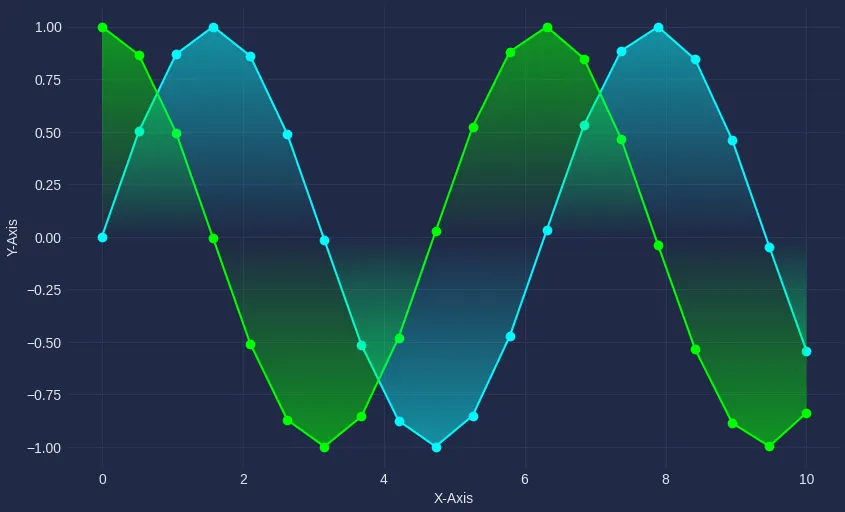<br />而且每个方法都可以使用两行代码来实现，一条import语句和一条Matplotlib的使用语句。 <br />尽管这些库非常适合创建酷炫的图表，但是还是需要了解目标受众以及可能遇到的视觉问题，比如色盲等情况。<br />下面就来一起看看吧！<br />在开始使用探索Matplotlib图表之前，先创建一些虚拟数据，用来生成图表。 <br />几行代码轻松搞定。
```python
import numpy as np 

# 生成 x 值
x = np.linspace( 0 , 10 , 20 ) 

# 生成 y 值
y = np.sin(x) 
y2 = np.cos(x)
```
<a name="R4VOA"></a>
## 1、赛博朋克风格——mplcyberpunk
赛博朋克是一种科幻小说的子类型，以其反乌托邦、技术先进的世界和反文化态度而闻名。<br />场景通常以未来主义风格描绘，经常包括霓虹灯及明亮、鲜艳的色彩等元素。<br /><br />比如，在制作海报或者是信息图表时，需要额外的元素来吸引读者。这便是赛博朋克风格可以发挥作用的地方。<br />但是，也要知道，它在为出版物创建图表或在论文中使用时可能会被视为不专业，并且可能不适合视觉有问题的读者。<br />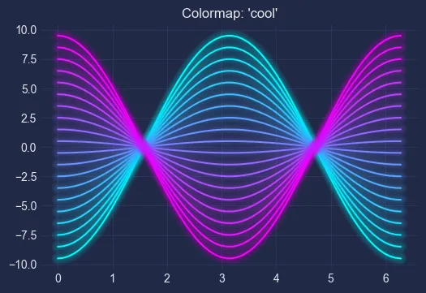<br />要开始使用这个主题，需要先安装mplcyberpunk库。
```python
# 安装
pip install mplcyberpunk
```
使用赛博朋克主题，只需要调用`plt.style.use()`，并传入参数`cypberpunk`即可。<br />使用`plt.scatter()`绘制散点图。为了使散点发光，还需要调用`make_scatter_glow()`函数。
```python
import mplcyberpunk
import matplotlib.pyplot as plt

# 使用赛博朋克风样式
plt.style.use('cyberpunk')
plt.figure(figsize=(8, 8))

# 散点图1
plt.scatter(x, y, marker='o')
mplcyberpunk.make_scatter_glow()

# 散点图2
plt.scatter(x, y2, marker='o', c='lime')
mplcyberpunk.make_scatter_glow()

# 坐标轴名称
plt.xlabel('X-Axis')
plt.ylabel('Y-Axis')

# 显示
plt.show()
```
运行上面的代码时，可以得到下图。<br />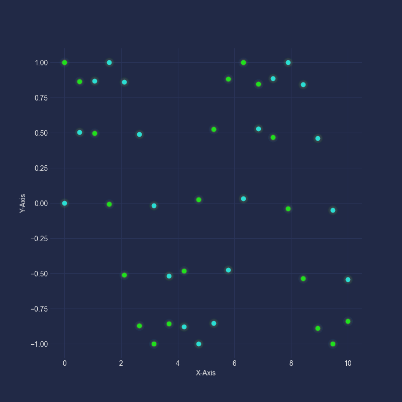<br />将赛博朋克主题应用到折线图中。为了使线条发光，可以调用`make_lines_glow()`。
```python
# 使用赛博朋克风样式
plt.style.use('cyberpunk')
plt.figure(figsize=(8, 8))

# 折线图
plt.plot(x, y, marker='o')
plt.plot(x, y2, marker='o', c='lime')

# 发光效果
mplcyberpunk.make_lines_glow()

# 坐标轴名称
plt.xlabel('X-Axis')
plt.ylabel('Y-Axis')

# 显示
plt.show()
```
运行完成，将返回带有霓虹灯线条的图表。<br />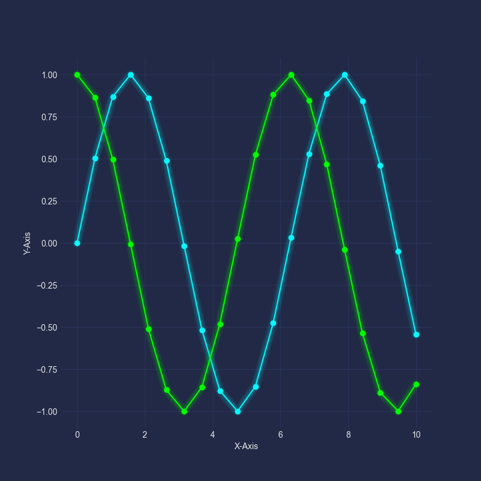<br />还可以将图表效果更进一步，在线条和X轴之间添加渐变填充。
```python
# 使用赛博朋克风样式
plt.style.use('cyberpunk')
plt.figure(figsize=(8, 8))

# 折线图
plt.plot(x, y, marker='o')
plt.plot(x, y2, marker='o', c='lime')

# 发光效果+渐变填充
mplcyberpunk.add_gradient_fill(alpha_gradientglow=0.5, gradient_start='zero')

# 坐标轴名称
plt.xlabel('X-Axis')
plt.ylabel('Y-Axis')

# 显示
plt.show()
```
这便创造了一个非常有趣的效果。<br />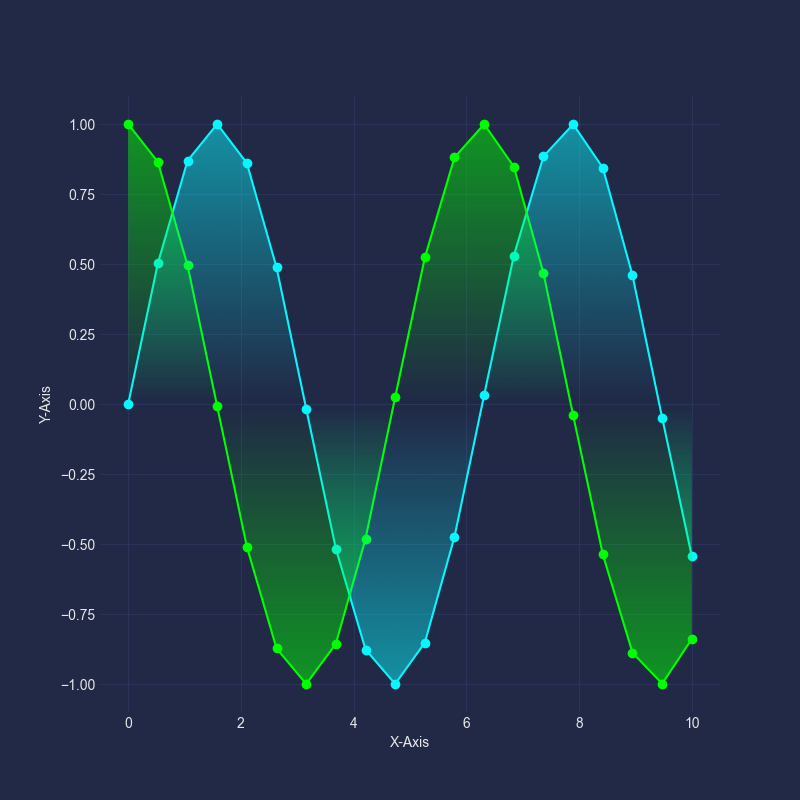<br />当然这个赛博朋克库还有其他的美化参数，大家可以去GitHub上查看使用。<br />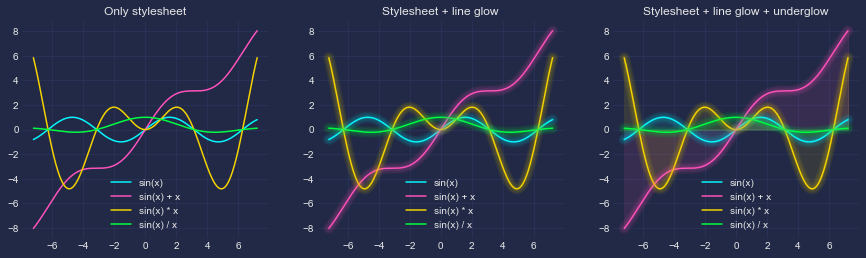<br />地址：[_https://github.com/dhaitz/mplcyberpunk_](https://github.com/dhaitz/mplcyberpunk)
<a name="WcMVc"></a>
## 2、Matplotx
matplotx库提供了一种简单的方法可以快速对matplotlib图表进行美化。<br />它包含几个可以便捷使用，且可应用于任何matplotlib图表的主题。 <br />在深色主题的Jupyter Notebook或VSCode中处理图表时，出现亮白色的图表可能会有些许刺眼。 <br />为了减少这种影响，可以将样式设为深色主题。但是，这需要好几行代码才能实现。 <br />正如接下来所看到的，Matplotx使这个过程变得更加容易。由于它包含多个主题，可以轻松找到一个与VSCode主题相匹配的。 <br />通过打开终端/命令提示符并运行以下命令，可以将Matplotx安装到Python环境中去。
```bash
# 安装
pip install matplotx
```
安装好以后，可以使用`with`语句来调用`plt.style.context`和传入`matplotx.styles`。<br />在这里，可以选择众多的可用主题。 比如非常流行的Dracula主题。
```python
import matplotx


with plt.style.context(matplotx.styles.dracula):
    # 散点图
    plt.scatter(x, y, c=y2)
    # 颜色类型
    plt.colorbar(label='Y2')
    # 坐标轴名称
    plt.xlabel('X')
    plt.ylabel('Y')
    # 显示
    plt.show()
```
运行代码，得到下图。<br />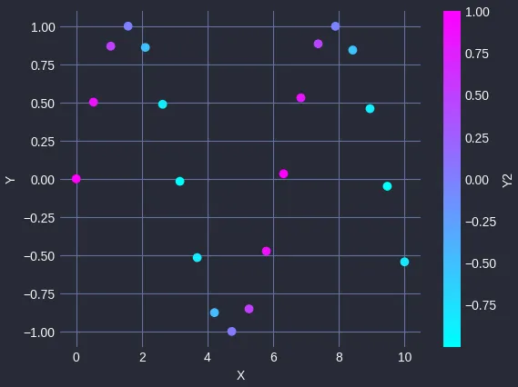<br />其中matplotx中有许多不同的样式，具体情况如下。<br /><br />下面用Pitaya Smoothie主题来创建一个折线图。<br />由于有多个子主题，需要使用方括号访问它们。<br />在这个例子中，有一个深色主题，所以需要传入「dark」参数才能使用。
```python
with plt.style.context(matplotx.styles.pitaya_smoothie['dark']):
    # 折线图
    plt.plot(x, y, marker='o')
    plt.plot(x, y2, marker='o')
    # 坐标轴名称
    plt.xlabel('X')
    plt.ylabel('Y')
    # 显示
    plt.show()
```
当运行上面的代码时，会得到下面这个折线图。<br />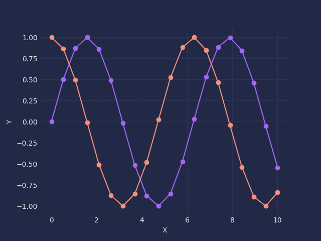<br />当然也有许多浅色主题。比如Pitaya Smoothie有一个，可以像这样使用。
```python
with plt.style.context(matplotx.styles.pitaya_smoothie['light']):
```
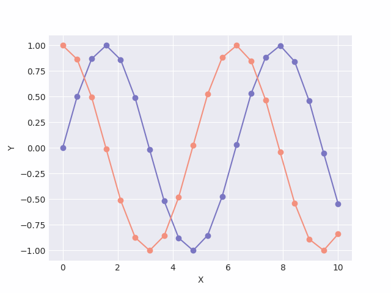<br />如果想了解更多有关此库的信息，可以查看它的GitHub。<br />地址：[_https://github.com/nschloe/matplotx_](https://github.com/nschloe/matplotx)
<a name="Rxv18"></a>
## 3、量子黑色风格
QuantumBlack Labs是一家成立于2012年的公司，旨在帮助其他公司使用数据做出更好的决策。<br />他们使用机器学习和人工智能等先进技术来分析医疗保健、金融和交通等一系列行业的复杂数据集。<br />几年前，他们在GitHub上发布了自己的样式库。<br />地址：[_https://github.com/quantumblacklabs/qbstyles_](https://github.com/quantumblacklabs/qbstyles)<br />要使用该主题，需要安装这个Python库。
```bash
# 安装
pip install qbstyles
```
安装好以后，就可以使用了～
```python
from qbstyles import mpl_style

# 深色主题开
mpl_style(dark=True)

# 深色主题关
mpl_style(dark=False)
```
来创建一个散点图，代码如下。
```python
from qbstyles import mpl_style

# 深色主题
mpl_style(dark=True)

# 非深色主题
mpl_style(dark=False)

# 散点图
plt.scatter(x, y, c=y2)

# 颜色
plt.colorbar(label='Y2')

# 坐标轴名称
plt.xlabel('X')
plt.ylabel('Y')

# 显示
plt.show()
```
返回如下两种图表结果，具体取决于选择的是浅色还是深色主题。<br />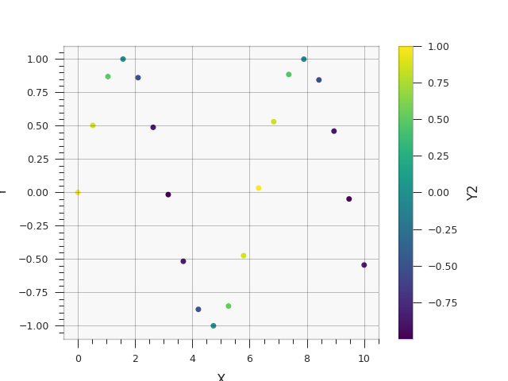<br />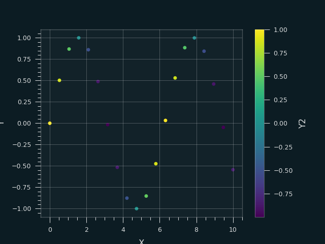<br />看看深色主题的折线图是什么样子的。
```python
# 深色主题
mpl_style(dark=True)

# 折线图
plt.plot(x, y, marker='o')
plt.plot(x, y2, marker='o')

# 坐标轴名称
plt.xlabel('X')
plt.ylabel('Y')

# 显示
plt.show()
```
当运行上面的代码时，会得到下面的图。<br />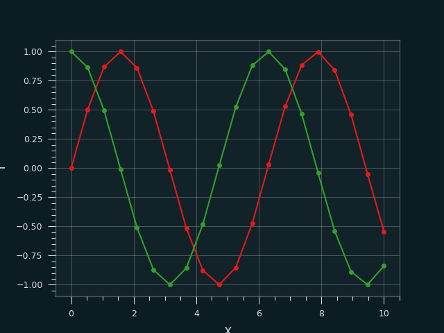<br />这个库的绘图样式与Matplotx中生成的绘图相比略有缓和。<br />但是，它确实感觉更专业一些，尤其是浅色主题的绘图。非常适合应用在专业演示或培训课程材料中。
<a name="ZboXw"></a>
## 4、科学图表
在撰写科学期刊或会议文章时，创建一个清晰、简单且易于解释的图表至关重要。<br />一些期刊，例如Nature，都是需要固定的样式，方便简化读者难以理解的图表。 <br />这就是SciencePlots库的用武之地。 它经常被用于生成常见的科学期刊样式图表，从而使创建图表变得更加容易。 <br />这个库的一大优点是它使图表适合黑白打印——这仍然是研究人员的普遍做法。通过更改线条样式或确保分类数据的散点图上有不同的形状，这将使得线条很容易区分。 <br />如果想探索SciencePlots中更多可用的样式，可以访问它的GitHub。<br />地址：[_https://github.com/garrettj403/SciencePlots/wiki/Gallery_](https://github.com/garrettj403/SciencePlots/wiki/Gallery)<br />运行SciencePlots库需要在电脑上安装LaTeX。可以下面的地址找到有关 LaTex以及如何安装等更多详细信息。 <br />地址：[_https://www.latex-project.org/get/_](https://www.latex-project.org/get/)<br />在完成库的安装及LaTeX设置完成后，可以使用下面的代码创建一个科学绘图图表。
```python
import scienceplots

with plt.style.context(['science', 'high-vis']):
    # 新建画布
    plt.figure(figsize=(6, 6))

    # 折线图
    plt.plot(x, y, marker='o', label='Line 1')
    plt.plot(x, y2, marker='o', label='Line 2')

    # 坐标轴名称
    plt.xlabel('X')
    plt.ylabel('Y')

    # 图例
    plt.legend()

    # 显示
    plt.show()
```
当运行上面的代码时，得到以下图表，这非常适合使用在期刊出版物中。<br />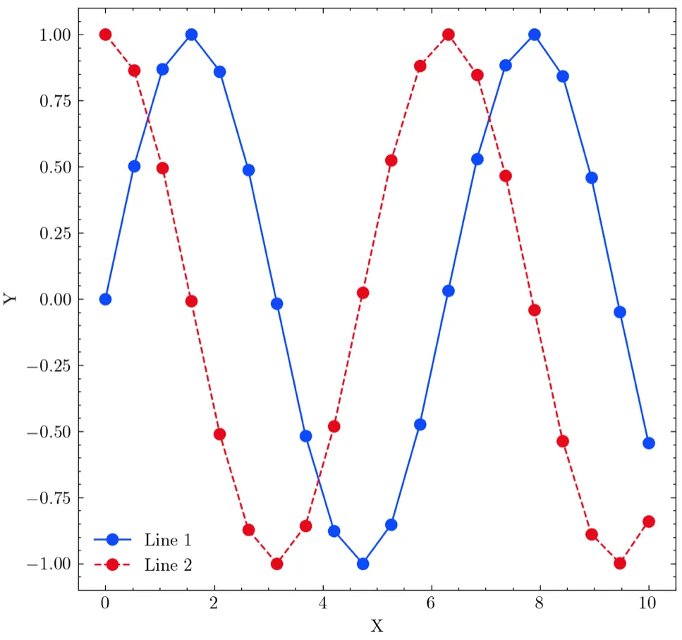<br />看看IEEE风格是什么样的。可以通过修改参数来创建一个。
```python
with plt.style.context(['science', 'ieee']):
```
和上面的有点不一样，颜色也变了，但还是一个很好看的科学期刊图表。<br />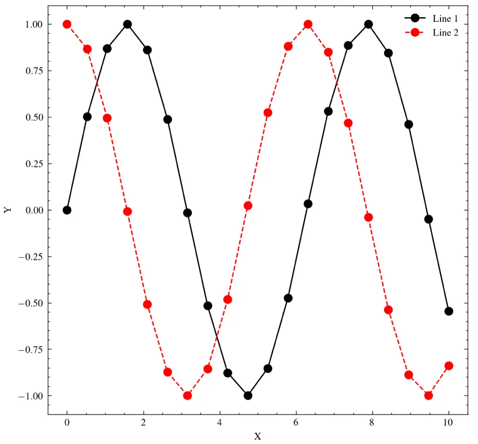<br />这对于搞学术研究的同学帮助非常大。<br />通过使用SciencePlots，不再为调整大小、颜色和线条样式而烦恼。 
<a name="QYQe4"></a>
## 5、总结
在本文中，看到了四个非常有用的matplotlib python库，它们可以让matplotlib图表更上一层楼。<br />这些库中的每一个都提供了独特的样式。 <br />尽管这些样式提供了很好的创意可视化效果，但也确实需要考虑你的受众。<br />创建出色的数据视觉效果的全部意义在于让你的信息易于理解，并尽可能以最好的方式分享你的故事。
