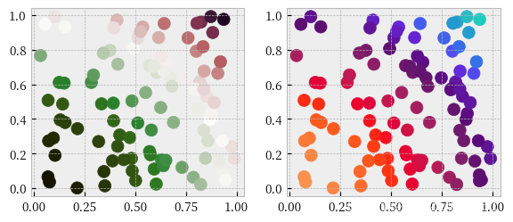
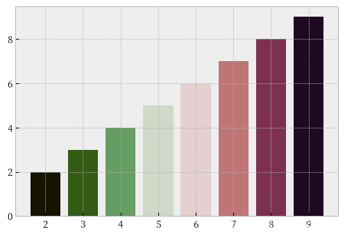

PythonMatplotlib<br />分享一个Python可视化colormaps工具：CMasher，主要提供sequential、diverging、cyclic三类渐变色，可极大丰富Matplotlib自带colormaps。

---

<a name="NzF7N"></a>
## **CMasher colormaps**
包含顺序配色方案 (例如'amber')和逆配色方案 (例如'amber_r')共计**116类**，`cmr.get_cmap_list()`)可取出，详细如下
```python
import cmasher as cmr
print(cmr.get_cmap_list()) #输出所有colormaps
```
```python
'amber', 'amber_r', 'amethyst', 'amethyst_r', 'apple', 'apple_r', 'arctic', 'arctic_r', 'bubblegum', 'bubblegum_r', 'chroma', 'chroma_r', 'copper', 'copper_r', 'copper_s', 'copper_s_r', 'cosmic', 'cosmic_r', 'dusk', 'dusk_r', 'eclipse', 'eclipse_r', 'ember', 'ember_r', 'emerald', 'emerald_r', 'emergency', 'emergency_r', 'emergency_s', 'emergency_s_r', 'fall', 'fall_r', 'flamingo', 'flamingo_r', 'freeze', 'freeze_r', 'fusion', 'fusion_r', 'gem', 'gem_r', 'ghostlight', 'ghostlight_r', 'gothic', 'gothic_r', 'guppy', 'guppy_r', 'holly', 'holly_r', 'horizon', 'horizon_r', 'iceburn', 'iceburn_r', 'infinity', 'infinity_r', 'infinity_s', 'infinity_s_r', 'jungle', 'jungle_r', 'lavender', 'lavender_r', 'lilac', 'lilac_r', 'neon', 'neon_r', 'neutral', 'neutral_r', 'nuclear', 'nuclear_r', 'ocean', 'ocean_r', 'pepper', 'pepper_r', 'pride', 'pride_r', 'prinsenvlag', 'prinsenvlag_r', 'rainforest', 'rainforest_r', 'redshift', 'redshift_r', 'sapphire', 'sapphire_r', 'savanna', 'savanna_r', 'seasons', 'seasons_r', 'seasons_s', 'seasons_s_r', 'seaweed', 'seaweed_r', 'sepia', 'sepia_r', 'sunburst', 'sunburst_r', 'swamp', 'swamp_r', 'torch', 'torch_r', 'toxic', 'toxic_r', 'tree', 'tree_r', 'tropical', 'tropical_r', 'viola', 'viola_r', 'voltage', 'voltage_r', 'waterlily', 'waterlily_r', 'watermelon', 'watermelon_r', 'wildfire', 'wildfire_r', 'heat', 'heat_r'
```

---

<a name="FhRUL"></a>
## **CMasher使用**
<a name="RFljw"></a>
### 调用某个colormap
例如，调用holly这个colormap--cmr.holly即可。
```python
import cmasher as cmr
import matplotlib.pyplot as plt
import numpy as np

my_dpi = 100
plt.figure(figsize=(680 / my_dpi, 280 / my_dpi), dpi=my_dpi)

x = np.random.rand(100)
y = np.random.rand(100)
z = x**2 + y**2

plt.subplot(1, 2, 1)
plt.scatter(x, y, c=z, cmap=cmr.holly, s=100)  #调用holly colormap

plt.subplot(1, 2, 2)
plt.scatter(x, y, c=z, cmap=cmr.guppy, s=100)  #调用guppy colormap
plt.show()
```
<br />`cmr.take_cmap_colors`取出**某个**colormap几种颜色，
```python
import matplotlib.pyplot as plt

plt.figure(dpi=100)
plt.style.use('bmh')
colors = cmr.take_cmap_colors('cmr.holly',
                              8, #取出holly中8类颜色
                              cmap_range=(0, 1),
                              return_fmt='hex')
plt.bar(range(2, 10), range(2, 10), color=colors)
plt.show()
```
<br />参考：[https://github.com/1313e/CMasher](https://github.com/1313e/CMasher)
