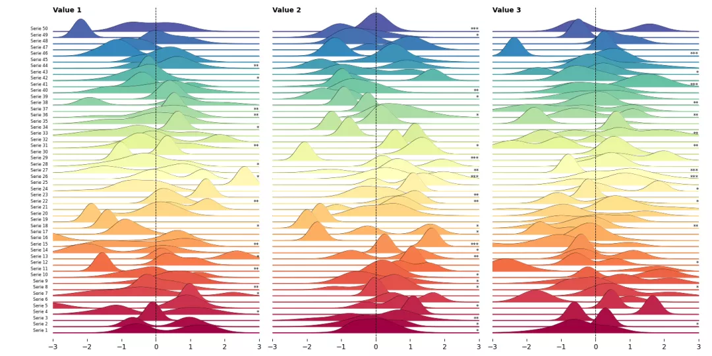
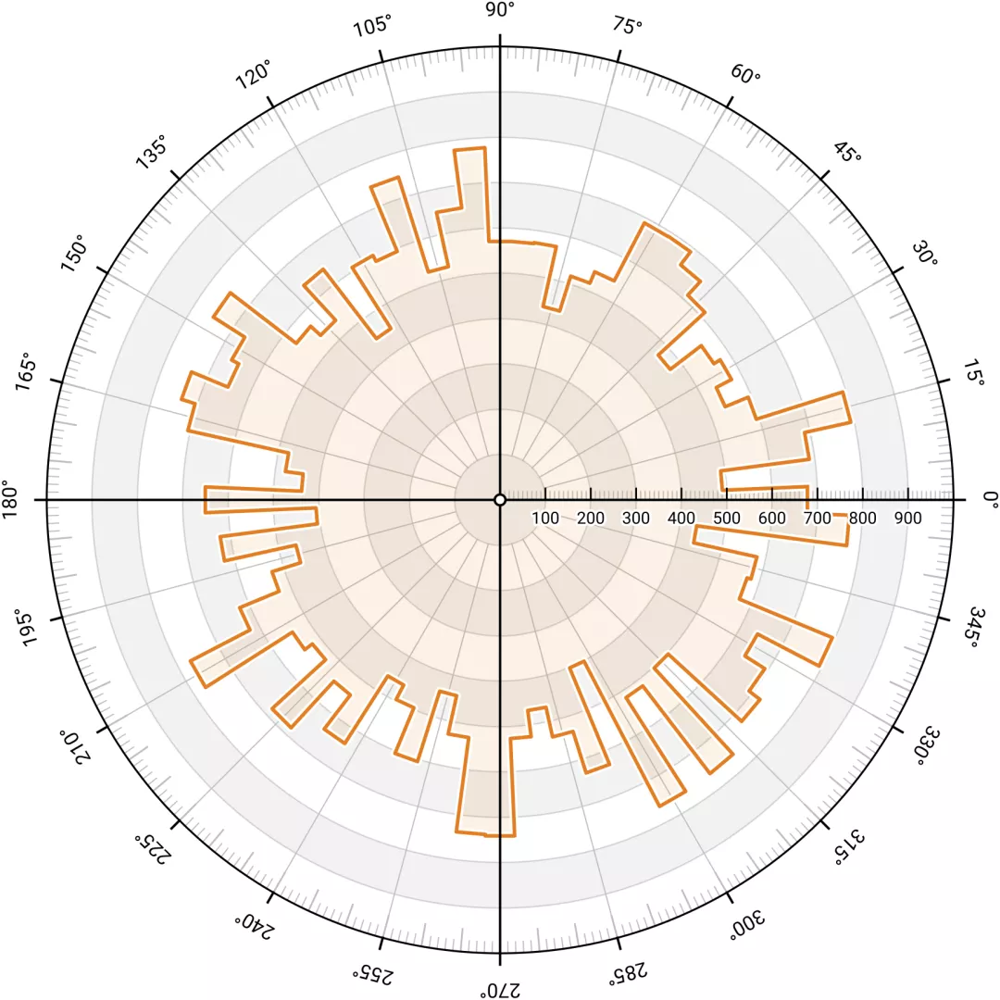
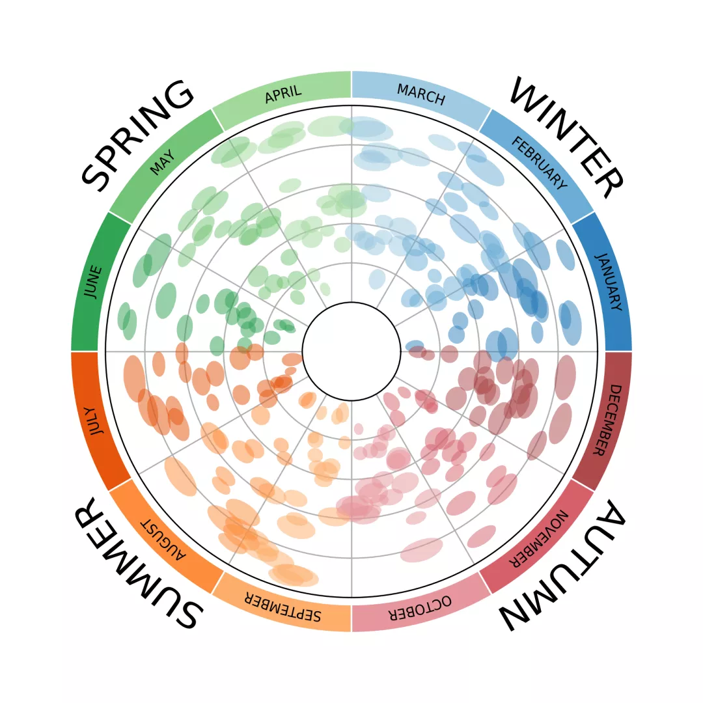
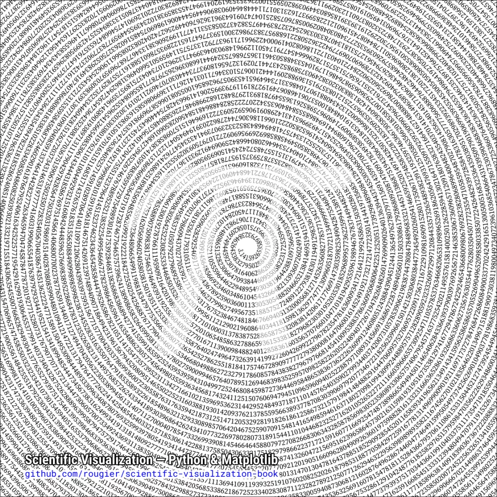
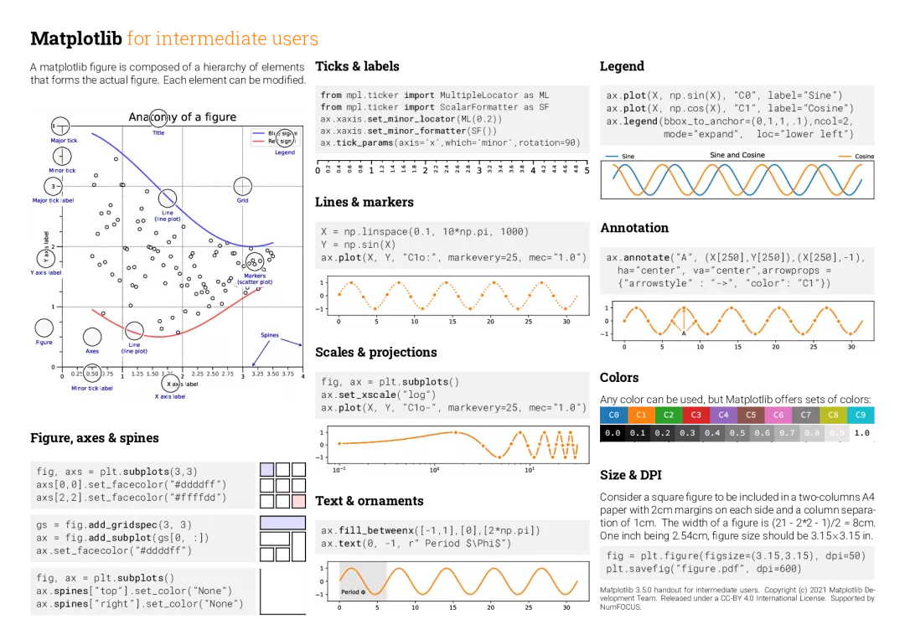
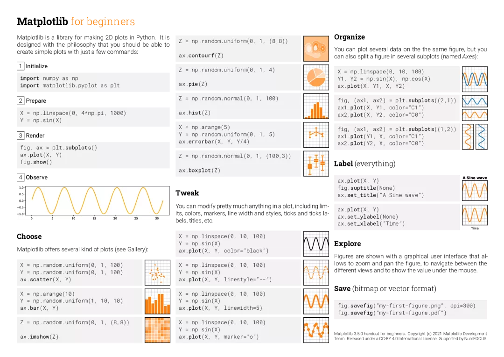
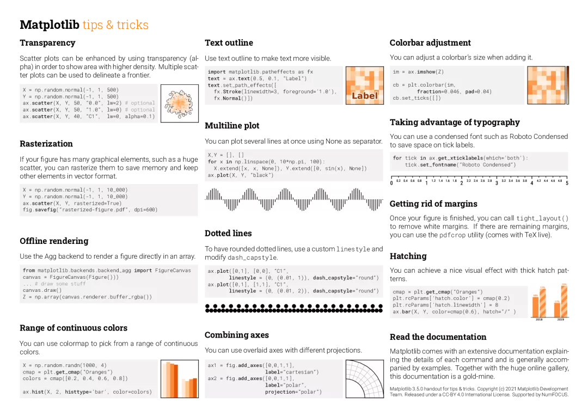
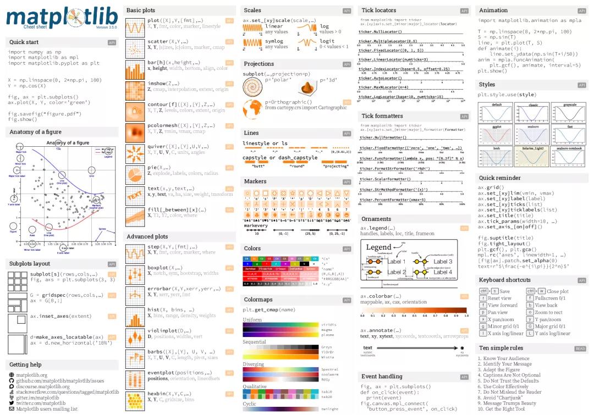
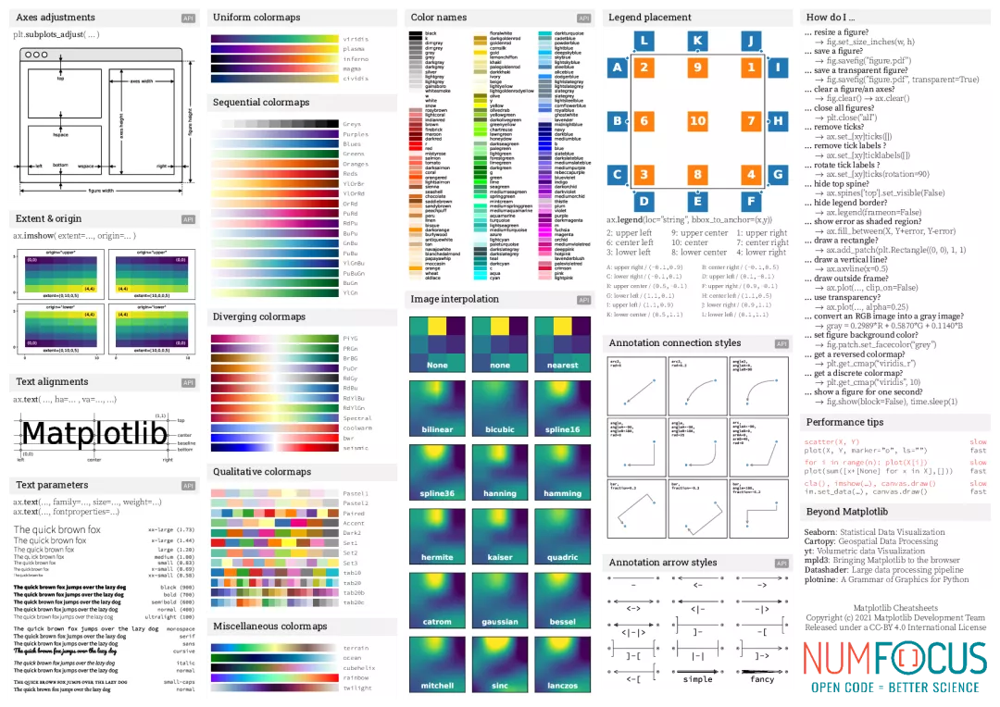

Python 可视化 Matlplotlib
<a name="qe4OR"></a>
## Matplotlib
Matplotlib 是一个 Python 的 2D绘图库，它以各种硬拷贝格式和跨平台的交互式环境生成出版质量级别的图形。<br />Python的绘图库层出不穷，比如boken seaborn pyechart altair plotly pygal ggplot等等。这些库各有优势，很多也是基于Matplotlib的，用起来确实极端代码实现很酷的图表，但是也会失去一些主动性和乐趣。<br />推荐一个开源项目，包括PDF书，完整代码，各种已实现图表。[https://github.com/rougier/scientific-visualization-book/](https://github.com/rougier/scientific-visualization-book/)
<a name="k1slz"></a>
## 比如这个sin-cos动图的实现

```python
import numpy as np
import matplotlib.pyplot as plt
import matplotlib.animation as animation

fig = plt.figure(figsize=(7, 2))
ax = plt.subplot()

X = np.linspace(-np.pi, np.pi, 256, endpoint=True)
C, S = np.cos(X), np.sin(X)
(line1,) = ax.plot(X, C, marker="o", markevery=[-1], markeredgecolor="white")
(line2,) = ax.plot(X, S, marker="o", markevery=[-1], markeredgecolor="white")
text = ax.text(0.01, 0.95, "Test", ha="left", va="top", transform=ax.transAxes)
ax.set_xticks([])
ax.set_yticks([])


def update(frame):
    line1.set_data(X[:frame], C[:frame])
    line2.set_data(X[:frame], S[:frame])
    text.set_text("Frame %d" % frame)
    if frame in [1, 32, 128, 255]:
        plt.savefig("../../figures/animation/sine-cosine-frame-%03d.pdf" % frame)
    return line1, line2, text


plt.tight_layout()
writer = animation.FFMpegWriter(fps=30)
anim = animation.FuncAnimation(fig, update, interval=10, frames=len(X))
from tqdm.autonotebook import tqdm

bar = tqdm(total=len(X))
anim.save(
    "../../figures/animation/sine-cosine.mp4",
    writer=writer,
    dpi=100,
    progress_callback=lambda i, n: bar.update(1),
)
bar.close()
```
<a name="tR6oR"></a>
## 更多漂亮的案例
<br /><br /><br /><br />
<a name="Hs9Tq"></a>
## 5张matplotlib必备速查表

<a name="uQrjz"></a>
## 附录：高清图表
[cheatsheets.pdf](https://www.yuque.com/attachments/yuque/0/2021/pdf/396745/1639732566340-c00658ba-622f-4216-b1fb-220b836d49c3.pdf?_lake_card=%7B%22src%22%3A%22https%3A%2F%2Fwww.yuque.com%2Fattachments%2Fyuque%2F0%2F2021%2Fpdf%2F396745%2F1639732566340-c00658ba-622f-4216-b1fb-220b836d49c3.pdf%22%2C%22name%22%3A%22cheatsheets.pdf%22%2C%22size%22%3A2465239%2C%22type%22%3A%22application%2Fpdf%22%2C%22ext%22%3A%22pdf%22%2C%22status%22%3A%22done%22%2C%22taskId%22%3A%22u4478925d-6daf-4dc7-a20a-dd1f8e240f1%22%2C%22taskType%22%3A%22upload%22%2C%22id%22%3A%22ue7f1f68a%22%2C%22card%22%3A%22file%22%7D)[cheatsheets-1.pdf](https://www.yuque.com/attachments/yuque/0/2021/pdf/396745/1639732563896-97f8f61e-52bd-4901-8846-0fff7cee6760.pdf?_lake_card=%7B%22src%22%3A%22https%3A%2F%2Fwww.yuque.com%2Fattachments%2Fyuque%2F0%2F2021%2Fpdf%2F396745%2F1639732563896-97f8f61e-52bd-4901-8846-0fff7cee6760.pdf%22%2C%22name%22%3A%22cheatsheets-1.pdf%22%2C%22size%22%3A642915%2C%22type%22%3A%22application%2Fpdf%22%2C%22ext%22%3A%22pdf%22%2C%22status%22%3A%22done%22%2C%22taskId%22%3A%22u7cafdf69-f2d3-46a4-ac98-3fa68f2b34c%22%2C%22taskType%22%3A%22upload%22%2C%22id%22%3A%22ueff51706%22%2C%22card%22%3A%22file%22%7D)[cheatsheets-2.pdf](https://www.yuque.com/attachments/yuque/0/2021/pdf/396745/1639732563841-5e3f1732-151d-40fe-bfb1-2d8ba482e77f.pdf?_lake_card=%7B%22src%22%3A%22https%3A%2F%2Fwww.yuque.com%2Fattachments%2Fyuque%2F0%2F2021%2Fpdf%2F396745%2F1639732563841-5e3f1732-151d-40fe-bfb1-2d8ba482e77f.pdf%22%2C%22name%22%3A%22cheatsheets-2.pdf%22%2C%22size%22%3A642926%2C%22type%22%3A%22application%2Fpdf%22%2C%22ext%22%3A%22pdf%22%2C%22status%22%3A%22done%22%2C%22taskId%22%3A%22u97e4876f-cc58-45e1-b6ff-8533a78ecd7%22%2C%22taskType%22%3A%22upload%22%2C%22id%22%3A%22uc35ec030%22%2C%22card%22%3A%22file%22%7D)[cheatsheets-3.pdf](https://www.yuque.com/attachments/yuque/0/2021/pdf/396745/1639732566207-82a1cc48-d84b-4a9a-ab36-2a32b33b89ad.pdf?_lake_card=%7B%22src%22%3A%22https%3A%2F%2Fwww.yuque.com%2Fattachments%2Fyuque%2F0%2F2021%2Fpdf%2F396745%2F1639732566207-82a1cc48-d84b-4a9a-ab36-2a32b33b89ad.pdf%22%2C%22name%22%3A%22cheatsheets-3.pdf%22%2C%22size%22%3A2456384%2C%22type%22%3A%22application%2Fpdf%22%2C%22ext%22%3A%22pdf%22%2C%22status%22%3A%22done%22%2C%22taskId%22%3A%22u314634b7-6150-410a-9d99-593c6283cca%22%2C%22taskType%22%3A%22upload%22%2C%22id%22%3A%22u3c231b6e%22%2C%22card%22%3A%22file%22%7D)[cheatsheets-4.pdf](https://www.yuque.com/attachments/yuque/0/2021/pdf/396745/1639732565549-740a6f5d-0d7e-4dc0-b6ff-3d4a75355b37.pdf?_lake_card=%7B%22src%22%3A%22https%3A%2F%2Fwww.yuque.com%2Fattachments%2Fyuque%2F0%2F2021%2Fpdf%2F396745%2F1639732565549-740a6f5d-0d7e-4dc0-b6ff-3d4a75355b37.pdf%22%2C%22name%22%3A%22cheatsheets-4.pdf%22%2C%22size%22%3A1859438%2C%22type%22%3A%22application%2Fpdf%22%2C%22ext%22%3A%22pdf%22%2C%22status%22%3A%22done%22%2C%22taskId%22%3A%22u34856f54-d7a1-4879-9822-94a0e0f4f58%22%2C%22taskType%22%3A%22upload%22%2C%22id%22%3A%22u31ae4fd2%22%2C%22card%22%3A%22file%22%7D)[cheatsheets-5.pdf](https://www.yuque.com/attachments/yuque/0/2021/pdf/396745/1639732566411-7f795757-2dfd-402a-98ed-487f9b3d78ac.pdf?_lake_card=%7B%22src%22%3A%22https%3A%2F%2Fwww.yuque.com%2Fattachments%2Fyuque%2F0%2F2021%2Fpdf%2F396745%2F1639732566411-7f795757-2dfd-402a-98ed-487f9b3d78ac.pdf%22%2C%22name%22%3A%22cheatsheets-5.pdf%22%2C%22size%22%3A1859437%2C%22type%22%3A%22application%2Fpdf%22%2C%22ext%22%3A%22pdf%22%2C%22status%22%3A%22done%22%2C%22taskId%22%3A%22u6071fda8-cd20-433d-a32b-423e9303e4e%22%2C%22taskType%22%3A%22upload%22%2C%22id%22%3A%22u80995906%22%2C%22card%22%3A%22file%22%7D)
