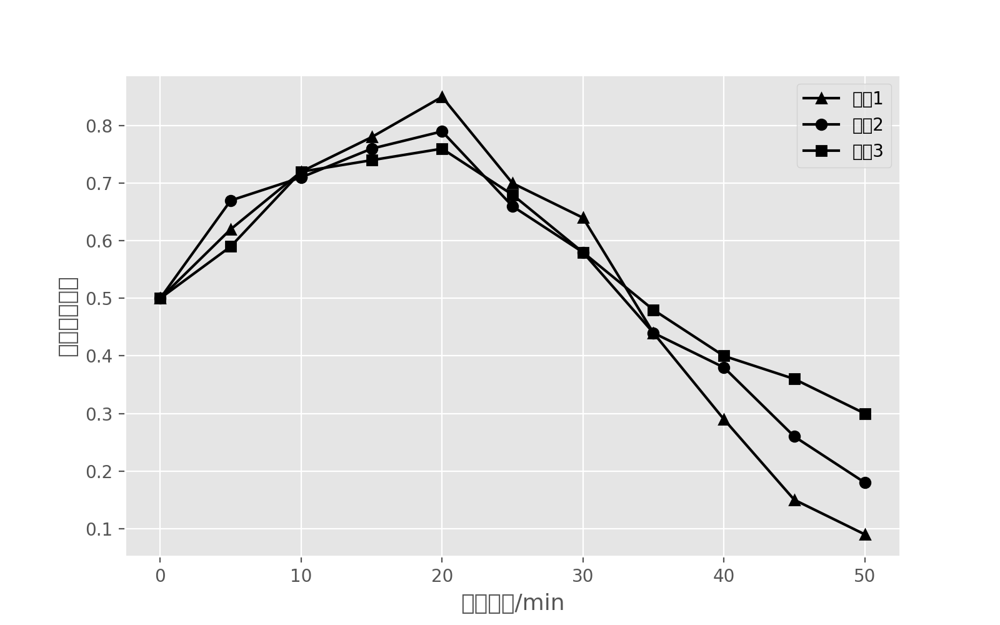

Python Matplotlib
```bash
plt.rcParams['font.sans-serif']=['SimHei'] # 防止中文乱码
plt.rcParams['axes.unicode_minus']=False # 如果需要将数字设为负数，也可能出现乱码的情况
```
<a name="d6fk0"></a>
## 一、中文乱码显示
Matplotlib库由各种可视化类构成，内部结构复杂，受 Matlab 启发 `matplotlib.pyplot` 是绘制各类可视化图形的命令子库，相当快捷。
```python
import matplotlib.pyplot as plt
```
可 matplotlib 并不支持中文显示。有中文显示会出现如下问题：
```python
# -*- coding: UTF-8 -*-
"""
三折线  黑白灰风格  标签label 标记点形状
"""
import matplotlib.pyplot as plt

# 生成x轴数据  列表推导式
x_data = [i for i in range(0, 55, 5)]

# 构造y轴数据
y_data1 = [0.5, 0.62, 0.72, 0.78, 0.85, 0.7, 0.64, 0.44, 0.29, 0.15, 0.09]
y_data2 = [0.5, 0.67, 0.71, 0.76, 0.79, 0.66, 0.58, 0.44, 0.38, 0.26, 0.18]
y_data3 = [0.5, 0.59, 0.72, 0.74, 0.76, 0.68, 0.58, 0.48, 0.4, 0.36, 0.3]

# 设置图形显示风格
plt.style.use('ggplot')

# 设置figure大小  像素
plt.figure(figsize=(8, 5), dpi=100)

# 绘制三条折线  点的形状 颜色  标签：用于图例显示
plt.plot(x_data, y_data1, marker='^', color="k", label="设备1")
plt.plot(x_data, y_data2, marker="o", color="k", label="设备2")
plt.plot(x_data, y_data3, marker="s", color="k", label="设备3")

# x y 轴标签   字体大小
plt.xlabel("时间周期/min", fontsize=13)
plt.ylabel("直接信任度值", fontsize=13)
# 显示图例
plt.legend()

# 保存图片  展示show
plt.savefig("折线图01.png", dpi=200)
plt.show()
```
<br />需要手动设置一下，才能解决中文显示的问题。
<a name="Et9Lf"></a>
## 二、解决方法
<a name="iVvwX"></a>
### 1. 方式一
```python
from matplotlib.font_manager import FontProperties  # 导入FontProperties

font = FontProperties(fname="SimHei.ttf", size=14)  # 设置字体

# 哪里需要显示中文就在哪里设置
```
```python
# -*- coding: UTF-8 -*-
"""
三折线  黑白灰风格  标签label 标记点形状
"""
import matplotlib.pyplot as plt
from matplotlib.font_manager import FontProperties  # 步骤一
# 生成x轴数据  列表推导式
x_data = [i for i in range(0, 55, 5)]

# 构造y轴数据
y_data1 = [0.5, 0.62, 0.72, 0.78, 0.85, 0.7, 0.64, 0.44, 0.29, 0.15, 0.09]
y_data2 = [0.5, 0.67, 0.71, 0.76, 0.79, 0.66, 0.58, 0.44, 0.38, 0.26, 0.18]
y_data3 = [0.5, 0.59, 0.72, 0.74, 0.76, 0.68, 0.58, 0.48, 0.4, 0.36, 0.3]

# 设置图形显示风格
plt.style.use('ggplot')
font = FontProperties(fname="SimHei.ttf", size=14)  # 步骤二
# 设置figure大小  像素
plt.figure(figsize=(8, 5), dpi=100)

# 绘制三条折线  点的形状 颜色  标签：用于图例显示
plt.plot(x_data, y_data1, marker='^', color="k", label="设备1")
plt.plot(x_data, y_data2, marker="o", color="k", label="设备2")
plt.plot(x_data, y_data3, marker="s", color="k", label="设备3")

# x y 轴标签   字体大小
plt.xlabel("时间周期/min", fontsize=13, fontproperties=font)
plt.ylabel("直接信任度值", fontsize=13, fontproperties=font)
# 显示图例
plt.legend(prop=font)

# 保存图片  展示show
plt.savefig("折线图01.png", dpi=200)
plt.show()
```
<a name="mgBGN"></a>
### 2. 方式二
通过 `fontdict` 字典参数来设置
```python
fontdict={"family": "KaiTi", "size": 15, "color": "r"}
```
```python
# -*- coding: UTF-8 -*-
"""
三折线  黑白灰风格  标签label 标记点形状
"""
import matplotlib.pyplot as plt

# 生成x轴数据  列表推导式
x_data = [i for i in range(0, 55, 5)]

# 构造y轴数据
y_data1 = [0.5, 0.62, 0.72, 0.78, 0.85, 0.7, 0.64, 0.44, 0.29, 0.15, 0.09]
y_data2 = [0.5, 0.67, 0.71, 0.76, 0.79, 0.66, 0.58, 0.44, 0.38, 0.26, 0.18]
y_data3 = [0.5, 0.59, 0.72, 0.74, 0.76, 0.68, 0.58, 0.48, 0.4, 0.36, 0.3]

# 设置图形显示风格
plt.style.use('ggplot')

# 设置figure大小  像素
plt.figure(figsize=(8, 5), dpi=100)

# 绘制三条折线  点的形状 颜色  标签：用于图例显示
plt.plot(x_data, y_data1, marker='^', color="k", label="设备1")
plt.plot(x_data, y_data2, marker="o", color="k", label="设备2")
plt.plot(x_data, y_data3, marker="s", color="k", label="设备3")

# x y 轴标签   字体大小
plt.xlabel("时间周期/min", fontsize=13, fontdict={"family": "KaiTi", "size": 15, "color": "r"})
plt.ylabel("直接信任度值", fontsize=13, fontdict={"family": "KaiTi", "size": 15, "color": "k"})

# 显示图例
plt.legend(prop={'family': 'SimHei', 'size': 16})

# 保存图片  展示show
plt.savefig("折线图01.png", dpi=200)
plt.show()
```
<a name="Yqtkl"></a>
### 3. 方式三
改变全局的字体
```python
# matplotlib其实是不支持显示中文的 显示中文需要一行代码设置字体
mpl.rcParams['font.family'] = 'SimHei'
plt.rcParams['axes.unicode_minus'] = False   # 步骤二（解决坐标轴负数的负号显示问题）
```
```python
# -*- coding: UTF-8 -*-
"""
三折线  黑白灰风格  标签label 标记点形状
"""
import matplotlib.pyplot as plt
import matplotlib as mpl

# 生成x轴数据  列表推导式
x_data = [i for i in range(0, 55, 5)]

# 构造y轴数据
y_data1 = [0.5, 0.62, 0.72, 0.78, 0.85, 0.7, 0.64, 0.44, 0.29, 0.15, 0.09]
y_data2 = [0.5, 0.67, 0.71, 0.76, 0.79, 0.66, 0.58, 0.44, 0.38, 0.26, 0.18]
y_data3 = [0.5, 0.59, 0.72, 0.74, 0.76, 0.68, 0.58, 0.48, 0.4, 0.36, 0.3]

# matplotlib其实是不支持显示中文的 显示中文需要一行代码设置字体
mpl.rcParams['font.family'] = 'SimHei'
plt.rcParams['axes.unicode_minus'] = False   # 步骤二（解决坐标轴负数的负号显示问题）
# 设置图形显示风格
plt.style.use('ggplot')

# 设置figure大小  像素
plt.figure(figsize=(8, 5), dpi=100)

# 绘制三条折线  点的形状 颜色  标签：用于图例显示
plt.plot(x_data, y_data1, marker='^', color="k", label="设备1")
plt.plot(x_data, y_data2, marker="o", color="k", label="设备2")
plt.plot(x_data, y_data3, marker="s", color="k", label="设备3")

# x y 轴标签   字体大小
plt.xlabel("时间周期/min", fontsize=13)
plt.ylabel("直接信任度值", fontsize=13)

# 显示图例
plt.legend()

# 保存图片  展示show
plt.savefig("折线图01.png", dpi=200)
plt.show()
```
<a name="s67fK"></a>
### 4. 方式四
同样也是全局改变字体的方法
```python
font = {'family' : 'SimHei',
        'weight' : 'bold',
        'size'   : '16'}
plt.rc('font', **font)               # 步骤一（设置字体的更多属性）
plt.rc('axes', unicode_minus=False)  # 步骤二（解决坐标轴负数的负号显示问题）
```
```python
# -*- coding: UTF-8 -*-
"""
三折线  黑白灰风格  标签label 标记点形状
"""
import matplotlib.pyplot as plt

# 生成x轴数据  列表推导式
x_data = [i for i in range(0, 55, 5)]

# 构造y轴数据
y_data1 = [0.5, 0.62, 0.72, 0.78, 0.85, 0.7, 0.64, 0.44, 0.29, 0.15, 0.09]
y_data2 = [0.5, 0.67, 0.71, 0.76, 0.79, 0.66, 0.58, 0.44, 0.38, 0.26, 0.18]
y_data3 = [0.5, 0.59, 0.72, 0.74, 0.76, 0.68, 0.58, 0.48, 0.4, 0.36, 0.3]

font = {'family' : 'SimHei',
        'weight' : 'bold',
        'size'   : '16'}
plt.rc('font', **font)               # 步骤一（设置字体的更多属性）
plt.rc('axes', unicode_minus=False)  # 步骤二（解决坐标轴负数的负号显示问题）

# 设置图形显示风格
plt.style.use('ggplot')

# 设置figure大小  像素
plt.figure(figsize=(8, 5), dpi=100)

# 绘制三条折线  点的形状 颜色  标签：用于图例显示
plt.plot(x_data, y_data1, marker='^', color="k", label="设备1")
plt.plot(x_data, y_data2, marker="o", color="k", label="设备2")
plt.plot(x_data, y_data3, marker="s", color="k", label="设备3")

# x y 轴标签   字体大小
plt.xlabel("时间周期/min", fontsize=13)
plt.ylabel("直接信任度值", fontsize=13)

# 显示图例
plt.legend()

# 保存图片  展示show
plt.savefig("折线图01.png", dpi=200)
plt.show()
```
<a name="rig0a"></a>
## 三、总结

- 方式一、方式二是哪里需要中文显示才设置，且不会污染全局字体设置，更灵活。
- 方式三、方式四不改变全局的字体设置，一次设置，多次使用，更方便。

附常用字体如下：

- 宋体：SimSun
- 黑体：SimHei
- 微软雅黑：Microsoft YaHei
- 微软正黑体：Microsoft JhengHei
- 新宋体：NSimSun
- 新细明体：PMingLiU
- 细明体：MingLiU
- 标楷体：DFKai-SB
- 仿宋：FangSong
- 楷体：KaiTi
- 隶书：LiSu
- 幼圆：YouYuan
- 华文细黑：STXihei
- 华文楷体：STKaiti
- 华文宋体：STSong
- 华文中宋：STZhongsong
- 华文仿宋：STFangsong
- 方正舒体：FZShuTi
- 方正姚体：FZYaoti
- 华文彩云：STCaiyun
- 华文琥珀：STHupo
- 华文隶书：STLiti
- 华文行楷：STXingkai
- 华文新魏：STXinwei
