Python Matplotlib 可视化<br />Python 中可以通过 matplotlib 模块的 pyplot 子库来完成绘图。Matplotlib 可用于创建高质量的图表和图形，也可以用于绘制和可视化结果。matplotlib 是 Python 优秀的数据可视化第三方库，`matplotlib.pyplot` 是绘制种类可视化图形的命令子库，相当于快捷方式 `import matplotlib.pyplot as plt`.<br />用 Python 对一批运动员数据进行操作，读取数据、数据预处理、matplotlib 数据可视化，熟悉用 Python 进行数据分析和可视化的基本方法，并绘制柱形图、堆叠图、折线图、饼图、环图、箱形图、散点图、直方图、多个子图和热力图。
<a name="S9253"></a>
## 数据集读取
数据文件：[soccer.csv](https://www.yuque.com/attachments/yuque/0/2023/csv/396745/1688970302686-ca393b56-a827-476f-a8ef-8a33759c1ee5.csv?_lake_card=%7B%22src%22%3A%22https%3A%2F%2Fwww.yuque.com%2Fattachments%2Fyuque%2F0%2F2023%2Fcsv%2F396745%2F1688970302686-ca393b56-a827-476f-a8ef-8a33759c1ee5.csv%22%2C%22name%22%3A%22soccer.csv%22%2C%22size%22%3A1965599%2C%22ext%22%3A%22csv%22%2C%22source%22%3A%22%22%2C%22status%22%3A%22done%22%2C%22download%22%3Atrue%2C%22taskId%22%3A%22u907a74f4-e583-4058-b19e-cb54acfa732%22%2C%22taskType%22%3A%22upload%22%2C%22type%22%3A%22text%2Fcsv%22%2C%22__spacing%22%3A%22both%22%2C%22mode%22%3A%22title%22%2C%22id%22%3A%22u379bed76%22%2C%22margin%22%3A%7B%22top%22%3Atrue%2C%22bottom%22%3Atrue%7D%2C%22card%22%3A%22file%22%7D)<br />**pandas读取并查看数据，对于本次练习的数据，读取时需要设置**`**encoding='gbk'**`**，不然会报错。**<br />`pd.read_csv()`读取csv文件，数据有17587行，17列。
```python
import pandas as pd
df = pd.read_csv('soccer.csv', encoding='gbk')
print(df)
```
`df.info()`：查看索引、数据类型和内存信息
```python
import pandas as pd
df = pd.read_csv('soccer.csv', encoding='gbk')
print(df.info())
```
`df.describe()`：查看数值型列的汇总统计情况
```python
import pandas as pd
df = pd.read_csv('soccer.csv', encoding='gbk')
print(df.describe())
```
<a name="fda07"></a>
## pyplot中文显示
pyplot并不默认显示中文，坐标系中出现中文汉字，需要增加额外代码辅助。
<a name="h1lhr"></a>
### 方法一：
可以通过rcParams修改字体实现，但这种方法改变的是全局的字体。
```python
import matplotlib as mpl
mpl.rcParams['font.family'] = 'SimHei'
mpl.rcParams['font.size'] = 15
```
| 属性 |  说明 |
| --- | --- |
| **'font.family'** | 用于显示字体的名字 |
| **'font.style'** | 字体风格，正常**'normal'**或斜体**'italic'** |
| **'font.size'** | 字体大小，整数字号或者**'large'**、**'x-small'** |

| 中文字体 | 说明 |
| --- | --- |
| 'SimHei' | 中文黑体 |
| 'Kaiti' | 中文楷体 |
| 'LiSu' | 中文隶书 |
| 'FangSong' | 中文仿宋 |
| 'YouYuan' | 中立幼圆 |
| 'STSong' | 华文宋体 |

<a name="UxE8s"></a>
### 方法二：
在有中文输出的地方，增加一个属性：fontproperties
```python
import matplotlib.pyplot as plt
import numpy as np
a = np.arange(0.0, 5.0, 0.02)
plt.figure(figsize=(9, 6), dpi=100)
plt.plot(a, np.cos(2 * np.pi * a), 'r--')
# 在特定的地方用中文  和改变字号
plt.xlabel('横轴：时间', fontproperties='SimHei', fontsize=15, color='green')
plt.ylabel('纵轴：振幅', fontproperties='SimHei', fontsize=15, color='red')
plt.show()
```
<a name="QRXYa"></a>
## 1、绘制柱形图
(1)  将运动员年龄（Age）划分为三个年龄段：'17-26'，'27-36'，'37-47'，统计不同年龄段的人数，并用柱状图可视化。
```python
import pandas as pd
import matplotlib.pyplot as plt
import matplotlib as mpl
# 读取数据  设置编码  不然会报错
df = pd.read_csv('soccer.csv', encoding='gbk')
# 将运动员年龄（Age）划分为三个年龄段
age_group = ["17-26", "27-36", "37-47"]
# 统计不同年龄段人数
count_1 = df[(df['Age'] >= 17) & (df['Age'] <= 26)]
count_2 = df[(df['Age'] >= 27) & (df['Age'] <= 36)]
count_3 = df[(df['Age'] >= 37) & (df['Age'] <= 47)]
age_counts = [len(count_1), len(count_2), len(count_3)]
# 设置大小   像素
plt.figure(figsize=(9, 6), dpi=100)
# 设置中文显示
mpl.rcParams['font.family'] = 'SimHei'
# 绘制柱形图  设置柱条的宽度和颜色
plt.bar(age_group, age_counts, width=0.35, color='red')
# 添加描述信息
plt.title('不同年龄段人数统计')
plt.xlabel('年龄段')
plt.ylabel('人数')
# 可以设置网格  透明度 线条样式
plt.grid(alpha=0.3, linestyle=':')
# 展示图片
plt.show()
```
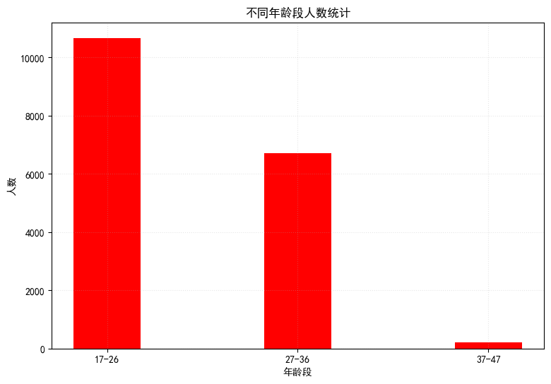<br />(2) 查看不同技术等级（Skill_Moves ）下的球员数量，以及哪个技术等级的球员数量最多，哪个最少，利用水平柱状图可视化。
```python
import pandas as pd
import matplotlib.pyplot as plt
import matplotlib as mpl
df = pd.read_csv('soccer.csv', encoding='gbk')
skill_count = df['Skill_Moves'].value_counts()
skill = [f'等级{m}' for m in skill_count.index]    # 列表推导式构造不同技术等级
counts = skill_count.values.tolist()               # 技术等级对应人数统计的列表
# 设置中文显示
mpl.rcParams['font.family'] = 'SimHei'
# 设置大小  像素
plt.figure(figsize=(9, 6), dpi=100)
# 绘制水平柱状图
plt.barh(skill[::-1], counts[::-1], height=0.5, color='#FF00FF')
plt.title('不同技术等级人数统计')
plt.xlabel('人数')
plt.show()
```
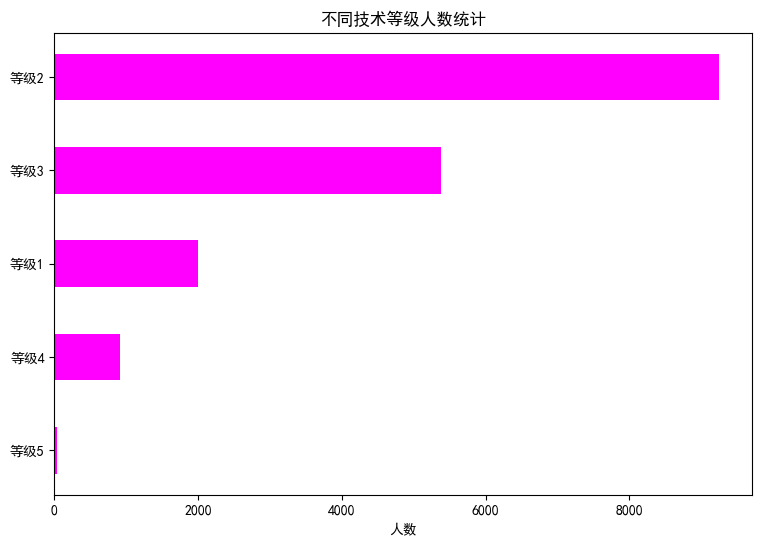
<a name="BdwTf"></a>
## 2、绘制堆叠图
将运动员年龄（Age）划分为三个年龄段：’17-26’，’27-36’，’37-47’，统计 3 个年龄段下 5个技术等级（Skill_Moves）的人数，并用堆叠图可视化。
```python
import pandas as pd
import matplotlib.pyplot as plt
import collections
import numpy as np
import matplotlib as mpl
df = pd.read_csv('soccer.csv', encoding='gbk')
age_group = ["17-26", "27-36", "37-47"]
# & 与    | 或   不同条件之间 ()括起来
data1 = df[(17 <= df['Age']) & (df['Age'] <= 26)]
age1 = list(data1['Skill_Moves'])
data2 = df[(27 <= df['Age']) & (df['Age'] <= 36)]
age2 = list(data2['Skill_Moves'])
data3 = df[(37 <= df['Age']) & (df['Age'] <= 47)]
age3 = list(data3['Skill_Moves'])
# 分别统计三个年龄段 不同等级人数
count_1 = collections.Counter(age1).most_common()
count_2 = collections.Counter(age2).most_common()
count_3 = collections.Counter(age3).most_common()
count_3.append((5, 0))    # 37-47年龄段等级5人数为零  手动添上
counts = count_1 + count_2 + count_3
datas = [[] for i in range(5)]
for i in counts:
    datas[i[0] - 1].append(i[1])
# 转化为数组  堆叠时可以对应相加
grades = np.array(datas)
# print(grades)
# 设置大小   像素
plt.figure(figsize=(9, 6), dpi=100)
# 设置中文显示
mpl.rcParams['font.family'] = 'SimHei'
plt.bar(age_group, grades[0], label='等级一', color='red', width=0.35)
plt.bar(age_group, grades[1], bottom=grades[0], label="等级二", color="#9400D3", width=0.35)
plt.bar(age_group, grades[2], bottom=grades[0] + grades[1], label="等级三", color="#0000FF", width=0.35)
plt.bar(age_group, grades[3], bottom=grades[0] + grades[1] + grades[2], label="等级四", color="#FFFF00", width=0.35)
plt.bar(age_group, grades[4], bottom=grades[0] + grades[1] + grades[2] + grades[3], label="等级五", color="#006400", width=0.35)
plt.title('不同年龄段等级人数统计')
plt.xlabel('年龄段')
plt.ylabel('人数')
plt.grid(alpha=0.3, linestyle=':')
# 显示图例 位置
plt.legend(loc=0)
plt.show()
```
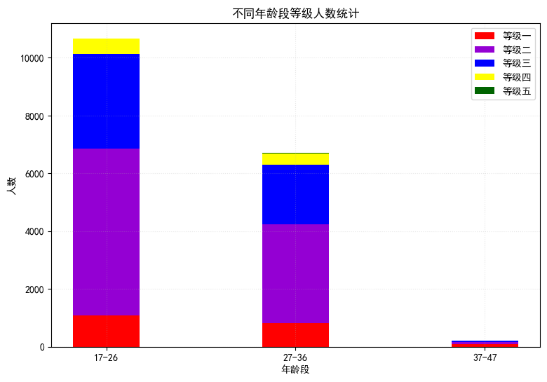
<a name="1LEbw"></a>
## 3、绘制折线图
利用频数分布折线图来查看运动员身高（Height）与体重（Weight）的分布
```python
import pandas as pd
import matplotlib.pyplot as plt
import matplotlib.gridspec as gridspec
import matplotlib as mpl
df = pd.read_csv('soccer.csv', encoding='gbk')
# <class 'pandas.core.series.Series'>
height = df['Height'].value_counts()
weight = df['Weight'].value_counts()
# SeriseL类型通过索引进行排序  也就是按身高从低到高排序
heights = height.sort_index()
weights = weight.sort_index()
mpl.rcParams['font.family'] = 'SimHei'
gs = gridspec.GridSpec(1, 2)
plt.figure(figsize=(12, 5), dpi=100)
# 设置图形显示风格
plt.style.use('ggplot')
ax1 = plt.subplot(gs[0, 0])
ax2 = plt.subplot(gs[0, 1])
# 子图1
ax1.plot(heights.index, heights.values)
ax1.set_title('运动员身高频数分布折线图')
ax1.set_xlabel('身高(cm)')
ax1.set_ylabel('人数')
# 子图2
ax2.plot(weights.index, weights.values)
ax2.set_title('运动员体重频数分布折线图')
ax2.set_xlabel('体重(kg)')
ax2.set_ylabel('人数')
plt.show()
```
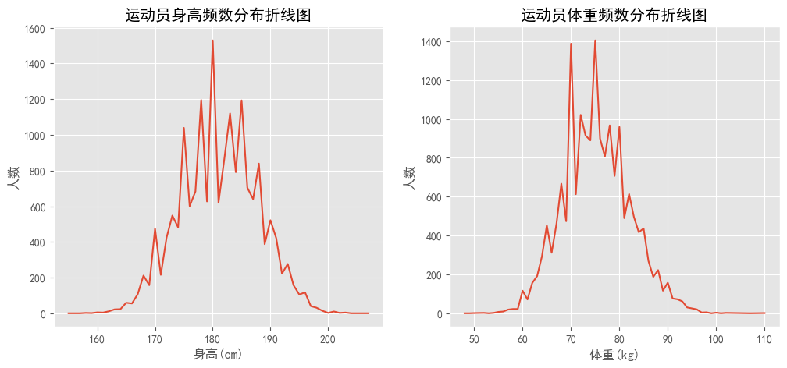
<a name="hjCvp"></a>
## 4、绘制饼图
(1) 使用饼图查看运动员的惯用脚（Preffered_Foot）字段中不同惯用脚人数的占比。
```python
import pandas as pd
import matplotlib.pyplot as plt
import matplotlib as mpl
preffered_foot = list(pd.read_csv('soccer.csv', encoding='gbk')['Preffered_Foot'])
foot = ['右脚', '左脚']
counts = [preffered_foot.count('Right'), preffered_foot.count('Left')]
# 设置中文显示
mpl.rcParams['font.family'] = 'SimHei'
# 设置大小  像素
plt.figure(figsize=(9, 6), dpi=100)
plt.axes(aspect='equal')   # 保证饼图是个正圆
explodes = [0, 0.2]
color = ['red', '#00FF00']
# 绘制饼图
# x：统计数据   explode：是否突出显示    label：标签  color：自定义颜色
# autopct：设置百分比的格式,保留2位小数  shadow：  有阴影  看起来立体
# startangle：初始角度 可使饼图旋转      labeldistance：标签离圆心的位置
plt.pie(counts, explode=explodes, labels=foot,
        colors=color, autopct='%.2f%%', shadow=True,
        startangle=15, labeldistance=0.8,
        )
plt.title('不同惯用脚的运动员人数占比图', fontsize=15)
plt.show()
```
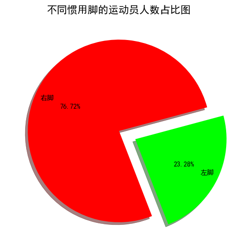<br />(2) 按照运动员的技术等级（Skill_Moves），使用环图展示出运动员不同技术等级人数的占比。
```python
import pandas as pd
import collections
import matplotlib.pyplot as plt
import matplotlib as mpl
skill_moves = list(pd.read_csv('soccer.csv', encoding='gbk')['Skill_Moves'])
skill_count = collections.Counter(skill_moves).most_common()
skill = ['等级{}'.format(m[0]) for m in skill_count]
counts = [n[1] for n in skill_count]
# 设置大小  像素
plt.figure(figsize=(9, 6), dpi=100)
# 设置中文显示
mpl.rcParams['font.family'] = 'SimHei'
plt.axes(aspect='equal')   # 保证饼图是个正圆
x_ = [1, 0, 0, 0, 0]       # 用于显示空心
color = ["red", "blue", "yellow", "green", "purple"]
plt.pie(x=counts, colors=color, pctdistance=0.9,
        startangle=45, autopct='%.1f%%', shadow=True,
        )
# 小的空白圆填充  实现圆环效果
plt.pie(x_, radius=0.65, colors="w")
# 添加图例  可以微调位置
plt.legend(skill, bbox_to_anchor=(0.9, 0.92))
plt.title('不同技术等级的运动员人数占比图', fontsize=15)
plt.show()
```
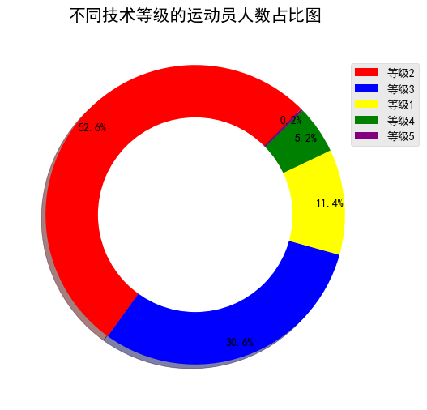
<a name="XvNjd"></a>
## 5、绘制箱形图
箱线图，又称箱形图 (boxplot) 或盒式图，不同于一般的折线图、柱状图或饼图等传统图表，只是数据大小、占比、趋势等等的呈现，其包含一些统计学的均值、分位数、极值等等统计量，因此，该图信息量较大，不仅能够分析不同类别数据平均水平差异（需在箱线图中加入均值点），还能揭示数据间离散程度、异常值、分布差异等等。<br />使用箱形图展示出不同技术等级 (Skill_Moves) 的运动员的评分 (Rating) 分布情况，即横轴为运动员的技术等级，纵轴为评分。<br />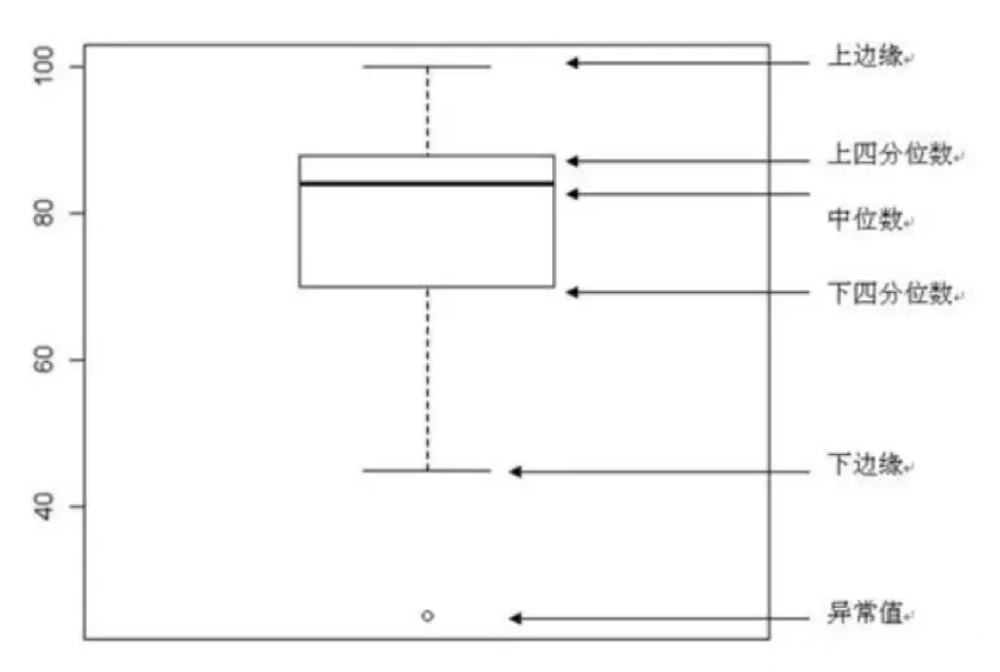<br />/

| 参数 | 说明 | 参数 | 说明 |
| --- | --- | --- | --- |
| X | 指定要绘制箱线图的数据; | showcaps | 是否显示箱线图顶端和末端的两条线 |
| notch | 是否是凹口的形式展现箱线图 | showbox | 是否显示箱线图的箱体 |
| sym | 指定异常点的形状 | showfliers | 是否显示异常值 |
| vert | 是否需要将箱线图垂直摆放 | boxprops | 设置箱体的属性,如边框色,填充色等; |
| whis | 指定上下须与上下四分位的距离 | labels | 为箱线图添加标签 |
| positions | 指定箱线图的位置 | filerprops | 设置异常值的属性 |
| widths | 指定箱线图的宽度 | medianprops | 设置中位数的属性 |
| patch _artist | 是否填充箱体的颜色; | meanprops | 设置均值的属性 |
| meanline | 是否用线的形式表示均值 | capprops | 设置箱线图顶端和末端线条的属性 |
| showmeans | 是否显示均值 | whiskerprops | 设置须的属性 |

```python
import pandas as pd
import matplotlib.pyplot as plt
import matplotlib as mpl
df = pd.read_csv('soccer.csv', encoding='gbk')
labels = [f'等级{i}' for i in ['一', '二', '三', '四', '五']]
data1 = df[df['Skill_Moves'] == 1]['Rating']
data2 = df[df['Skill_Moves'] == 2]['Rating']
data3 = df[df['Skill_Moves'] == 3]['Rating']
data4 = df[df['Skill_Moves'] == 4]['Rating']
data5 = df[df['Skill_Moves'] == 5]['Rating']
# 设置中文显示
mpl.rcParams['font.family'] = 'SimHei'
# 设置图形显示风格
plt.style.use('ggplot')
fig, ax = plt.subplots()
box_plot = ax.boxplot((data1, data2, data3, data4, data5), labels=labels,
            boxprops={'color': 'black'}, showmeans=True, patch_artist=True,
            )
colors = ['pink', 'blue', 'green', 'yellow', 'red']
# 填充箱子颜色
for patch, color in zip(box_plot['boxes'], colors):
    patch.set(facecolor=color)
# 设置箱子两端线的属性
for whisker in box_plot['whiskers']:
    whisker.set(color='purple', linewidth=2)
# 设置顶端和末端线条的属性
for cap in box_plot['caps']:
    cap.set(color='g', linewidth=3)
# 设置中位数的属性
for median in box_plot['medians']:
    median.set(color='black', linewidth=3)
plt.xlabel('技术等级')
plt.ylabel('评分')
plt.title('不同技术等级的运动员评分分布箱形图')
plt.show()
```
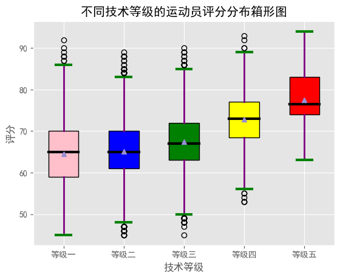
<a name="OOZu3"></a>
## 6、绘制散点图
绘制年龄 (Age) 与评分 (Rating) 构成的散点图
```python
import pandas as pd
import matplotlib.pyplot as plt
import matplotlib as mpl
df= pd.read_csv('soccer.csv', encoding='gbk')
age, rating = list(df['Age']), list(df['Rating'])
# 设置中文显示
mpl.rcParams['font.family'] = 'SimHei'
# 设置图形显示风格
plt.style.use('ggplot')
# 设置大小  像素
plt.figure(figsize=(9, 6), dpi=100)
# 绘制散点图
plt.scatter(age, rating)
# 添加描述信息
plt.title('运动员年龄与评分散点图')
plt.xlabel('年龄')
plt.ylabel('评分')
plt.show()
```
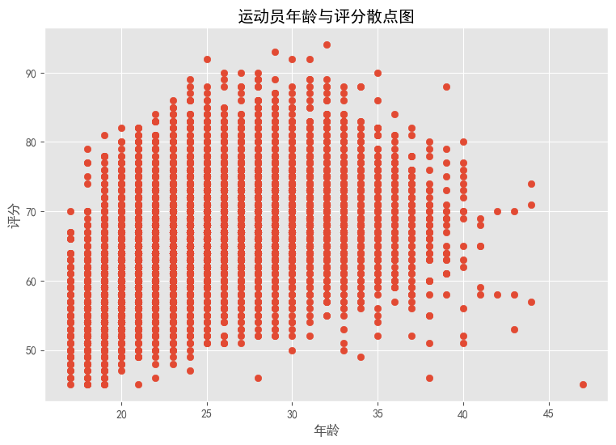
<a name="ziQC0"></a>
## 7、绘制直方图
利用直方图查看运动员的年龄(Age)分布
```python
import pandas as pd
import matplotlib.pyplot as plt
import matplotlib as mpl
ages = list(pd.read_csv('soccer.csv', encoding='gbk')['Age'])
ages.sort()
# 设置中文显示
mpl.rcParams['font.family'] = 'SimHei'
# 设置图形显示风格
plt.style.use('ggplot')
plt.figure(figsize=(9, 6), dpi=100)
bin_width = 1  # 设置组距   整除
num_bin = (max(ages) - min(ages)) // bin_width    # 组数
# 绘制直方图  x：指定要绘制直方图的数据
# bins：指定直方图条形的个数  color：设置直方图的填充色    edgecolor：指定直方图的边界色
plt.hist(x=ages, bins=num_bin, color='blue', edgecolor='k', label='直方图')   # 为直方图呈现标签
plt.xticks(range(20, 50, 5))     # 设置x轴刻度
# 添加描述信息
plt.xlabel('年龄区间')
plt.ylabel('频数')
plt.title('年龄频数分布直方图')
plt.legend()
plt.show()
```
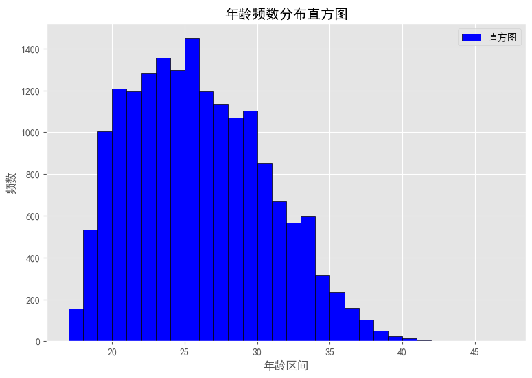<br />数据可视化的时候，有时需要将多个子图放在同一个画板上进行比较。通过使用GridSpec类配合subplot，可以很容易对子区域进行划定和选择，在同一个画板上绘制多个子图。
<a name="3kOSi"></a>
## 8、对子绘图区域的划定和选择
GridSpec是matplotlib中一个特殊的用来进行子绘图区域设计和选定的一个类
```python
import matplotlib.gridspec as gridspec
gs = gridspec.GridSpec(2, 2)   # 设计一个网格 2行2列
# 选定子绘图区域
ax1 = plt.subplot(gs[0, 0])
ax2 = plt.subplot(gs[0, 1])
ax3 = plt.subplot(gs[1, 0])
ax4 = plt.subplot(gs[1, 1])
```
通过使用GridSpec类配合subplot，可以很容易对子区域进行划定和选择。
<a name="dIEEf"></a>
## 9、绘制多个子图
**测试数据如下：**<br />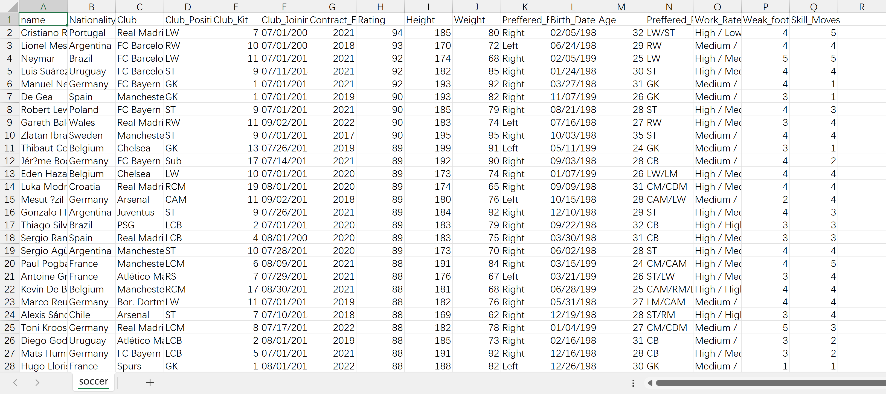<br />**代码如下：**
```python
import pandas as pd
import matplotlib.pyplot as plt
import matplotlib as mpl
import matplotlib.gridspec as gridspec
import collections
import numpy as np
# 读取数据
df = pd.read_csv('soccer.csv', encoding='gbk')
# 子图1数据
skill_count = df['Skill_Moves'].value_counts()
skill = [f'等级{m}' for m in skill_count.index]    # 列表推导式构造不同技术等级
counts = skill_count.values.tolist()               # 技术等级对应人数统计的列表
# 子图2数据
age_group = ["17-26", "27-36", "37-47"]
count_1 = df[(df['Age'] >= 17) & (df['Age'] <= 26)]
count_2 = df[(df['Age'] >= 27) & (df['Age'] <= 36)]
count_3 = df[(df['Age'] >= 37) & (df['Age'] <= 47)]
age_counts = [len(count_1), len(count_2), len(count_3)]
# 子图3数据
# &符号 并且    |符号 或   不同条件之间 ()括起来
data1 = df[(17 <= df['Age']) & (df['Age'] <= 26)]
age1 = list(data1['Skill_Moves'])
data2 = df[(27 <= df['Age']) & (df['Age'] <= 36)]
age2 = list(data2['Skill_Moves'])
data3 = df[(37 <= df['Age']) & (df['Age'] <= 47)]
age3 = list(data3['Skill_Moves'])
# 分别统计三个年龄段 不同等级人数
count_1 = collections.Counter(age1).most_common()
count_2 = collections.Counter(age2).most_common()
count_3 = collections.Counter(age3).most_common()
count_3.append((5, 0))    # 37-47年龄段等级5人数为零  手动填上
age_counts3 = count_1 + count_2 + count_3
datas = [[] for i in range(5)]
for i in age_counts3:
    datas[i[0]-1].append(i[1])
grades = np.array(datas)
# 子图4数据
skill_moves = list(df['Skill_Moves'])
skill_count = collections.Counter(skill_moves).most_common()
skill = ['等级{}'.format(m[0]) for m in skill_count]
counts = [n[1] for n in skill_count]
# 绘制多个子图
mpl.rcParams['font.family'] = 'SimHei'
gs = gridspec.GridSpec(2, 2)
plt.figure(figsize=(12, 20), dpi=100)
ax1 = plt.subplot(gs[0, 0])
ax2 = plt.subplot(gs[0, 1])
ax3 = plt.subplot(gs[1, 0])
ax4 = plt.subplot(gs[1, 1])
ax1.barh(skill[::-1], counts[::-1], height=0.5, color='#FF00FF')
ax1.set_xlabel('人数')
ax1.set_title('不同技术等级人数统计')
ax2.bar(age_group, age_counts, width=0.35, color='red')
ax2.set_title('不同年龄段人数统计')
ax2.set_xlabel('年龄段')
ax2.set_ylabel('人数')
ax3.bar(age_group, grades[0], label='等级一', color='red', width=0.35)
ax3.bar(age_group, grades[1], bottom=grades[0], label="等级二", color="#9400D3", width=0.35)
ax3.bar(age_group, grades[2], bottom=grades[0] + grades[1], label="等级三", color="#0000FF", width=0.35)  # 转化为数组  直接相加
ax3.bar(age_group, grades[3], bottom=grades[0] + grades[1] + grades[2], label="等级四", color="#FFFF00", width=0.35)
ax3.bar(age_group, grades[4], bottom=grades[0] + grades[1] + grades[2] + grades[3], label="等级五", color="#006400", width=0.35)
ax3.set_title('不同年龄段等级人数统计')
ax3.set_xlabel('年龄段')
ax3.set_ylabel('人数')
x_ = [1, 0, 0, 0, 0]       # 用于显示空心
color = ["red", "blue", "yellow", "green", "purple"]
# 正圆
ax4.set_aspect(aspect='equal')
ax4.pie(x=counts, colors=color, pctdistance=0.9,
        startangle=45, autopct='%.1f%%',
        )
ax4.pie(x_, radius=0.65, colors="w")   # 小的空白圆填充
ax4.set_title('不同技术等级的运动员人数占比图')
# 调整图例位置
plt.legend(skill, bbox_to_anchor=(0.9, 0.92))
plt.show()
```
运行效果如下：<br />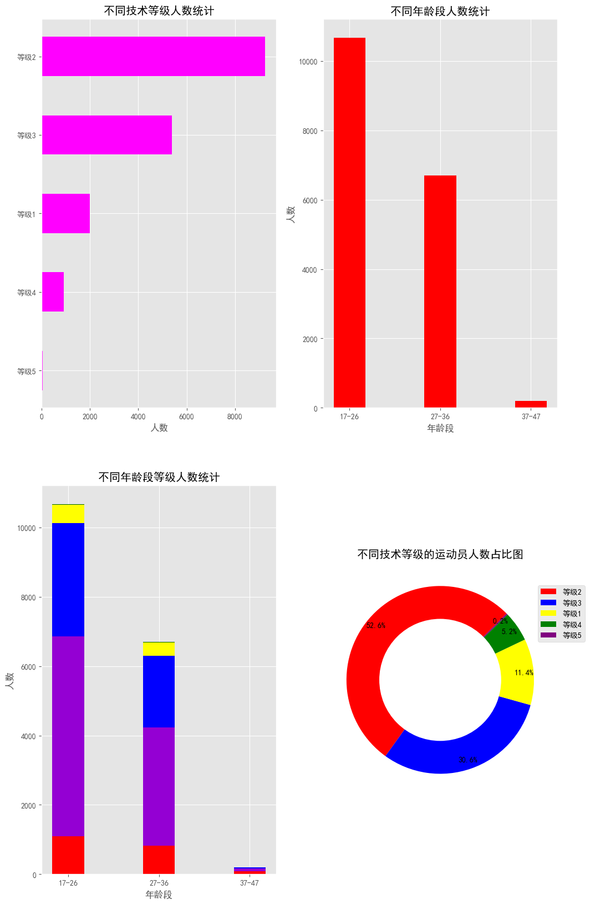
<a name="XuP3s"></a>
## 10、Matplotlib 绘制热力图
Matplotlib 是 Python 著名的 2D 绘图库，该库仿造 Matlab 提供了一整套相似的绘图函数，用于绘图和绘表，是强大的数据可视化工具和做图库，且绘制出的图形美观。
> **测试数据来源：**[https://www.tudinet.com/market-0-0-0-0/](https://www.tudinet.com/market-0-0-0-0/)

代码如下：
```python
import pandas as pd
import matplotlib.pyplot as plt
import numpy as np
import matplotlib as mpl
df = pd.read_excel('real_estate_info.xlsx')
area = df['土地位置']
# 成都主要 区 县 市  9区6县4市
with open('test.txt', encoding='utf-8') as f:
    areas = f.read().split('、')
for item in areas:
    # 每个行政区 对每行数据都进行判断
    # 土地位置里包含行政区名  值为规划建筑面积   不包含  值为0
    # 得到19列 以行政区为列名 其下面值为规划建筑面积
    df[item] = [eval(df.loc[x, '规划建筑面积'][:-1]) if item in df.loc[x, '土地位置'] else 0 for x in range(len(df['土地位置']))]
date = df['推出时间'].str.split('年', expand=True)[0]   # 这列的字符串 按年切割
df['年份'] = date        # 添加新的一列  年份
df1 = df[areas]
df1.index = df['年份']
df2 = df1.groupby('年份').sum()
# print(df2.iloc[:5, ::])  # 2020年数据只有到2月的  舍去
# print(type(df2.iloc[:5, ::].T))     # 转置
datas = np.array(df2.iloc[:5, ::].T)   # 19行 5列 二维数组
print(datas)
x_label = [year for year in range(2015, 2020)]
y_label = areas
mpl.rcParams['font.family'] = 'Kaiti'     # 中文显示
fig, ax = plt.subplots(figsize=(15, 9))   # 绘图
heatmap = plt.pcolor(datas)
for y in range(datas.shape[0]):
    for x in range(datas.shape[1]):
        plt.text(x + 0.5, y + 0.5, '%.1f' % datas[y, x],    # 热力图种每个格子添加文本  数据项设置
                 horizontalalignment='center', verticalalignment='center',
                 )
# x y轴刻度设置
plt.xticks(np.arange(0.5, 5.5, 1))
plt.yticks(np.arange(0.5, 19.5, 1))
# x y轴标签设置
ax.set_xticklabels(x_label)
ax.set_yticklabels(areas)
# title
ax.set_title(r'各行政区2015-2019年的总规划建筑面积(平方米)', fontsize=25, x=0.5, y=1.02)
# 隐藏边框
ax.spines['top'].set_visible(False)
ax.spines['right'].set_visible(False)
ax.spines['left'].set_visible(False)
ax.spines['bottom'].set_visible(False)
plt.savefig('heat_map.png')
# 热力图   展示
plt.colorbar(heatmap)
plt.show()
```
运行效果如下：<br />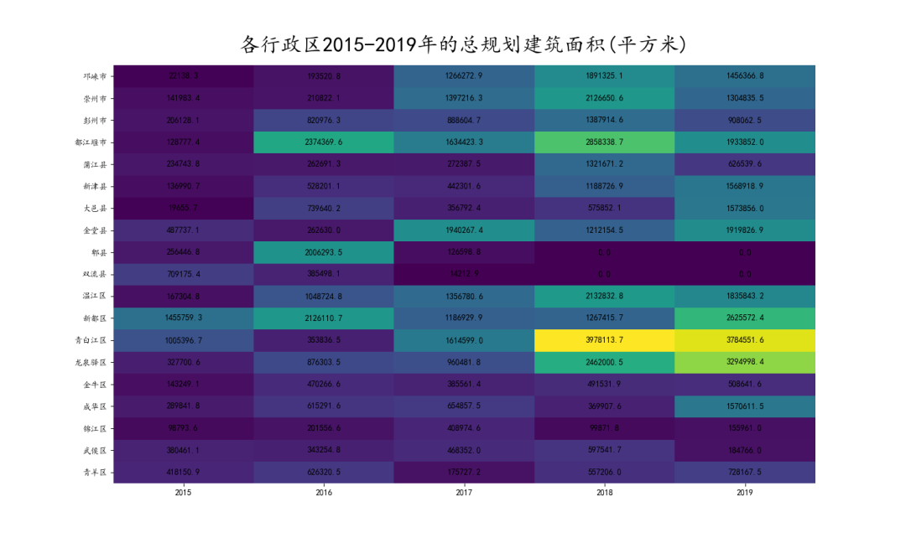<br />matplotlib 绘制 heatmap，该方法比较繁琐，要调用很多辅助函数才能实现效果更好的热图。
