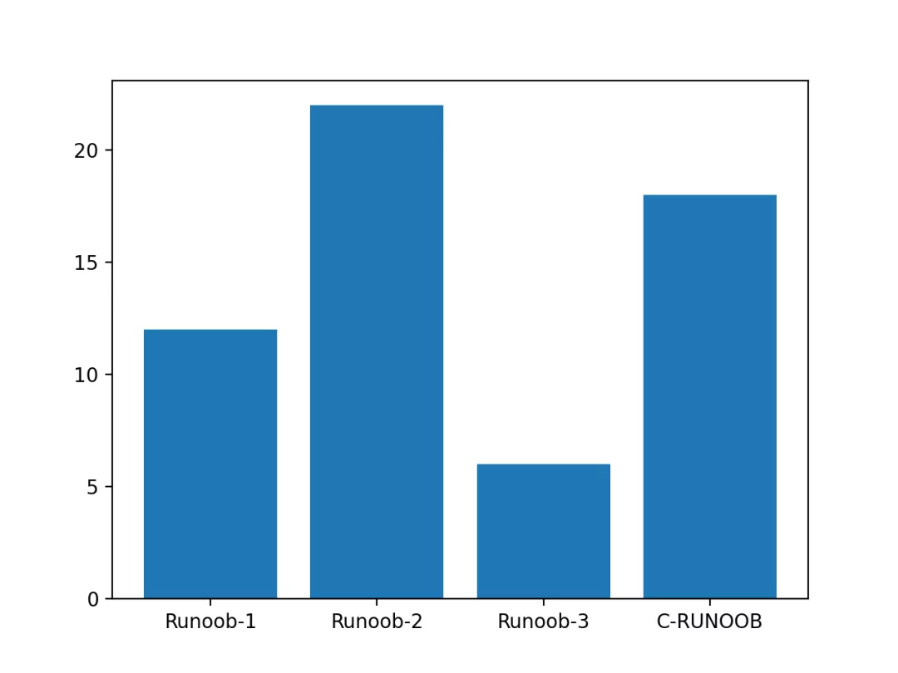
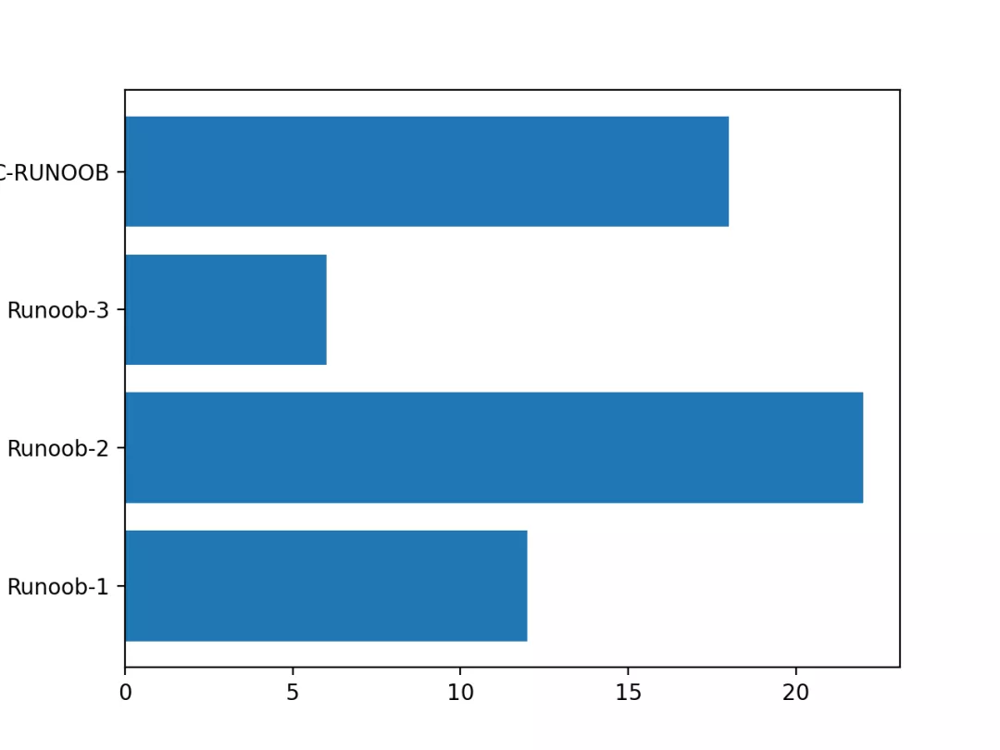
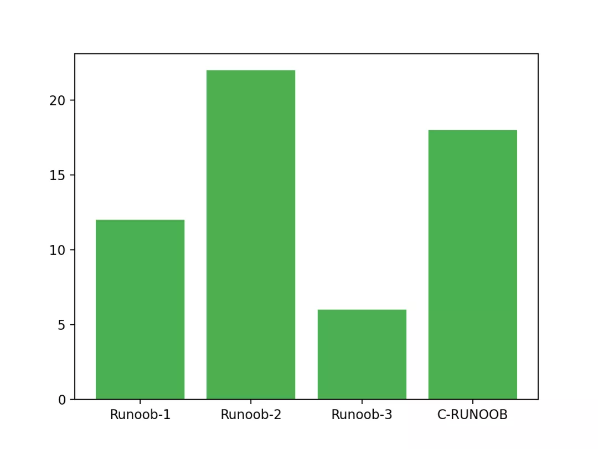
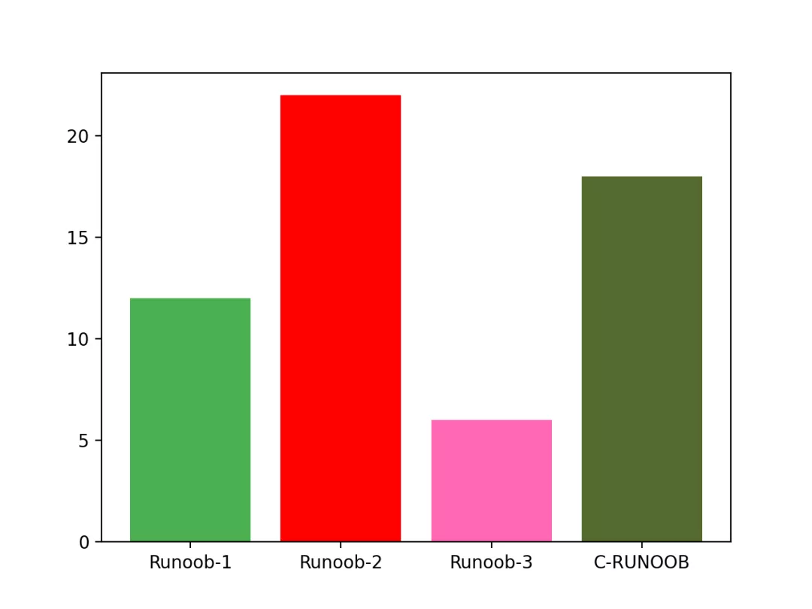
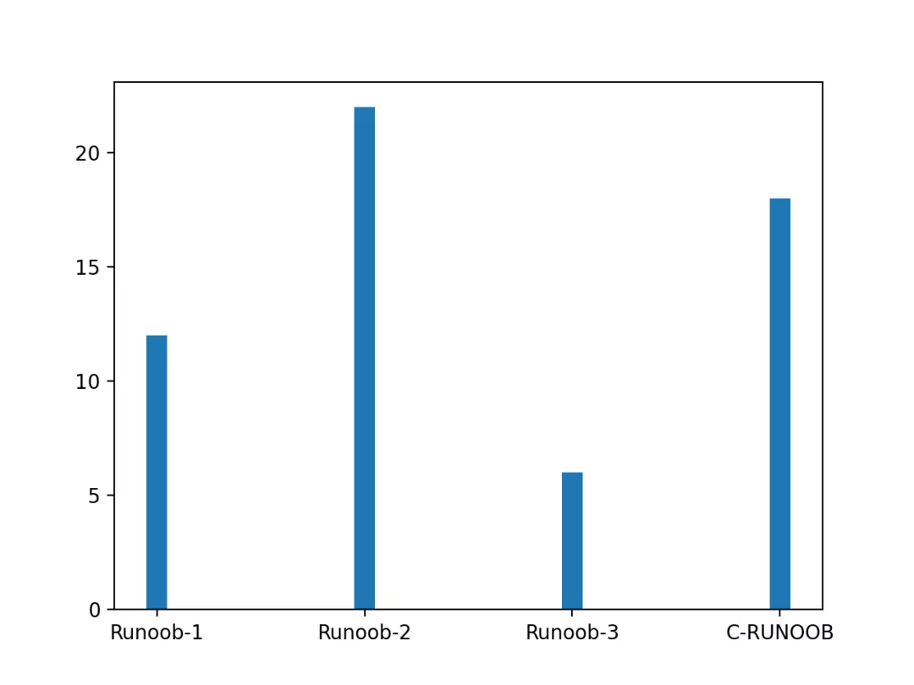
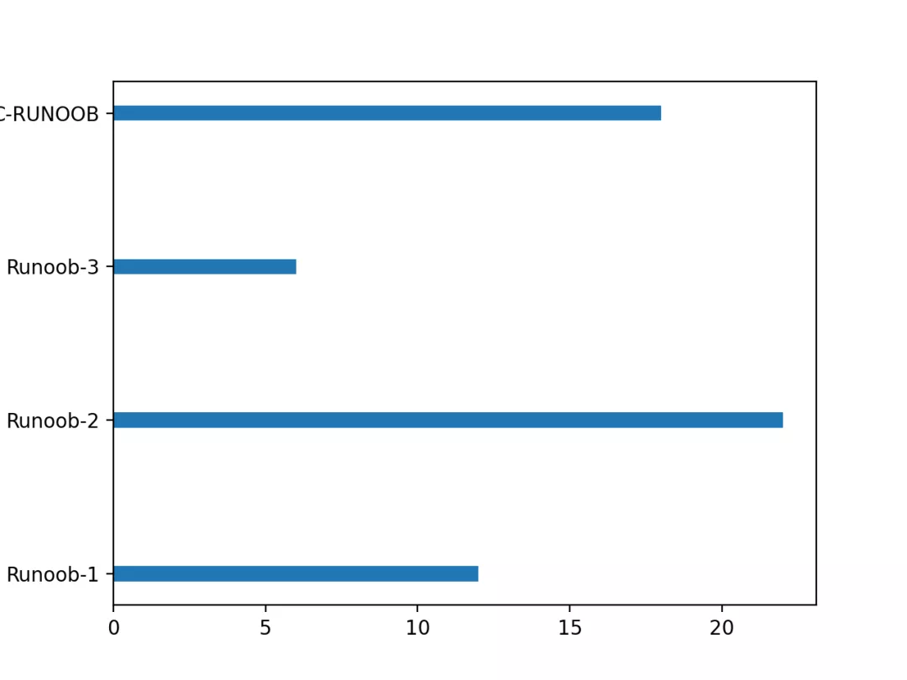

Python Matplotlib 可视化<br />可以使用 `pyplot` 中的 `bar()` 方法来绘制柱形图。<br />`bar()` 方法语法格式如下：
```python
matplotlib.pyplot.bar(x, height, width=0.8, bottom=None, *, align='center', data=None, **kwargs)
```
参数说明：<br />`x`：浮点型数组，柱形图的 x 轴数据。<br />`height`：浮点型数组，柱形图的高度。<br />`width`：浮点型数组，柱形图的宽度。<br />`bottom`：浮点型数组，底座的 y 坐标，默认 0。<br />`align`：柱形图与 x 坐标的对齐方式，`'center'` 以 x 位置为中心，这是默认值。`'edge'`：将柱形图的左边缘与 x 位置对齐。要对齐右边缘的条形，可以传递负数的宽度值及 `align='edge'`。<br />`**kwargs`：：其他参数。
<a name="Te9cy"></a>
### 简单使用 `bar()` 来创建一个柱形图:
```python
import matplotlib.pyplot as plt
import numpy as np

x = np.array(["Runoob-1", "Runoob-2", "Runoob-3", "C-RUNOOB"])
y = np.array([12, 22, 6, 18])

plt.bar(x,y)
plt.show()
```


显示结果如下：<br />
<a name="sQfoR"></a>
### 垂直方向的柱形图可以使用 `barh()` 方法来设置
```python
import matplotlib.pyplot as plt
import numpy as np

x = np.array(["Runoob-1", "Runoob-2", "Runoob-3", "C-RUNOOB"])
y = np.array([12, 22, 6, 18])

plt.barh(x,y)
plt.show()
```
显示结果如下：<br />
<a name="nUIG5"></a>
### 设置柱形图颜色
```python
import matplotlib.pyplot as plt
import numpy as np

x = np.array(["Runoob-1", "Runoob-2", "Runoob-3", "C-RUNOOB"])
y = np.array([12, 22, 6, 18])

plt.bar(x, y, color = "#4CAF50")
plt.show()
```
显示结果如下：<br />
<a name="Y1ND5"></a>
### 自定义各个柱形的颜色
```python
import matplotlib.pyplot as plt
import numpy as np

x = np.array(["Runoob-1", "Runoob-2", "Runoob-3", "C-RUNOOB"])
y = np.array([12, 22, 6, 18])

plt.bar(x, y,  color = ["#4CAF50","red","hotpink","#556B2F"])
plt.show()
```
显示结果如下：<br />
<a name="iW9II"></a>
### 设置柱形图宽度
`bar()` 方法使用 width 设置，`barh()` 方法使用 height 设置 height
<a name="WwNBU"></a>
#### 实例
```python
import matplotlib.pyplot as plt
import numpy as np

x = np.array(["Runoob-1", "Runoob-2", "Runoob-3", "C-RUNOOB"])
y = np.array([12, 22, 6, 18])

plt.bar(x, y, width = 0.1)
plt.show()
```
显示结果如下：<br />
<a name="kwJkj"></a>
#### 实例
```python
import matplotlib.pyplot as plt
import numpy as np

x = np.array(["Runoob-1", "Runoob-2", "Runoob-3", "C-RUNOOB"])
y = np.array([12, 22, 6, 18])

plt.barh(x, y, height = 0.1)
plt.show()
```
显示结果如下：<br />
