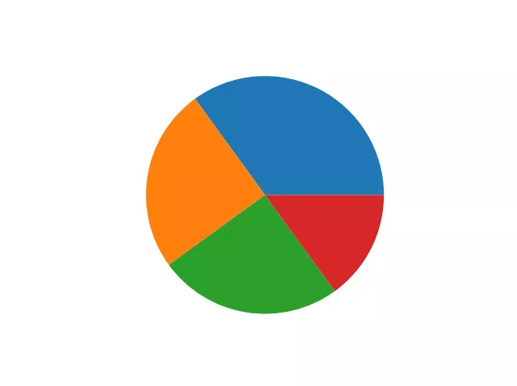
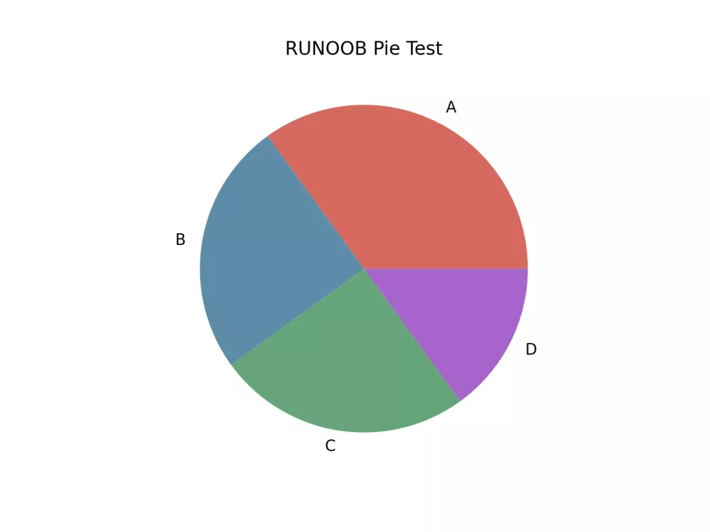
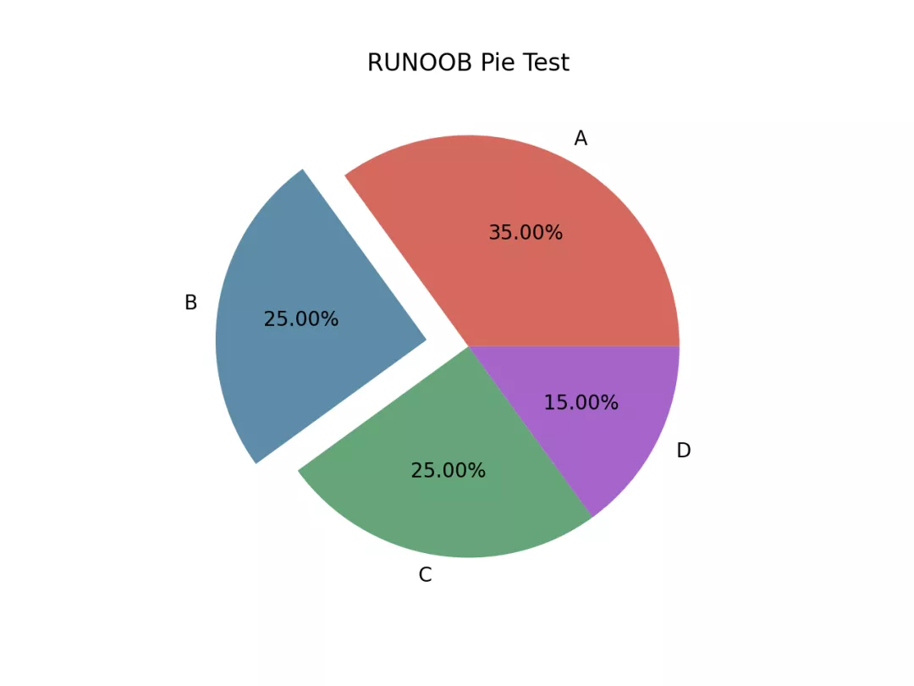
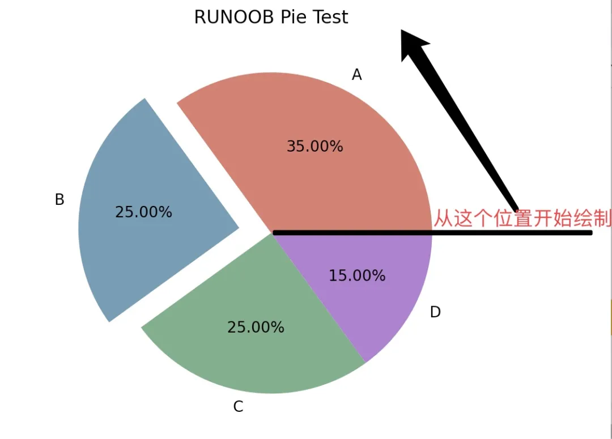

Python Matplotlib 可视化<br />可以使用 pyplot 中的 `pie()` 方法来绘制饼图。<br />`pie()` 方法语法格式如下：
```python
matplotlib.pyplot.pie(x, explode=None, labels=None, colors=None, autopct=None, pctdistance=0.6, shadow=False, labeldistance=1.1, startangle=0, radius=1, counterclock=True, wedgeprops=None, textprops=None, center=0, 0, frame=False, rotatelabels=False, *, normalize=None, data=None)[source]
```
参数说明：<br />`x`：浮点型数组，表示每个扇形的面积。<br />`explode`：数组，表示各个扇形之间的间隔，默认值为0。<br />`labels`：列表，各个扇形的标签，默认值为 None。<br />`colors`：数组，表示各个扇形的颜色，默认值为 None。<br />`autopct`：设置饼图内各个扇形百分比显示格式，%d%% 整数百分比，%0.1f 一位小数， %0.1f%% 一位小数百分比， %0.2f%% 两位小数百分比。<br />`labeldistance`：标签标记的绘制位置，相对于半径的比例，默认值为 1.1，如 <1则绘制在饼图内侧。<br />`pctdistance`：：类似于 labeldistance，指定 autopct 的位置刻度，默认值为 0.6。<br />`shadow`：布尔值 True 或 False，设置饼图的阴影，默认为 False，不设置阴影。<br />`radius`：设置饼图的半径，默认为 1。<br />`startangle`：：起始绘制饼图的角度，默认为从 x 轴正方向逆时针画起，如设定 =90 则从 y 轴正方向画起。<br />`counterclock`：布尔值，设置指针方向，默认为 True，即逆时针，False 为顺时针。<br />`wedgeprops`：字典类型，默认值 None。参数字典传递给 wedge 对象用来画一个饼图。例如：wedgeprops={'linewidth':5} 设置 wedge 线宽为5。<br />`textprops`：字典类型，默认值为：None。传递给 text 对象的字典参数，用于设置标签（labels）和比例文字的格式。<br />`center`：浮点类型的列表，默认值：(0,0)。用于设置图标中心位置。<br />`frame`：布尔类型，默认值：False。如果是 True，绘制带有表的轴框架。<br />`rotatelabels`：布尔类型，默认为 False。如果为 True，旋转每个 label 到指定的角度。
<a name="eyyvV"></a>
### 使用 `pie()` 来创建一个柱形图
```python
import matplotlib.pyplot as plt
import numpy as np

y = np.array([35, 25, 25, 15])

plt.pie(y)
plt.show()
```
显示结果如下：<br />
<a name="cEnJX"></a>
### 设置饼图各个扇形的标签与颜色
```python
import matplotlib.pyplot as plt
import numpy as np

y = np.array([35, 25, 25, 15])

plt.pie(y,
        labels=['A','B','C','D'], # 设置饼图标签
        colors=["#d5695d", "#5d8ca8", "#65a479", "#a564c9"], # 设置饼图颜色
       )
plt.title("RUNOOB Pie Test") # 设置标题
plt.show()
```
显示结果如下：<br />
<a name="UU8cF"></a>
### 突出显示第二个扇形，并格式化输出百分比
```python
import matplotlib.pyplot as plt
import numpy as np

y = np.array([35, 25, 25, 15])

plt.pie(y,
        labels=['A','B','C','D'], # 设置饼图标签
        colors=["#d5695d", "#5d8ca8", "#65a479", "#a564c9"], # 设置饼图颜色
        explode=(0, 0.2, 0, 0), # 第二部分突出显示，值越大，距离中心越远
        autopct='%.2f%%', # 格式化输出百分比
       )
plt.title("RUNOOB Pie Test")
plt.show()
```

:::tips
注意：默认情况下，第一个扇形的绘制是从 x 轴开始并逆时针移动：
:::

