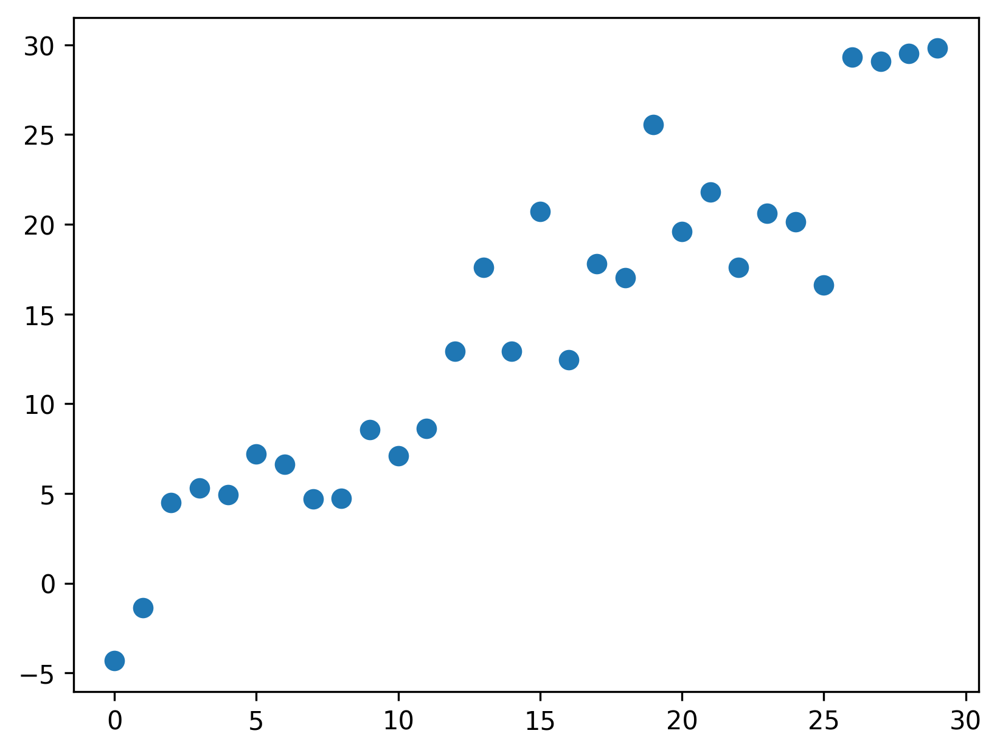
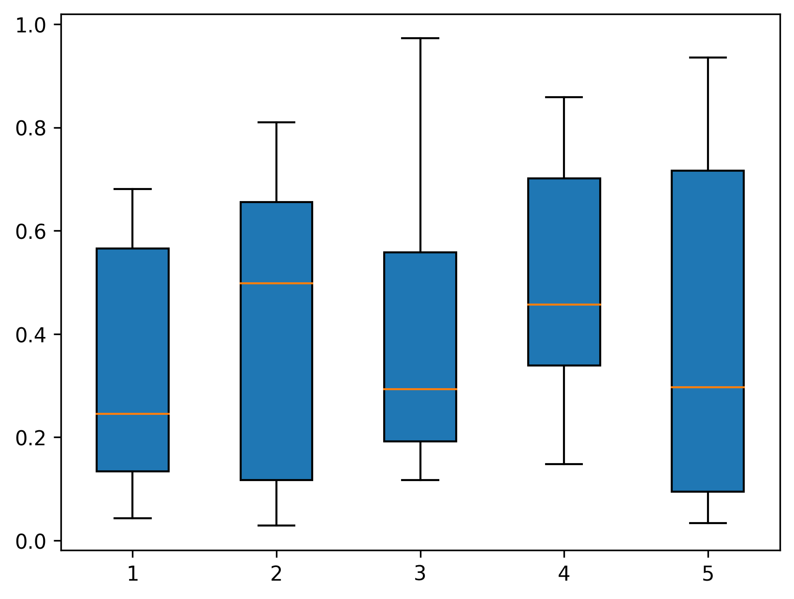

Python Matplotlib 可视化<br />Matplotlib是一个跨平台库，是根据数组中的数据制作2D图的可视化分析工具。Matplotlib提供了一个面向对象的API，有助于使用Python GUI工具包（如PyQt、WxPythonotTkinter）在应用程序中嵌入绘图。它也可以用于Python、IPython shell、Jupyter笔记本和Web应用程序服务器中。<br />Matplotlib提供了丰富的数据绘图工具，主要用于绘制一些统计图形，例如散点图、条形图、折线图、饼图、直方图、箱形图等。首先简单介绍一下`Matplotlib.pyplot`模块的绘图基础语法与常用参数，因为后面要介绍的各种图形基本都是基于这个模块来实现的。`pyplot`的基础语法及常用参数如下。

- `plt.figure`：创建空白画布，在一幅图中可省略
- `figure.add_subplot`：第一个参数表示行，第二个参数表示列，第三个参数表示选中的子图编号
- `plt.title`：标题
- `plt.xlabel`：x轴名称
- `plt.ylabel`：y轴名称
- `plt.xlim`：x轴的范围
- `plt.ylim`：y轴范围
- `plt.xticks`：第一个参数为范围，数组类型；第二个参数是标签，第三个是控制标签
- `plt.yticks`：同plt.xticks
- `plt.legend`：图例
- `plt.savafig`：保存图形
- `plt.show`：在本机显示
<a name="WDwtk"></a>
## 1、散点图
散点图通常用在回归分析中，描述数据点在直角坐标系平面上的分布。散点图表示因变量随自变量而变化的大致趋势，据此可以选择合适的函数对数据点进行拟合。在广告数据分析中，通常会根据散点图来分析两个变量之间的数据分布关系。散点图的主要参数及其说明如下。

- `x/y`：X/Y轴数据。两者都是向量，而且必须长度相等。
- `s`：标记大小，可自定义
- `c`：标记颜色，可自定义
- `marker`：标记样式，可自定义

通过`matplotlib.pyplot`模块画一个散点图，如代码清单1所示。
<a name="JbVwR"></a>
### 代码清单1 绘制散点图
```python
import numpy as np
import matplotlib.pyplot as plt 
x = np.arange(30)
y = np.arange(30)+3*np.random.randn(30)
plt.scatter(x, y, s=50) 
plt.savefig('outbox_legend.png', dpi=300, bbox_inches='tight', pad_inches=.1)
```
其可视化结果如下图所示。<br /><br />▲图1 散点图
<a name="jI78I"></a>
## 2、条形图
条形图是用宽度相同的条形的高度或长度来表示数据多少的图形。条形图可以横置或纵置，纵置时也称为柱状图。此外，条形图有简单条形图、复式条形图等形式。条形图的主要参数及各参数说明如下。

- `x`：数据源
- `height`：bar的高度
- `width`：bar的宽度,默认0.8
- `bottom`：y轴的基准,默认0
- `align`：x轴的位置,默认中间,`edge`表示将`bar`的左边与x对齐
- `color`：bar颜色
- `edgecolor`：边颜色
- `linewidth`：边的宽度，0表示无边框

假设拿到了2017年内地电影票房前10的电影的片名和票房数据，如果想直观比较各电影票房数据大小，那么条形图显然是最合适的呈现方式，如代码清单2所示，其可视化结果如图2所示。
<a name="yjXVs"></a>
### 代码清单2 绘制条形图
```python
import matplotlib.pyplot as plt

a = ['战狼2', '速度与激情8', '功夫瑜伽', '西游伏妖篇', '变形金刚5:最后的骑士', '摔跤吧！爸爸', '加勒比海盗5:死无对证','金刚:骷髅岛', '极限特工:终极回归', '生化危机6:终章']
# 单位:亿
b=[56.01,26.94,17.53,16.49,15.45,12.96,11.8,11.61,11.28,11.12]
# 用来正常显示中文标签
plt.rcParams['font.sans-serif']=['SimHei','Times New Roman']
plt.rcParams['axes.unicode_minus']=False
# bar要求传递两个数字，可以单独设置x轴的显示
plt.bar(range(len(a)), b, width=0.3)
plt.xticks(range(len(a)), a, rotation=90)  #字体倾斜角度
plt.grid(False)
plt.savefig('outbox_legend.png', dpi=300, bbox_inches='tight', pad_inches=.1)
```
<br />▲图2 条形图
<a name="dQcnB"></a>
## 3、折线图
折线图是用直线连接排列在工作表的列或行中的数据点而绘制成的图形。折线图可以显示随时间（根据常用比例设置）而变化的连续数据，因此非常适用于显示相等时间间隔下数据的趋势。折线图的主要参数及各参数说明如下。

- `x/y`：数据源
- `color`：字体颜色：`color='r'`；`b`、`g`、`r`、`c`、`m`、`y`、`k`、`w` 或者`blue`、`green`、`red`、`cyan`、`magenta`、`yellow`、`black`、`whtite` 或十六进制字符串（'`#008000`'）
- `linewidth`：线条粗细，可自定义
- `linestyle`：线条形状：`linestyle='–'`(虚线);`linestyle=':'`(点线);`linestyle='-.'`(短线加点)；
- `label`：数据标签内容：`label='数据一'`,数据标签展示位置需另说明`plt.legend(loc=1)`数字为标签位置

以某广告平台随日期变化的用户请求数为例，用折线图来表现其变化趋势，如代码清单3所示，其可视化结果如图3所示。
<a name="hg8Zb"></a>
### 代码清单3 绘制折线图
```python
import pandas as pd
import matplotlib.pyplot as plt

dateparse = lambda dates: pd.datetime.strptime(dates, '%Y%m%d')
data = pd.read_csv('req_user.csv', encoding='utf-8', parse_dates=['date'], date_parser=dateparse)
plt.figure(figsize=(10, 7))
plt.plot(data["date"], data['req_user'])
plt.xlabel('date', fontsize=15)
plt.ylabel('req_user', fontsize=15)  # 图例字体大小
plt.tick_params(labelsize=10)  # 刻度字体大小
plt.savefig('outbox_legend.png', dpi=300, bbox_inches='tight', pad_inches=.1)
```
<br />▲图3 折线图
<a name="cxVGz"></a>
## 4、饼图
饼图常用于统计学模块中。用于显示一个数据系列中各项的大小与各项总和的比例。饼图中的数据点显示为整个饼图的百分比，饼图的主要参数及其说明如下。

- `x`：数据源
- `labels`：(每一块)饼图外侧显示的说明文字
- `explode`：(每一块)离开中心距离
- `startangle`：起始绘制角度,默认图是从x轴正方向逆时针画起,如设定=90则从y轴正方向画起
- `shadow`：在饼图下面画一个阴影。默认值：False，即不画阴影
- `labeldistance`：`label`标记的绘制位置,相对于半径的比例，默认值为1.1, 如<1则绘制在饼图内侧
- `autopct`：控制饼图内百分比设置,可以使用`format`字符串或者format function，'%1.1f'指小数点前后位数(没有则用空格补齐)
- `pctdistance`：类似于`labeldistance`,指定`autopct`的位置刻度,默认值为0.6
- `radius`：控制饼图半径，默认值为1
- `textprops`：设置标签（`labels`）和比例文字的格式；字典类型，可选参数，默认值为：None。传递给`text`对象的字典参数
- `center`：浮点类型的列表，可选参数，默认值：(0,0),图标中心位置。

以某家庭10月份家庭支出情况为例，用饼图来体现各部分支出占家庭整体支出的情况，如代码清单4所示，其可视化结果如图4所示。
<a name="S3jWR"></a>
### 代码清单4 绘制饼图
```python
import matplotlib.pyplot as plt

plt.rcParams['font.sans-serif'] = ['SimHei']  # 用来正常显示中文标签

labels = ['娱乐', '育儿', '饮食', '房贷', '交通', '其他']
sizes = [4, 10, 18, 60, 2, 6]
explode = (0, 0, 0, 0.1, 0, 0)
plt.figure(figsize=(10, 7))
plt.pie(sizes, explode=explode, labels=labels, autopct='%1.1f%%', shadow=False, startangle=150)
plt.title("饼图示例-10月份家庭支出")
plt.savefig('outbox_legend.png', dpi=300, bbox_inches='tight', pad_inches=.1)
```
<br />▲图4 饼图
<a name="D5LG5"></a>
## 5、直方图
直方图，又称质量分布图，是一种统计报告图，由一系列高度不等的纵向条纹或线段表示数据分布的情况。一般用横轴表示数据类型，用纵轴表示分布情况。直方图是数值数据分布的精确图形表示，是对连续变量（定量变量）的概率分布的估计，由卡尔·皮尔逊（Karl Pearson）首先引入，是一种特殊的条形图。<br />在构建直方图时，第一步是将值的范围分段，即将整个值的范围分成一系列间隔，然后计算每个间隔中有多少值。这些值通常被指定为连续的、不重叠的变量间隔，间隔必须相邻，并且通常是相等的大小。直方图的主要参数及说明如下。

- `x`：数据源
- `bins`：分块数,默认10
- `range`：画图范围,接收元组
- `cumulative`：每一列累加
- `bottom`：`bin`的基线
- `histtype`：画图的形状,默认是bar
- `align`：`bar`中心位置,默认中间
- `orientation`：水平或垂直,默认垂直
- `rwidth`：`bar`的宽度
- `color`：表示`bar`的颜色
- `label`：`bar`的标签；也可以在图例中写`plt.legend()`
- `edgecolor`：直方图的边界色

下面以Kaggle经典比赛案例泰坦尼克号数据集为例，绘制乘客年龄的频数直方图，查看各年龄段乘客的年龄分布情况，如代码清单5所示，其可视化结果如图5所示。
<a name="ugIqI"></a>
### 代码清单5 绘制直方图
```python
# 导入第三方包
import numpy as np
import pandas as pd
import matplotlib.pyplot as plt
import matplotlib.mlab as mlab
# 中文和负号的正常显示
plt.rcParams['font.sans-serif'] = [u'SimHei']
plt.rcParams['axes.unicode_minus'] = False
# 读取Titanic数据集
titanic = pd.read_csv('train.csv')
# 检查年龄是否有缺失
any(titanic.Age.isnull())
# 删除含有缺失年龄的样本
titanic.dropna(subset=['Age'], inplace=True)
# 设置图形的显示风格
plt.style.use('ggplot')
# 绘图
plt.hist(titanic.Age, 
        bins = 20, 
        color = 'steelblue', 
        edgecolor = 'k', 
        label = '直方图' ) 
# 去除图形顶部边界和右边界的刻度
plt.tick_params(top='off', right='off')
# 显示图例
plt.legend()
# 去除网格线
plt.grid(False)
plt.savefig('outbox_legend.png', dpi=300, bbox_inches='tight', pad_inches=.1)
```
<br />▲图5 直方图
<a name="VyqKl"></a>
## 6、箱形图
箱形图又称为盒须图、盒式图或箱线图，是一种用于显示一组数据分散情况的统计图，因形状如箱子而得名。它主要用于反映原始数据分布的特征，也可以进行多组数据分布特征的比较。箱形图的主要参数及说明如下。

- `x`：指定要绘制箱线图的数据
- `showcaps`：是否显示箱线图顶端和末端的两条线
- `notch`：是否是凹口的形式展现箱线图
- `showbox`：是否显示箱线图的箱体
- `sym`：指定异常点的形状
- `showfliers`：是否显示异常值
- `vert`：是否需要将箱线图垂直摆放
- `boxprops`：设置箱体的属性，如边框色，填充色等
- `whis`：指定上下须与上下四分位的距离
- `labels`：为箱线图添加标签
- `positions`：指定箱线图的位置
- `filerprops`：设置异常值的属性
- `widths`：指定箱线图的宽度
- `medianprops`：设置中位数的属性
- `patch_artist`：是否填充箱体的颜色
- `meanprops`：设置均值的属性
- `meanline`：是否用线的形式表示均值
- `capprops`：设置箱线图顶端和末端线条的属性
- `showmeans`：是否显示均值
- `whiskerprops`：`whiskerprops`设置须的属性

下面绘制箱形图，如代码清单6所示。
<a name="Ptd8L"></a>
### 代码清单6 绘制箱形图
```python
import numpy as np
import pandas as pd
import matplotlib.pyplot as plt

df = pd.DataFrame(np.random.rand(10, 5), columns=['a', 'b', 'c', 'd', 'e'])
# 绘图
plt.boxplot(df, patch_artist=True)  # 默认垂直摆放箱体
plt.savefig('outbox_legend.png', dpi=300, bbox_inches='tight', pad_inches=.1)
```
垂直箱形图与水平箱形图分别如图6、图7所示。<br /><br />▲图6 垂直箱形图
```python
import numpy as np
import pandas as pd
import matplotlib.pyplot as plt

df = pd.DataFrame(np.random.rand(10, 5), columns=['a', 'b', 'c', 'd', 'e'])
# 绘图
plt.boxplot(df, patch_artist=True, vert=False)  # 默认垂直摆放箱体
plt.savefig('outbox_legend.png', dpi=300, bbox_inches='tight', pad_inches=.1)
```
<br />▲图7 水平箱形图
<a name="LKC7u"></a>
## 7、组合图
前面介绍的都是在`figure`对象中创建单独的图像，有时候需要在同一个画布中创建多个子图或者组合图，此时可以用`add_subplot`创建一个或多个`subplot`来创建组合图，或者通过`subplot`使用循环语句来创建多个子图。`pyplot.subplots`的常用参数及说明如下。

- `nrows`：`subplot`的行数
- `ncols`：`subplot`的列数
- `sharex`：所有`subplot`应该使用相同的X轴刻度（调节`xlim`将会影响所有的`subplot`）
- `sharey`：所有`subplot`应该使用相同的Y轴刻度（调节`ylim`将会影响所有的`subplot`）
- `subplot_kw`：用于创建各`subplot`的关键字字典
- `**fig_kw`：创建`figure`时的其他关键字，如`plt.subplots(3,3,figsize=(8,6))`

使用`add_subplot`创建组合图，如代码清单7所示，其可视化结果如图8所示。
<a name="m0kyJ"></a>
### 代码清单7 绘制组合图
```python
import numpy as np
from numpy.random import randn
import matplotlib.pyplot as plt

# 在同一个figure中创建一组2行2列的subplot
fig = plt.figure()
ax1 = fig.add_subplot(2, 2, 1)  # 表示4个subplot中的第一个
ax2 = fig.add_subplot(2, 2, 2)  # 表示4个subplot中的第二个
ax3 = fig.add_subplot(2, 2, 3)  # 表示4个subplot中的第三个
ax4 = fig.add_subplot(2, 2, 4)  # 表示4个subplot中的第四个
ax1.scatter(np.arange(30), np.arange(30) + 3 * randn(30))
ax2.bar(np.arange(8), [1, 2, 3, 7, 8, 5, 6, 4])
ax3.hist(randn(100), bins=20)
ax4.plot(randn(60).cumsum())
plt.savefig('outbox_legend.png', dpi=300, bbox_inches='tight', pad_inches=.1)
```
<br />▲图8 组合图<br />通过`subplot`使用循环语句来创建组合图，如代码清单8所示，其可视化结果如图9所示。
<a name="rXK64"></a>
### 代码清单8 使用循环语句绘制组合图
```python
from numpy.random import randn
import matplotlib.pyplot as plt

fig, axes = plt.subplots(2, 2, sharex=True, sharey=True)
for i in range(2):
    for j in range(2):
        axes[i, j].plot(randn(100).cumsum())
plt.subplots_adjust(wspace=0, hspace=0)  # 用于调整subplot周围的间距
plt.savefig('outbox_legend.png', dpi=300, bbox_inches='tight', pad_inches=.1)
```
<br />▲图9 组合图<br />利用`figure`的`subplot_adjust`方法可以轻易地修改间距，其中`wspace`和`hspace`分别用于控制宽度和高度的百分比，可以用作`subplot`之间的间距。
