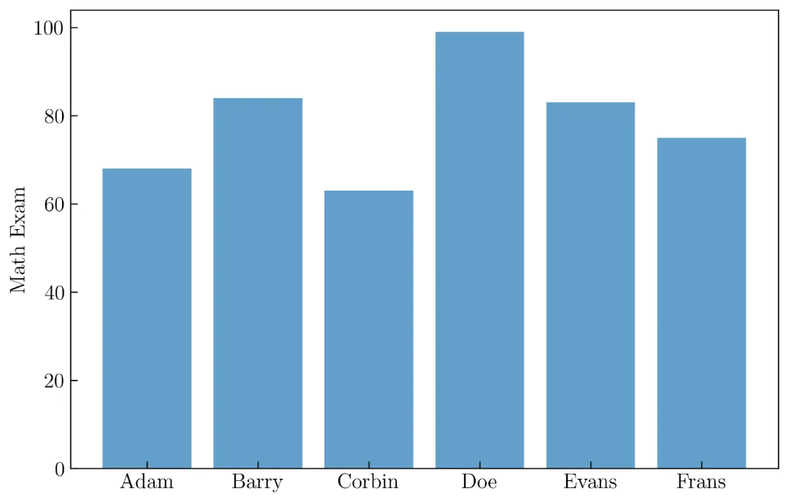
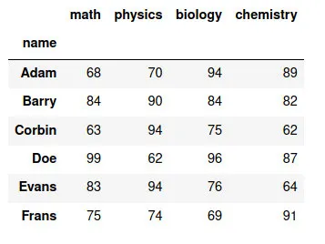
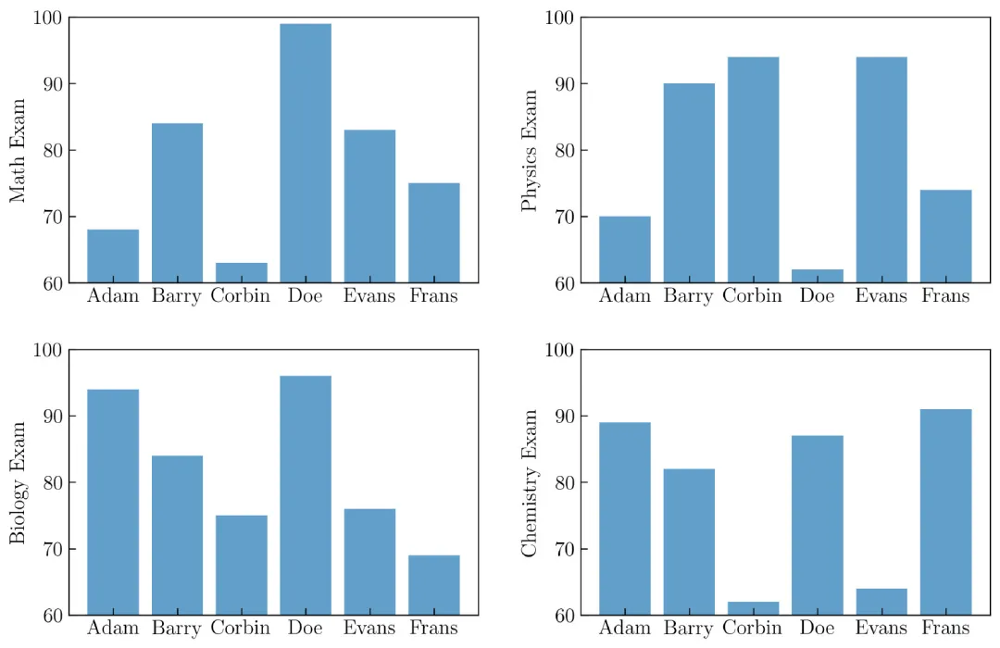
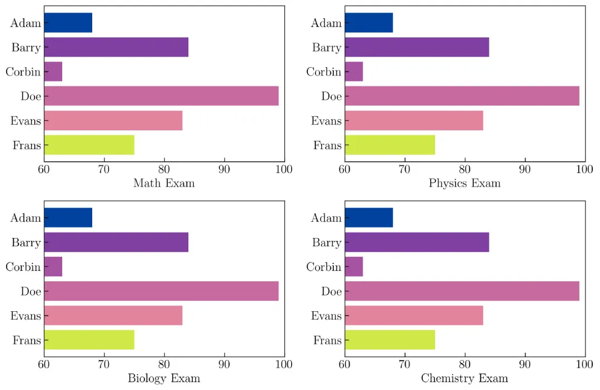
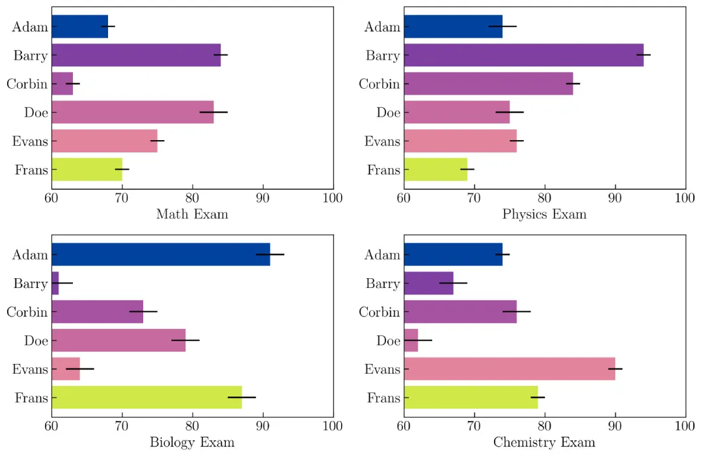

Matplotlib Bar chart 条形图
<a name="Coibe"></a>
### 创建条形图
如果想用条形图可视化数据，在 Matplotlib 中创建条形图之前，先创建要显示的模拟数据。比如在数学考试成绩中创建六个人的数据，要创建它，使用以下代码。
```python
name = ['Adam', 'Barry', 'Corbin', 'Doe', 'Evans', 'Frans']
np.random.seed(100)
N = len(name)
math = np.random.randint(60, 100, N)
```
生成的数学考试成绩从 60 到 100 ，代码如下：
```python
plt.bar(name, math, alpha = .7)
```
添加一些信息之后，生成了一个条形图，如下图所示：<br />创建条形图<br />创建上图的完整代码如下：
```python
name = ['Adam', 'Barry', 'Corbin', 'Doe', 'Evans', 'Frans']
np.random.seed(100)
N = len(name)
math = np.random.randint(60, 100, N)
plt.figure(figsize=(9, 6))
plt.bar(name, math, alpha = .7)
plt.ylabel('Math Exam')
```
之后，使用以下代码为物理、生物学和化学考试成绩创建了更多模拟数据。
```python
np.random.seed(100)
N = len(name)
math = np.random.randint(60, 100, N)
physics = np.random.randint(60, 100, N)
biology = np.random.randint(60, 100, N)
chemistry = np.random.randint(60, 100, N)
```
也可以使用 Pandas 创建一个表（在 Python 中，称为 DataFrame ）。从模拟数据创建的 DataFrame 如下图所示：<br /><br />Pandas 中的 DataFrame 数据<br />默认情况下，这里没有显示有关如何创建 DataFrame 的代码。<br />然后，将其可视化，如下图所示：<br />创建多个条形图<br />创建上图的代码如下：
```python
name = ['Adam', 'Barry', 'Corbin', 'Doe', 'Evans', 'Frans']
np.random.seed(100)
N = len(name)
math = np.random.randint(60, 100, N)
physics = np.random.randint(60, 100, N)
biology = np.random.randint(60, 100, N)
chemistry = np.random.randint(60, 100, N)
rows = 2
columns = 2
plt.figure(figsize=(12, 8))
grid = plt.GridSpec(rows, columns, wspace = .25, hspace = .25)
plt.subplot(grid[0])
plt.bar(name, math, alpha = .7)
plt.ylabel('Math Exam')
plt.ylim(60, 100)
plt.subplot(grid[1])
plt.bar(name, physics, alpha = .7)
plt.ylabel('Physics Exam')
plt.ylim(60, 100)
plt.subplot(grid[2])
plt.bar(name, biology, alpha = .7)
plt.ylabel('Biology Exam')
plt.ylim(60, 100)
plt.subplot(grid[3])
plt.bar(name, chemistry, alpha = .7)
plt.ylabel('Chemistry Exam')
plt.ylim(60, 100)
```
或使用下面的代码（如果要使用循环）：
```python
name = ['Adam', 'Barry', 'Corbin', 'Doe', 'Evans', 'Frans']
course_name = ['Math', 'Physics', 'Biology', 'Chemistry']
N = len(name)
rows = 2
columns = 2
plt.figure(figsize=(12, 8))
grid = plt.GridSpec(rows, columns, wspace = .25, hspace = .25)
for i in range(len(course_name)):
    np.random.seed(100)
    course = np.random.randint(60, 100, N)
    plt.subplot(grid[i])
    plt.bar(name, course, alpha = .7)
    plt.ylabel(course_name[i] + ' Exam')
    plt.ylim(60, 100)
```
<a name="AJMFC"></a>
### 水平条形图
可以使用下面的代码来创建水平条形图。<br />以水平条形图和各种颜色呈现上面的图，以下是生成它的完整代码：
```python
name = ['Adam', 'Barry', 'Corbin', 'Doe', 'Evans', 'Frans']
course_name = ['Math', 'Physics', 'Biology', 'Chemistry']
colors = ['#00429d', '#7f40a2', '#a653a1', '#c76a9f', 
          '#e4849c', '#d0e848']
N = len(name)
rows = 2
columns = 2
plt.figure(figsize=(12, 8))
grid = plt.GridSpec(rows, columns, wspace = .25, hspace = .25)
for i in range(len(course_name)):
    np.random.seed(100)
    course = np.random.randint(60, 100, N)
    plt.subplot(grid[i])
    plt.barh(name, course, color = colors)
    plt.xlabel(course_name[i] + ' Exam')
    plt.xlim(60, 100)
    plt.gca().invert_yaxis()
```
运行上面的代码后，将获得结果，如下图所示：<br />水平条形图
<a name="MDvfz"></a>
### 在水平条形图插入误差线
可以使用以下参数在水平条形图中插入误差线：
```python
N = len(name)
noise = np.random.randint(1, 3, N)
plt.barh(name, course, xerr = noise)
```
这里使用 1 到 3 之间的整数随机数创建了误差，如变量 noise 中所述。在为水平条形图添加一些元素之后，将其显示出来，如下图所示：<br />添加了误差的水平条形图<br />创建上图的代码如下：
```python
name = ['Adam', 'Barry', 'Corbin', 'Doe', 'Evans', 'Frans']
course_name = ['Math', 'Physics', 'Biology', 'Chemistry']
N = len(name)
rows = 2
columns = 2
plt.figure(figsize=(12, 8))
grid = plt.GridSpec(rows, columns, wspace = .25, hspace = .25)
np.random.seed(100)
for i in range(len(course_name)):
    course = np.random.randint(60, 95, N)
    noise = np.random.randint(1, 3, N)
    plt.subplot(grid[i])
    plt.barh(name, course, color = colors, xerr = noise, 
             ecolor = 'k')
    plt.xlabel(course_name[i] + ' Exam')
    plt.xlim(60, 100)
    plt.gca().invert_yaxis()
```
:::tips
模拟数据虽然不是真实的，但是这仍然是理解 Matplotlib 中条形图的一个很好的例子。
:::
