Python Matplotlib 
```python
# !pip install brewer2mpl
import numpy as np
import pandas as pd
import matplotlib as mpl
import matplotlib.pyplot as plt
import seaborn as sns
import warnings; warnings.filterwarnings(action='once')
large = 22; med = 16; small = 12
params = {'axes.titlesize': large,
          'legend.fontsize': med,
          'figure.figsize': (16, 10),
          'axes.labelsize': med,
          'axes.titlesize': med,
          'xtick.labelsize': med,
          'ytick.labelsize': med,
          'figure.titlesize': large}
plt.rcParams.update(params)
plt.style.use('seaborn-whitegrid')
sns.set_style("white")
%matplotlib inline
# Version
print(mpl.__version__)  #> 3.0.0
print(sns.__version__)  #> 0.9.0
```
<a name="btW37"></a>
### 1、散点图
Scatteplot是用于研究两个变量之间关系的经典和基本图。如果数据中有多个组，则可能需要以不同颜色可视化每个组。在Matplotlib，可以方便地使用。
```python
# Import dataset 
midwest = pd.read_csv("https://github.com/selva86/datasets/blob/master/midwest_filter.csv")
# Prepare Data 
# Create as many colors as there are unique midwest['category']
categories = np.unique(midwest['category'])
colors = [plt.cm.tab10(i/float(len(categories)-1)) for i in range(len(categories))]
# Draw Plot for Each Category
plt.figure(figsize=(16, 10), dpi= 80, facecolor='w', edgecolor='k')
for i, category in enumerate(categories):
    plt.scatter('area', 'poptotal', 
                data=midwest.loc[midwest.category==category, :], 
                s=20, c=colors[i], label=str(category))
# Decorations
plt.gca().set(xlim=(0.0, 0.1), ylim=(0, 90000),
              xlabel='Area', ylabel='Population')
plt.xticks(fontsize=12); 
plt.yticks(fontsize=12)
plt.title("Scatterplot of Midwest Area vs Population", fontsize=22)
plt.legend(fontsize=12)    
plt.savefig('outbox_legend.png', dpi = 300, bbox_inches = 'tight', pad_inches = .1)
```
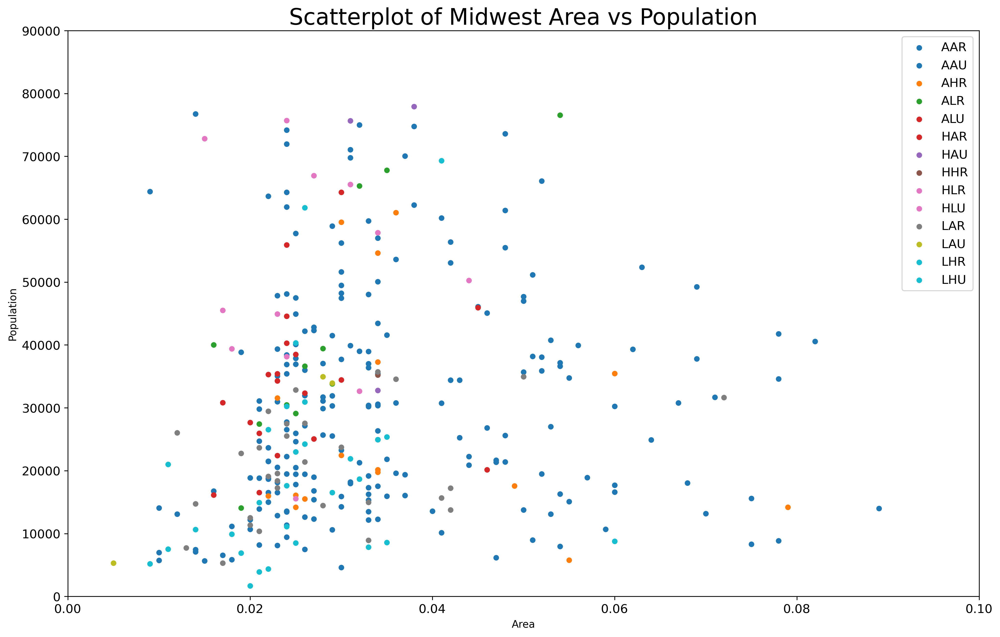
<a name="EuFb3"></a>
### 2、带边界的气泡图
有时，希望在边界内显示一组点以强调其重要性。在此示例中，将从应该被环绕的数据帧中获取记录，并将其传递给下面的代码中描述的记录。encircle()
```python
import numpy as np
import pandas as pd
import seaborn as sns
import matplotlib.pyplot as plt
from matplotlib import patches
from scipy.spatial import ConvexHull
import warnings; warnings.simplefilter('ignore')
sns.set_style("white")
# Step 1: Prepare Data
midwest = pd.read_csv("https://github.com/selva86/datasets/blob/master/midwest_filter.csv")
# As many colors as there are unique midwest['category']
categories = np.unique(midwest['category'])
colors = [plt.cm.tab10(i/float(len(categories)-1)) for i in range(len(categories))]
# Step 2: Draw Scatterplot with unique color for each category
fig = plt.figure(figsize=(16, 10), dpi= 80, facecolor='w', edgecolor='k')    
for i, category in enumerate(categories):
    plt.scatter('area', 'poptotal', data=midwest.loc[midwest.category==category, :], s='dot_size', c=colors[i], label=str(category), edgecolors='black', linewidths=.5)
# Step 3: Encircling
# https://stackoverflow.com/questions/44575681/how-do-i-encircle-different-data-sets-in-scatter-plot
def encircle(x,y, ax=None, **kw):
    if not ax: ax=plt.gca()
    p = np.c_[x,y]
    hull = ConvexHull(p)
    poly = plt.Polygon(p[hull.vertices,:], **kw)
    ax.add_patch(poly)
# Select data to be encircled
midwest_encircle_data = midwest.loc[midwest.state=='IN', :]                         
# Draw polygon surrounding vertices    
encircle(midwest_encircle_data.area, midwest_encircle_data.poptotal, ec="k", fc="gold", alpha=0.1)
encircle(midwest_encircle_data.area, midwest_encircle_data.poptotal, ec="firebrick", fc="none", linewidth=1.5)
# Step 4: Decorations
plt.gca().set(xlim=(0.0, 0.1), ylim=(0, 90000),
              xlabel='Area', ylabel='Population')
plt.xticks(fontsize=12); plt.yticks(fontsize=12)
plt.title("Bubble Plot with Encircling", fontsize=22)
plt.legend(fontsize=12)    
plt.savefig('outbox_legend.png', dpi = 300, bbox_inches = 'tight', pad_inches = .1)
```
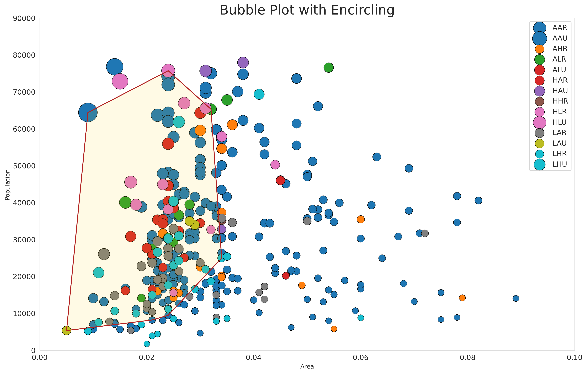
<a name="b1956800"></a>
### 3、带线性回归最佳拟合线的散点图
如果想了解两个变量如何相互改变，那么最合适的线就是要走的路。下图显示了数据中各组之间最佳拟合线的差异。要禁用分组并仅为整个数据集绘制一条最佳拟合线，请从下面的调用中删除该参数。
```python
# Import Data
df = pd.read_csv("https://github.com/selva86/datasets/blob/master/mpg_ggplot2.csv")
df_select = df.loc[df.cyl.isin([4,8]), :]
# Plot
sns.set_style("white")
gridobj = sns.lmplot(x="displ", y="hwy", hue="cyl", data=df_select, 
                     height=7, aspect=1.6, robust=True, palette='tab10', 
                     scatter_kws=dict(s=60, linewidths=.7, edgecolors='black'))
# Decorations
gridobj.set(xlim=(0.5, 7.5), ylim=(0, 50))
plt.title("Scatterplot with line of best fit grouped by number of cylinders", fontsize=20)
plt.savefig('outbox_legend.png', dpi = 300, bbox_inches = 'tight', pad_inches = .1)
```
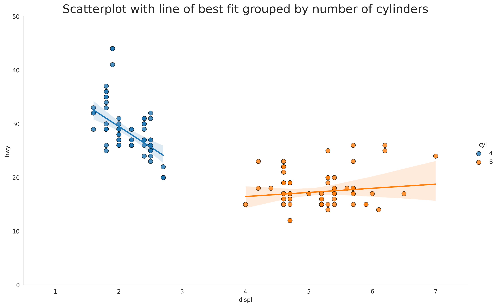<br />每个回归线都在自己的列中<br />或者，可以在其自己的列中显示每个组的最佳拟合线。可以通过在里面设置参数来实现这一点。
```python
# Import Data
df = pd.read_csv("https://github.com/selva86/datasets/blob/master/mpg_ggplot2.csv")
df_select = df.loc[df.cyl.isin([4,8]), :]
# Each line in its own column
sns.set_style("white")
gridobj = sns.lmplot(x="displ", y="hwy", 
                     data=df_select, 
                     height=7, 
                     robust=True, 
                     palette='Set1', 
                     col="cyl",
                     scatter_kws=dict(s=60, linewidths=.7, edgecolors='black'))
# Decorations
gridobj.set(xlim=(0.5, 7.5), ylim=(0, 50))
plt.savefig('outbox_legend.png', dpi = 300, bbox_inches = 'tight', pad_inches = .1)
```
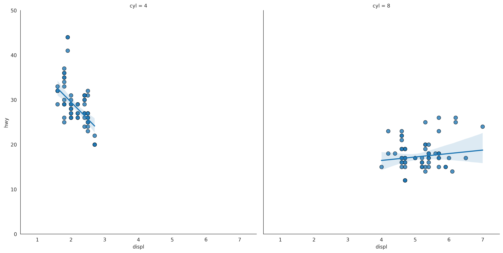
<a name="njQT2"></a>
### 4、抖动图
通常，多个数据点具有完全相同的X和Y值。结果，多个点相互绘制并隐藏。为避免这种情况，请稍微抖动点，以便可以直观地看到它们。这很方便使用
```python
# Import Data
df = pd.read_csv("https://github.com/selva86/datasets/blob/master/mpg_ggplot2.csv")
# Draw Stripplot
fig, ax = plt.subplots(figsize=(16,10), dpi= 80)    
sns.stripplot(df.cty, df.hwy, jitter=0.25, size=8, ax=ax, linewidth=.5)
# Decorations
plt.title('Use jittered plots to avoid overlapping of points', fontsize=22)
plt.savefig('outbox_legend.png', dpi = 300, bbox_inches = 'tight', pad_inches = .1)
```
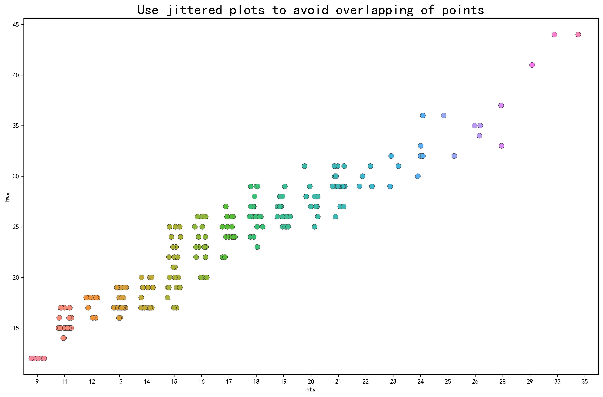
<a name="bVHVo"></a>
### 5、计数图
避免点重叠问题的另一个选择是增加点的大小，这取决于该点中有多少点。因此，点的大小越大，周围的点的集中度就越大。
```python
# Import Data
df = pd.read_csv("https://github.com/selva86/datasets/blob/master/mpg_ggplot2.csv")
df_counts = df.groupby(['hwy', 'cty']).size().reset_index(name='counts')
# Draw Stripplot
fig, ax = plt.subplots(figsize=(16,10), dpi= 80)    
sns.stripplot(df_counts.cty, df_counts.hwy, size=10, ax=ax)
# Decorations
plt.title('Counts Plot - Size of circle is bigger as more points overlap', fontsize=22)
plt.savefig('outbox_legend.png', dpi = 300, bbox_inches = 'tight', pad_inches = .1)
```
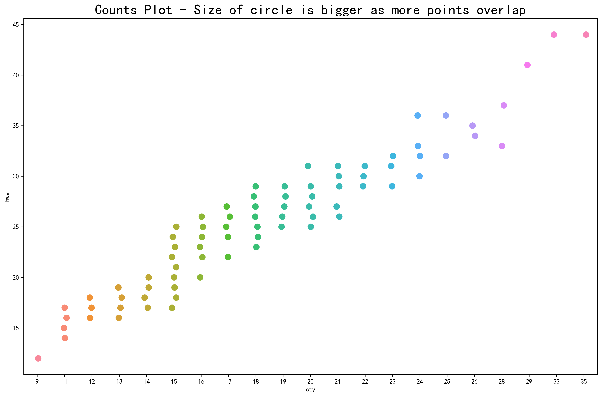
<a name="COEvM"></a>
### 6、边缘直方图
边缘直方图具有沿X和Y轴变量的直方图。这用于可视化X和Y之间的关系以及单独的X和Y的单变量分布。该图如果经常用于探索性数据分析（EDA）。
```python
# Import Data
df = pd.read_csv("https://github.com/selva86/datasets/blob/master/mpg_ggplot2.csv")
# Create Fig and gridspec
fig = plt.figure(figsize=(16, 10), dpi= 80)
grid = plt.GridSpec(4, 4, hspace=0.5, wspace=0.2)
# Define the axes
ax_main = fig.add_subplot(grid[:-1, :-1])
ax_right = fig.add_subplot(grid[:-1, -1], xticklabels=[], yticklabels=[])
ax_bottom = fig.add_subplot(grid[-1, 0:-1], xticklabels=[], yticklabels=[])
# Scatterplot on main ax
ax_main.scatter('displ', 'hwy', s=df.cty*4, c=df.manufacturer.astype('category').cat.codes, alpha=.9, data=df, cmap="tab10", edgecolors='gray', linewidths=.5)
# histogram on the right
ax_bottom.hist(df.displ, 40, histtype='stepfilled', orientation='vertical', color='deeppink')
ax_bottom.invert_yaxis()
# histogram in the bottom
ax_right.hist(df.hwy, 40, histtype='stepfilled', orientation='horizontal', color='deeppink')
# Decorations
ax_main.set(title='Scatterplot with Histograms displ vs hwy', xlabel='displ', ylabel='hwy')
ax_main.title.set_fontsize(20)
for item in ([ax_main.xaxis.label, ax_main.yaxis.label] + ax_main.get_xticklabels() + ax_main.get_yticklabels()):
    item.set_fontsize(14)
xlabels = ax_main.get_xticks().tolist()
ax_main.set_xticklabels(xlabels)
plt.savefig('outbox_legend.png', dpi = 300, bbox_inches = 'tight', pad_inches = .1)
```
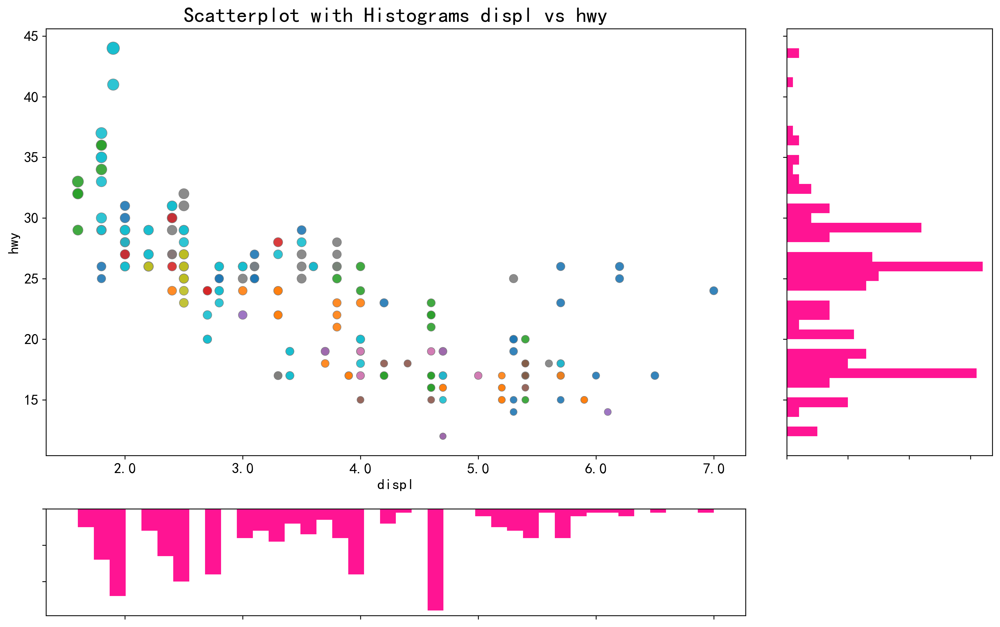
<a name="20d353fb"></a>
### 7、边缘箱形图
边缘箱图与边缘直方图具有相似的用途。然而，箱线图有助于精确定位X和Y的中位数，第25和第75百分位数。
```python
# Import Data
df = pd.read_csv("https://github.com/selva86/datasets/blob/master/mpg_ggplot2.csv")
# Create Fig and gridspec
fig = plt.figure(figsize=(16, 10), dpi= 80)
grid = plt.GridSpec(4, 4, hspace=0.5, wspace=0.2)
# Define the axes
ax_main = fig.add_subplot(grid[:-1, :-1])
ax_right = fig.add_subplot(grid[:-1, -1], xticklabels=[], yticklabels=[])
ax_bottom = fig.add_subplot(grid[-1, 0:-1], xticklabels=[], yticklabels=[])
# Scatterplot on main ax
ax_main.scatter('displ', 'hwy', s=df.cty*5, c=df.manufacturer.astype('category').cat.codes, alpha=.9, data=df, cmap="Set1", edgecolors='black', linewidths=.5)
# Add a graph in each part
sns.boxplot(df.hwy, ax=ax_right, orient="v")
sns.boxplot(df.displ, ax=ax_bottom, orient="h")
# Decorations ------------------
# Remove x axis name for the boxplot
ax_bottom.set(xlabel='')
ax_right.set(ylabel='')
# Main Title, Xlabel and YLabel
ax_main.set(title='Scatterplot with Histograms displ vs hwy', xlabel='displ', ylabel='hwy')
# Set font size of different components
ax_main.title.set_fontsize(20)
for item in ([ax_main.xaxis.label, ax_main.yaxis.label] + ax_main.get_xticklabels() + ax_main.get_yticklabels()):
    item.set_fontsize(14)
plt.savefig('outbox_legend.png', dpi = 300, bbox_inches = 'tight', pad_inches = .1)
```
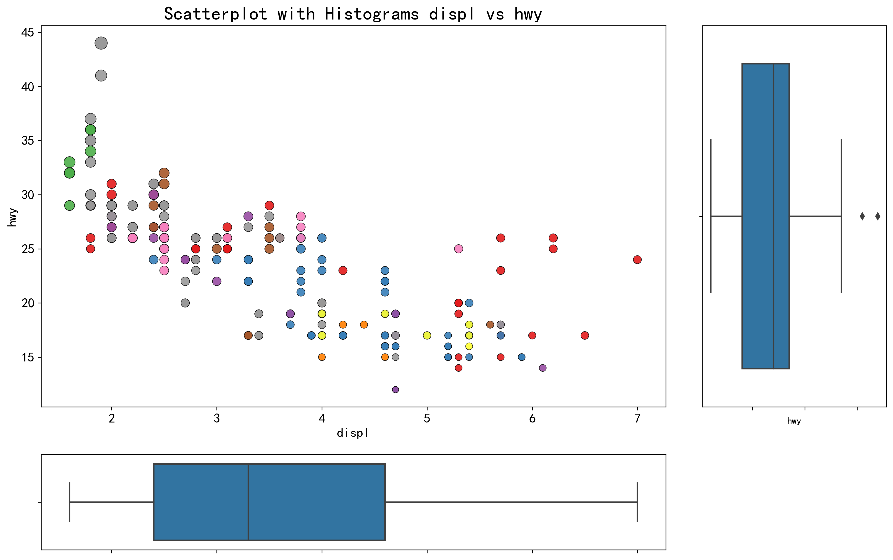
<a name="rLCZ8"></a>
### 8、相关图
Correlogram用于直观地查看给定数据帧（或2D数组）中所有可能的数值变量对之间的相关度量。
```python
# Import Dataset
df = pd.read_csv("https://github.com/selva86/datasets/blob/master/mtcars.csv")
# Plot
plt.figure(figsize=(12,10), dpi= 80)
sns.heatmap(df.corr(), xticklabels=df.corr().columns, yticklabels=df.corr().columns, cmap='RdYlGn', center=0, annot=True)
# Decorations
plt.title('Correlogram of mtcars', fontsize=22)
plt.xticks(fontsize=12)
plt.yticks(fontsize=12)
plt.savefig('outbox_legend.png', dpi = 300, bbox_inches = 'tight', pad_inches = .1)
```
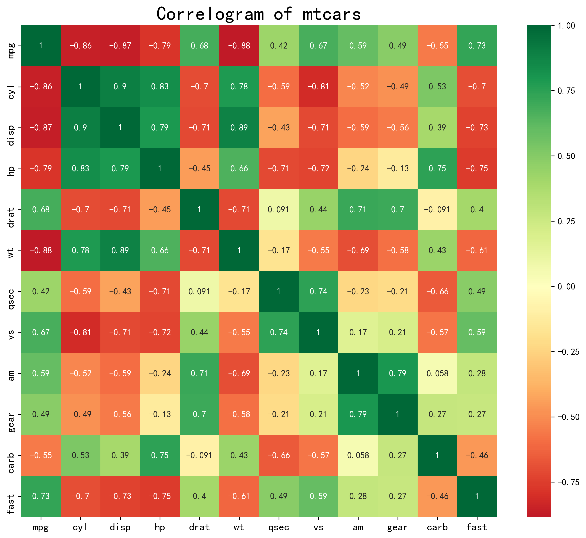
<a name="kdhnk"></a>
### &9、矩阵图
成对图是探索性分析中的最爱，以理解所有可能的数字变量对之间的关系。它是双变量分析的必备工具。
```python
# Load Dataset
df = sns.load_dataset('iris')
# Plot
plt.figure(figsize=(10,8), dpi= 80)
sns.pairplot(df, kind="scatter", hue="species", plot_kws=dict(s=80, edgecolor="white", linewidth=2.5))
plt.savefig('outbox_legend.png', dpi = 300, bbox_inches = 'tight', pad_inches = .1)
```
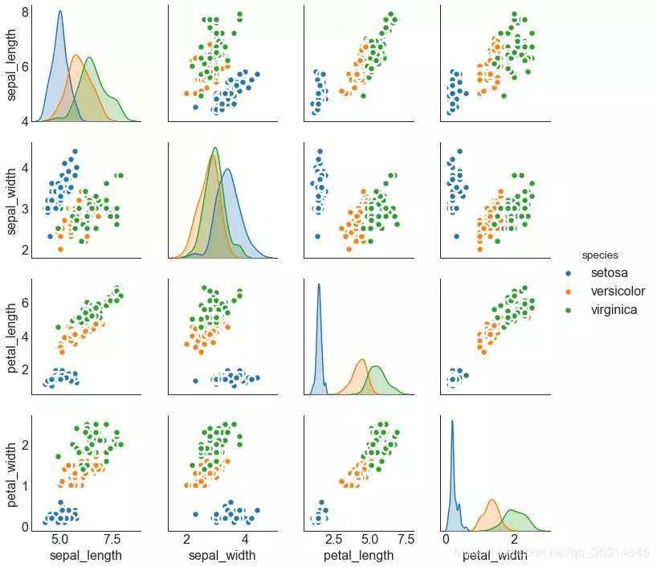
```python
# Load Dataset
df = sns.load_dataset('iris')
# Plot
plt.figure(figsize=(10,8), dpi= 80)
sns.pairplot(df, kind="reg", hue="species")
plt.savefig('outbox_legend.png', dpi = 300, bbox_inches = 'tight', pad_inches = .1)
```
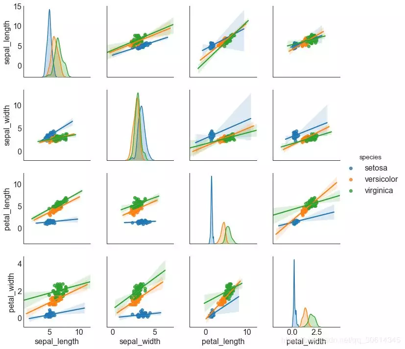

<a name="WfatL"></a>
### 10、发散型条形图
如果想根据单个指标查看项目的变化情况，并可视化此差异的顺序和数量，那么发散条是一个很好的工具。它有助于快速区分数据中组的性能，并且非常直观，并且可以立即传达这一点。
```python
# Prepare Data
df = pd.read_csv("https://github.com/selva86/datasets/blob/master/mtcars.csv")
x = df.loc[:, ['mpg']]
df['mpg_z'] = (x - x.mean())/x.std()
df['colors'] = ['red' if x < 0 else 'green' for x in df['mpg_z']]
df.sort_values('mpg_z', inplace=True)
df.reset_index(inplace=True)
# Draw plot
plt.figure(figsize=(14,10), dpi= 80)
plt.hlines(y=df.index, xmin=0, xmax=df.mpg_z, color=df.colors, alpha=0.4, linewidth=5)
# Decorations
plt.gca().set(ylabel='$Model$', xlabel='$Mileage$')
plt.yticks(df.index, df.cars, fontsize=12)
plt.title('Diverging Bars of Car Mileage', fontdict={'size':20})
plt.grid(linestyle='--', alpha=0.5)
plt.savefig('outbox_legend.png', dpi = 300, bbox_inches = 'tight', pad_inches = .1)
```
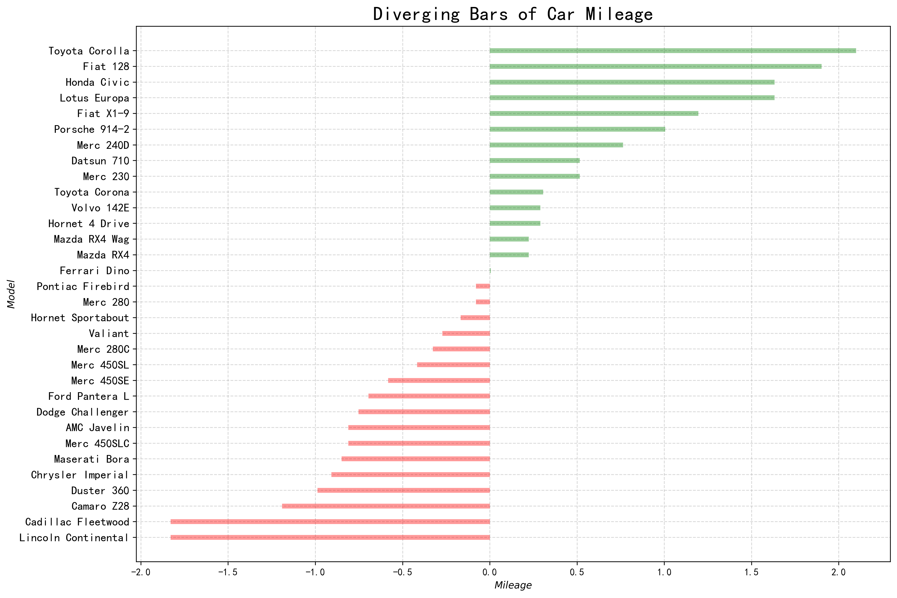
<a name="6403da1e"></a>
### 11、发散型文本
分散的文本类似于发散条，如果想以一种漂亮和可呈现的方式显示图表中每个项目的价值，它更喜欢。
```python
# Prepare Data
df = pd.read_csv("https://github.com/selva86/datasets/blob/master/mtcars.csv")
x = df.loc[:, ['mpg']]
df['mpg_z'] = (x - x.mean())/x.std()
df['colors'] = ['red' if x < 0 else 'green' for x in df['mpg_z']]
df.sort_values('mpg_z', inplace=True)
df.reset_index(inplace=True)
# Draw plot
plt.figure(figsize=(14,14), dpi= 80)
plt.hlines(y=df.index, xmin=0, xmax=df.mpg_z)
for x, y, tex in zip(df.mpg_z, df.index, df.mpg_z):
    t = plt.text(x, y, round(tex, 2), horizontalalignment='right' if x < 0 else 'left', 
                 verticalalignment='center', fontdict={'color':'red' if x < 0 else 'green', 'size':14})
# Decorations    
plt.yticks(df.index, df.cars, fontsize=12)
plt.title('Diverging Text Bars of Car Mileage', fontdict={'size':20})
plt.grid(linestyle='--', alpha=0.5)
plt.xlim(-2.5, 2.5)
plt.savefig('outbox_legend.png', dpi = 300, bbox_inches = 'tight', pad_inches = .1)
```
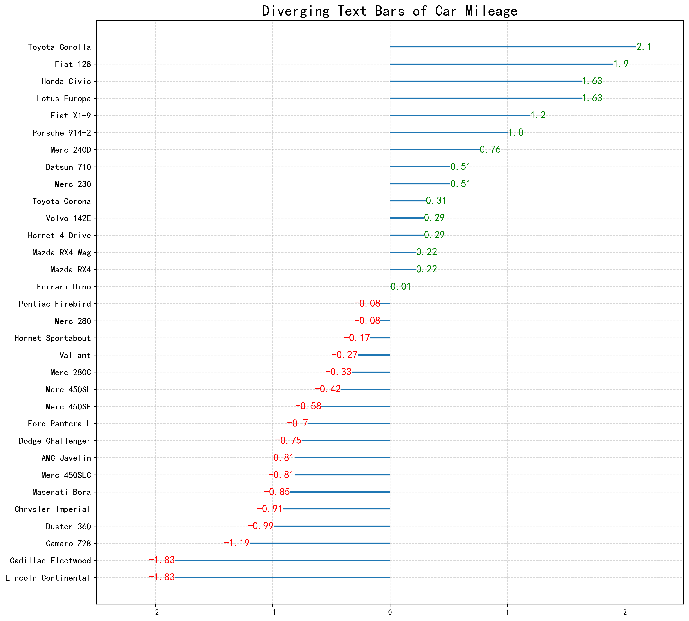
<a name="XPR8M"></a>
### 12、发散型包点图
发散点图也类似于发散条。然而，与发散条相比，条的不存在减少了组之间的对比度和差异。
```python
# Prepare Data
df = pd.read_csv("https://github.com/selva86/datasets/blob/master/mtcars.csv")
x = df.loc[:, ['mpg']]
df['mpg_z'] = (x - x.mean())/x.std()
df['colors'] = ['red' if x < 0 else 'darkgreen' for x in df['mpg_z']]
df.sort_values('mpg_z', inplace=True)
df.reset_index(inplace=True)
# Draw plot
plt.figure(figsize=(14,16), dpi= 80)
plt.scatter(df.mpg_z, df.index, s=450, alpha=.6, color=df.colors)
for x, y, tex in zip(df.mpg_z, df.index, df.mpg_z):
    t = plt.text(x, y, round(tex, 1), horizontalalignment='center', 
                 verticalalignment='center', fontdict={'color':'white'})
# Decorations
# Lighten borders
plt.gca().spines["top"].set_alpha(.3)
plt.gca().spines["bottom"].set_alpha(.3)
plt.gca().spines["right"].set_alpha(.3)
plt.gca().spines["left"].set_alpha(.3)
plt.yticks(df.index, df.cars)
plt.title('Diverging Dotplot of Car Mileage', fontdict={'size':20})
plt.xlabel('$Mileage$')
plt.grid(linestyle='--', alpha=0.5)
plt.xlim(-2.5, 2.5)
plt.savefig('outbox_legend.png', dpi = 300, bbox_inches = 'tight', pad_inches = .1)
```
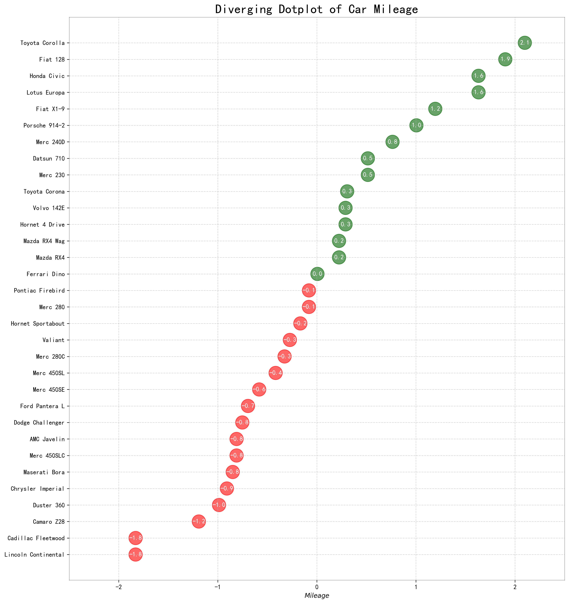
<a name="14dea40a"></a>
### 13、带标记的发散型棒棒糖图
带标记的棒棒糖通过强调想要引起注意的任何重要数据点并在图表中适当地给出推理，提供了一种可视化分歧的灵活方式。
```python
# Prepare Data
df = pd.read_csv("https://github.com/selva86/datasets/blob/master/mtcars.csv")
x = df.loc[:, ['mpg']]
df['mpg_z'] = (x - x.mean())/x.std()
df['colors'] = 'black'
# color fiat differently
df.loc[df.cars == 'Fiat X1-9', 'colors'] = 'darkorange'
df.sort_values('mpg_z', inplace=True)
df.reset_index(inplace=True)
# Draw plot
import matplotlib.patches as patches
plt.figure(figsize=(14,16), dpi= 80)
plt.hlines(y=df.index, xmin=0, xmax=df.mpg_z, color=df.colors, alpha=0.4, linewidth=1)
plt.scatter(df.mpg_z, df.index, color=df.colors, s=[600 if x == 'Fiat X1-9' else 300 for x in df.cars], alpha=0.6)
plt.yticks(df.index, df.cars)
plt.xticks(fontsize=12)
# Annotate
plt.annotate('Mercedes Models', xy=(0.0, 11.0), xytext=(1.0, 11), xycoords='data', 
            fontsize=15, ha='center', va='center',
            bbox=dict(boxstyle='square', fc='firebrick'),
            arrowprops=dict(arrowstyle='-[, widthB=2.0, lengthB=1.5', lw=2.0, color='steelblue'), color='white')
# Add Patches
p1 = patches.Rectangle((-2.0, -1), width=.3, height=3, alpha=.2, facecolor='red')
p2 = patches.Rectangle((1.5, 27), width=.8, height=5, alpha=.2, facecolor='green')
plt.gca().add_patch(p1)
plt.gca().add_patch(p2)
# Decorate
plt.title('Diverging Bars of Car Mileage', fontdict={'size':20})
plt.grid(linestyle='--', alpha=0.5)
plt.savefig('outbox_legend.png', dpi = 300, bbox_inches = 'tight', pad_inches = .1)
```
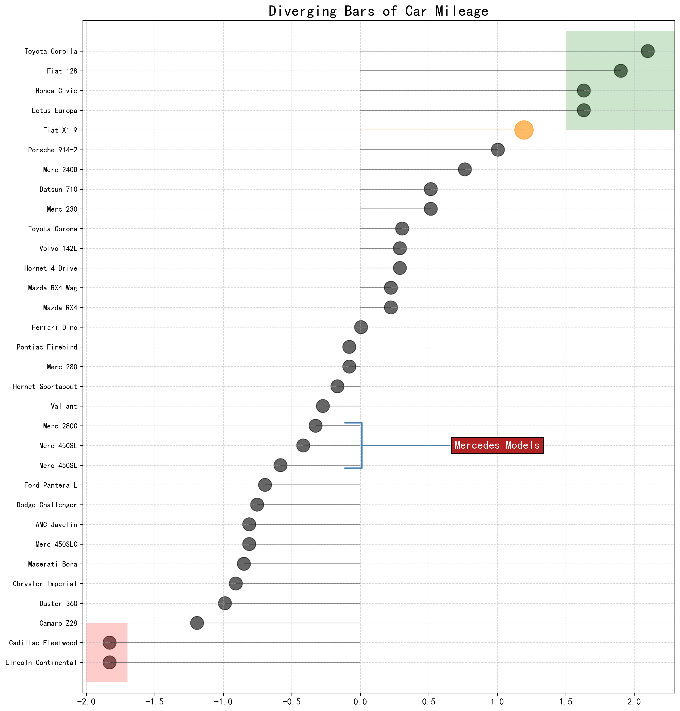
<a name="69900a7b"></a>
### 14、面积图
通过对轴和线之间的区域进行着色，区域图不仅强调峰值和低谷，而且还强调高点和低点的持续时间。高点持续时间越长，线下面积越大。
```python
import numpy as np
import pandas as pd
# Prepare Data
df = pd.read_csv("https://github.com/selva86/datasets/blob/master/economics.csv", parse_dates=['date']).head(100)
x = np.arange(df.shape[0])
y_returns = (df.psavert.diff().fillna(0)/df.psavert.shift(1)).fillna(0) * 100
# Plot
plt.figure(figsize=(16,10), dpi= 80)
plt.fill_between(x[1:], y_returns[1:], 0, where=y_returns[1:] >= 0, facecolor='green', interpolate=True, alpha=0.7)
plt.fill_between(x[1:], y_returns[1:], 0, where=y_returns[1:] <= 0, facecolor='red', interpolate=True, alpha=0.7)
# Annotate
plt.annotate('Peak 1975', xy=(94.0, 21.0), xytext=(88.0, 28),
             bbox=dict(boxstyle='square', fc='firebrick'),
             arrowprops=dict(facecolor='steelblue', shrink=0.05), fontsize=15, color='white')
# Decorations
xtickvals = [str(m)[:3].upper()+"-"+str(y) for y,m in zip(df.date.dt.year, df.date.dt.month_name())]
plt.gca().set_xticks(x[::6])
plt.gca().set_xticklabels(xtickvals[::6], rotation=90, fontdict={'horizontalalignment': 'center', 'verticalalignment': 'center_baseline'})
plt.ylim(-35,35)
plt.xlim(1,100)
plt.title("Month Economics Return %", fontsize=22)
plt.ylabel('Monthly returns %')
plt.grid(alpha=0.5)
plt.savefig('outbox_legend.png', dpi = 300, bbox_inches = 'tight', pad_inches = .1)
```
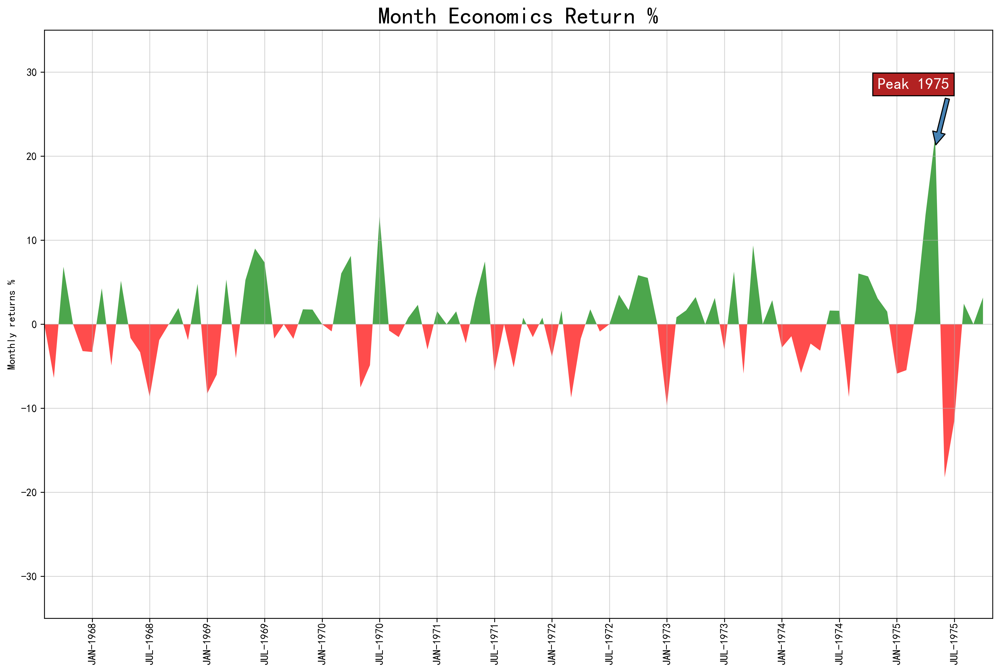
<a name="70831a42"></a>
### 15、有序条形图
有序条形图有效地传达了项目的排名顺序。但是，在图表上方添加度量标准的值，用户可以从图表本身获取精确信息。
```python
# Prepare Data
df_raw = pd.read_csv("https://github.com/selva86/datasets/blob/master/mpg_ggplot2.csv")
df = df_raw[['cty', 'manufacturer']].groupby('manufacturer').apply(lambda x: x.mean())
df.sort_values('cty', inplace=True)
df.reset_index(inplace=True)
# Draw plot
import matplotlib.patches as patches
fig, ax = plt.subplots(figsize=(16,10), facecolor='white', dpi= 80)
ax.vlines(x=df.index, ymin=0, ymax=df.cty, color='firebrick', alpha=0.7, linewidth=20)
# Annotate Text
for i, cty in enumerate(df.cty):
    ax.text(i, cty+0.5, round(cty, 1), horizontalalignment='center')
# Title, Label, Ticks and Ylim
ax.set_title('Bar Chart for Highway Mileage', fontdict={'size':22})
ax.set(ylabel='Miles Per Gallon', ylim=(0, 30))
plt.xticks(df.index, df.manufacturer.str.upper(), rotation=60, horizontalalignment='right', fontsize=12)
# Add patches to color the X axis labels
p1 = patches.Rectangle((.57, -0.005), width=.33, height=.13, alpha=.1, facecolor='green', transform=fig.transFigure)
p2 = patches.Rectangle((.124, -0.005), width=.446, height=.13, alpha=.1, facecolor='red', transform=fig.transFigure)
fig.add_artist(p1)
fig.add_artist(p2)
plt.savefig('outbox_legend.png', dpi = 300, bbox_inches = 'tight', pad_inches = .1)
```
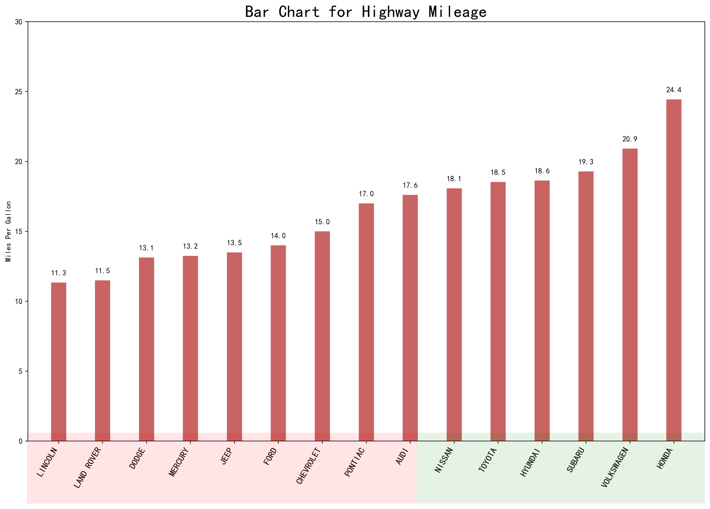
<a name="50qcs"></a>
### 16、棒棒糖图
棒棒糖图表以一种视觉上令人愉悦的方式提供与有序条形图类似的目的。
```python
# Prepare Data
df_raw = pd.read_csv("https://github.com/selva86/datasets/blob/master/mpg_ggplot2.csv")
df = df_raw[['cty', 'manufacturer']].groupby('manufacturer').apply(lambda x: x.mean())
df.sort_values('cty', inplace=True)
df.reset_index(inplace=True)
# Draw plot
fig, ax = plt.subplots(figsize=(16,10), dpi= 80)
ax.vlines(x=df.index, ymin=0, ymax=df.cty, color='firebrick', alpha=0.7, linewidth=2)
ax.scatter(x=df.index, y=df.cty, s=75, color='firebrick', alpha=0.7)
# Title, Label, Ticks and Ylim
ax.set_title('Lollipop Chart for Highway Mileage', fontdict={'size':22})
ax.set_ylabel('Miles Per Gallon')
ax.set_xticks(df.index)
ax.set_xticklabels(df.manufacturer.str.upper(), rotation=60, fontdict={'horizontalalignment': 'right', 'size':12})
ax.set_ylim(0, 30)
# Annotate
for row in df.itertuples():
    ax.text(row.Index, row.cty+.5, s=round(row.cty, 2), horizontalalignment= 'center', verticalalignment='bottom', fontsize=14)
plt.savefig('outbox_legend.png', dpi = 300, bbox_inches = 'tight', pad_inches = .1)
```
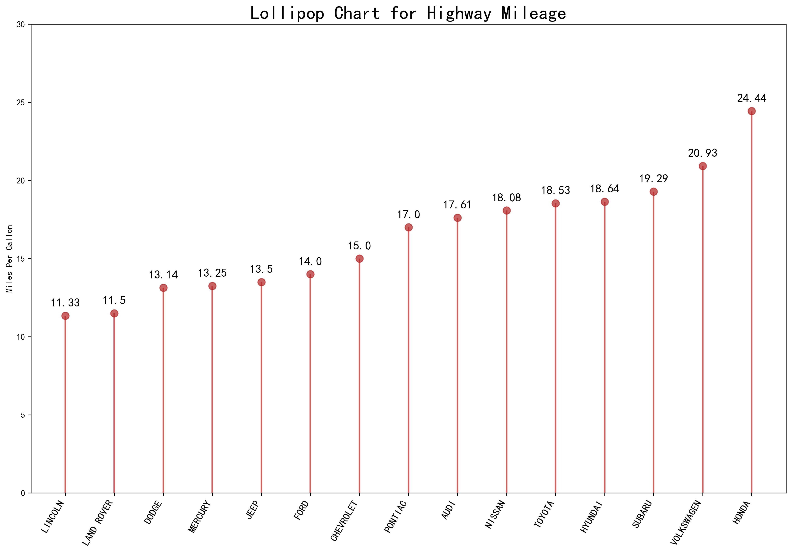
<a name="PgIk6"></a>
### 17、包点图
点图表传达了项目的排名顺序。由于它沿水平轴对齐，因此可以更容易地看到点彼此之间的距离。
```python
# Prepare Data
df_raw = pd.read_csv("https://github.com/selva86/datasets/blob/master/mpg_ggplot2.csv")
df = df_raw[['cty', 'manufacturer']].groupby('manufacturer').apply(lambda x: x.mean())
df.sort_values('cty', inplace=True)
df.reset_index(inplace=True)
# Draw plot
fig, ax = plt.subplots(figsize=(16,10), dpi= 80)
ax.hlines(y=df.index, xmin=11, xmax=26, color='gray', alpha=0.7, linewidth=1, linestyles='dashdot')
ax.scatter(y=df.index, x=df.cty, s=75, color='firebrick', alpha=0.7)
# Title, Label, Ticks and Ylim
ax.set_title('Dot Plot for Highway Mileage', fontdict={'size':22})
ax.set_xlabel('Miles Per Gallon')
ax.set_yticks(df.index)
ax.set_yticklabels(df.manufacturer.str.title(), fontdict={'horizontalalignment': 'right'})
ax.set_xlim(10, 27)
plt.savefig('outbox_legend.png', dpi = 300, bbox_inches = 'tight', pad_inches = .1)
```
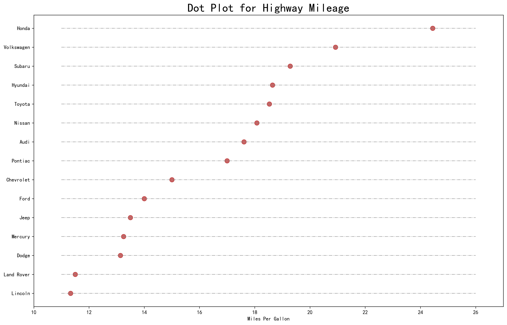
<a name="8XTEC"></a>
### 18、坡度图
斜率图最适合比较给定人/项目的“之前”和“之后”位置。
```python
import matplotlib.lines as mlines
# Import Data
df = pd.read_csv("https://github.com/selva86/datasets/blob/master/gdppercap.csv")
left_label = [str(c) + ', '+ str(round(y)) for c, y in zip(df.continent, df['1952'])]
right_label = [str(c) + ', '+ str(round(y)) for c, y in zip(df.continent, df['1957'])]
klass = ['red' if (y1-y2) < 0 else 'green' for y1, y2 in zip(df['1952'], df['1957'])]
# draw line
# https://stackoverflow.com/questions/36470343/how-to-draw-a-line-with-matplotlib/36479941
def newline(p1, p2, color='black'):
    ax = plt.gca()
    l = mlines.Line2D([p1[0],p2[0]], [p1[1],p2[1]], color='red' if p1[1]-p2[1] > 0 else 'green', marker='o', markersize=6)
    ax.add_line(l)
    return l
fig, ax = plt.subplots(1,1,figsize=(14,14), dpi= 80)
# Vertical Lines
ax.vlines(x=1, ymin=500, ymax=13000, color='black', alpha=0.7, linewidth=1, linestyles='dotted')
ax.vlines(x=3, ymin=500, ymax=13000, color='black', alpha=0.7, linewidth=1, linestyles='dotted')
# Points
ax.scatter(y=df['1952'], x=np.repeat(1, df.shape[0]), s=10, color='black', alpha=0.7)
ax.scatter(y=df['1957'], x=np.repeat(3, df.shape[0]), s=10, color='black', alpha=0.7)
# Line Segmentsand Annotation
for p1, p2, c in zip(df['1952'], df['1957'], df['continent']):
    newline([1,p1], [3,p2])
    ax.text(1-0.05, p1, c + ', ' + str(round(p1)), horizontalalignment='right', verticalalignment='center', fontdict={'size':14})
    ax.text(3+0.05, p2, c + ', ' + str(round(p2)), horizontalalignment='left', verticalalignment='center', fontdict={'size':14})
# 'Before' and 'After' Annotations
ax.text(1-0.05, 13000, 'BEFORE', horizontalalignment='right', verticalalignment='center', fontdict={'size':18, 'weight':700})
ax.text(3+0.05, 13000, 'AFTER', horizontalalignment='left', verticalalignment='center', fontdict={'size':18, 'weight':700})
# Decoration
ax.set_title("Slopechart: Comparing GDP Per Capita between 1952 vs 1957", fontdict={'size':22})
ax.set(xlim=(0,4), ylim=(0,14000), ylabel='Mean GDP Per Capita')
ax.set_xticks([1,3])
ax.set_xticklabels(["1952", "1957"])
plt.yticks(np.arange(500, 13000, 2000), fontsize=12)
# Lighten borders
plt.gca().spines["top"].set_alpha(.0)
plt.gca().spines["bottom"].set_alpha(.0)
plt.gca().spines["right"].set_alpha(.0)
plt.gca().spines["left"].set_alpha(.0)
plt.savefig('outbox_legend.png', dpi = 300, bbox_inches = 'tight', pad_inches = .1)
```
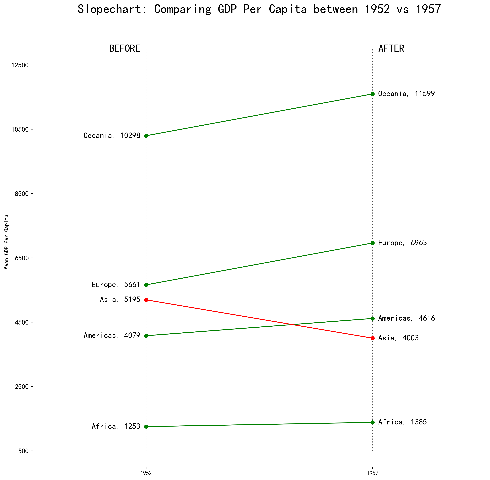
<a name="NSmBh"></a>
### 19、哑铃图
哑铃图传达各种项目的“前”和“后”位置以及项目的排序。如果想要将特定项目/计划对不同对象的影响可视化，那么它非常有用。
```python
import matplotlib.lines as mlines
# Import Data
df = pd.read_csv("https://github.com/selva86/datasets/blob/master/health.csv")
df.sort_values('pct_2014', inplace=True)
df.reset_index(inplace=True)
# Func to draw line segment
def newline(p1, p2, color='black'):
    ax = plt.gca()
    l = mlines.Line2D([p1[0],p2[0]], [p1[1],p2[1]], color='skyblue')
    ax.add_line(l)
    return l
# Figure and Axes
fig, ax = plt.subplots(1,1,figsize=(14,14), facecolor='#f7f7f7', dpi= 80)
# Vertical Lines
ax.vlines(x=.05, ymin=0, ymax=26, color='black', alpha=1, linewidth=1, linestyles='dotted')
ax.vlines(x=.10, ymin=0, ymax=26, color='black', alpha=1, linewidth=1, linestyles='dotted')
ax.vlines(x=.15, ymin=0, ymax=26, color='black', alpha=1, linewidth=1, linestyles='dotted')
ax.vlines(x=.20, ymin=0, ymax=26, color='black', alpha=1, linewidth=1, linestyles='dotted')
# Points
ax.scatter(y=df['index'], x=df['pct_2013'], s=50, color='#0e668b', alpha=0.7)
ax.scatter(y=df['index'], x=df['pct_2014'], s=50, color='#a3c4dc', alpha=0.7)
# Line Segments
for i, p1, p2 in zip(df['index'], df['pct_2013'], df['pct_2014']):
    newline([p1, i], [p2, i])
# Decoration
ax.set_facecolor('#f7f7f7')
ax.set_title("Dumbell Chart: Pct Change - 2013 vs 2014", fontdict={'size':22})
ax.set(xlim=(0,.25), ylim=(-1, 27), ylabel='Mean GDP Per Capita')
ax.set_xticks([.05, .1, .15, .20])
ax.set_xticklabels(['5%', '15%', '20%', '25%'])
ax.set_xticklabels(['5%', '15%', '20%', '25%'])    
plt.savefig('outbox_legend.png', dpi = 300, bbox_inches = 'tight', pad_inches = .1)
```
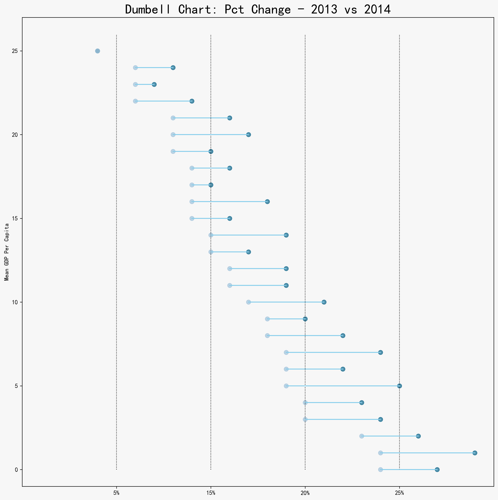
<a name="TLNRZ"></a>
### 20、连续变量的直方图
直方图显示给定变量的频率分布。下面的表示基于分类变量对频率条进行分组，从而更好地了解连续变量和串联变量。
```python
# Import Data
df = pd.read_csv("https://github.com/selva86/datasets/blob/master/mpg_ggplot2.csv")
# Prepare data
x_var = 'displ'
groupby_var = 'class'
df_agg = df.loc[:, [x_var, groupby_var]].groupby(groupby_var)
vals = [df[x_var].values.tolist() for i, df in df_agg]
# Draw
plt.figure(figsize=(16,9), dpi= 80)
colors = [plt.cm.Spectral(i/float(len(vals)-1)) for i in range(len(vals))]
n, bins, patches = plt.hist(vals, 30, stacked=True, density=False, color=colors[:len(vals)])
# Decoration
plt.legend({group:col for group, col in zip(np.unique(df[groupby_var]).tolist(), colors[:len(vals)])})
plt.title(f"Stacked Histogram of ${x_var}$ colored by ${groupby_var}$", fontsize=22)
plt.xlabel(x_var)
plt.ylabel("Frequency")
plt.ylim(0, 25)
plt.xticks(ticks=bins[::3], labels=[round(b,1) for b in bins[::3]])
plt.savefig('outbox_legend.png', dpi = 300, bbox_inches = 'tight', pad_inches = .1)
```
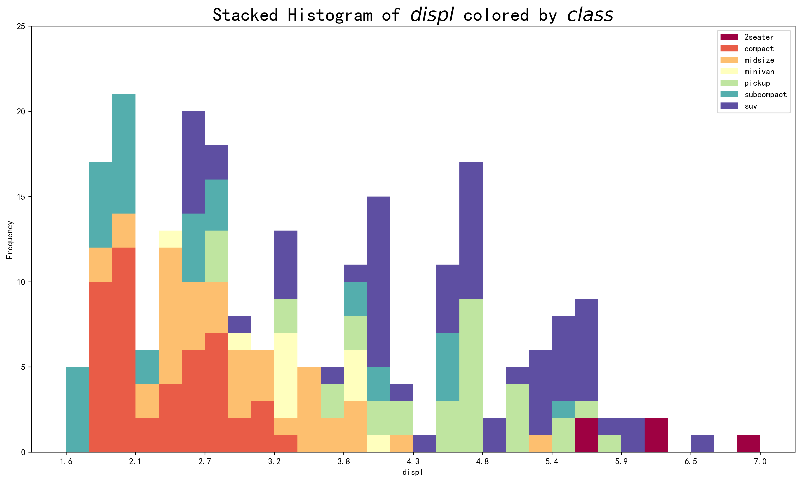
<a name="XRWno"></a>
### 21、类型变量的直方图
分类变量的直方图显示该变量的频率分布。通过对条形图进行着色，可以将分布与表示颜色的另一个分类变量相关联。
```python
# Import Data
df = pd.read_csv("https://github.com/selva86/datasets/blob/master/mpg_ggplot2.csv")
# Prepare data
x_var = 'manufacturer'
groupby_var = 'class'
df_agg = df.loc[:, [x_var, groupby_var]].groupby(groupby_var)
vals = [df[x_var].values.tolist() for i, df in df_agg]
# Draw
plt.figure(figsize=(16,9), dpi= 80)
colors = [plt.cm.Spectral(i/float(len(vals)-1)) for i in range(len(vals))]
n, bins, patches = plt.hist(vals, df[x_var].unique().__len__(), stacked=True, density=False, color=colors[:len(vals)])
# Decoration
plt.legend({group:col for group, col in zip(np.unique(df[groupby_var]).tolist(), colors[:len(vals)])})
plt.title(f"Stacked Histogram of ${x_var}$ colored by ${groupby_var}$", fontsize=22)
plt.xlabel(x_var)
plt.ylabel("Frequency")
plt.ylim(0, 40)
plt.xticks(ticks=bins[:-1], labels=np.unique(df[x_var]).tolist(), rotation=90, horizontalalignment='left')
plt.savefig('outbox_legend.png', dpi = 300, bbox_inches = 'tight', pad_inches = .1)
```
:::tips
因为根据官方文档可以知道 `plt.hist()` 函数返回的 bins 长度是加一的<br />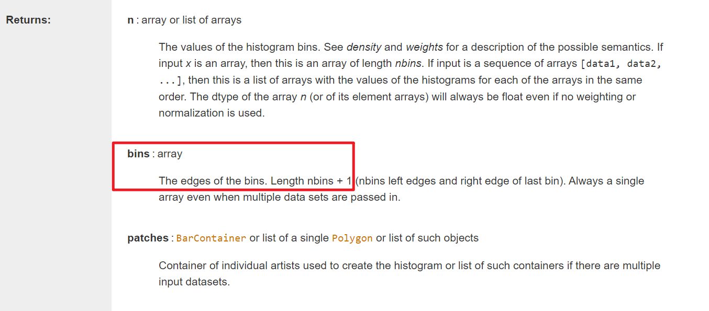<br />所以在进行赋值时需要对生成的bins进行切片处理，不然会报列表不一致错误。
:::
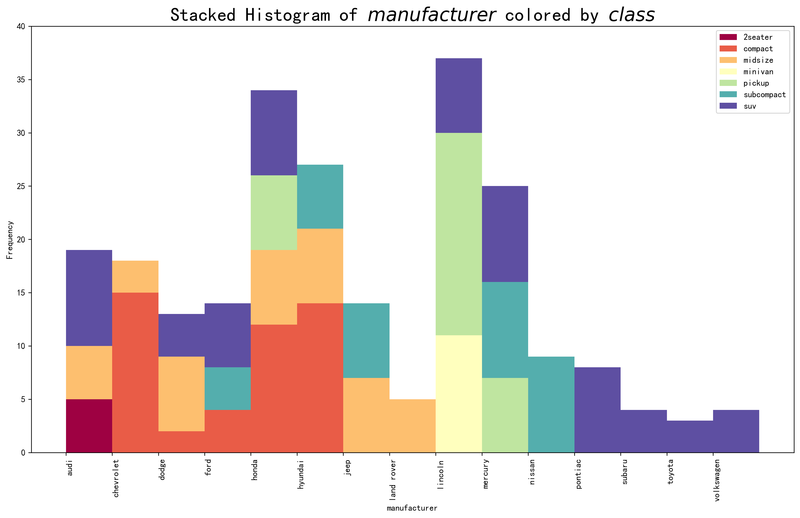
<a name="Iahd9"></a>
### 22、密度图
密度图是一种常用工具，可视化连续变量的分布。通过“响应”变量对它们进行分组，可以检查X和Y之间的关系。以下情况，如果出于代表性目的来描述城市里程的分布如何随着汽缸数的变化而变化。
```python
# Import Data
df = pd.read_csv("https://github.com/selva86/datasets/blob/master/mpg_ggplot2.csv")
# Draw Plot
plt.figure(figsize=(16,10), dpi= 80)
sns.kdeplot(df.loc[df['cyl'] == 4, "cty"], shade=True, color="g", label="Cyl=4", alpha=.7)
sns.kdeplot(df.loc[df['cyl'] == 5, "cty"], shade=True, color="deeppink", label="Cyl=5", alpha=.7)
sns.kdeplot(df.loc[df['cyl'] == 6, "cty"], shade=True, color="dodgerblue", label="Cyl=6", alpha=.7)
sns.kdeplot(df.loc[df['cyl'] == 8, "cty"], shade=True, color="orange", label="Cyl=8", alpha=.7)
# Decoration
plt.title('Density Plot of City Mileage by n_Cylinders', fontsize=22)
plt.legend()
plt.savefig('outbox_legend.png', dpi = 300, bbox_inches = 'tight', pad_inches = .1)
```
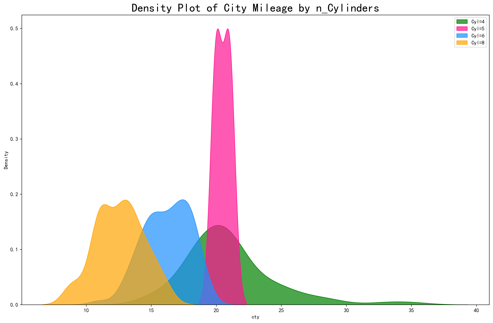
<a name="cS3GV"></a>
### 23、直方密度线图
带有直方图的密度曲线将两个图表传达的集体信息汇集在一起，这样就可以将它们放在一个图形而不是两个图形中。
```python
# Import Data
df = pd.read_csv("https://github.com/selva86/datasets/blob/master/mpg_ggplot2.csv")
# Draw Plot
plt.figure(figsize=(13,10), dpi= 80)
sns.distplot(df.loc[df['class'] == 'compact', "cty"], color="dodgerblue", label="Compact", hist_kws={'alpha':.7}, kde_kws={'linewidth':3})
sns.distplot(df.loc[df['class'] == 'suv', "cty"], color="orange", label="SUV", hist_kws={'alpha':.7}, kde_kws={'linewidth':3})
sns.distplot(df.loc[df['class'] == 'minivan', "cty"], color="g", label="minivan", hist_kws={'alpha':.7}, kde_kws={'linewidth':3})
plt.ylim(0, 0.35)
# Decoration
plt.title('Density Plot of City Mileage by Vehicle Type', fontsize=22)
plt.legend()
plt.savefig('outbox_legend.png', dpi = 300, bbox_inches = 'tight', pad_inches = .1)
```
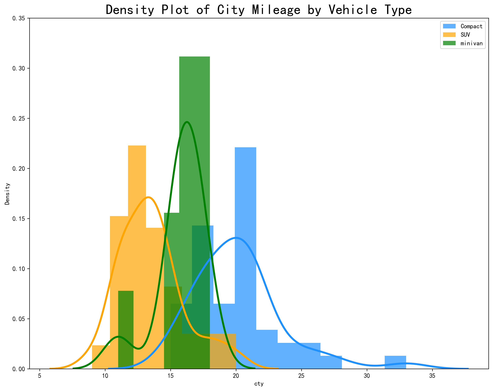
<a name="KNaS4"></a>
### 24、Joy Plot
Joy Plot允许不同组的密度曲线重叠，这是一种可视化相对于彼此的大量组的分布的好方法。它看起来很悦目，并清楚地传达了正确的信息。它可以使用joypy基于的包来轻松构建matplotlib。
```python
# !pip install joypy
import joypy
# Import Data
mpg = pd.read_csv("https://github.com/selva86/datasets/blob/master/mpg_ggplot2.csv")
# Draw Plot
plt.figure(figsize=(16,10), dpi= 80)
fig, axes = joypy.joyplot(mpg, column=['hwy', 'cty'], by="class", ylim='own', figsize=(14,10))
# Decoration
plt.title('Joy Plot of City and Highway Mileage by Class', fontsize=22)
plt.savefig('outbox_legend.png', dpi = 300, bbox_inches = 'tight', pad_inches = .1)
```
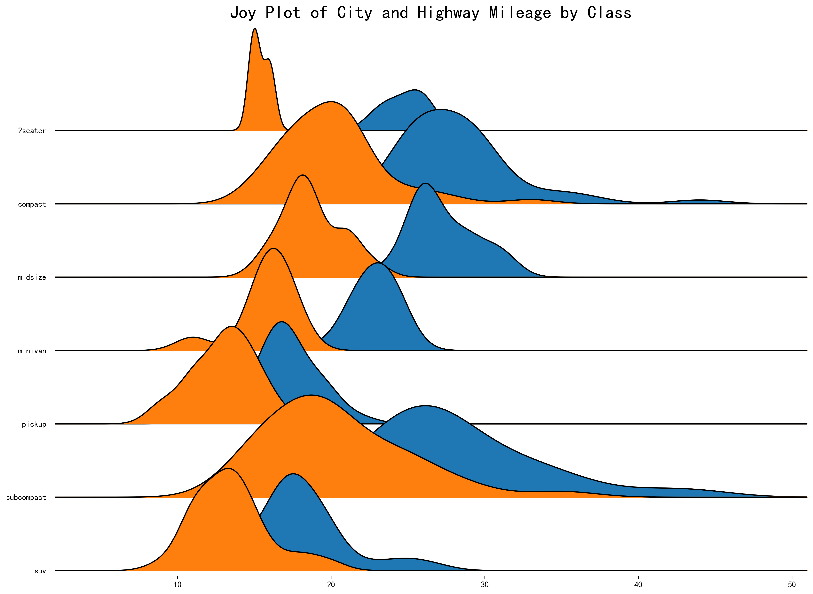
<a name="gY1HK"></a>
### 25、分布式点图
分布点图显示按组分割的点的单变量分布。点数越暗，该区域的数据点集中度越高。通过对中位数进行不同着色，组的真实定位立即变得明显。
```python
import matplotlib.patches as mpatches
# Prepare Data
df_raw = pd.read_csv("https://github.com/selva86/datasets/blob/master/mpg_ggplot2.csv")
cyl_colors = {4:'tab:red', 5:'tab:green', 6:'tab:blue', 8:'tab:orange'}
df_raw['cyl_color'] = df_raw.cyl.map(cyl_colors)
# Mean and Median city mileage by make
df = df_raw[['cty', 'manufacturer']].groupby('manufacturer').apply(lambda x: x.mean())
df.sort_values('cty', ascending=False, inplace=True)
df.reset_index(inplace=True)
df_median = df_raw[['cty', 'manufacturer']].groupby('manufacturer').apply(lambda x: x.median())
# Draw horizontal lines
fig, ax = plt.subplots(figsize=(16,10), dpi= 80)
ax.hlines(y=df.index, xmin=0, xmax=40, color='gray', alpha=0.5, linewidth=.5, linestyles='dashdot')
# Draw the Dots
for i, make in enumerate(df.manufacturer):
    df_make = df_raw.loc[df_raw.manufacturer==make, :]
    ax.scatter(y=0.5, x=0.5, data=df_make, s=75, edgecolors='gray', c='w', alpha=0.5)
    ax.scatter(y=i, x='cty', data=df_median.loc[df_median.index==make, :], s=75, c='firebrick')
# Annotate    
ax.text(33, 13, "$red ; dots ; are ; the : median$", fontdict={'size':12}, color='firebrick')
# Decorations
red_patch = plt.plot([],[], marker="o", ms=10, ls="", mec=None, color='firebrick', label="Median")
plt.legend(handles=red_patch)
ax.set_title('Distribution of City Mileage by Make', fontdict={'size':22})
ax.set_xlabel('Miles Per Gallon (City)', alpha=0.7)
ax.set_yticks(df.index)
ax.set_yticklabels(df.manufacturer.str.title(), fontdict={'horizontalalignment': 'right'}, alpha=0.7)
ax.set_xlim(1, 40)
plt.xticks(alpha=0.7)
plt.gca().spines["top"].set_visible(False)    
plt.gca().spines["bottom"].set_visible(False)    
plt.gca().spines["right"].set_visible(False)    
plt.gca().spines["left"].set_visible(False)   
plt.grid(axis='both', alpha=.4, linewidth=.1)
plt.savefig('outbox_legend.png', dpi = 300, bbox_inches = 'tight', pad_inches = .1)
```
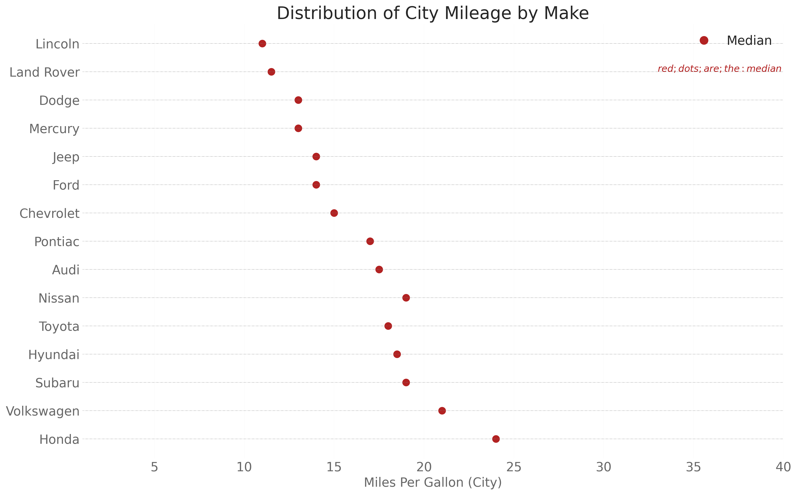
