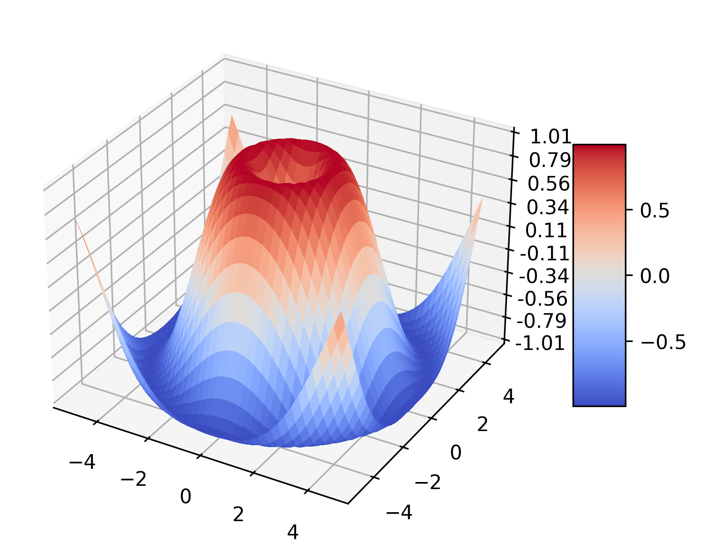
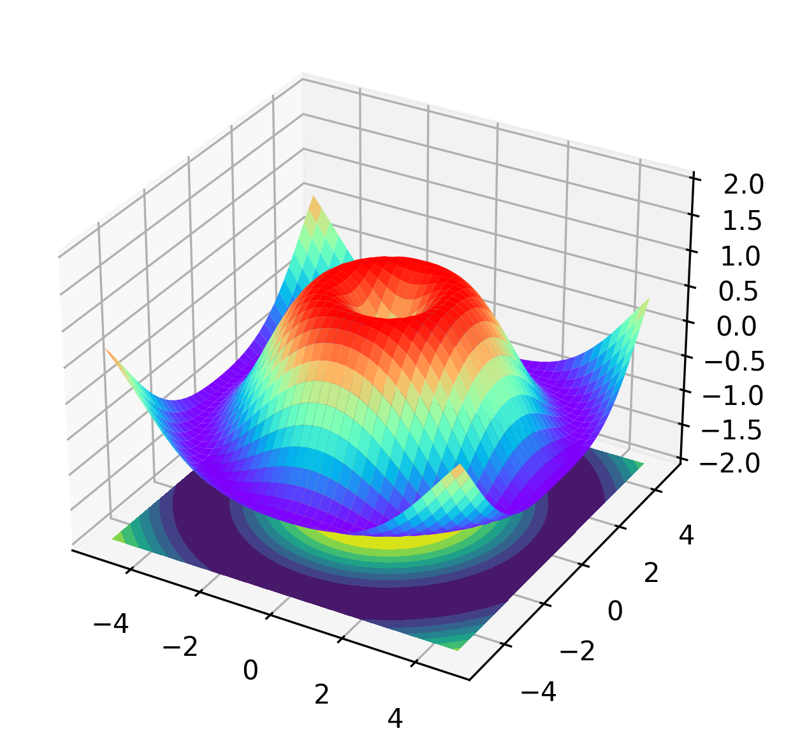
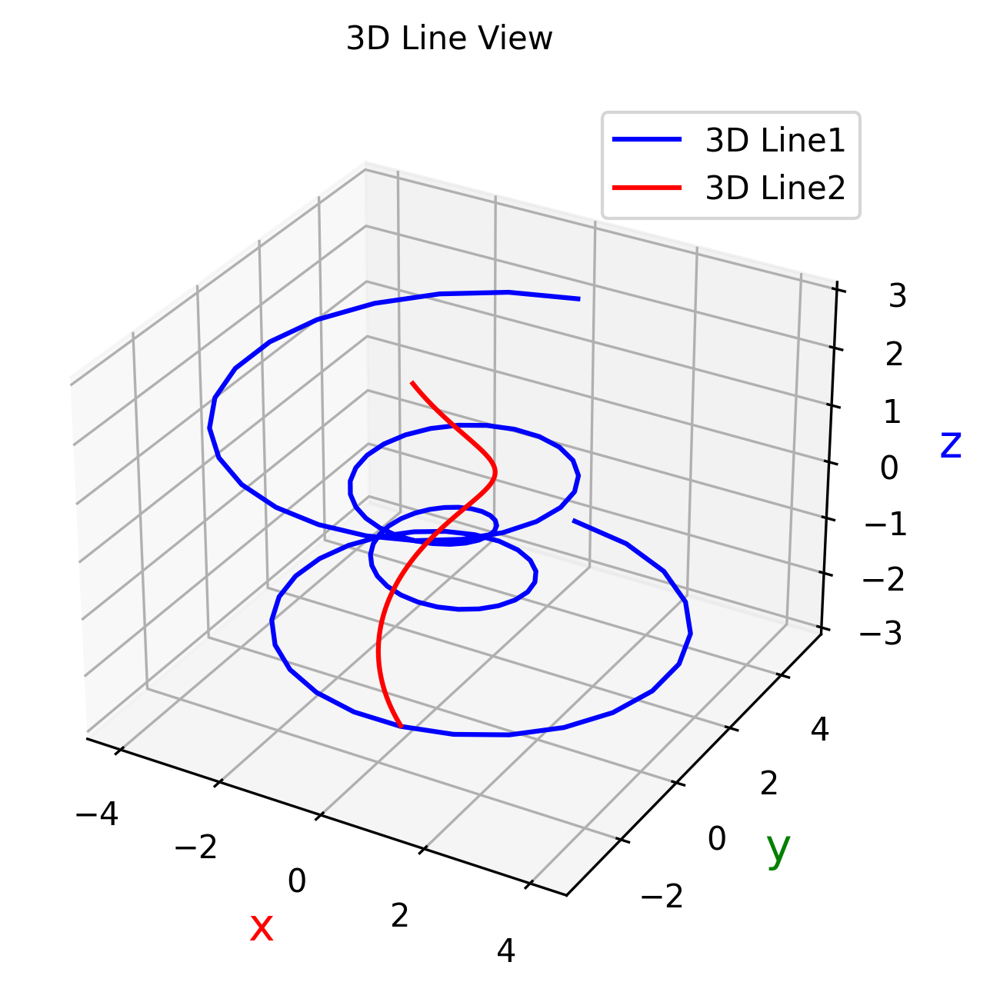
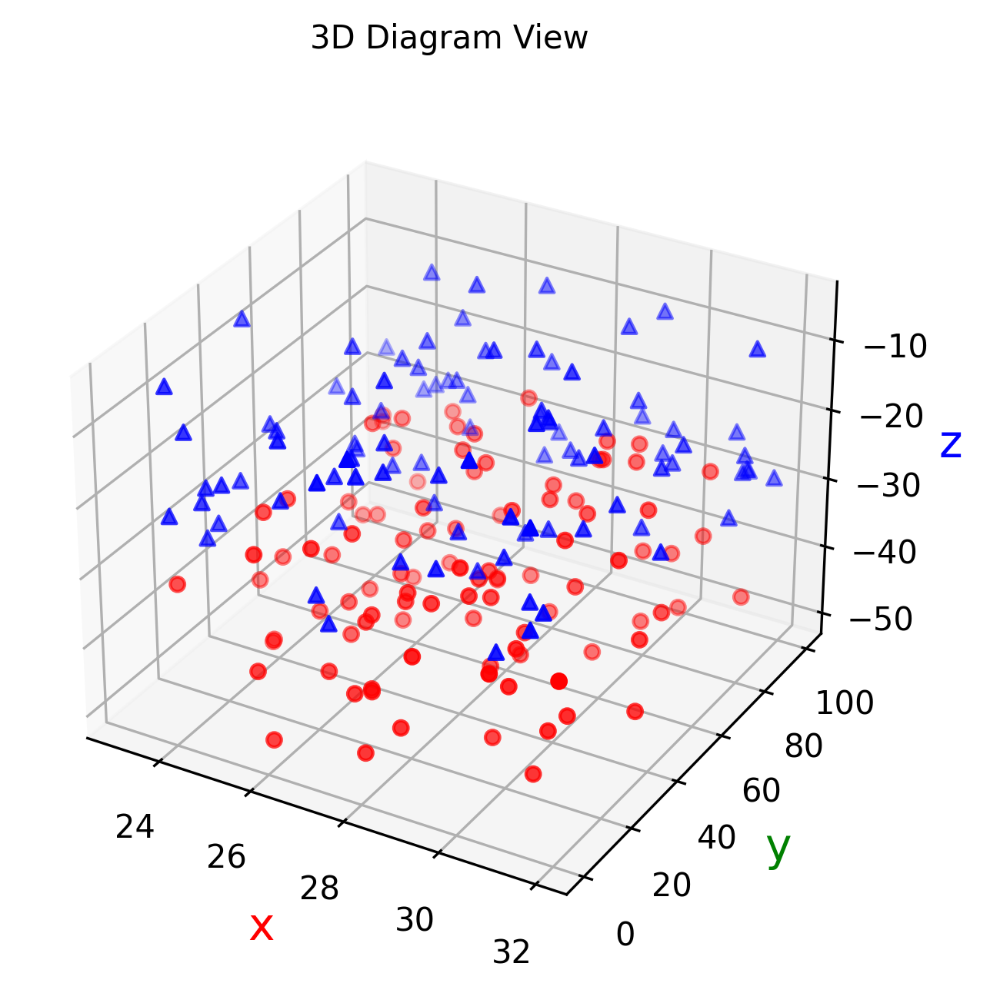

Python Matplotlib 3D<br />Matplotlib 绘制 3D 图形使用的是 mplot3d Toolkit，即 mplot3d 工具包。绘制 3D 图可以通过创建子图，然后指定 projection 参数 为 3d 即可，返回的 ax 为 Axes3D 对象。
<a name="dcfaab86"></a>
### 1、导包
```python
from matplotlib import cm
from matplotlib.ticker import LinearLocator, FormatStrFormatter
from mpl_toolkits.mplot3d import Axes3D
```
<a name="x7jBa"></a>
### 2、绘图过程
```python
import matplotlib.pyplot as plt
from matplotlib import cm
from matplotlib.ticker import LinearLocator, FormatStrFormatter
from mpl_toolkits.mplot3d import Axes3D
import numpy as np
fig = plt.figure()
# 指定图形类型是 3d 类型
ax = fig.add_subplot(projection='3d')
# 构造数据
X = np.arange(-5, 5, 0.25)
Y = np.arange(-5, 5, 0.25)
X, Y = np.meshgrid(X, Y)
R = np.sqrt(X**2 + Y**2)
Z = np.sin(R)
# Plot the surface.
surf = ax.plot_surface(X, Y, Z, cmap=cm.coolwarm,
                       linewidth=0, antialiased=False)
# Customize the z axis.
ax.set_zlim(-1.01, 1.01)
ax.zaxis.set_major_locator(LinearLocator(10))
ax.zaxis.set_major_formatter(FormatStrFormatter('%.02f'))
# Add a color bar which maps values to colors.
fig.colorbar(surf, shrink=0.5, aspect=5)
plt.savefig('outbox_legend.png', dpi=300, bbox_inches='tight', pad_inches=.1)
```
<a name="e2036be6"></a>
### 3、呈现效果

<a name="xfdUd"></a>
### 3D 帽子图
```python
import numpy as np
import matplotlib.pyplot as plt
from mpl_toolkits.mplot3d import Axes3D
fig = plt.figure()
# 指定图形类型为 3d 类型
ax = fig.add_subplot(111, projection='3d')
# X, Y value
X = np.arange(-5, 5, 0.25)
Y = np.arange(-5, 5, 0.25)
# 设置 x-y 平面的网格
X, Y = np.meshgrid(X, Y)
R = np.sqrt(X ** 2 + Y ** 2)
# height value
Z = np.sin(R)
# rstride:行之间的跨度  cstride:列之间的跨度
# rcount:设置间隔个数，默认50个，ccount:列的间隔个数  不能与上面两个参数同时出现
#vmax和vmin  颜色的最大值和最小值
ax.plot_surface(X, Y, Z, rstride=1, cstride=1, cmap=plt.get_cmap('rainbow'))
# zdir : 'z' | 'x' | 'y' 表示把等高线图投射到哪个面
# offset : 表示等高线图投射到指定页面的某个刻度
ax.contourf(X,Y,Z,zdir='z',offset=-2)
# 设置图像z轴的显示范围，x、y轴设置方式相同
ax.set_zlim(-2,2)
plt.savefig('outbox_legend.png', dpi=300, bbox_inches='tight', pad_inches=.1)
```

<a name="xABC7"></a>
### 3D 线性图
3D 线性图使用 Axes3D.plot来绘制。绘画的基本方法：`Axes3D.plot(xs, ys[, zs, zdir='z', *args, **kwargs])`
<a name="8oZRF"></a>
#### 参数说明
| 参数 | 描述 |
| --- | --- |
| xs | 一维数组，点的 x 轴坐标 |
| ys | 一维数组，点的 y 轴坐标 |
| zs | 一维数组，可选项，点的 z 轴坐标 |
| zdir | 可选项，在 3D 轴上绘制 2D 数据时，数据必须以 xs，ys 的形式传递，若此时将 zdir 设置为 ‘y’，数据将会被绘制到 x-z 轴平面上，默认为 ‘z’ |
| **kwargs | 其他关键字参数，可选项，可参见 matplotlib.axes.Axes.plot |

```python
import numpy as np
import matplotlib.pyplot as plt
from mpl_toolkits.mplot3d import Axes3D
# 依次获取画布和绘图区并创建 Axes3D 对象
fig = plt.figure()
ax = fig.gca(projection='3d')
# 第一条3D线性图数据
theta = np.linspace(-4 * np.pi, 4 * np.pi, 100)
z1 = np.linspace(-2, 2, 100)
r = z1**2 + 1
x1 = r * np.sin(theta)
y1 = r * np.cos(theta)
# 第二条3D线性图数据
z2 = np.linspace(-3, 3, 100)
x2 = np.sin(z2)
y2 = np.cos(z2)
# 绘制3D线性图
ax.plot(x1, y1, z1, color='b', label='3D Line1')
ax.plot(x2, y2, z2, color='r', label='3D Line2')
# 设置标题、轴标签、图例，也可以直接使用 plt.title、plt.xlabel、plt.legend...
ax.set_title('3D Line View', pad=15, fontsize='10')
ax.set_xlabel('x ', color='r', fontsize='14')
ax.set_ylabel('y ', color='g', fontsize='14')
ax.set_zlabel('z ', color='b', fontsize='14')
ax.legend()
plt.savefig('outbox_legend.png', dpi=300, bbox_inches='tight', pad_inches=.1)
```
<a name="luqSE"></a>
#### 结果显示

<a name="9DGgl"></a>
### 3D 散点图
绘制 3D 散点图的基本方法是：Axes3D.scatter(xs, ys[, zs=0, zdir='z', s=20, c=None, depthshade=True, *args, **kwargs])
<a name="Kokb8"></a>
#### 参数详解
| 参数 | 描述 |
| --- | --- |
| xs | 一维数组，点的 x 轴坐标 |
| ys | 一维数组，点的 y 轴坐标 |
| zs | 一维数组，可选项，点的 z 轴坐标 |
| zdir | 可选项，在 3D 轴上绘制 2D 数据时，数据必须以 xs，ys 的形式传递，若此时将 zdir 设置为 ‘y’，数据将会被绘制到 x-z 轴平面上，默认为 ‘z’ |
| s | 标量或数组类型，可选项，标记的大小，默认 20 |
| c | 标记的颜色，可选项，可以是单个颜色或者一个颜色列表支持英文颜色名称及其简写、十六进制颜色码等，更多颜色示例参见官网 Color Demo |
| depthshade | bool 值，可选项，默认 True，是否为散点标记着色以提供深度外观 |
| **kwargs | 其他关键字 |

```python
import matplotlib.pyplot as plt
import numpy as np
from mpl_toolkits.mplot3d import Axes3D
def randrange(n, vmin, vmax):
    return (vmax - vmin) * np.random.rand(n) + vmin
fig = plt.figure()
ax = fig.add_subplot(111, projection='3d')
n = 100
# For each set of style and range settings, plot n random points in the box
# defined by x in [23, 32], y in [0, 100], z in [zlow, zhigh].
for c, m, zlow, zhigh in [('r', 'o', -50, -25), ('b', '^', -30, -5)]:
    xs = randrange(n, 23, 32)
    ys = randrange(n, 0, 100)
    zs = randrange(n, zlow, zhigh)
    ax.scatter(xs, ys, zs, c=c, marker=m)
ax.set_title('3D Diagram View', pad=15, fontsize='10')
ax.set_xlabel('x ', color='r', fontsize='14')
ax.set_ylabel('y ', color='g', fontsize='14')
ax.set_zlabel('z ', color='b', fontsize='14')
plt.savefig('outbox_legend.png', dpi=300, bbox_inches='tight', pad_inches=.1)
```
<a name="bxZHP"></a>
#### 结果显示

