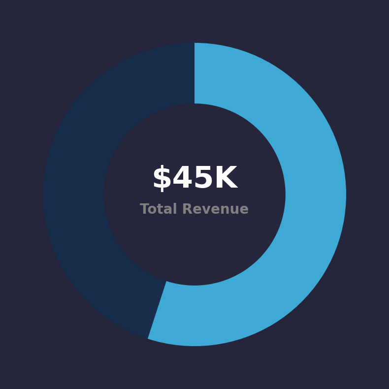
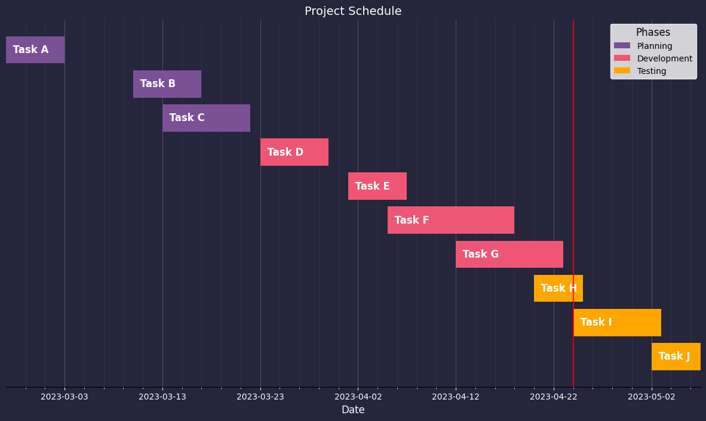
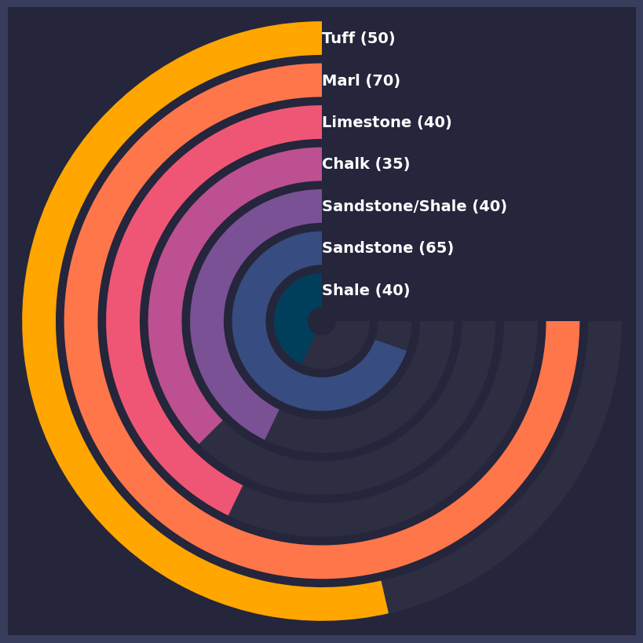

PythonMatplotlib<br />当谈论Python中的数据可视化，Matplotlib是一个不可或缺的库。它强大的功能和灵活性使我们能够以各种方式轻松地呈现数据。然而，有时候，可能会忽视Matplotlib在创建视觉上令人惊叹的图像方面的潜力。这里将探讨如何使用Matplotlib绘制出吸引人的、有趣的和美观的图像。
<a name="Pt86U"></a>
## 圆环图中间带有文字
可以在双层圆环图当中放置文字来代表关键的信息，例如整体的业绩指标，通过该图可以来显示目前已经达到的进度，代码如下
```python
import matplotlib.pyplot as plt
import pandas as pd
import numpy as np

actual_value = 45
target_value = 120
remaining_value = target_value - actual_value

colours = ['#3da9d4', '#063b63']

fig = plt.figure(figsize=(10,10), facecolor='#25253c')
ax = fig.add_subplot(1,1,1)

pie = ax.pie([55, 45], 
             colors=colours, 
             startangle=90, 
             labeldistance=1.15, 
             counterclock=False)

pie[0][1].set_alpha(0.4)

# 添加内圆环
centre_circle = plt.Circle((0, 0), 0.6, fc='#25253c')

# Adding the circles to the chart
fig.gca().add_artist(centre_circle)

# 添加文字
centre_text = f'${actual_value}K'
centre_text_line_2 = f'Total Revenue'

ax.text(0,0.1, centre_text, horizontalalignment='center', 
        verticalalignment='center', 
        fontsize=44, fontweight='bold',
        color='white')
ax.text(0,-0.1, centre_text_line_2, horizontalalignment='center', 
        verticalalignment='center', 
        fontsize=20, fontweight='bold',
        color='grey')

plt.show()
```
output<br /><br />从上面出来的结果中可以看到整个圆环代表的是整体的目标，也就是45K的整体业绩指标，可以看到直观的看到目前所处的进度，即55%，以及还未完成的部分，即45%。圆环中间也可以添加文字，来更加直观对整个图表做一个说明
<a name="esHOl"></a>
## 甘特图
甘特图基本上是应用在项目管理当中，提供关于项目进度的相关内容，包括了

- 哪些项目是已经完成了的
- 哪些项目还未完成，当下的进度是如何
- 项目原定计划的周期
- 等等

当然除了Matplotlib之外还有其他的模块也能够来绘制甘特图。<br />而用Matplotlib模块绘制甘特图的详细的代码如下
```python
import datetime
import matplotlib.pyplot as plt
from matplotlib.dates import datestr2num, DateFormatter, DayLocator
from matplotlib.ticker import AutoMinorLocator
from matplotlib.patches import Patch

# 创建假数据
tasks = ['Task A', 'Task B', 'Task C', 'Task D', 'Task E', 'Task F', 'Task G', 'Task H', 'Task I', 'Task J']
start_dates = ['2023-02-25', '2023-03-10', '2023-03-13', '2023-03-23', '2023-04-01', '2023-04-05', '2023-04-12', '2023-04-20', '2023-04-24', '2023-05-02']
end_dates = ['2023-03-03', '2023-03-17', '2023-03-22', '2023-03-30', '2023-04-07', '2023-04-18', '2023-04-23', '2023-04-25', '2023-05-03', '2023-05-07']

# 创建项目的开始与结束时间
start_dates = [datestr2num(d) for d in start_dates]
end_dates = [datestr2num(d) for d in end_dates]

durations = [(end - start) for start, end in zip(start_dates, end_dates)]

fig, ax = plt.subplots(figsize=(15, 8), facecolor='#25253c')

ax.set_facecolor('#25253c')

# 根据类目的不同来设定不同的颜色
colors = ['#7a5195', '#ef5675', '#ffa600'] 
task_colors = [colors[0]] * 3 + [colors[1]] * 4 + [colors[2]] * 3

# 展示柱状图
ax.barh(y=tasks, width=durations, left=start_dates, 
        height=0.8, color=task_colors)

ax.invert_yaxis()

# X轴的坐标
ax.set_xlim(start_dates[0], end_dates[-1])

date_form = DateFormatter("%Y-%m-%d")
ax.xaxis.set_major_formatter(date_form)

ax.xaxis.set_major_locator(DayLocator(interval=10))
ax.xaxis.set_minor_locator(AutoMinorLocator(5))
ax.tick_params(axis='x', which='minor', length=2, color='white', labelsize=6)

ax.get_yaxis().set_visible(False)


ax.grid(True, axis='x', linestyle='-', color='#FFFFFF', alpha=0.2, which='major')
ax.grid(True, axis='x', linestyle='-', color='#FFFFFF', alpha=0.05, which='minor')
ax.set_axisbelow(True)

# 给每一个任务添加注释
for i, task in enumerate(tasks):
    ax.text(start_dates[i], i, f'  {task}', ha='left', va='center', color='white', fontsize=12, fontweight='bold')

# 添加时间轴
today = datetime.datetime.now().strftime("%Y-%m-%d")
today_num = datestr2num(today)
ax.axvline(today_num, color='red', alpha=0.8)

# X轴的注释和标题设置
ax.tick_params(axis='both', colors='white')

ax.set_xlabel('Date', color='white', fontsize=12)
ax.set_title('Project Schedule', color='white', fontsize=14)

# 横轴和纵轴隐藏
ax.spines['left'].set_visible(False)
ax.spines['top'].set_visible(False)
ax.spines['right'].set_visible(False)

# 分类标注出来
legend_elements = [
    Patch(facecolor=colors[0], label='Planning'),
    Patch(facecolor=colors[1], label='Development'),
    Patch(facecolor=colors[2], label='Testing'),
]

# 添加注释
ax.legend(handles=legend_elements, loc='upper right', 
          facecolor='white', 
          edgecolor='white', 
          fontsize=10, title='Phases', title_fontsize=12, frameon=True)

plt.show()
```
output<br /><br />从结果中可以看到每条任务的开始与结束的时间，以及所处的不同的状态，**有计划中的任务、开发中的任务以及测试中的任务等等**，基于当下的时间正处于哪项任务。
<a name="gHHS5"></a>
## 环状条形图
最后介绍一下环状条形图，整体效果会更加的惊艳，但是可读性和前面二者相比可能会稍差一些，代码如下
```python
import matplotlib.pyplot as plt
import pandas as pd
import numpy as np

# 创建假数据
lith_dict = {'LITH': ['Shale', 'Sandstone', 
                      'Sandstone/Shale', 'Chalk', 
                      'Limestone', 'Marl', 'Tuff'],
             'PERCENTAGE': [40,65, 40, 35, 
                            40, 70, 50]}
# 变成DataFrame格式
df = pd.DataFrame.from_dict(lith_dict)

max_value_full_ring = max(df['PERCENTAGE'])

ring_colours = ['#003f5c', '#374c80', '#7a5195','#bc5090',
                '#ef5675','#ff764a','#ffa600']

ring_labels =  [f'{x} ({v})' for x, v in zip(list(df['LITH']), 
                                             list(df['PERCENTAGE']))]
data_len = len(df)
# 创建一个画布出来
fig = plt.figure(figsize=(10,10), facecolor='#393d5c')

rect = [0.1,0.1,0.8,0.8]

ax_cart = fig.add_axes(rect, facecolor='#25253c')
ax_cart.spines[['right', 'top', 'left', 'bottom']].set_visible(False)
ax_cart.tick_params(axis='both', left=False, bottom=False, 
                    labelbottom=False, labelleft=False)

ax_polar_bg = fig.add_axes(rect, polar=True, frameon=False)
ax_polar_bg.set_theta_zero_location('N')
ax_polar_bg.set_theta_direction(1)

for i in range(data_len):
    ax_polar_bg.barh(i, max_value_full_ring*1.5*np.pi/max_value_full_ring, 
                     color='grey', 
                     alpha=0.1)
# 隐藏掉所有的横轴纵轴
ax_polar_bg.axis('off')

ax_polar = fig.add_axes(rect, polar=True, frameon=False)
ax_polar.set_theta_zero_location('N')
ax_polar.set_theta_direction(1)
ax_polar.set_rgrids([0, 1, 2, 3, 4, 5, 6], 
                    labels=ring_labels, 
                    angle=0, 
                    fontsize=14, fontweight='bold',
                    color='white', verticalalignment='center')

# 遍历所有的数据，然后绘制柱状图
for i in range(data_len):
    ax_polar.barh(i, list(df['PERCENTAGE'])[i]*1.5*np.pi/max_value_full_ring, 
                  color=ring_colours[i])

ax_polar.grid(False)
ax_polar.tick_params(axis='both', left=False, bottom=False, 
                     labelbottom=False, labelleft=True)

plt.show()
```
output<br /><br />总之，Matplotlib不仅仅是一个功能强大的数据可视化库，它还可以作为一个有趣的工具，在图像设计和艺术创作中发挥想象力。当然，这里展示的只是冰山一角。Matplotlib的潜力远不止于此，可以深入挖掘它的功能，尝试更多有趣和创新的设计。
