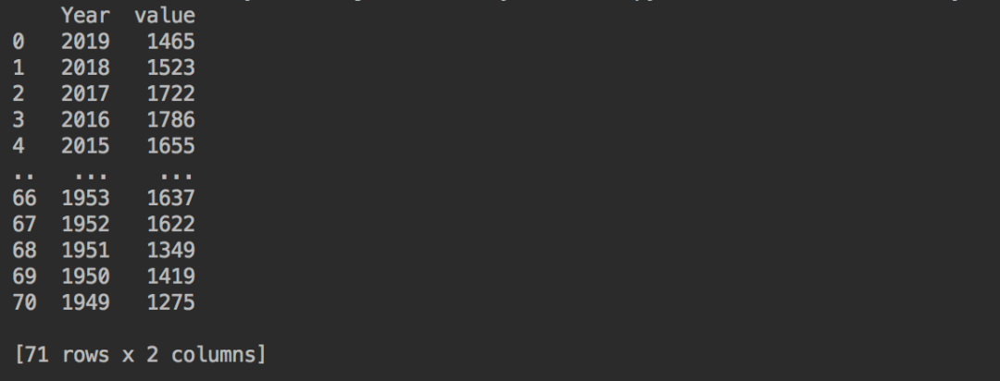
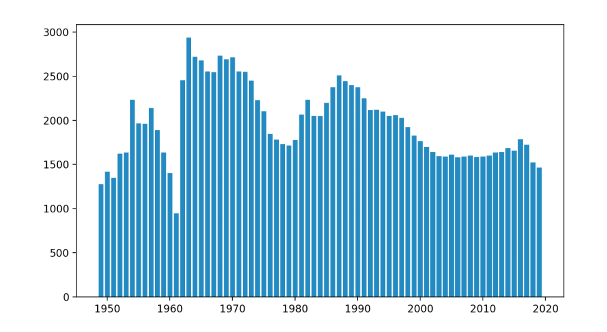
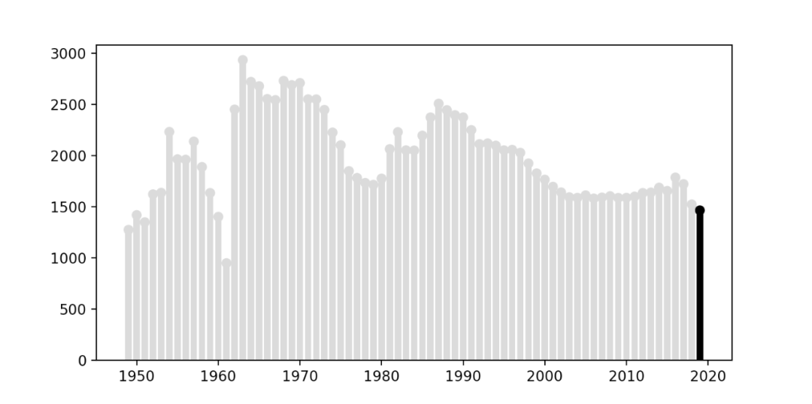
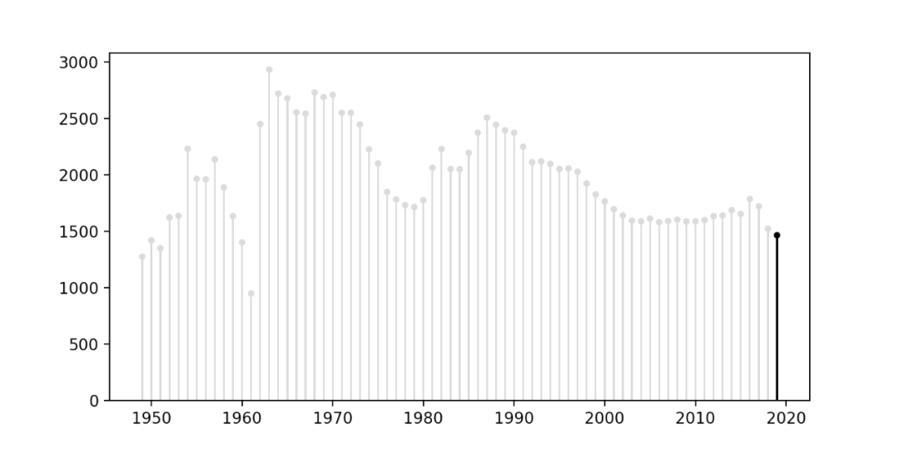
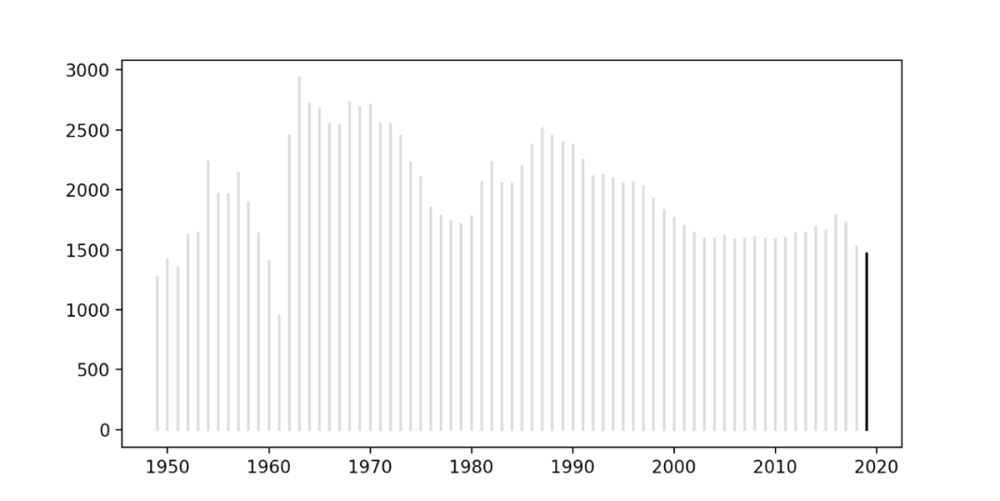
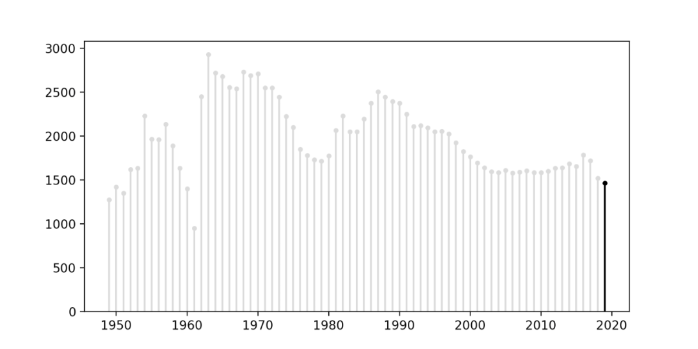
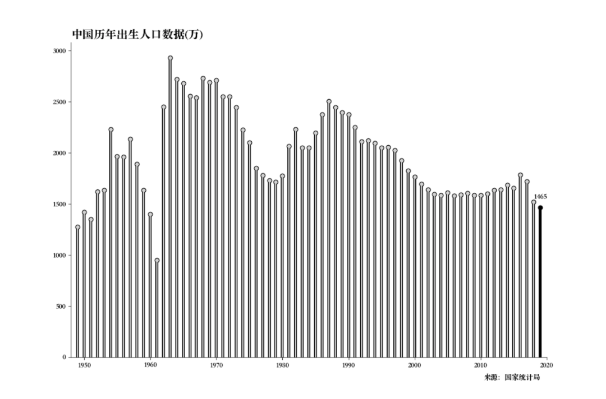
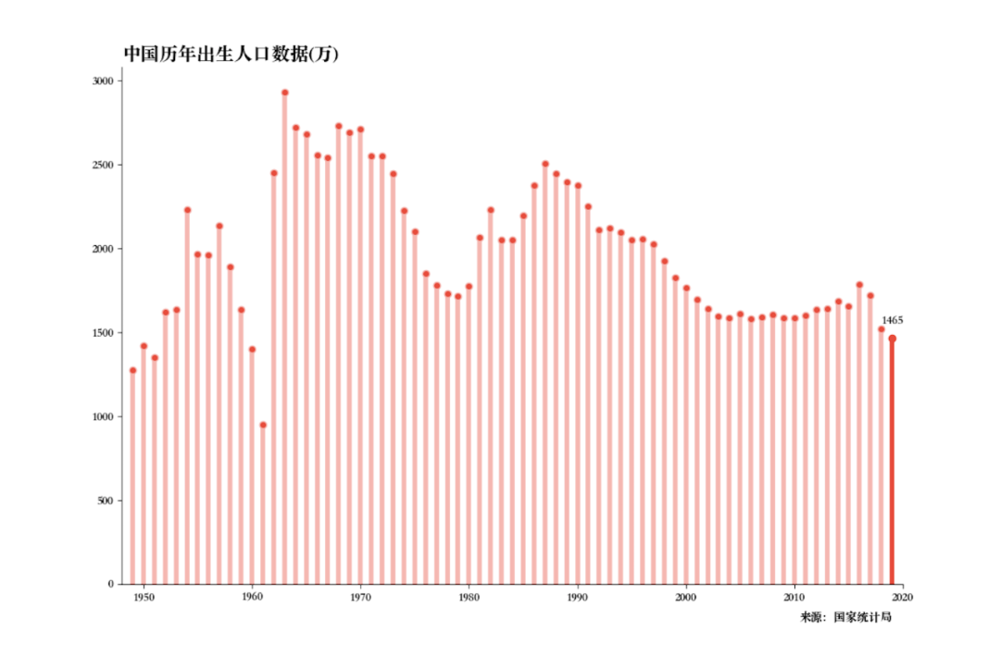

Python Matplotlib<br />条形图在数据可视化里，是一个经常被使用到的图表。<br />虽然很好用，也还是存在着缺陷呢。比如条形图条目太多时，会显得臃肿，不够直观。<br />**棒棒糖图表**则是对条形图的改进，以一种小清新的设计，清晰明了表达了我们的数据。<br />这里介绍一下，如何使用Python绘制棒棒糖图表。<br />使用到的是我国1949到2019年，历年的出生人口数据，数据来源国家统计局。<br />首先读取一下数据。
```python
import pandas as pd
import matplotlib.pyplot as plt

# 读取数据
df = pd.read_csv('data.csv')
print(df)
```
结果如下。<br /><br />数据集很简单，每行都只有一个年份和一个值。<br />先绘制一个带有每年数值的条形图。
```python
# 绘制柱状图
plt.bar(df.Year, df.value)
plt.show()
```
两行代码，即可得到一张条形图图表，看起来确实是有点拥挤。<br /><br />下面将最后一年，即2019年的数据区分出来。<br />给2019年的条形着色为黑色，其他年份为浅灰色。<br />并且在图表中添加散点图，可在条形图的顶部绘制圆形。
```python
# 新建画布
fig, ax = plt.subplots(1, figsize=(12, 8))

# 年份数
n = len(df)
# 颜色设置
colors = ['black'] + ((n-1)*['lightgrey'])
plt.bar(df.Year, df.value, color=colors)
plt.scatter(df.Year, df.value, color=colors)
plt.show()
```
得到结果如下。<br /><br />颜色已经修改成功，还需要调整一下条形图的宽度以及顶部圆圈的大小。
```python
# width: 条形图宽度  s: 散点图圆圈大小
plt.bar(df.Year, df.value, color=colors, width=0.2)
plt.scatter(df.Year, df.value, color=colors, s=10)
plt.show()
```
结果如下。<br /><br />比起先前的蓝色条形图图表，棒棒糖图表确实是好看了不少。<br />除了用条形图来绘制棒棒糖图表，还可以使用线条，这样整体的宽度会更加一致。<br />X将Year(年份)数据作为起点和终点，Y以-20和各年份数据作为起点和终点。
```python
import pandas as pd
import matplotlib.pyplot as plt

# 读取数据
df = pd.read_csv('data.csv')
print(df)

# 新建画布
fig, ax = plt.subplots(1, figsize=(12, 8))

# 年份数
n = len(df)
# 颜色设置
colors = ['black'] + ((n-1)*['lightgrey'])
# 使用线条
for idx, val in df.iterrows():
    plt.plot([val.Year, val.Year],
             [-20, val.value],
             color=colors[idx])
plt.show()
```
得到结果如下。<br /><br />可以使用参数标记在两端绘制圆，而不是只在顶部生成散点图。<br />然后可以通过更改y-limit参数来隐藏最底端的圆。
```python
# 新建画布
fig, ax = plt.subplots(1, figsize=(12, 8))

# 年份数
n = len(df)
# 颜色设置
colors = ['black'] + ((n-1)*['lightgrey'])
# 使用线条, markersize设置标记点大小
for idx, val in df.iterrows():
    plt.plot([val.Year, val.Year],
             [-20, val.value],
             color=colors[idx],
             marker='o',
             markersize=3)

# 设置y轴最低值
plt.ylim(0,)
plt.show()
```
结果如下。<br /><br />此外还可以调整`lw`、`markersize`参数，定义线条的粗细及标记的大小，甚至可以绘制两次线条以创建轮廓效果。
```python
# 新建画布
fig, ax = plt.subplots(1, figsize=(12, 8))
color = 'b'

# 年份数
n = len(df)
# 颜色设置
colors = ['black'] + ((n-1)*['lightgrey'])
# 使用线条
for idx, val in df.iterrows():
    plt.plot([val.Year, val.Year],
             [-20, val.value],
             color='black',
             marker='o',
             lw=4,
             markersize=6)
    plt.plot([val.Year, val.Year],
             [-20, val.value],
             color=colors[idx],
             marker='o',
             markersize=4)

# 移除上边框、右边框
ax.spines['right'].set_visible(False)
ax.spines['top'].set_visible(False)

# 设置x、y轴范围
plt.xlim(1948, 2020)
plt.ylim(0,)

# 中文显示
plt.rcParams['font.sans-serif'] = ['Songti SC']

plt.title('中国历年出生人口数据(万)', loc='left', fontsize=16)
plt.text(2019, -220, '来源：国家统计局', ha='right')

# 2019年出生人口数(显示)
value_2019 = df[df['Year'] == 2019].value.values[0]
plt.text(2019, value_2019+80, value_2019, ha='center')

# 保存图片
plt.savefig('chart.png')
```
得到结果如下。<br /><br />黑色不是特别好看，改个颜色看看。
```python
# 新建画布
fig, ax = plt.subplots(1, figsize=(12, 8))

# 年份数
n = len(df)
# 颜色设置
color = 'b'
colors = ['#E74C3C'] + ((len(df)-1)*['#F5B7B1'])
# 使用线条
for idx, val in df.iterrows():
    plt.plot([val.Year, val.Year],
             [-20, val.value],
             color=colors[idx],
             marker='o',
             lw=4,
             markersize=6,
             markerfacecolor='#E74C3C')

# 移除上边框、右边框
ax.spines['right'].set_visible(False)
ax.spines['top'].set_visible(False)

# 设置x、y轴范围
plt.xlim(1948, 2020)
plt.ylim(0,)

# 中文显示
plt.rcParams['font.sans-serif'] = ['Songti SC']

plt.title('中国历年出生人口数据(万)', loc='left', fontsize=16)
plt.text(2019, -220, '来源：国家统计局', ha='right')

# 2019年出生人口数(显示)
value_2019 = df[df['Year'] == 2019].value.values[0]
plt.text(2019, value_2019+80, value_2019, ha='center')

# 保存图片
plt.savefig('chart.png')
```
得到结果如下。<br /><br />现在对于条形图，就有了另外一个选择，即棒棒糖图表。
