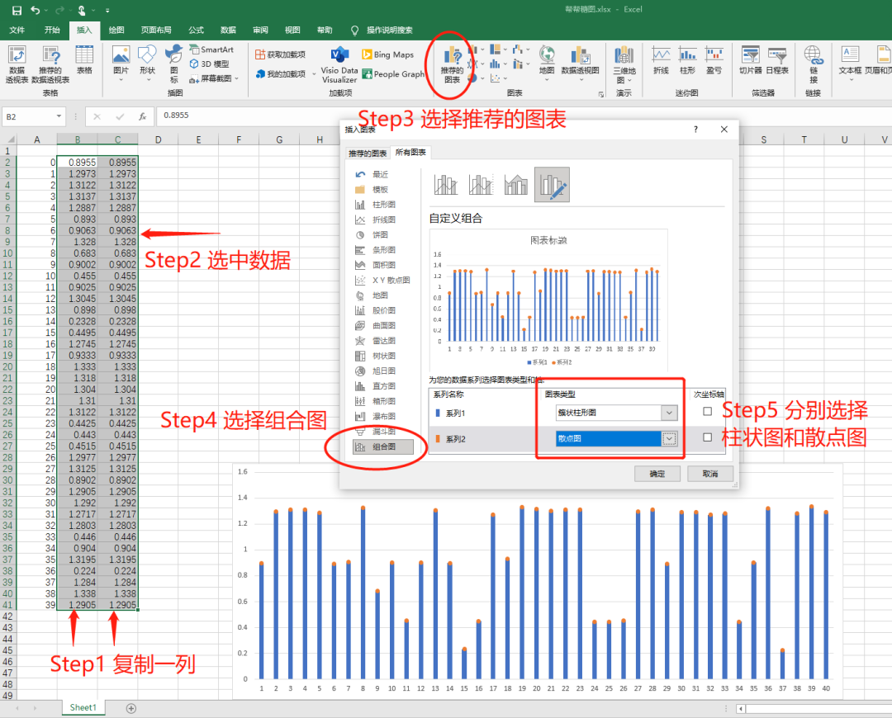

Python Matplotlib 可视化
<a name="QP8nw"></a>
## Excel绘制棒棒糖图
首先是数据准备，首先将原始数据复制一列，得到两列一样的数据。<br />选择数据，插入组合图，分别设置柱状图和散点图的组合图表，确认后既可以得到初步的棒棒糖图。<br /><br />可根据需要设置相应的样式：<br /><br />其中设置x轴的位置相对较复杂些。<br />首先选中y轴，右击再点击设置坐标轴格式，接下来分别设置横坐标轴位置及横坐标轴标签。设置x坐标轴值为0.8，或者需要的轴。设置x坐标轴标签在图的底部。<br />结果得到如下样式。<br /><br />当然，可以设置条形和散点的样式，如颜色形状等。也可以单独选中某条柱状图和散点标志的样式，以突出某个或某些值。<br />
<a name="BoEFM"></a>
## Python绘制棒棒糖图
<a name="FMi2a"></a>
### Bar+Scatter组合法
第一种方法，和Excel思路一样，运用条形图（`plt.bar`）和散点图（`plt.scatter`）组合绘制。如果想要不同的样式，可以分别设置条形图和散点图的样式，来改变整体样式。
```python
n = len(values)
colors1 = ["red"]+((n-1)*["olive"])
colors2 = ["red"]+((n-1)*["blue"])
plt.rcParams['figure.figsize'] = (23.5, 10)  
plt.bar(values.index, values.values, 
        color=colors1, # 设置线条颜色
        width=0.05)    # 设置线条宽度
plt.scatter(values.index, values.values, 
            color=colors2,# 设置标记点宽度
            s=50)         # 设置标记点大小
plt.show()
```

<a name="O5ZeI"></a>
#### 设置样式
这一步主要实现将X轴向上移动。

- 将所有y值加上一个固定值v（负数）：`y = y+v`
- 并且设置y轴的下限为该固定值v ：`plt.ylim(v, 0.6)`

绘制一条横线

- 通过绘制折线的方法绘制一条基线，并固定 `y=0`<br />`plt.plot(values.index, [0]*n)`
- 或直接用直线函数绘制基线，同样设置 `y=0`<br />`plt.axhline(y=0, xmin=0, xmax=1）`
- 上面两种方法均可以绘制直线图，第二种方法的缺点是在设置直线两个端点时，不太好把控，因为`xmin`和`xmax`设置的值在0～1之间的比例值。而第二种方法可以直接设置折线两端点值。
```python
plt.style.use('ggplot')
# plt.style.use('dark_background') # 设置黑色背景
plt.rcParams['figure.figsize'] = (23.5, 10)  
plt.rcParams['axes.unicode_minus'] = False
v = -0.8
plt.bar(values.index, values.values+v, 
        color=colors1,width=0.05)
plt.scatter(values.index, values.values+v, 
            color=colors2,s=60)
# plt.plot(values.index,[0]*n,color='darkblue')
plt.axhline(y=0,xmin=0.045, xmax=0.955, 
            color='darkblue' , 
            linestyle='--')
plt.ylim(v,0.6)
plt.show()
```

<a name="hXViZ"></a>
### Stem 函数法
在python中，利用`matplotlib.pyplot.stem`可以直接绘制棒棒糖图（茎叶图）。这个函数只需要一行代码就能绘制棒棒糖图。下面来看看该神奇的`plt.stem()`的主要参数。<br />`stem(x,y, linefmt=None, markerfmt=None, basefmt=None)`<br />`x : array-like, optional`<br />数据x轴<br />`y : array-like`<br />数据y轴<br />`linefmt : str, optional`<br />可以使用颜色和线型来设置垂直线的颜色和类型，如`'r-'`，代表红色的实线。<br />`markerfmt : str, optional`<br />设置顶点的类型和颜色，默认值:`'C0o'`，`C`(大写字母C)是默认的，后面数字应该是0-9，改变颜色，最后的`.`或者`o`（小写字母o）分别可以设置顶点为小实点或者大实点。<br />`basefmt : str, default: 'C3-' ('C2-' in classic mode)`<br />定义基线属性的格式字符串。就是y=0的那条线<br />从参数来看，使用其参数设置颜色，只能选用该函数设定好了的颜色圈内的0-9号颜色。如果想要设置其他颜色，可以利用`plt.setp`来设置线条样式。
```python
n = len(values2)
colors1 = ["red"]+((n-1)*["olive"])
(markers, stemlines, baseline) = plt.stem(values2, markerfmt="C0o")
plt.setp(stemlines, 
         linestyle="-", 
         color=colors1, 
         linewidth=0.5 )  # 指定每行的属性
plt.setp(baseline, 
         linestyle="--", 
         color="darkblue", 
         linewidth=2 )
plt.show()
```
<br />通过设置参数`bottom=0.8`来调整基线位置，并设置背景样式。
```python
plt.style.use('dark_background') 
plt.grid(0)
(markers, stemlines, baseline) = plt.stem(values2, 
                                          bottom=0.8,
                                          markerfmt="C3o")
plt.setp(stemlines, linestyle="-", 
         color="y", linewidth=2 )  
plt.show()
```


---

最后看下当数据量超多的时候，绘制棒棒糖图的效果。<br /><br />
