Python Matplotlib<br />数据可视化非常重要，因为错误或不充分的数据表示方法可能会毁掉原本很出色的数据分析工作。<br />matplotlib 库是专门用于开发2D图表（包括3D图表）的，突出优点：

- 使用起来极为简单。
- 以渐进、交互式方式实现数据可视化。
- 表达式和文本使用LaTeX排版。
- 对图像元素控制力强。
- 可输出PNG、PDF、SVG和EPS等多种格式。
<a name="VvpFp"></a>
## 安装Matplotlib库
```bash
conda install matplotlib
```
或者
```bash
pip install matplotlib
```
<a name="0rW0Z"></a>
## matplotlib 架构
matplotlib 的主要任务之一，就是提供一套表示和操作图形对象（主要对象）以及它的内部对象的函数和工具。其不仅可以处理图形，还提供事件处理工具，具有为图形添加动画效果的能力。有了这些附加功能，matplotlib 就能生成以键盘按键或鼠标移动触发的事件的交互式图表。<br />从逻辑上来讲，matplotlib 的整体架构为3层，各层之间单向通信：

- Scripting （脚本）层。
- Artist （表现）层。
- Backend （后端）层。
<a name="huqFY"></a>
## 一、matplotlib的基本用法
```python
import numpy as np
import matplotlib.pyplot as plt

x = np.linspace(-np.pi, np.pi, 30) # 在区间内生成30个等差数
y = np.sin(x)
print('x = ', x)
print('y = ', y)
```
输出：
```java
x =  [-3.14159265 -2.92493109 -2.70826953 -2.49160797 -2.2749464  -2.05828484
 -1.84162328 -1.62496172 -1.40830016 -1.19163859 -0.97497703 -0.75831547
 -0.54165391 -0.32499234 -0.10833078  0.10833078  0.32499234  0.54165391
  0.75831547  0.97497703  1.19163859  1.40830016  1.62496172  1.84162328
  2.05828484  2.2749464   2.49160797  2.70826953  2.92493109  3.14159265]
y =  [-1.22464680e-16 -2.14970440e-01 -4.19889102e-01 -6.05174215e-01
 -7.62162055e-01 -8.83512044e-01 -9.63549993e-01 -9.98533414e-01
 -9.86826523e-01 -9.28976720e-01 -8.27688998e-01 -6.87699459e-01
 -5.15553857e-01 -3.19301530e-01 -1.08119018e-01  1.08119018e-01
  3.19301530e-01  5.15553857e-01  6.87699459e-01  8.27688998e-01
  9.28976720e-01  9.86826523e-01  9.98533414e-01  9.63549993e-01
  8.83512044e-01  7.62162055e-01  6.05174215e-01  4.19889102e-01
  2.14970440e-01  1.22464680e-16]
```
<a name="uQ5PY"></a>
### 画一条曲线
```python
plt.figure() # 创建一个新的窗口
plt.plot(x, y) # 画一个x与y相关的曲线
plt.savefig('outbox_legend.png', dpi = 300, bbox_inches = 'tight', pad_inches = .1)
```
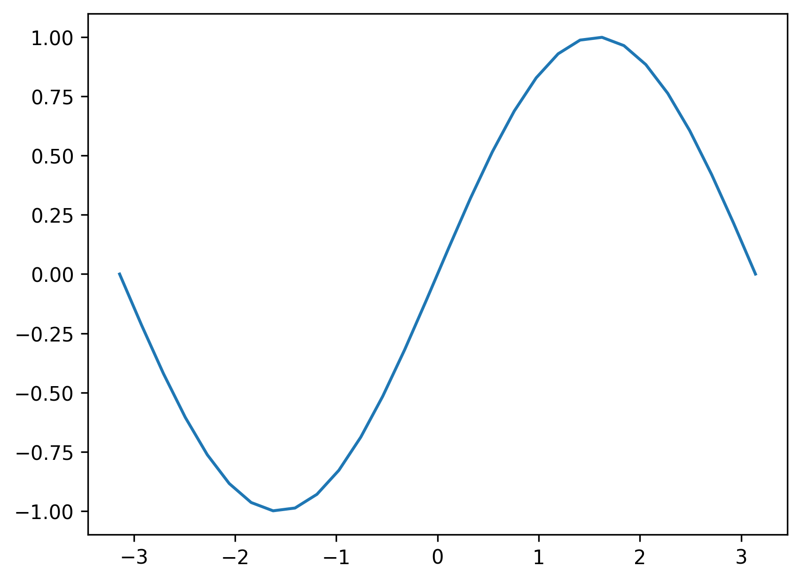<br />画多条曲线以及添加坐标轴和标签
```python
import numpy as np
import matplotlib.pyplot as plt

x = np.linspace(-np.pi, np.pi, 100) # 在区间内生成21个等差数
y = np.sin(x)
linear_y = 0.2 * x + 0.1

plt.figure(figsize = (8, 6)) # 自定义窗口的大小

plt.plot(x, y)
plt.plot(x, linear_y, color = "red", linestyle = '--') # 自定义颜色和表示方式

plt.title('y = sin(x) and y = 0.2x + 0.1') # 定义该曲线的标题
plt.xlabel('x') # 定义横轴标签
plt.ylabel('y') # 定义纵轴标签

plt.savefig('outbox_legend.png', dpi = 300, bbox_inches = 'tight', pad_inches = .1)
```
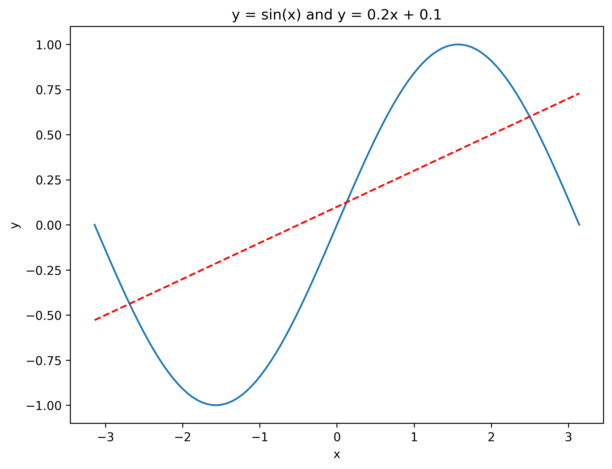
<a name="Cl5bv"></a>
### 指定坐标范围 and 设置坐标轴刻度
```python
import numpy as np
import matplotlib.pyplot as plt

x = np.linspace(-np.pi, np.pi, 100) # 在区间内生成21个等差数
y = np.sin(x)
linear_y = 0.2 * x + 0.1

plt.figure(figsize = (8, 6)) # 自定义窗口的大小

plt.plot(x, y)
plt.plot(x, linear_y, color = "red", linestyle = '--') # 自定义颜色和表示方式

plt.title('y = sin(x) and y = 0.2x + 0.1') # 定义该曲线的标题
plt.xlabel('x') # 定义横轴标签
plt.ylabel('y') # 定义纵轴标签
plt.xlim(-np.pi, np.pi)
plt.ylim(-1, 1)

# 重新设置x轴的刻度
# plt.xticks(np.linspace(-np.pi, np.pi, 5))
x_value_range = np.linspace(-np.pi, np.pi, 5)
x_value_strs = [r'$\pi$', r'$-\frac{\pi}{2}$', r'$0$', r'$\frac{\pi}{2}$', r'$\pi$']
plt.xticks(x_value_range, x_value_strs)
plt.savefig('outbox_legend.png', dpi = 300, bbox_inches = 'tight', pad_inches = .1)
```
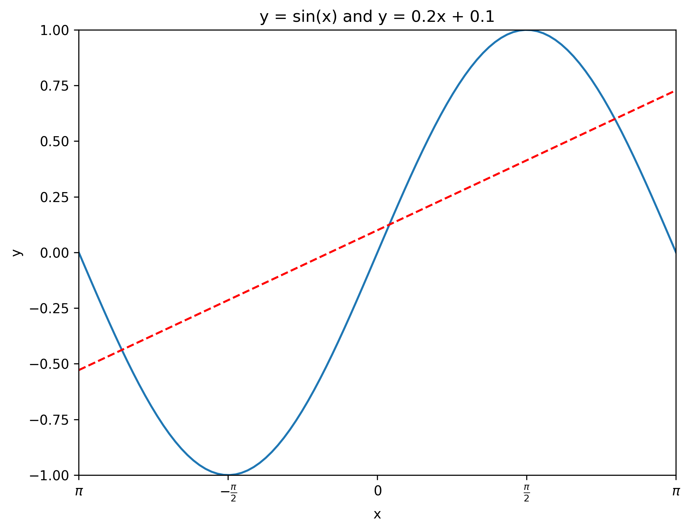
<a name="lKIwX"></a>
### 定义原点在中心的坐标轴
```python
import numpy as np
import matplotlib.pyplot as plt

x = np.linspace(-np.pi, np.pi, 100)
y = np.sin(x)
linear_y = 0.2 * x + 0.1

plt.figure(figsize = (8, 6)) 

plt.plot(x, y)
plt.plot(x, linear_y, color = "red", linestyle = '--') 

plt.title('y = sin(x) and y = 0.2x + 0.1')
plt.xlabel('x') 
plt.ylabel('y') 
plt.xlim(-np.pi, np.pi)
plt.ylim(-1, 1)

# plt.xticks(np.linspace(-np.pi, np.pi, 5))
x_value_range = np.linspace(-np.pi, np.pi, 5)
x_value_strs = [r'$\pi$', r'$-\frac{\pi}{2}$', r'$0$', r'$\frac{\pi}{2}$', r'$\pi$']
plt.xticks(x_value_range, x_value_strs)

ax = plt.gca() # 获取坐标轴
ax.spines['right'].set_color('none') # 隐藏上方和右方的坐标轴
ax.spines['top'].set_color('none')

# 设置左方和下方坐标轴的位置
ax.spines['bottom'].set_position(('data', 0)) # 将下方的坐标轴设置到y = 0的位置
ax.spines['left'].set_position(('data', 0)) # 将左方的坐标轴设置到 x = 0 的位置

# plt.show() # 显示图像
# 保存图像
plt.savefig('outbox_legend.png', dpi = 300, bbox_inches = 'tight', pad_inches = .1)
```
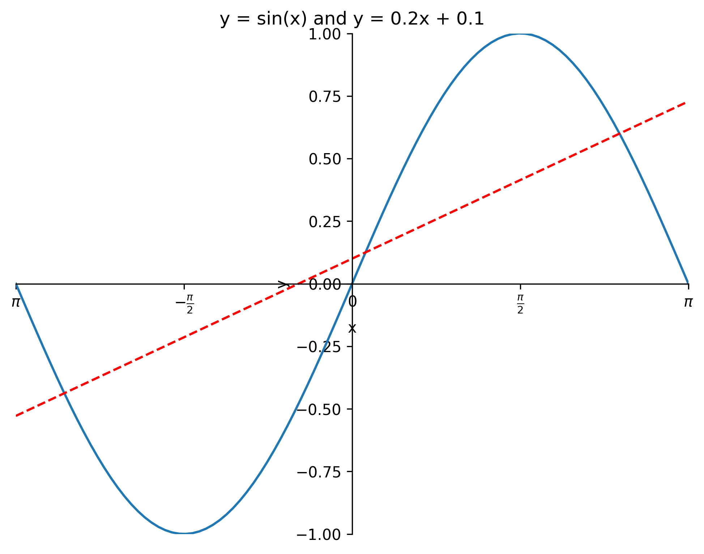
<a name="25uGs"></a>
### `legend`图例
使用`xticks()`和`yticks()`函数替换轴标签，分别为每个函数传入两列数值。第一个列表存储刻度的位置，第二个列表存储刻度的标签。
```python
import numpy as np
import matplotlib.pyplot as plt

x = np.linspace(-np.pi, np.pi, 100)
y = np.sin(x)
linear_y = 0.2 * x + 0.1

plt.figure(figsize = (8, 6)) 

# 为曲线加上标签
plt.plot(x, y, label = "y = sin(x)")
plt.plot(x, linear_y, color = "red", linestyle = '--', label = 'y = 0.2x + 0.1') 

plt.title('y = sin(x) and y = 0.2x + 0.1')
plt.xlabel('x') 
plt.ylabel('y') 
plt.xlim(-np.pi, np.pi)
plt.ylim(-1, 1)

# plt.xticks(np.linspace(-np.pi, np.pi, 5))
x_value_range = np.linspace(-np.pi, np.pi, 5)
x_value_strs = [r'$\pi$', r'$-\frac{\pi}{2}$', r'$0$', r'$\frac{\pi}{2}$', r'$\pi$']
plt.xticks(x_value_range, x_value_strs)

ax = plt.gca() 
ax.spines['right'].set_color('none')
ax.spines['top'].set_color('none')


ax.spines['bottom'].set_position(('data', 0)) 
ax.spines['left'].set_position(('data', 0)) 

# 将曲线的信息标识出来
plt.legend(loc = 'lower right', fontsize = 12)
plt.savefig('outbox_legend.png', dpi = 300, bbox_inches = 'tight', pad_inches = .1)
```
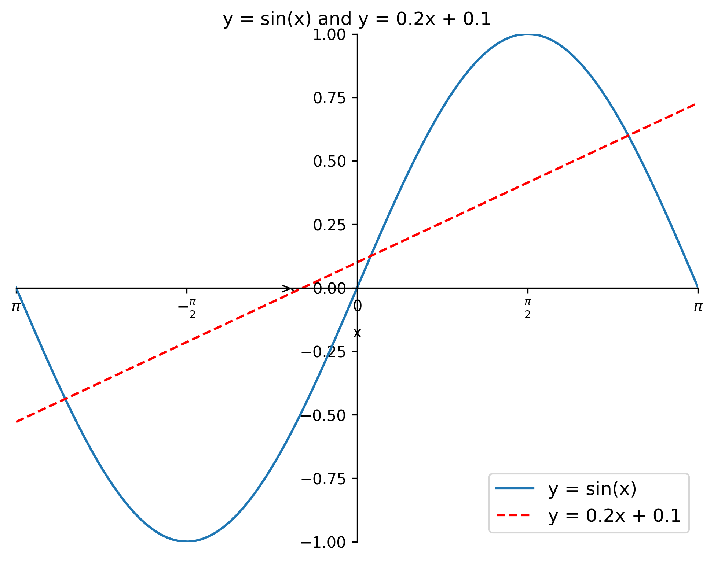<br />`legend`方法中的`loc` 参数可选设置

| 位置字符串 | 位置编号 | 位置表述 |
| --- | --- | --- |
| 'best' | 0 | 最佳位置 |
| 'upper right' | 1 | 右上角 |
| 'upper left' | 2 | 左上角 |
| 'lower left' | 3 | 左下角 |
| 'lower right' | 4 | 右下角 |
| 'right' | 5 | 右侧 |
| 'center left' | 6 | 左侧垂直居中 |
| 'center right' | 7 | 右侧垂直居中 |
| 'lower center' | 8 | 下方水平居中 |
| 'upper center' | 9 | 上方水平居中 |
| 'center' | 10 | 正中间 |

<a name="HcGzQ"></a>
## 二、柱状图
使用的方法：`plt.bar`
```python
import numpy as np
import matplotlib.pyplot as plt

plt.figure(figsize = (16, 12))
x = np.array([1, 2, 3, 4, 5, 6, 7, 8])
y = np.array([3, 5, 7, 6, 2, 6, 10, 15])
plt.plot(x, y, 'r', lw = 5) # 指定线的颜色和宽度

x = np.array([1, 2, 3, 4, 5, 6, 7, 8])
y = np.array([13, 25, 17, 36, 21, 16, 10, 15])
plt.bar(x, y, 0.2, alpha = 1, color='b') # 生成柱状图，指明图的宽度，透明度和颜色
plt.savefig('outbox_legend.png', dpi = 300, bbox_inches = 'tight', pad_inches = .1)
```
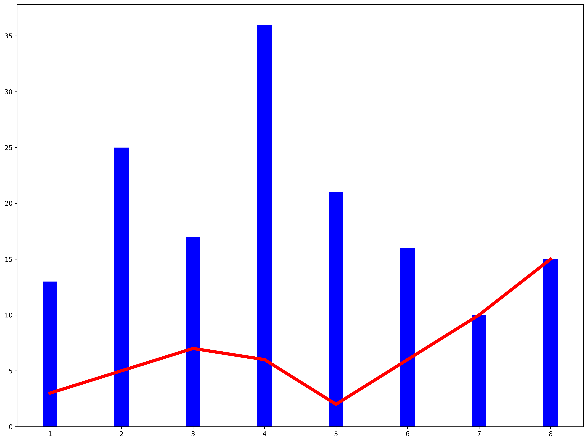<br />有的时候柱状图会出现在x轴的俩侧，方便进行比较，代码实现如下：
```python
import numpy as np
import matplotlib.pyplot as plt

plt.figure(figsize = (16, 12))
n = 12
x = np.arange(n) # 按顺序生成从12以内的数字
y1 = (1 - x / float(n)) * np.random.uniform(0.5, 1.0, n)
y2 = (1 - x / float(n)) * np.random.uniform(0.5, 1.0, n)

# 设置柱状图的颜色以及边界颜色
#+y表示在x轴的上方 -y表示在x轴的下方
plt.bar(x, +y1, facecolor = '#9999ff', edgecolor = 'white')
plt.bar(x, -y2, facecolor = '#ff9999', edgecolor = 'white')

plt.xlim(-0.5, n) # 设置x轴的范围，
plt.xticks(()) # 可以通过设置刻度为空，消除刻度
plt.ylim(-1.25, 1.25) # 设置y轴的范围
plt.yticks(())

# plt.text()在图像中写入文本，设置位置，设置文本，ha设置水平方向对其方式，va设置垂直方向对齐方式
for x1, y in zip(x, y2):
    plt.text(x1, -y - 0.05, '%.2f' % y, ha = 'center', va = 'top')
for x1, y in zip(x, y1):
    plt.text(x1, y + 0.05, '%.2f' % y, ha = 'center', va = 'bottom')
plt.savefig('outbox_legend.png', dpi = 300, bbox_inches = 'tight', pad_inches = .1)
```
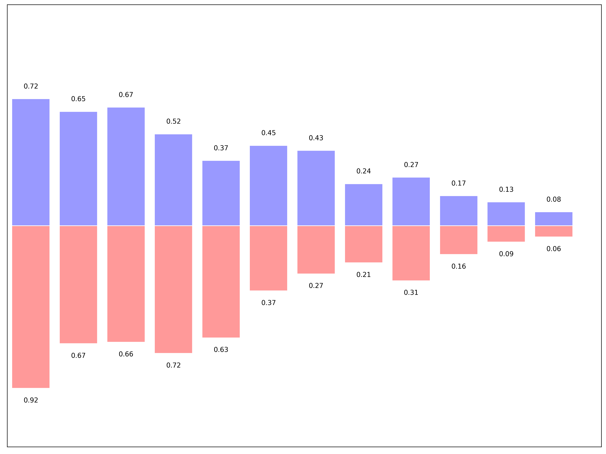
<a name="xhzsf"></a>
## 三、散点图
```python
import numpy as np
import matplotlib.pyplot as plt
N = 50
x = np.random.rand(N)
y = np.random.rand(N)
colors = np.random.rand(N)
area = np.pi * (15 * np.random.rand(N))**2
plt.scatter(x, y, s = area,c = colors, alpha = 0.8)

plt.savefig('outbox_legend.png', dpi = 300, bbox_inches = 'tight', pad_inches = .1)
```
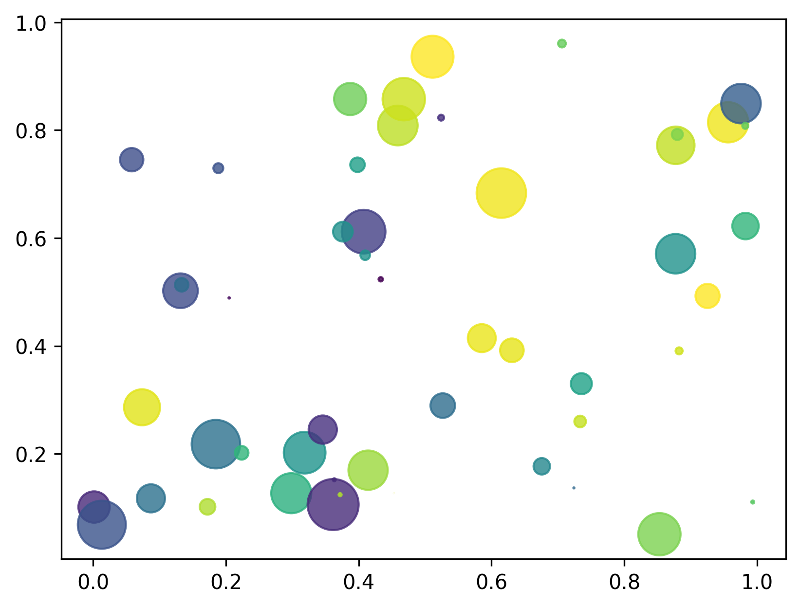
<a name="JNfQK"></a>
## 四、等高线图
```python
import matplotlib.pyplot as plt
import numpy as np

def f(x, y):
    return (1 - x / 2 + x ** 5 + y ** 3) * np.exp(-x ** 2 - y ** 2)

n = 256
x = np.linspace(-3, 3, n)
y = np.linspace(-3, 3, n)
X, Y = np.meshgrid(x, y)  # 生成网格坐标 将x轴与y轴正方形区域的点全部获取
line_num = 10 # 等高线的数量

plt.figure(figsize = (16, 12))

#contour 生成等高线的函数
#前俩个参数表示点的坐标，第三个参数表示等成等高线的函数，第四个参数表示生成多少个等高线
C = plt.contour(X, Y, f(X, Y), line_num, colors = 'black', linewidths = 0.5) # 设置颜色和线段的宽度
plt.clabel(C, inline = True, fontsize = 12) # 得到每条等高线确切的值

# 填充颜色, cmap 表示以什么方式填充，hot表示填充热量的颜色
plt.contourf(X, Y, f(X, Y), line_num, alpha = 0.75, cmap = plt.cm.hot)

plt.savefig('outbox_legend.png', dpi = 300, bbox_inches = 'tight', pad_inches = .1)
```
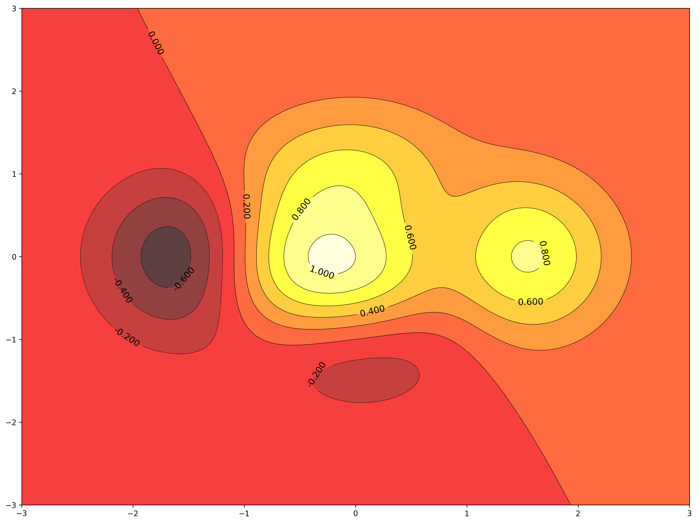
<a name="ZuHs3"></a>
## 五、处理图片<br />
```python
import matplotlib.pyplot as plt
import matplotlib.image as mpimg # 导入处理图片的库
import matplotlib.cm as cm # 导入处理颜色的库colormap

plt.figure(figsize = (16, 12))
img = mpimg.imread('image/fuli.jpg')# 读取图片
print(img) # numpy数据
print(img.shape) # 

plt.imshow(img, cmap = 'hot')
plt.colorbar() # 得到颜色多对应的数值
plt.savefig('outbox_legend.png', dpi = 300, bbox_inches = 'tight', pad_inches = .1)
```

```python
[[[147 100  46]
  [144  97  43]
  [145  98  46]
  ...
  [ 51  86  22]
  [ 51  86  22]
  [ 51  86  22]]

 [[146  99  45]
  [144  97  45]
  [146  99  47]
  ...
  [ 50  85  21]
  [ 49  84  20]
  [ 48  83  19]]

 [[144  97  45]
  [143  96  44]
  [147 100  48]
  ...
  [ 49  84  20]
  [ 48  83  19]
  [ 47  82  18]]

 ...

 [[148 111  58]
  [148 111  58]
  [151 111  59]
  ...
  [121  77  40]
  [120  76  39]
  [119  75  38]]

 [[148 111  58]
  [148 111  58]
  [151 111  59]
  ...
  [121  77  40]
  [120  76  39]
  [119  75  38]]

 [[148 111  58]
  [148 111  58]
  [151 111  60]
  ...
  [121  77  40]
  [120  76  39]
  [119  75  38]]]
(2667, 4056, 3)
```
<br />利用numpy矩阵得到图片
```python
import matplotlib.pyplot as plt
import matplotlib.cm as cm # 导入处理颜色的库colormap
import numpy as np

size =  8
# 得到一个8*8数值在(0, 1)之间的矩阵
a = np.linspace(0, 1, size ** 2).reshape(size, size)

plt.figure(figsize = (16, 12))
plt.imshow(a)
plt.savefig('outbox_legend.png', dpi = 300, bbox_inches = 'tight', pad_inches = .1)
```
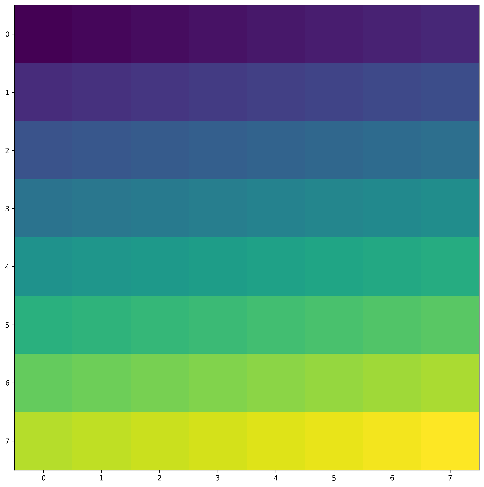
<a name="LSdkL"></a>
## 六、3D图
```python
import numpy as np
import matplotlib.pyplot as plt
from mpl_toolkits.mplot3d import Axes3D # 导入Axes3D对象

fig = plt.figure(figsize = (16, 12))
ax = fig.add_subplot(111, projection = '3d') # 得到3d图像

x = np.arange(-4, 4, 0.25)
y = np.arange(-4, 4, 0.25)
X, Y = np.meshgrid(x, y) # 生成网格
Z = np.sqrt(X ** 2 + Y ** 2)

# 画曲面图              # 行和列对应的跨度         # 设置颜色
ax.plot_surface(X, Y, Z, rstride = 1, cstride = 1, cmap = plt.get_cmap('rainbow'))
plt.savefig('outbox_legend.png', dpi = 300, bbox_inches = 'tight', pad_inches = .1)
```
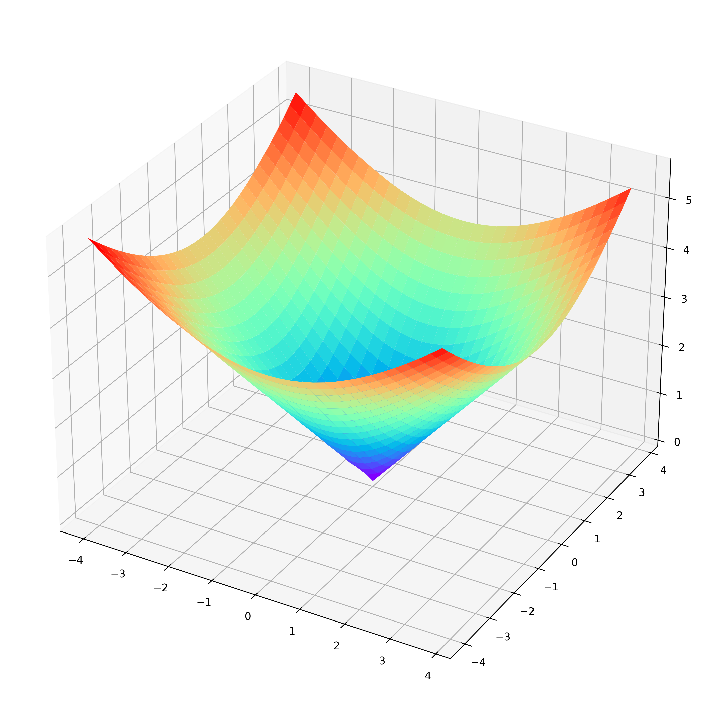<br />以上是matplotlib基于测试数据的数据可视化，结合实际项目中数据，代码稍加修改，即可有让人印象深刻的效果。
