Python Matplotlib<br />需要导入的模块，matplotlib绘图，numpy几乎是必用的包。
```python
# 导入numpy模块
import numpy as np
# 导入pyplot模块
import matplotlib.pyplot as plt
```
<a name="fdbf7ee6"></a>
### 基本折线图
```python
# 创建序列[1,2,3,...,99]
X = range(100)
# X中元素依次取平方
Y = [value ** 2 for value in X]
plt.plot(X, Y)
plt.savefig('outbox_legend.png', dpi = 300, bbox_inches = 'tight', pad_inches = .1)
```
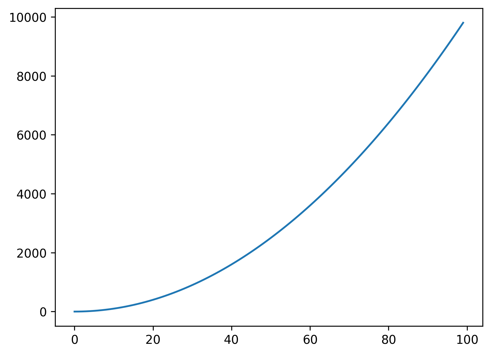
<a name="b0Xzq"></a>
### 正弦图
```python
# [0,2PI)分割为100份
X = np.linspace(0, 2 * np.pi, 100)
# 计算正弦值
Y = np.sin(X)
plt.plot(X, Y)
plt.savefig('outbox_legend.png', dpi = 300, bbox_inches = 'tight', pad_inches = .1)
```
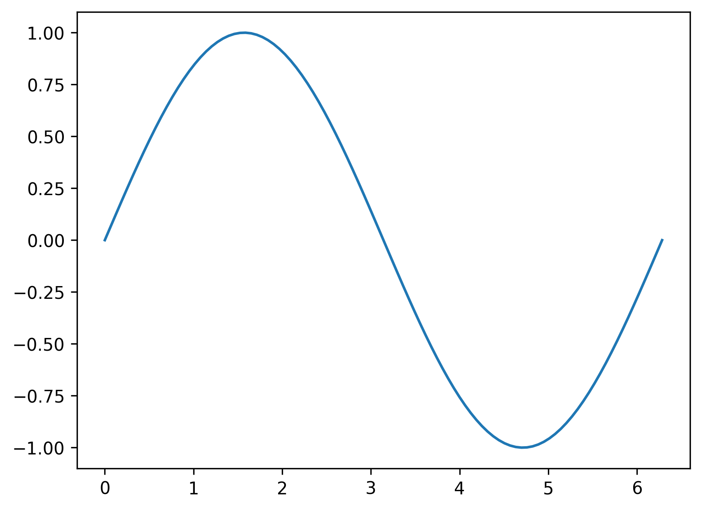
<a name="0dBze"></a>
### 正弦和余弦图
```python
X = np.linspace(0, 2 * np.pi, 100)
Ya = np.sin(X)
# 计算余弦值
Yb = np.cos(X)
plt.plot(X, Ya)
plt.plot(X, Yb)
plt.savefig('outbox_legend.png', dpi = 300, bbox_inches = 'tight', pad_inches = .1)
```
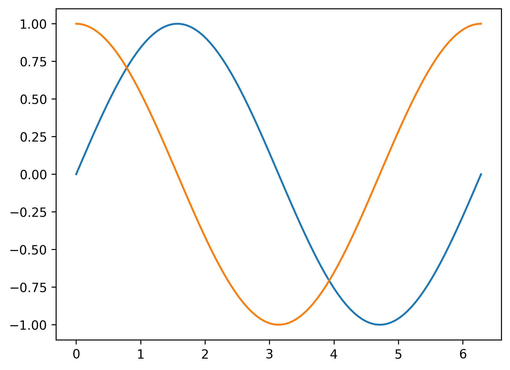
<a name="Eg824"></a>
### 曲线
```python
def plot_slope(X, Y):
    # 计算x方向相邻元素的delta
    Xs = X[1:] - X[:-1]
    # y方向delta
    Ys = Y[1:] - Y[:-1]
    plt.plot(X[1:], Ys / Xs)
X = np.linspace(-3, 3, 100)
Y = np.exp(-X ** 2)
plt.plot(X, Y)
plot_slope(X, Y)
plt.savefig('outbox_legend.png', dpi = 300, bbox_inches = 'tight', pad_inches = .1)
```
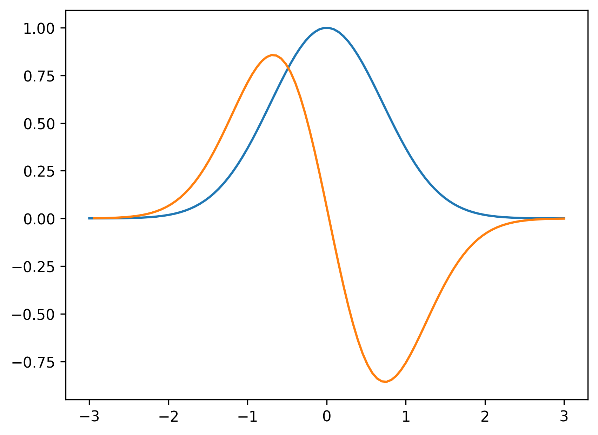<br />读入数据文件数据文件 my_data.txt 为
```
1 1
2 4
3 9
4 16
5 25
6 36
```
```python
X, Y = [], []
# 按行读入txt文件
for line in open('my_data.txt', 'r'):
    # 得到一对(x,y)坐标
    values = [float(s) for s in line.split()]
    X.append(values[0])
    Y.append(values[1])
plt.plot(X, Y)
plt.savefig('outbox_legend.png', dpi = 300, bbox_inches = 'tight', pad_inches = .1)
```
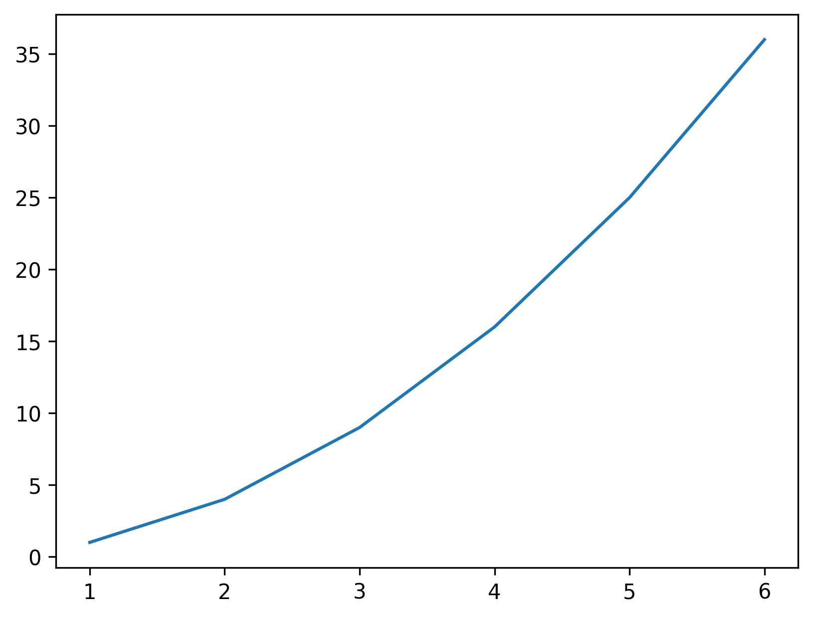
<a name="927b8923"></a>
### 散点图
1024个随机点的散点图
```python
# 随机生成1024行2列的数据，就是1024个点(x,y)
data = np.random.rand(1024, 2)
# 绘制散点图
plt.scatter(data[:, 0], data[:, 1])
plt.savefig('outbox_legend.png', dpi = 300, bbox_inches = 'tight', pad_inches = .1)
```
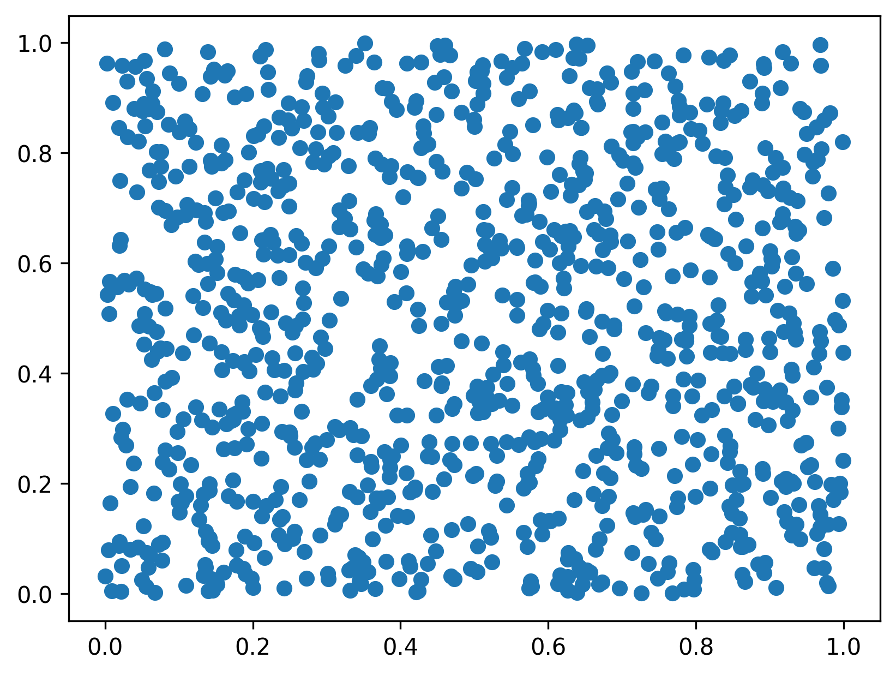
<a name="gwOXB"></a>
### 柱状图
```python
data = [5., 25., 50., 20.]
plt.bar(range(len(data)), data, width=0.5)
plt.savefig('outbox_legend.png', dpi = 300, bbox_inches = 'tight', pad_inches = .1)
```
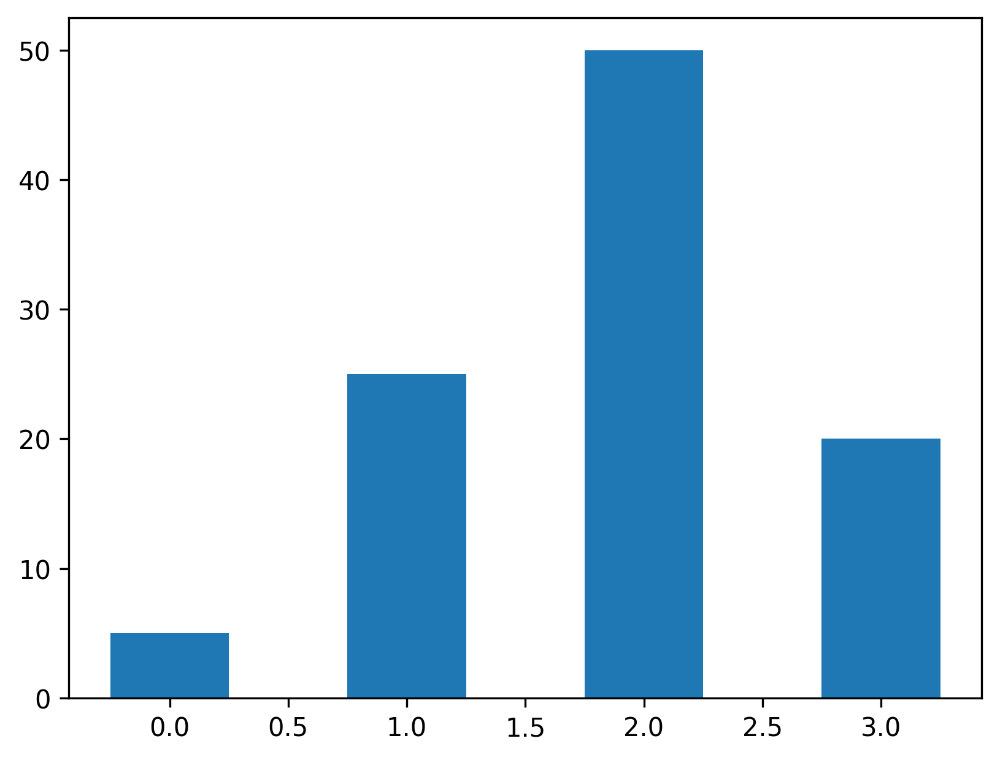
<a name="ecU5P"></a>
### 水平柱状图
```python
data = [5., 25., 50., 20.]
plt.barh(range(len(data)), data)
plt.savefig('outbox_legend.png', dpi = 300, bbox_inches = 'tight', pad_inches = .1)
```
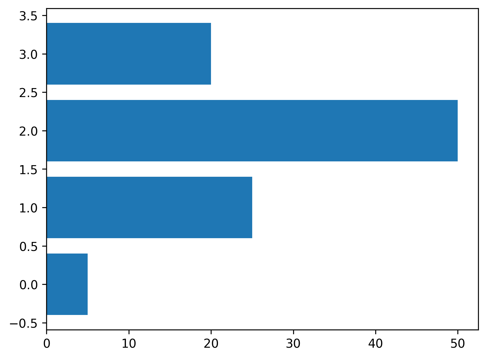
<a name="Nl1Ay"></a>
### 系列柱状图
```python
import numpy as np
import matplotlib.pyplot as plt
data = [[5., 25., 50., 20.],
[4., 23., 51., 17.],
[6., 22., 52., 19.]]
X = np.arange(4)
plt.bar(X + 0.00, data[0], color='b', width=0.25)
plt.bar(X + 0.25, data[1], color='g', width=0.25)
plt.bar(X + 0.50, data[2], color='r', width=0.25)
plt.savefig('outbox_legend.png', dpi = 300, bbox_inches = 'tight', pad_inches = .1)
```
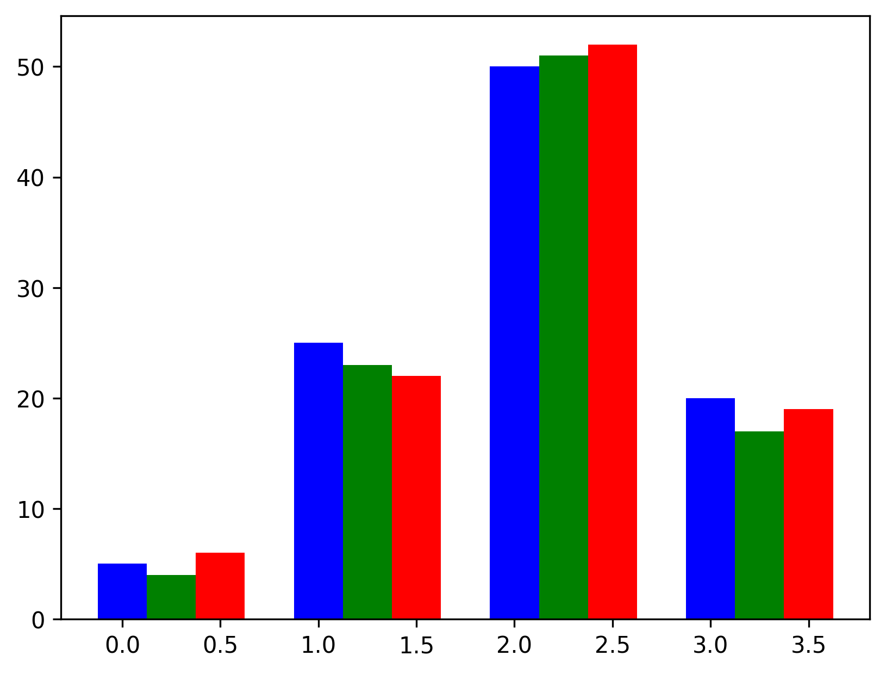
<a name="9KPju"></a>
### stacked 柱状图
```python
A = [5., 30., 45., 22.]
B = [5., 25., 50., 20.]
X = range(4)
plt.bar(X, A, color='b')
plt.bar(X, B, color='r', bottom=A)
plt.savefig('outbox_legend.png', dpi = 300, bbox_inches = 'tight', pad_inches = .1)
```
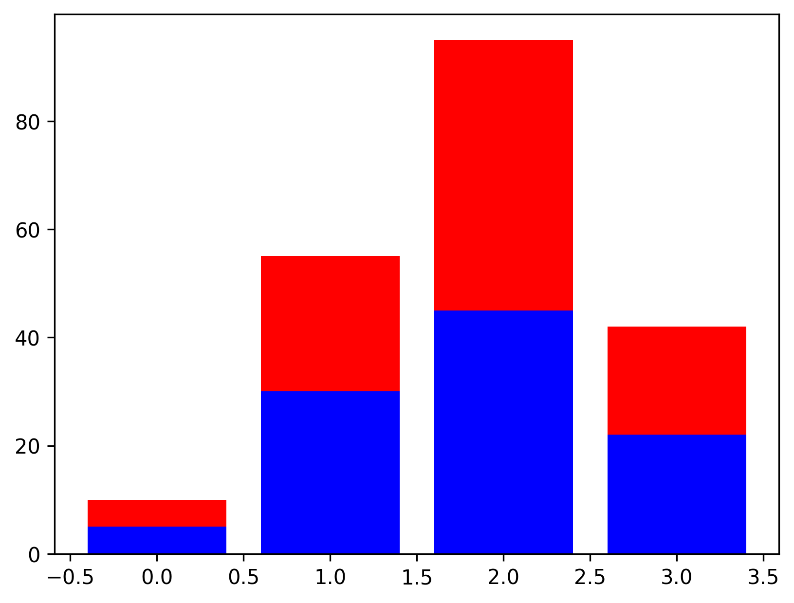
<a name="39b1dad7"></a>
### 背靠背水平柱状图
```python
women_pop = np.array([5., 30., 45., 22.])
men_pop = np.array([5., 25., 50., 20.])
X = np.arange(4)
plt.barh(X, women_pop, color = 'r')
plt.barh(X, -men_pop, color = 'b')
plt.show()
X = np.arange(4)
plt.barh(X, women_pop, color='r')
plt.barh(X, -men_pop, color='b')
plt.savefig('outbox_legend.png', dpi = 300, bbox_inches = 'tight', pad_inches = .1)
```
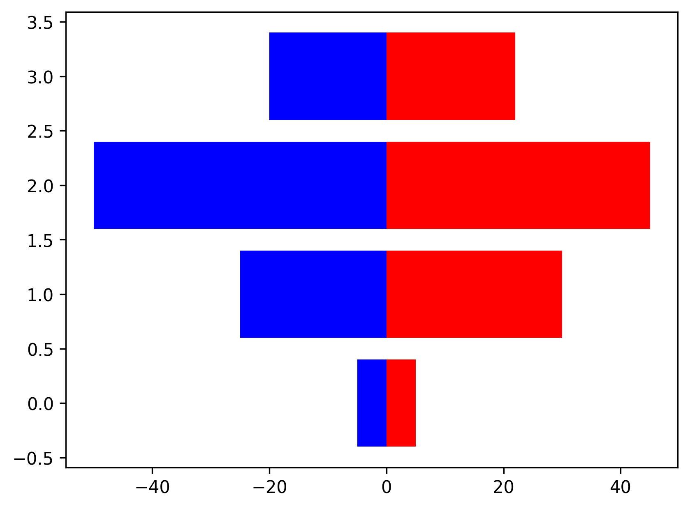
<a name="aMECL"></a>
### 饼状图
```python
data = [5, 25, 50, 20]
plt.pie(data)
plt.savefig('outbox_legend.png', dpi = 300, bbox_inches = 'tight', pad_inches = .1)
```

<a name="c6467287"></a>
### 直方图
```python
X = np.random.randn(1000)
plt.hist(X, bins=20)
plt.savefig('outbox_legend.png', dpi = 300, bbox_inches = 'tight', pad_inches = .1)
```
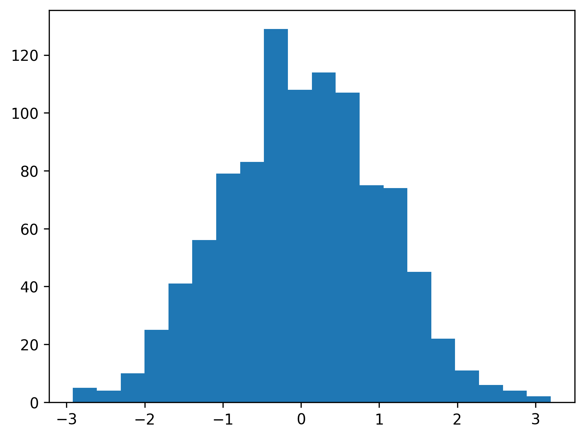<br />以上直方图描述了20个区间内，点数的频次。
<a name="d4bedf01"></a>
### 箱形图
```python
data = np.random.randn(100, 5)
plt.boxplot(data)
plt.savefig('outbox_legend.png', dpi = 300, bbox_inches = 'tight', pad_inches = .1)
```
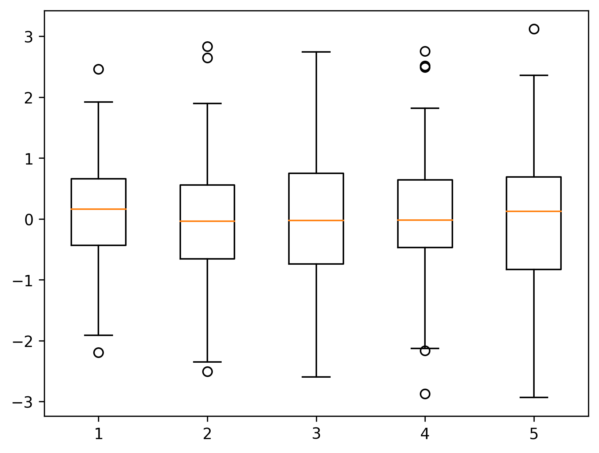<br />箱形图中红线表示中位数，往下线是1/4分位数，往上线是3/4分位数，再往下延伸线的长度等于2倍的(上分位数-下分位数），圆圈表示异常点。
<a name="9cf417a5"></a>
### triangulation 图
```python
import matplotlib.tri as tri
data = np.random.rand(100, 2)
triangles = tri.Triangulation(data[:, 0], data[:, 1])
plt.triplot(triangles)
plt.savefig('outbox_legend.png', dpi = 300, bbox_inches = 'tight', pad_inches = .1)
```
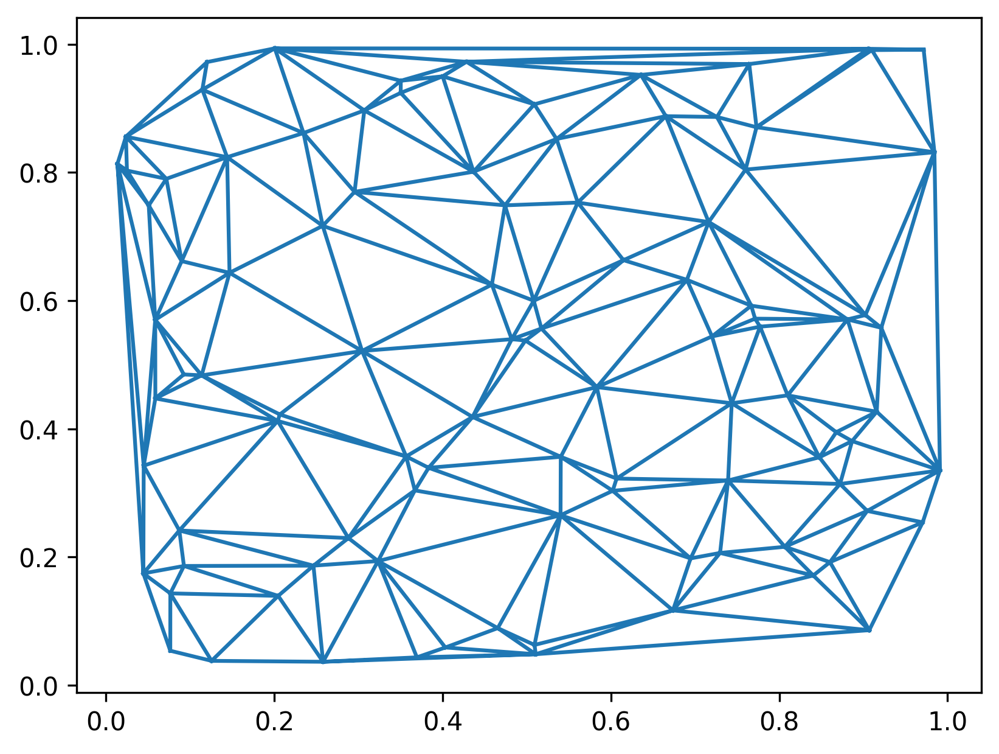
