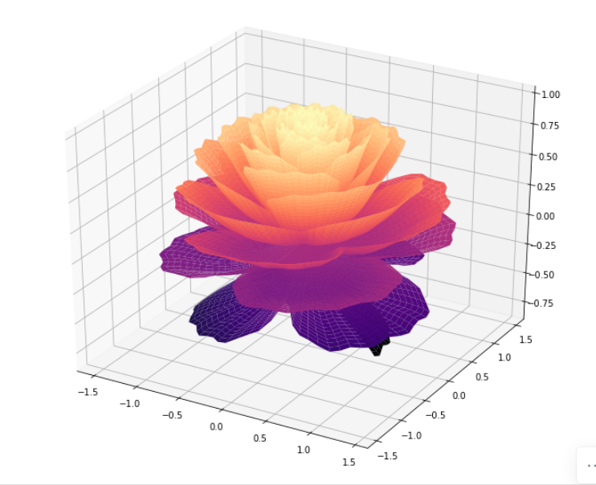
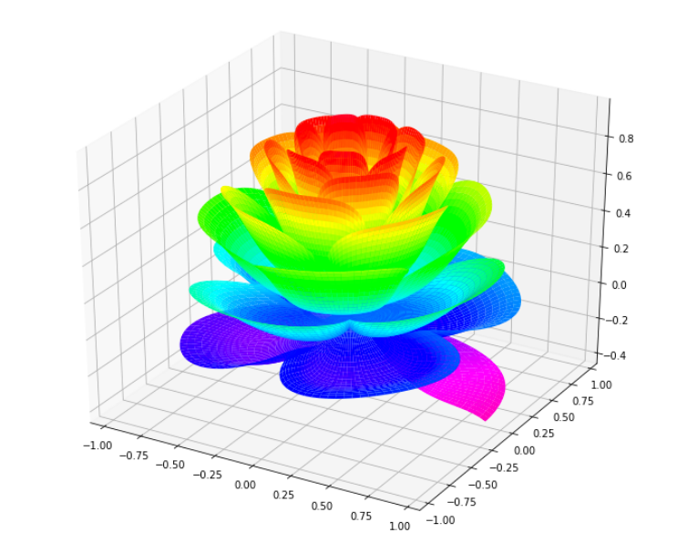
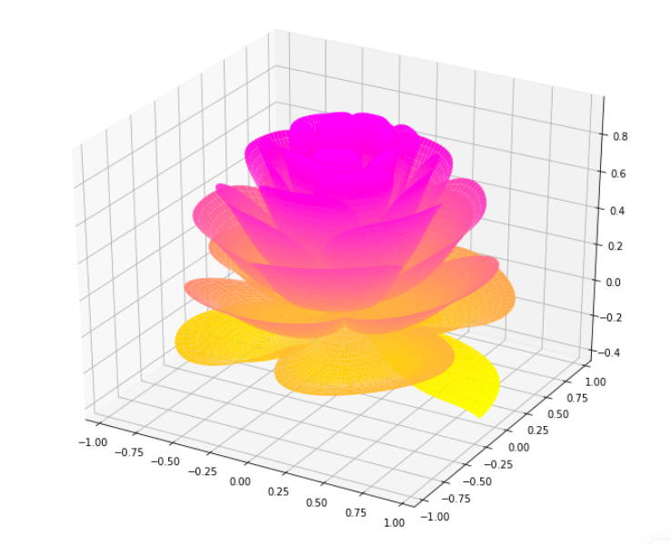
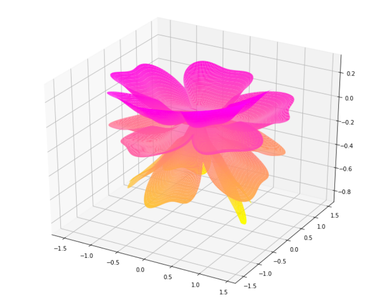
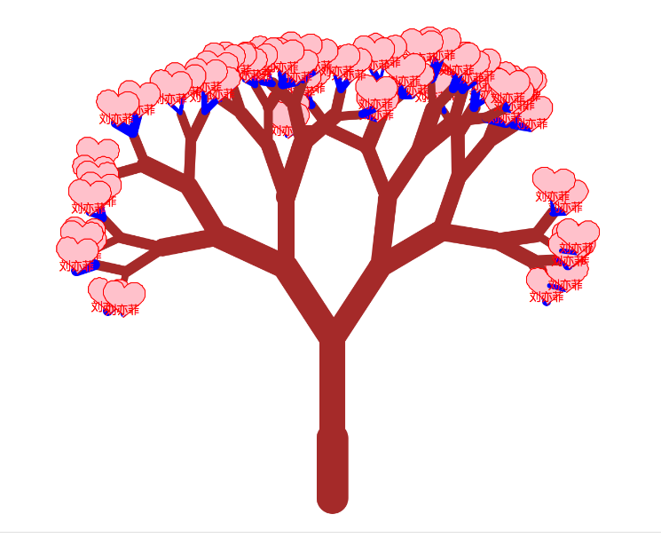

Python
<a name="UTzU3"></a>
###  Python导包
```python
import numpy as np
import pandas as pd
import matplotlib.pyplot as plt

from matplotlib import cm
from mpl_toolkits.mplot3d import Axes3D
```
<a name="YXf9G"></a>
### 画一朵玫瑰花
```python
fig = plt.figure(figsize=(12, 10))
ax = fig.gca(projection='3d')
[x, t] = np.meshgrid(np.array(range(25)) / 24.0, 
                     np.arange(0, 575.5, 0.5) / 575 * 30 * np.pi - 4*np.pi
                    )
p = (np.pi / 2) * np.exp(-t / (8 * np.pi))

change = np.sin(20*t)/50
u = 1 - (1 - np.mod(3.3 * t, 2 * np.pi) / np.pi) ** 4 / 2 + change
y = 2 * (x ** 2 - x) ** 2 * np.sin(p)
r = u * (x * np.sin(p) + y * np.cos(p)) * 1.5
h = u * (x * np.cos(p) - y * np.sin(p))

c = plt.get_cmap('magma')
surf = ax.plot_surface(r * np.cos(t), r * np.sin(t), h, rstride=1, cstride=1,
                        cmap= c, linewidth=0, antialiased=True)
plt.show()
```

<a name="dQMlv"></a>
### 来个五颜六色的
```python
fig = plt.figure(figsize=(12, 10))
ax = fig.gca(projection='3d')

[x, t] = np.meshgrid(np.array(range(25)) / 24.0, 
                     np.arange(0, 575.5, 0.5) / 575 * 17 * np.pi - 2 * np.pi)
p = (np.pi / 2) * np.exp(-t / (8 * np.pi))

u = 1 - (1 - np.mod(3.6 * t, 2 * np.pi) / np.pi) ** 4 / 2
y = 2 * (x ** 2 - x) ** 2 * np.sin(p)
r = u * (x * np.sin(p) + y * np.cos(p))
h = u * (x * np.cos(p) - y * np.sin(p))

c = cm.gist_rainbow_r
surf = ax.plot_surface(r * np.cos(t), r * np.sin(t), h, rstride=1, cstride=1,
                cmap= c, linewidth=0, antialiased=True)
plt.show()
```

<a name="I8CHf"></a>
### 去掉绿色，保留玫瑰花的红色
```python
fig = plt.figure(figsize=(12, 10))
ax = fig.gca(projection='3d')

[x, t] = np.meshgrid(np.array(range(25)) / 24.0, 
                     np.arange(0, 575.5, 0.5) / 575 * 17 * np.pi - 2 * np.pi)

p = (np.pi / 2) * np.exp(-t / (8 * np.pi))
u = 1 - (1 - np.mod(3.6 * t, 2 * np.pi) / np.pi) ** 4 / 2
y = 2 * (x ** 2 - x) ** 2 * np.sin(p)
r = u * (x * np.sin(p) + y * np.cos(p))
h = u * (x * np.cos(p) - y * np.sin(p))
c= cm.get_cmap('spring_r')

surf = ax.plot_surface(r * np.cos(t), r * np.sin(t), h, rstride=1, cstride=1,
                        cmap= c, linewidth=0, antialiased=True)
plt.show()
```

<a name="bpFtY"></a>
### 玫瑰花盛开
```python
fig = plt.figure(figsize=(12, 10))
ax = fig.gca(projection='3d')

[x, t] = np.meshgrid(np.array(range(25)) / 24.0, 
                     np.arange(0, 575.5, 0.5) / 575 * 6 * np.pi - 4*np.pi)
p = (np.pi / 2) * np.exp(-t / (8 * np.pi))

change = np.sin(10*t)/20
u = 1 - (1 - np.mod(5.2 * t, 2 * np.pi) / np.pi) ** 4 / 2 + change
y = 2 * (x ** 2 - x) ** 2 * np.sin(p)
r = u * (x * np.sin(p) + y * np.cos(p)) * 1.5
h = u * (x * np.cos(p) - y * np.sin(p))
c= plt.get_cmap('spring_r')

surf = ax.plot_surface(r * np.cos(t), r * np.sin(t), h, rstride=1, cstride=1,
                    cmap= c, linewidth=0, antialiased=True)

plt.show()
```

<a name="zDvOz"></a>
### 用Python海龟画图表白
```python
import turtle
import random


# 输入你爱人的姓名:
my_love = "刘亦菲"

def love(x, y):
    lv = turtle.Turtle()
    lv.hideturtle()
    lv.up()
    lv.goto(x, y)  # 定位到(x,y)
    def curvemove():  # 画圆弧
        for i in range(20):
            lv.right(10)
            lv.forward(2)

    lv.color('red', 'pink')
    lv.speed(10000)
    lv.pensize(1)

    # 开始画爱心
    lv.down()
    lv.begin_fill()
    lv.left(140)
    lv.forward(22)
    curvemove()
    lv.left(120)
    curvemove()
    lv.forward(22)
    lv.write(my_love, font=("Arial", 12, "normal"), align="center")
    lv.left(140)
    lv.end_fill()


def tree(branchLen, t):
    if branchLen > 5:
        if branchLen < 20:
            t.color("blue")
            t.pensize(random.uniform((branchLen + 5) / 4 - 2, (branchLen + 6) / 4 + 5))
            t.down()

            t.forward(branchLen)
            love(t.xcor(), t.ycor())
            t.up()

            t.backward(branchLen)
            t.color("brown")
            return

    t.pensize(random.uniform((branchLen + 5) / 4 - 2, (branchLen + 6) / 4 + 5))
    t.down()
    t.forward(branchLen)

    # 递归
    ang = random.uniform(15, 45)
    t.right(ang)
    tree(branchLen - random.uniform(12, 16), t)
    t.left(2 * ang)
    tree(branchLen - random.uniform(12, 16), t)
    t.right(ang)
    t.up()
    t.backward(branchLen)


myWin = turtle.Screen()
t = turtle.Turtle()
t.hideturtle()
t.speed(100)

t.left(90)
t.up()
t.backward(200)
t.down()
t.color("brown")
t.pensize(32)
t.forward(60)
tree(100, t)
myWin.exitonclick()
```

