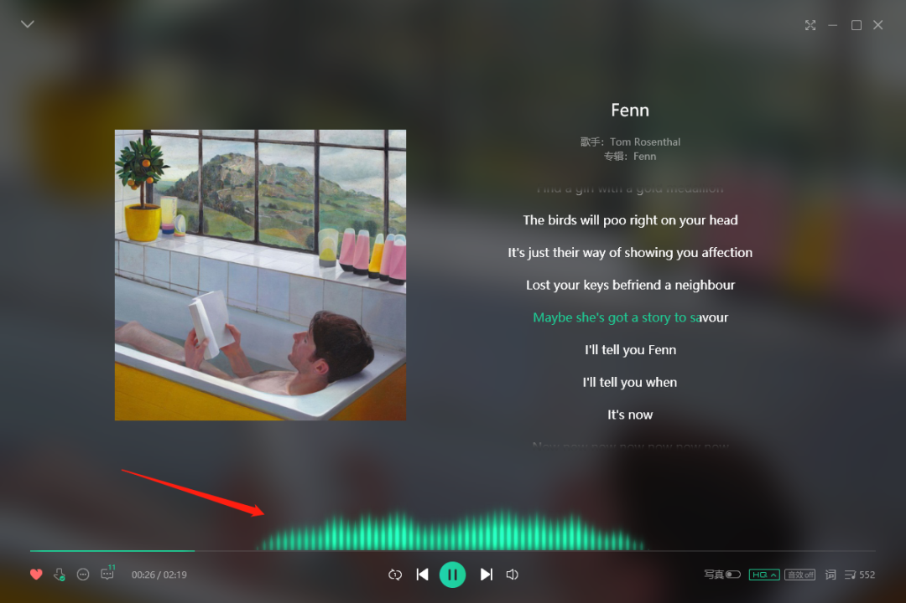
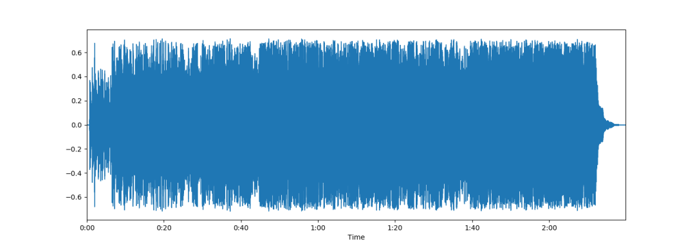
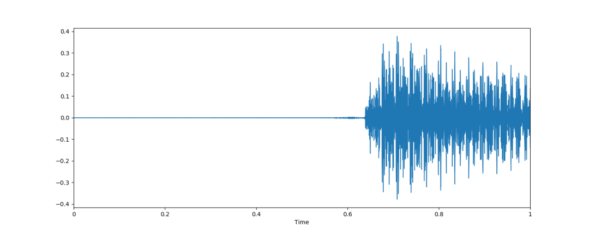
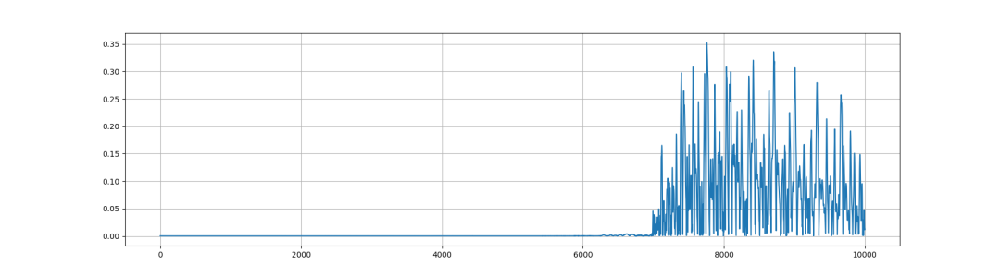
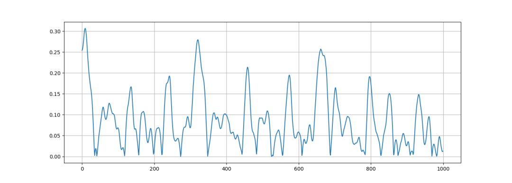

Python可视化<br /><br />有没有经常好奇一些音乐软件的频谱特效是怎么做的，为什么做的这么好看？
<a name="Jfteh"></a>
## 1、准备
开始之前，要确保Python和pip已经成功安装在电脑上。<br />Windows环境下打开Cmd(开始—运行—CMD)，苹果系统环境下请打开Terminal(command+空格输入Terminal)，准备开始输入命令安装依赖。<br />在终端输入以下命令安装所需要的依赖模块:
```bash
pip install pydub
pip install librosa
```
看到 Successfully installed xxx 则说明安装成功。
<a name="GaQ5C"></a>
## 2、频谱展示
使用librosa和matplot，可以用10行代码完整地展示整个频谱：<br />
```python
import matplotlib.pyplot as plt
import librosa.display
# 音乐文件载入
audio_path = 'Fenn.mp3'
music, sr = librosa.load(audio_path)
# 宽高比为14:5的图
plt.figure(figsize=(14,5))
librosa.display.waveplot(music, sr=sr)
# 显示图
plt.show()
```
不过，这样的频谱是整段音乐的，看起来非常难看，接下来使用 pydub 切割频谱，以获得更佳的效果。细分到0到1秒的区段来查看频谱：<br />
```python
import matplotlib.pyplot as plt
import librosa.display
import numpy as np
from pydub import AudioSegment
# 1秒=1000亳秒
SECOND = 1000
#音乐文件
AUDIO_PATH = 'Fenn.mp3'

def split_music(begin, end, filepath):
	# 导儿音乐
	song = AudioSegment.from_mp3(filepath)
	# 取begin秒至ijend秒间的片段
	song = song[begin*SECOND: end*SECOND]
	# 存储为临时文件做备份
	temp_path = 'backup/'+filepath
	song.export(temp_path)
	return temp_path
music, sr = librosa.load(split_music(0, 1, AUDIO_PATH))
#宽高比为14:5的图
plt.figure(figsize=(14, 5))
librosa.display.waveplot(music, sr=sr)
plt.show()
```
这下细是细了，但是还是太复杂了，其实做频谱的展示，或许只需要正值即可：<br /><br />然后还可以进一步放大，比如说0.9秒到1秒之间的频谱：<br />
```python
n0 = 9000
n1 = 10000
music = np.array([mic for mic in music if mic > 0])
plt.figure(figsize=(14, 5))
pit.plot(music[n0:n1])
plt.grid()
#显示图
plt.show()
```
这样好看许多，不过如果要达成QQ音乐那种效果，还是需要进行大量改造。<br />比如用精美的图像元素来填充替代、然后零值如何处理？如何让频谱更加平稳？此外，这是静态的图像，还需要根据事件动态地延续波段。<br />用于生产的代码肯定比这简易的代码更加复杂，而且也不应该是暴力去除负值绘制图像。
