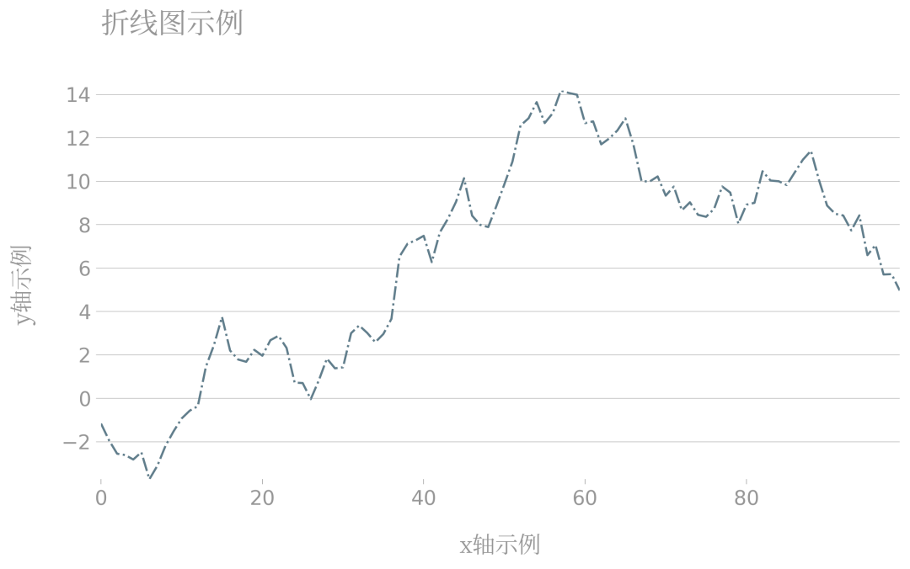
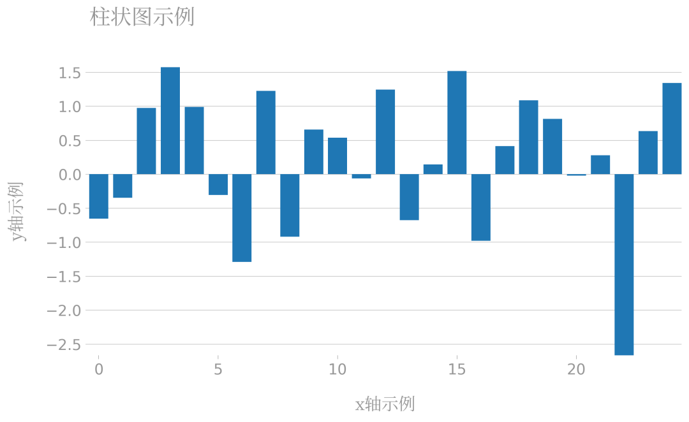
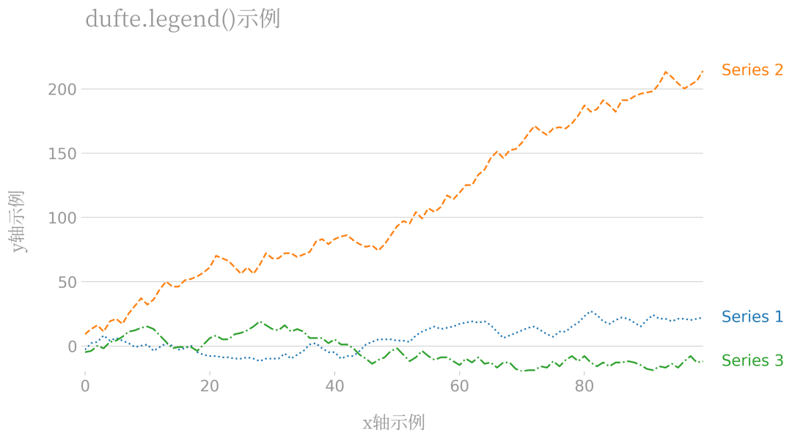
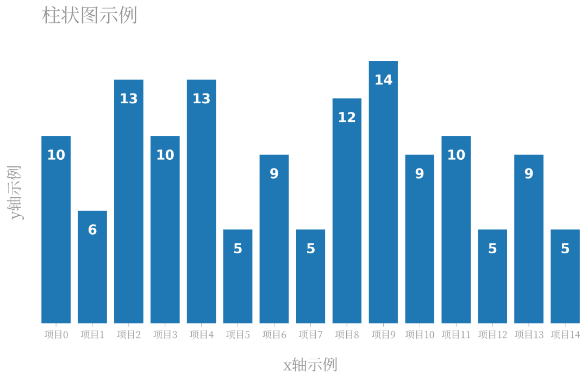

Python Matplotlib 可视化
<a name="o6Sr4"></a>
## 1、简介
matplotlib作为Python生态中最流行的数据可视化框架，虽然功能非常强大，但默认样式比较简陋，想要制作具有简洁商务风格的图表往往需要编写众多的代码来调整各种参数。<br />而今天要为大家介绍的dufte，就是用来通过简短的代码，对默认的matplotlib图表样式进行自动改造的Python库：<br />
<a name="Ef6QL"></a>
## 2、利用dufte自动改造matplotlib图表
通过`pip install dufte`安装完成后，就可以将dufte的几个关键API穿插在常规matplotlib图表的绘制过程中，目前主要有以下几种功能：
<a name="B9xhz"></a>
### 2.1 主题设置
dufte最重要的功能是其自带的主题风格，而在matplotlib中有两种设置主题的方式，一种是利用`plt.style.use(主题)`来全局设置，一般不建议这种方式。<br />另一种方式则是以下列方式来在`with`的作用范围内局部使用主题：
```python
# 局部主题设置
with plt.style.context(主题):
    # 绘图代码
    ...
```
这里都使用第二种方式，首先导入演示所需的依赖库，并从本地注册思源宋体：
```python
import dufte
import numpy as np
import matplotlib.pyplot as plt
from matplotlib import font_manager

# 注册本地思源宋体
fontproperties = font_manager.FontProperties(fname='NotoSerifSC-Regular.otf')
```
接下来以折线图和柱状图为例：
<a name="in8fF"></a>
#### 折线图
```python
# 折线图示例
with plt.style.context(dufte.style):
    x = range(100)
    y = np.random.standard_normal(100).cumsum()
    
    fig, ax = plt.subplots(figsize=(10, 5), facecolor='white', edgecolor='white')
    
    ax.plot(x, y, linestyle='-.', color='#607d8b')
    
    ax.set_xlabel('x轴示例', fontproperties=fontproperties, fontsize=16)
    ax.set_ylabel('y轴示例', fontproperties=fontproperties, fontsize=16)
    
    ax.set_title('折线图示例', fontproperties=fontproperties, fontsize=20)

    fig.savefig('图2.png', dpi=300, bbox_inches='tight')
```

<a name="WSKg5"></a>
#### 柱状图
```python
# 柱状图示例
with plt.style.context(dufte.style):
    x = range(25)
    y = np.random.standard_normal(25)

    fig, ax = plt.subplots(figsize=(10, 5), facecolor='white', edgecolor='white')
    
    ax.bar(x, y)
    
    ax.set_xlabel('x轴示例', fontproperties=fontproperties, fontsize=16)
    ax.set_ylabel('y轴示例', fontproperties=fontproperties, fontsize=16)
    
    ax.set_title('柱状图示例', fontproperties=fontproperties, fontsize=20)

    fig.savefig('图3.png', dpi=300, bbox_inches='tight')
```
<br />可以看到，dufte自带了一套简洁的绘图风格，主张去除多余的轴线，只保留必要的参考线，适用于日常工作中的通用出图需求。
<a name="Qfu66"></a>
### 2.2 自动图例美化
除了前面介绍的整体主题风格之外，dufte还自带了一套图例风格化策略，只需要在绘图过程中利用`dufte.legend()`来代替matplotlib原有的`legend()`即可，以下面的折线图为例：
```python
# 折线图示例
with plt.style.context(dufte.style):
    x = range(100)
    y1 = np.random.randint(-5, 6, 100).cumsum()
    y2 = np.random.randint(-5, 10, 100).cumsum()
    y3 = np.random.randint(-5, 6, 100).cumsum()
    
    fig, ax = plt.subplots(figsize=(10, 5), facecolor='white', edgecolor='white')
    
    ax.plot(x, y1, linestyle='dotted', label='Series 1')
    ax.plot(x, y2, linestyle='dashed', label='Series 2')
    ax.plot(x, y3, linestyle='dashdot', label='Series 3')
    
    ax.set_xlabel('x轴示例', fontproperties=fontproperties, fontsize=16)
    ax.set_ylabel('y轴示例', fontproperties=fontproperties, fontsize=16)

    dufte.legend()

    ax.set_title('dufte.legend()示例', fontproperties=fontproperties, fontsize=20)

    fig.savefig('图4.png', dpi=300, bbox_inches='tight')
```
可以看到，对于多系列图表，只需要一行`dufte.legend()`就可以自动添加出下列别致的图例说明：<br />
<a name="fF71g"></a>
### 2.3 柱状图自动标注
很多时候在绘制柱状图时，希望把每个柱体对应的y值标注在柱体上，而通过`dufte.show_bar_values()`，只要其之前的绘图流程中设置了xticks，它就会自动往柱体上标注信息：
```python
# 柱状图示例
with plt.style.context(dufte.style):
    x = range(15)
    y = np.random.randint(5, 15, 15)

    fig, ax = plt.subplots(figsize=(10, 5), facecolor='white', edgecolor='white')
    
    ax.bar(x, y)
    
    ax.set_xticks(x)
    ax.set_xticklabels([f'项目{i}' for i in x], fontproperties=fontproperties, fontsize=10)
    dufte.show_bar_values()
    
    ax.set_xlabel('x轴示例', fontproperties=fontproperties, fontsize=16)
    ax.set_ylabel('y轴示例', fontproperties=fontproperties, fontsize=16)
    
    ax.set_title('柱状图示例', fontproperties=fontproperties, fontsize=20)

    fig.savefig('图5.png', dpi=300, bbox_inches='tight')
```
<br />作为一个处于开发初期的库，dufte未来势必会加入更多的实用功能，可以对其持续关注。
