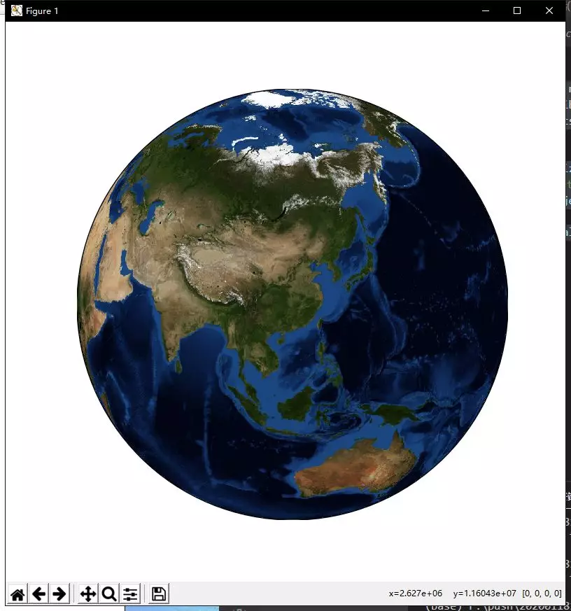
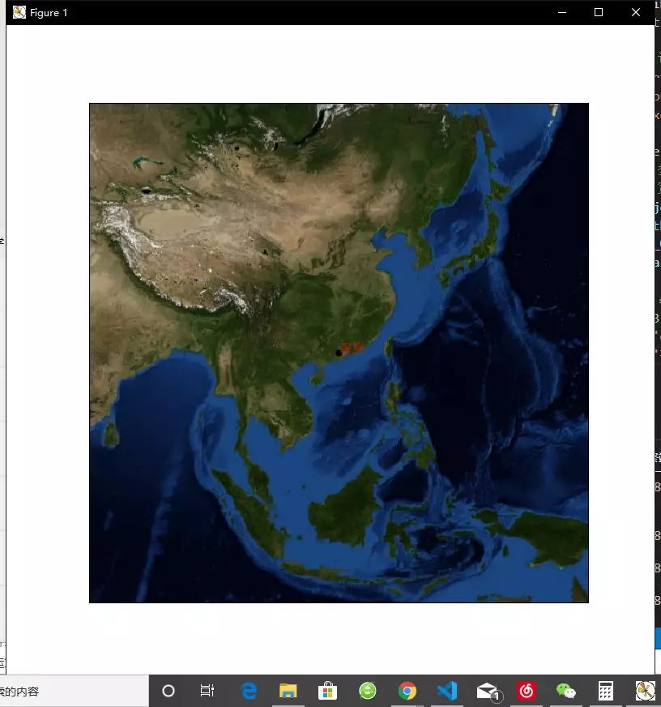
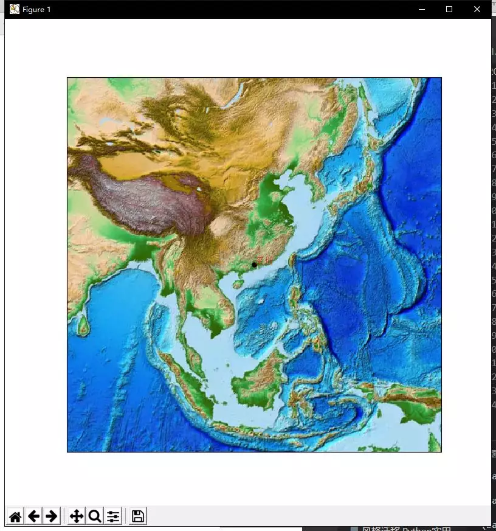
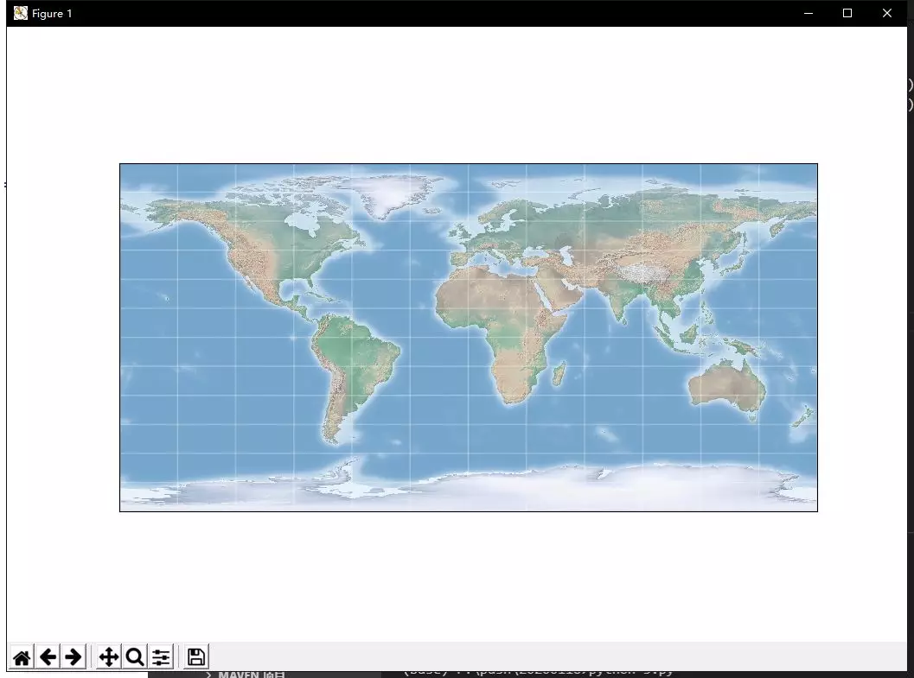
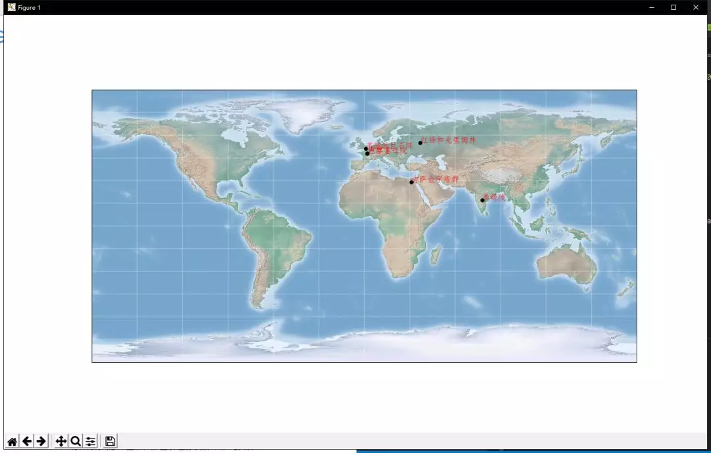

Python 可视化<br />用matplot工具包之一的 mpl_toolkits 来绘制世界地图，这是一个简单的可视化工具，如果希望绘制更加复杂的地图，可以考虑使用Google Maps API。
<a name="LG3ni"></a>
## 1、准备
请选择以下任一种方式输入命令安装依赖：

1. Windows 环境 打开 Cmd (开始-运行-CMD)。
2. MacOS 环境 打开 Terminal (command+空格输入Terminal)。
3. 如果用的是 VSCode编辑器 或 Pycharm，可以直接使用界面下方的Terminal.
```bash
pip install numpy
pip install matplotlib
```
为了使用 `mpl_toolkits`，单纯安装matplotlib是不够的，还需要单独安装basemap，如果已经安装了Anaconda，那这一步就非常好办，输入以下命令安装即可：
```bash
conda install basemap
```
如果没有的话，就稍微麻烦一点：

1. 安装geos: `pip install geos`
2. 根据Python版本下载basemap

[http://www.lfd.uci.edu/~gohlke/pythonlibs/#basemap](http://www.lfd.uci.edu/~gohlke/pythonlibs/#basemap)<br />注意cp后面的数字是Python的版本。（在页面上按ctrl+F，输入basemap快速定位）

3. 在 cmd 下进入该文件的目录，运行
```bash
pip install basemap‑1.2.1‑cp37‑cp37m‑win_amd64.whl
```
<a name="JbPqR"></a>
## 2、简单地图
开始绘制一个地球，中心指向中国：<br />
```python
# 导入需要的包
import numpy as np
import matplotlib.pyplot as plt
from mpl_toolkits.basemap import Basemap

# 初始化图形
plt.figure(figsize=(8, 8))
# 底图：圆形, lat_0：纬度；lon_o: 经度, (113,29)是武汉
m = Basemap(projection='ortho', resolution=None, lat_0=29, lon_0=113)
# 底色
m.bluemarble(scale=0.5)
# 显示
plt.show()
```
这里的重点在于Basemap，指定好想要放置的中心。<br /><br />效果还不错，不仅如此，它其实不单单只是一张图像，它还是一个功能齐全的matplot画布。这也就意味着，能够在上面画线！放大地图，进入中国区域，然后标记出深圳的位置：<br />
```python
# 导入需要的包
import numpy as np
import matplotlib.pyplot as plt
from mpl_toolkits.basemap import Basemap

# 以下三行是为了让matplot能显示中文
from pylab import mpl
mpl.rcParams['font.sans-serif'] = ['FangSong']
mpl.rcParams['axes.unicode_minus'] = False

fig = plt.figure(figsize=(8, 8))
# 注意几个新增的参数, width和height是用来控制放大尺度的
# 分别代表投影的宽度和高度(8E6代表 8x10^6米)
m = Basemap(projection='lcc', resolution=None,
            width=8E6, height=8E6,
            lat_0=23, lon_0=113,)
m.bluemarble(scale=0.5)

# 这里的经纬度是：(经度, 纬度)
x, y = m(113, 23)
plt.plot(x, y, 'ok', markersize=5) 
plt.text(x, y, '深圳', fontsize=12, color="red") 
plt.show()
```
<br />不要用蓝底图了，看得不是很清晰，换成浮雕型：<br /><br />可以很明显地看到山区、丘陵等地理样貌。还可以根据你的需要，针对某几个城市做连线或者绘制某些经纬度之间的区域。别忘了，这可是matplotlib可编辑的画布。
<a name="ayfOF"></a>
## 3、世界地图
接下来，将上述的世界地图展开成带经纬线的平面图形。<br />
```python
# 导入需要的包
import numpy as np
import matplotlib.pyplot as plt
from mpl_toolkits.basemap import Basemap
from itertools import chain


def draw_map(m, scale=0.2):
    # 绘制带阴影的浮雕图像
    m.shadedrelief(scale=scale)

    # 根据经纬度切割，每13度一条线
    lats = m.drawparallels(np.linspace(-90, 90, 13))
    lons = m.drawmeridians(np.linspace(-180, 180, 13))

    # 集合所有线条
    lat_lines = chain(*(tup[1][0] for tup in lats.items()))
    lon_lines = chain(*(tup[1][0] for tup in lons.items()))
    all_lines = chain(lat_lines, lon_lines)

    # 循环画线
    for line in all_lines:
        line.set(linestyle='-', alpha=0.3, color='w')


fig = plt.figure(figsize=(8, 6), edgecolor='w')
m = Basemap(projection='cyl', resolution=None,
            llcrnrlat=-90, urcrnrlat=90,
            llcrnrlon=-180, urcrnrlon=180,)

draw_map(m)
plt.show()
```
<br />绘制添加世界著名景点的位置<br />
```python
# 导入需要的包
import numpy as np
import matplotlib.pyplot as plt
from mpl_toolkits.basemap import Basemap
from itertools import chain

# 以下三行是为了让matplot能显示中文
from pylab import mpl
mpl.rcParams['font.sans-serif'] = ['FangSong']
mpl.rcParams['axes.unicode_minus'] = False


def draw_point(m, x, y, name):
    # 这里的经纬度是：(经度, 纬度)
    x, y = m(x, y)
    plt.plot(x, y, 'ok', markersize=5)
    plt.text(x, y, name, fontsize=12, color="red")


def draw_map(m, scale=0.2):
    # 绘制带阴影的浮雕图像
    m.shadedrelief(scale=scale)

    # 根据经纬度切割，每13度一条线
    lats = m.drawparallels(np.linspace(-90, 90, 13))
    lons = m.drawmeridians(np.linspace(-180, 180, 13))

    # 集合所有线条
    lat_lines = chain(*(tup[1][0] for tup in lats.items()))
    lon_lines = chain(*(tup[1][0] for tup in lons.items()))
    all_lines = chain(lat_lines, lon_lines)

    # 循环画线
    for line in all_lines:
        line.set(linestyle='-', alpha=0.3, color='w')


fig = plt.figure(figsize=(8, 6), edgecolor='w')
m = Basemap(projection='cyl', resolution=None,
            llcrnrlat=-90, urcrnrlat=90,
            llcrnrlon=-180, urcrnrlon=180,)
locations = {
    '泰姬陵': (17, 78),
    '吉萨金字塔群': (29, 31),
    '英国的巨石阵': (51, 1),
    '巴黎圣母院': (48, 2),
    '卢浮宫': (48, 2),
    '红场和克里姆林': (55, 37),
    # ...
}
draw_map(m)
for loc in locations:
    print(locations[loc])
    draw_point(m, locations[loc][1], locations[loc][0], loc)
plt.show()
```
放大查看：<br /><br />这样，只需要往locations里类似地加入某个地点的经纬度，就能在地图上展示出来了，还能自定义地画两个地点之间的连线，或者是重点放大某个区域。
