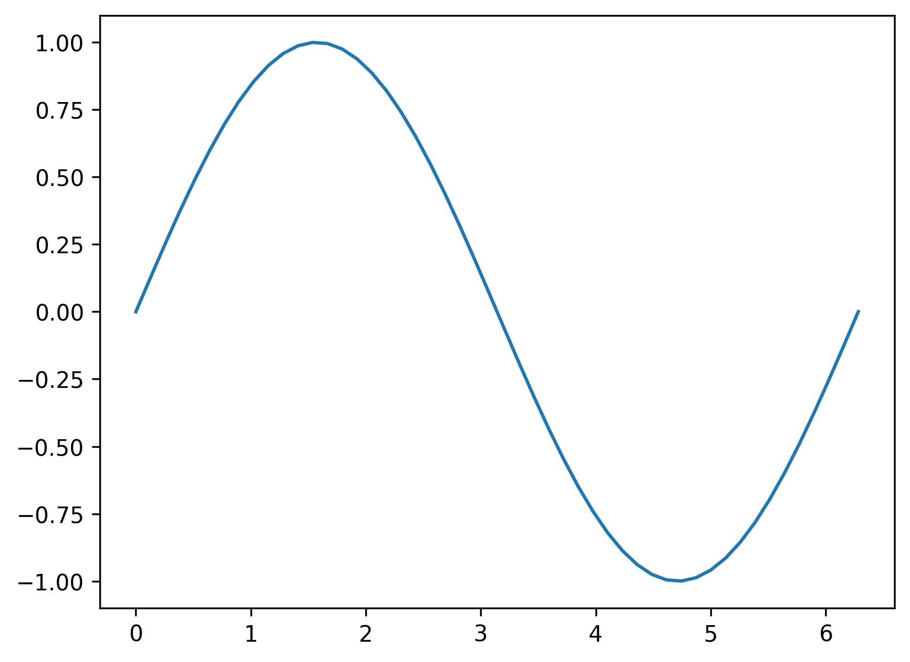
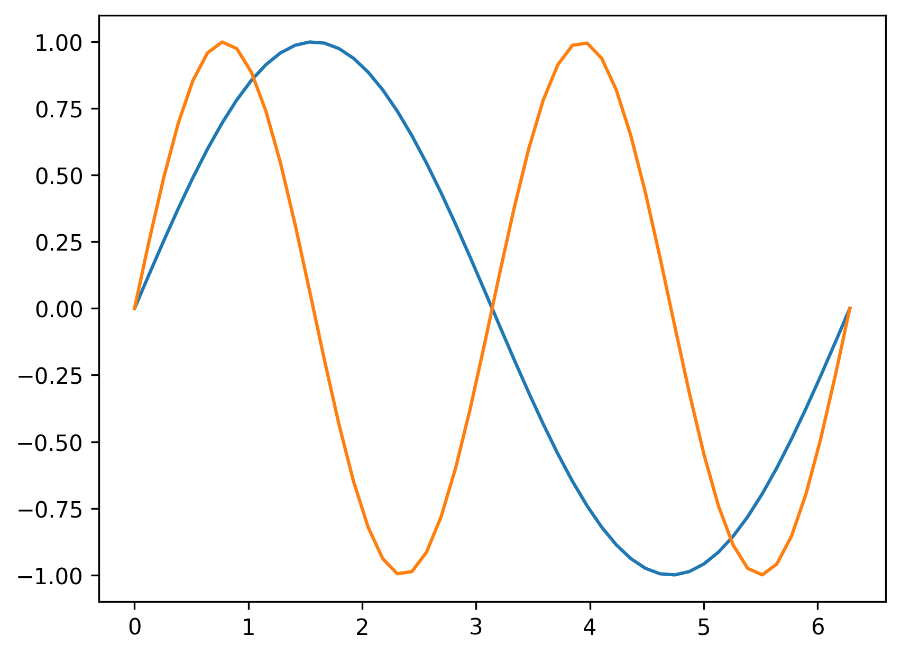
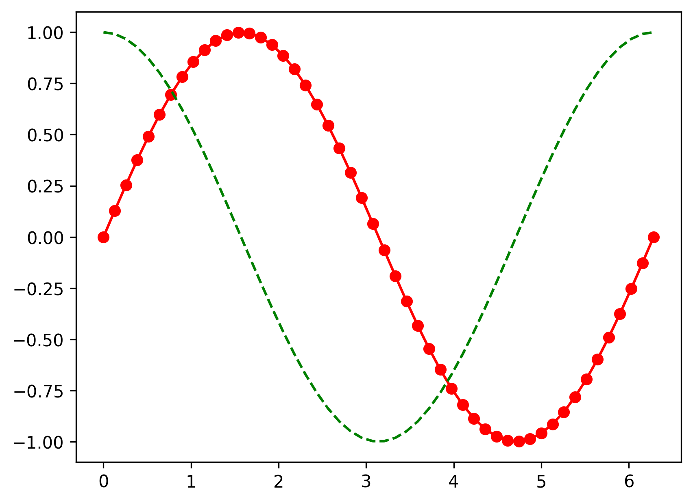
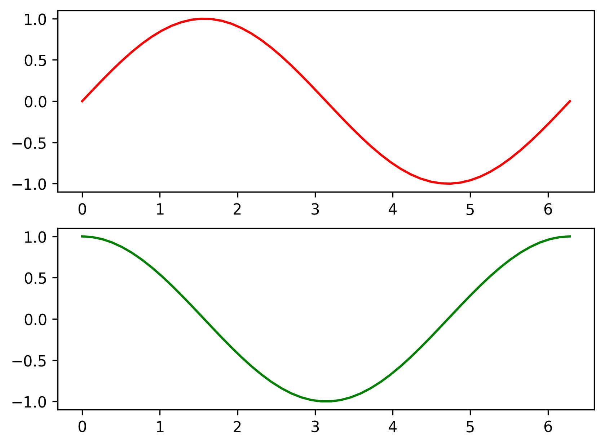
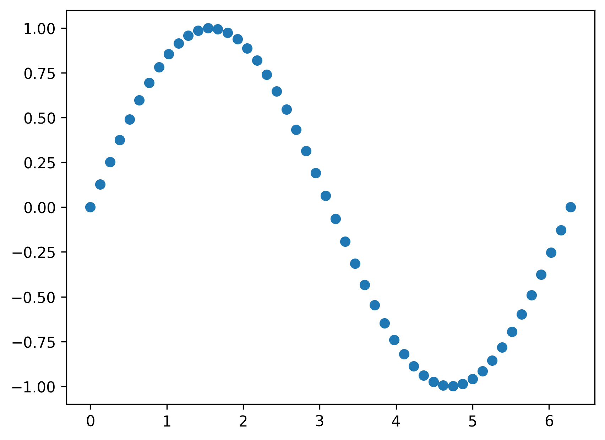
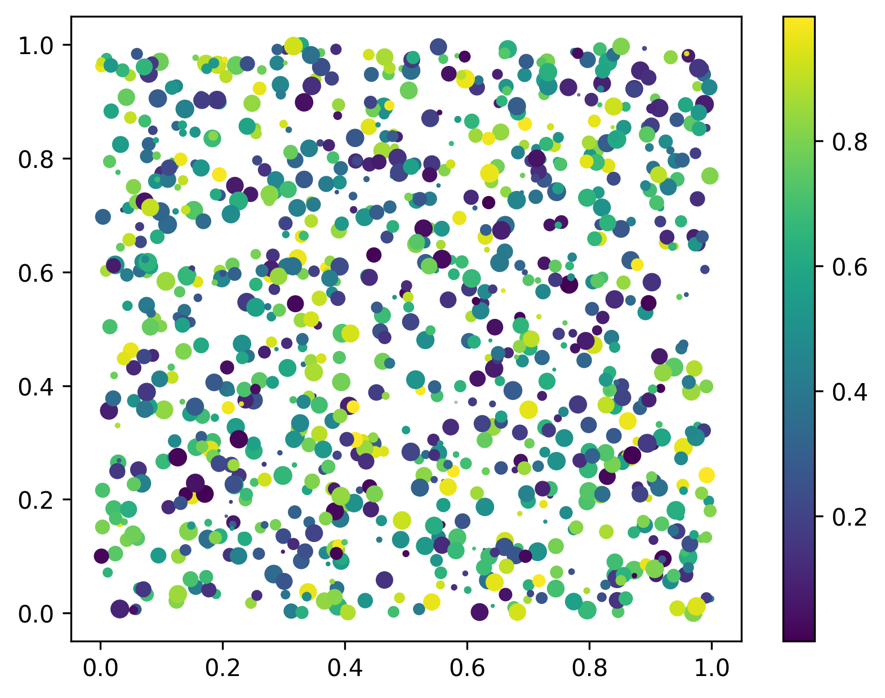
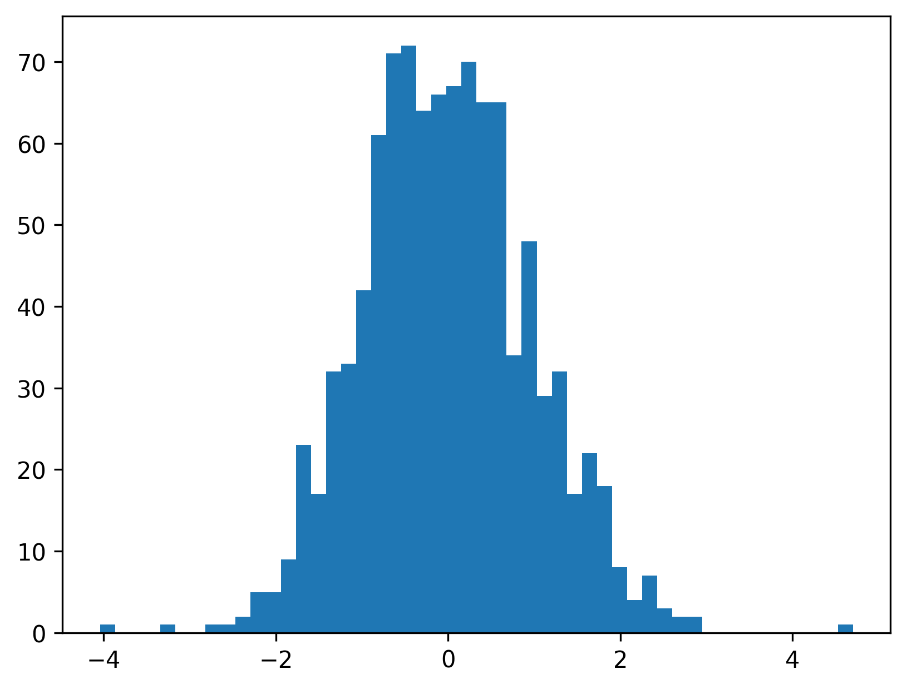
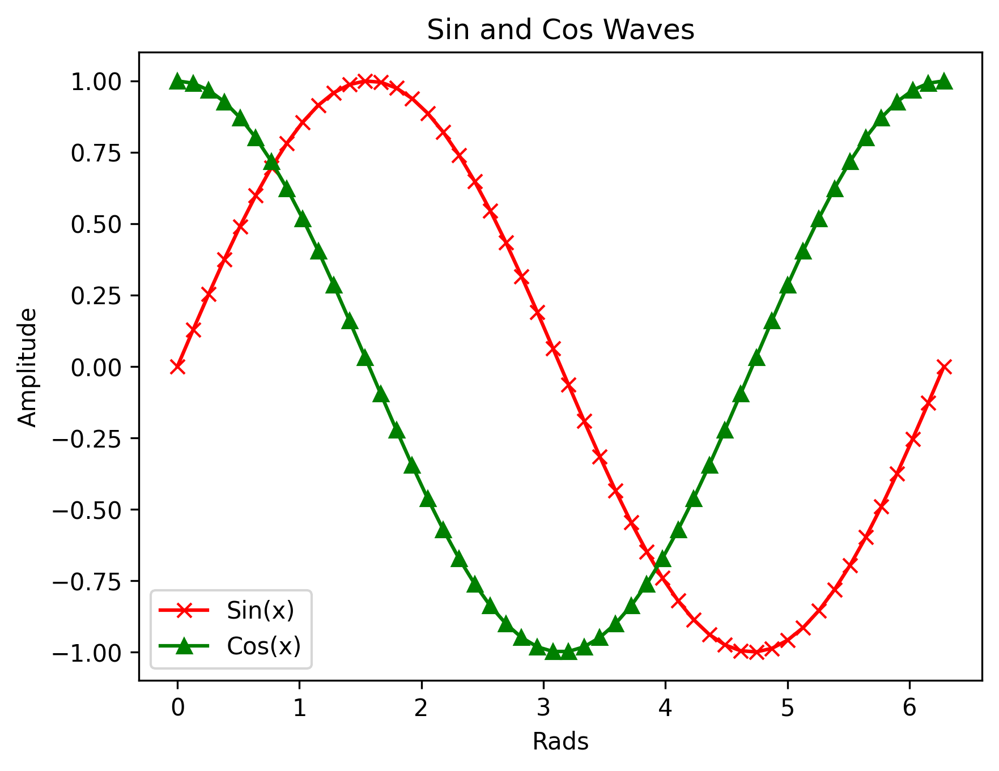

Matplotlib<br />Matplotlib 是 Python 的一个绘图库。它包含了大量的工具，可以使用这些工具创建各种图形，包括简单的散点图，正弦曲线，甚至是三维图形。Python 科学计算社区经常使用它完成数据可视化的工作。
<a name="yDkGC"></a>
## 画一个简单的图形
首先画一条在 [0, 2pi] 上的正弦曲线。在这里使用了 Numpy 库。
```python
import matplotlib.pyplot as plt
import numpy as np
```
以上这些就是将要用到的导入模块。 `from x import *` 是一种糟糕的导入方式。程序里重复书写 `matplotlib.pyplot` 和 `numpy`，这种书写方式过于冗长，因此采用了上面的折中写法。
```python
# 简单的绘图
x = np.linspace(0, 2 * np.pi, 50)
plt.plot(x, np.sin(x)) # 如果没有第一个参数 x，图形的 x 坐标默认为数组的索引
plt.show() # 显示图形
```
上面的代码将画出一个简单的正弦曲线。`np.linspace(0, 2 * np.pi, 50)` 这段代码将会生成一个包含 50 个元素的数组，这 50 个元素均匀的分布在 [0, 2pi] 的区间上。<br />`plot` 命令以一种简洁优雅的方式创建了图形。提醒一下，如果没有第一个参数 x，图形的 x 轴坐标将不再是 0 到 2pi，而应该是数组的索引范围。<br />最后一行代码 `plt.show()` 将图形显示出来，如果没有这行代码图像就不会显示。<br />运行代码后应该会类似得到下面的图形：<br />
<a name="huFv8"></a>
## 在一张图上绘制两个数据集
大多数时候可能更想在一张图上绘制多个数据集。用 Matplotlib 也可以轻松实现这一点。
```python
x = np.linspace(0, 2 * np.pi, 50)
plt.plot(x, np.sin(x),
        x, np.sin(2 * x))
plt.show()
```
上面的代码同时绘制了表示函数 sin(x) 和 sin(2x) 的图形。这段代码和前面绘制一个数据集的代码几乎完全相同，只有一点例外，这段代码在调用 `plt.plot()` 的时候多传入了一个数据集，并用逗号与第一个数据集分隔开。<br />最后会得到类似于下面包含两条曲线的图形：<br />
<a name="a0ul6"></a>
## 自定义图形的外观
当在同一个图形上展示多个数据集时，通过改变线条的外观来区分不同的数据集变得非常必要。
```python
# 自定义曲线的外观
x = np.linspace(0, 2 * np.pi, 50)
plt.plot(x, np.sin(x), 'r-o',
        x, np.cos(x), 'g--')
plt.show()
```
上述代码展示了两种不同的曲线样式：`'r-o'` 和 `'g--'`。字母 ‘r’ 和 ‘g’ 代表线条的颜色，后面的符号代表线和点标记的类型。例如 `'-o'` 代表包含实心点标记的实线，`'--'` 代表虚线。其他的参数可以自己去尝试。
> 颜色：<br />蓝色 - ‘b’<br />绿色 - ‘g’<br />红色 - ‘r’<br />青色 - ‘c’<br />品红 - ‘m’<br />黄色 - ‘y’<br />黑色 - ‘k’（’b’代表蓝色，所以这里用黑色的最后一个字母）<br />白色 - ‘w’
> 线：<br />直线 - ‘-‘<br />虚线 - ‘—‘<br />点线 - ‘:’<br />点划线 - ‘-.’
> 常用点标记<br />点 - ‘.’<br />像素 - ‘,’<br />圆 - ‘o’<br />方形 - ‘s’<br />三角形 - ‘^’<br />更多点标记样式点击这里

最后会得到类似下面的图形：<br />
<a name="MGkvi"></a>
## 使用子图
使用子图可以在一个窗口绘制多张图。
```python
# 使用子图
x = np.linspace(0, 2 * np.pi, 50)
plt.subplot(2, 1, 1) # （行，列，活跃区）
plt.plot(x, np.sin(x), 'r')
plt.subplot(2, 1, 2)
plt.plot(x, np.cos(x), 'g')
plt.show()
```
使用子图只需要一个额外的步骤，就可以像前面的例子一样绘制数据集。即在调用 `plot()` 函数之前需要先调用 `subplot()` 函数。该函数的第一个参数代表子图的总行数，第二个参数代表子图的总列数，第三个参数代表活跃区域。<br />活跃区域代表当前子图所在绘图区域，绘图区域是按从左至右，从上至下的顺序编号。例如在 4×4 的方格上，活跃区域 6 在方格上的坐标为 (2, 2)。<br />最终会得到类似下面的图形：<br />
<a name="ooore"></a>
## 简单的散点图
散点图是一堆离散点的集合。用 Matplotlib 画散点图也同样非常简单。
```python
# 简单的散点图
x = np.linspace(0, 2 * np.pi, 50)
y = np.sin(x)
plt.scatter(x,y)
plt.show()
```
正如上面代码所示，只需要调用 `scatter()` 函数并传入两个分别代表 x 坐标和 y 坐标的数组。注意，通过 `plot` 命令并将线的样式设置为 `'bo'` 也可以实现同样的效果。<br />最后会得到类似下面的无线图形：<br />
<a name="rI1QQ"></a>
## 彩色映射散点图
另一种可能用到的图形是彩色映射散点图。这里会根据数据的大小给每个点赋予不同的颜色和大小，并在图中添加一个颜色栏。
```python
# 彩色映射散点图
x = np.random.rand(1000)
y = np.random.rand(1000)
size = np.random.rand(1000) * 50
colour = np.random.rand(1000)
plt.scatter(x, y, size, colour)
plt.colorbar()
plt.show()
```
上面的代码大量的用到了 `np.random.rand(1000)`，原因是绘图的数据都是随机产生的。<br />同前面一样用到了 `scatter()` 函数，但是这次传入了另外的两个参数，分别为所绘点的大小和颜色。通过这种方式使得图上点的大小和颜色根据数据的大小产生变化。<br />然后用 `colorbar()` 函数添加了一个颜色栏。<br />最后会得到类似于下面的彩色散点图：<br />
<a name="j50dJ"></a>
## 直方图
直方图是另一种常见的图形，也可以通过几行代码创建出来。
```python
# 直方图
x = np.random.randn(1000)
plt.hist(x, 50)
plt.show()
```
直方图是 Matplotlib 中最简单的图形之一。只需要给 `hist()` 函数传入一个包含数据的数组。第二个参数代表数据容器的个数。数据容器代表不同的值的间隔，并用来包含数据。数据容器越多，图形上的数据条就越多。<br />最终会得到类似下面的直方图：<br />
<a name="ebTfL"></a>
## 标题，标签和图例
当需要快速创建图形时，可能不需要为图形添加标签。但是当构建需要展示的图形时，就需要添加标题，标签和图例。
```python
# 添加标题，坐标轴标记和图例
x = np.linspace(0, 2 * np.pi, 50)
plt.plot(x, np.sin(x), 'r-x', label='Sin(x)')
plt.plot(x, np.cos(x), 'g-^', label='Cos(x)')
plt.legend() # 展示图例
plt.xlabel('Rads') # 给 x 轴添加标签
plt.ylabel('Amplitude') # 给 y 轴添加标签
plt.title('Sin and Cos Waves') # 添加图形标题
plt.show()
```
为了给图形添加图例，需要在 `plot()` 函数中添加命名参数 `'label'` 并赋予该参数相应的标签。然后调用 `legend()` 函数就会在图形中添加图例。<br />接下来只需要调用函数 `title()`，`xlabel()` 和 `ylabel()` 就可以为图形添加标题和标签。<br />会得到类似于下面这张拥有标题、标签和图例的图形：<br />
