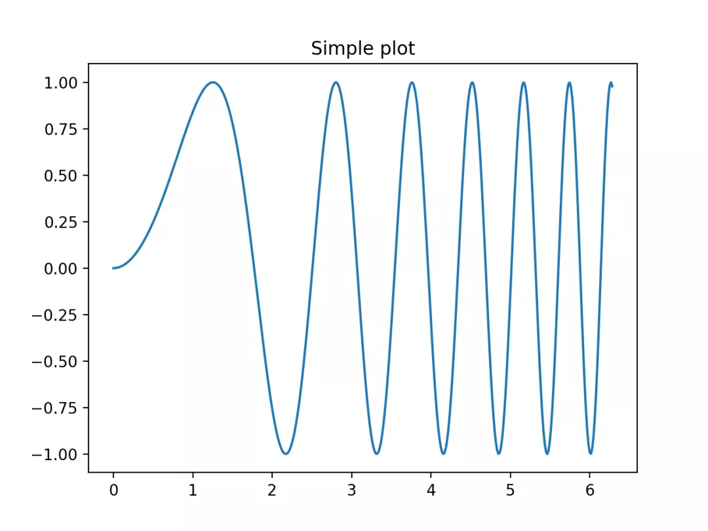

Python 可视化 Matplotlib<br />可以使用 pyplot 中的 `subplot()` 和 `subplots()` 方法来绘制多个子图。<br />`subpot()` 方法在绘图时需要指定位置，`subplots()` 方法可以一次生成多个，在调用时只需要调用生成对象的 ax 即可。
<a name="wUVGQ"></a>
### `subplot()`
`subplot(nrows, ncols, index, **kwargs)`<br />`subplot(pos, **kwargs)`<br />`subplot(**kwargs)`<br />`subplot(ax)`<br />以上函数将整个绘图区域分成 nrows 行和 ncols 列，然后从左到右，从上到下的顺序对每个子区域进行编号 1...N ，左上的子区域的编号为 1、右下的区域编号为 N，编号可以通过参数 index 来设置。<br />设置 `numRows ＝ 1`，`numCols ＝ 2`，就是将图表绘制成 1x2 的图片区域, 对应的坐标为：<br />(1, 1), (1, 2)<br />`plotNum ＝ 1`, 表示的坐标为(1, 1), 即第一行第一列的子图。<br />`plotNum ＝ 2`, 表示的坐标为(1, 2), 即第一行第二列的子图。
<a name="XrpmQ"></a>
#### 实例
```python
import matplotlib.pyplot as plt
import numpy as np

#plot 1:
xpoints = np.array([0, 6])
ypoints = np.array([0, 100])

plt.subplot(1, 2, 1)
plt.plot(xpoints,ypoints)
plt.title("plot 1")

#plot 2:
x = np.array([1, 2, 3, 4])
y = np.array([1, 4, 9, 16])

plt.subplot(1, 2, 2)
plt.plot(x,y)
plt.title("plot 2")

plt.suptitle("RUNOOB subplot Test")
plt.show()
```
显示结果如下：<br /><br />设置 `numRows ＝ 2`，`numCols ＝ 2`，就是将图表绘制成 2x2 的图片区域, 对应的坐标为：<br />(1, 1), (1, 2)(2, 1), (2, 2)<br />`plotNum ＝ 1`, 表示的坐标为(1, 1), 即第一行第一列的子图。<br />`plotNum ＝ 2`, 表示的坐标为(1, 2), 即第一行第二列的子图。<br />`plotNum ＝ 3`, 表示的坐标为(2, 1), 即第二行第一列的子图。<br />`plotNum ＝ 4`, 表示的坐标为(2, 2), 即第二行第二列的子图。
<a name="m1gPV"></a>
#### 实例
```python

import matplotlib.pyplot as plt
import numpy as np

#plot 1:
x = np.array([0, 6])
y = np.array([0, 100])

plt.subplot(2, 2, 1)
plt.plot(x,y)
plt.title("plot 1")

#plot 2:
x = np.array([1, 2, 3, 4])
y = np.array([1, 4, 9, 16])

plt.subplot(2, 2, 2)
plt.plot(x,y)
plt.title("plot 2")

#plot 3:
x = np.array([1, 2, 3, 4])
y = np.array([3, 5, 7, 9])

plt.subplot(2, 2, 3)
plt.plot(x,y)
plt.title("plot 3")

#plot 4:
x = np.array([1, 2, 3, 4])
y = np.array([4, 5, 6, 7])

plt.subplot(2, 2, 4)
plt.plot(x,y)
plt.title("plot 4")

plt.suptitle("RUNOOB subplot Test")
plt.show()
```
显示结果如下：<br />
<a name="arGvS"></a>
### `subplots()`
`subplots()` 方法语法格式如下：
```python
matplotlib.pyplot.subplots(nrows=1, ncols=1, *, sharex=False, sharey=False, squeeze=True, subplot_kw=None, gridspec_kw=None, **fig_kw)
```
参数说明：

- `nrows`：默认为 1，设置图表的行数。
- `ncols`：默认为 1，设置图表的列数。
- `sharex`、`sharey`：设置 x、y 轴是否共享属性，默认为 false，可设置为 `'none'`、`'all'`、`'row'` 或 `'col'`。`False` 或 `none` 每个子图的 x 轴或 y 轴都是独立的，True 或 `'all'`：所有子图共享 x 轴或 y 轴，`'row'` 设置每个子图行共享一个 x 轴或 y 轴，`'col'`：设置每个子图列共享一个 x 轴或 y 轴。
- `squeeze`：布尔值，默认为 `True`，表示额外的维度从返回的 Axes(轴)对象中挤出，对于 N*1 或 1*N 个子图，返回一个 1 维数组，对于 N*M，N>1 和 M>1 返回一个 2 维数组。如果设置为 False，则不进行挤压操作，返回一个元素为 Axes 实例的2维数组，即使它最终是1x1。
- `subplot_kw`：可选，字典类型。把字典的关键字传递给 `add_subplot()` 来创建每个子图。
- `gridspec_kw`：可选，字典类型。把字典的关键字传递给 GridSpec 构造函数创建子图放在网格里(grid)。
- `**fig_kw`：把详细的关键字参数传给 `figure()` 函数。
<a name="Jk2ZU"></a>
#### 实例
```python

import matplotlib.pyplot as plt
import numpy as np

# 创建一些测试数据 -- 图1
x = np.linspace(0, 2*np.pi, 400)
y = np.sin(x**2)

# 创建一个画像和子图 -- 图2
fig, ax = plt.subplots()
ax.plot(x, y)
ax.set_title('Simple plot')

# 创建两个子图 -- 图3
f, (ax1, ax2) = plt.subplots(1, 2, sharey=True)
ax1.plot(x, y)
ax1.set_title('Sharing Y axis')
ax2.scatter(x, y)

# 创建四个子图 -- 图4
fig, axs = plt.subplots(2, 2, subplot_kw=dict(projection="polar"))
axs[0, 0].plot(x, y)
axs[1, 1].scatter(x, y)

# 共享 x 轴
plt.subplots(2, 2, sharex='col')

# 共享 y 轴
plt.subplots(2, 2, sharey='row')

# 共享 x 轴和 y 轴
plt.subplots(2, 2, sharex='all', sharey='all')

# 这个也是共享 x 轴和 y 轴
plt.subplots(2, 2, sharex=True, sharey=True)

# 创建10 张图，已经存在的则删除
fig, ax = plt.subplots(num=10, clear=True)

plt.show()
```
部分图表显示结果如下：<br />图1<br /><br />图2<br /><br />图3<br /><br />图4<br />
