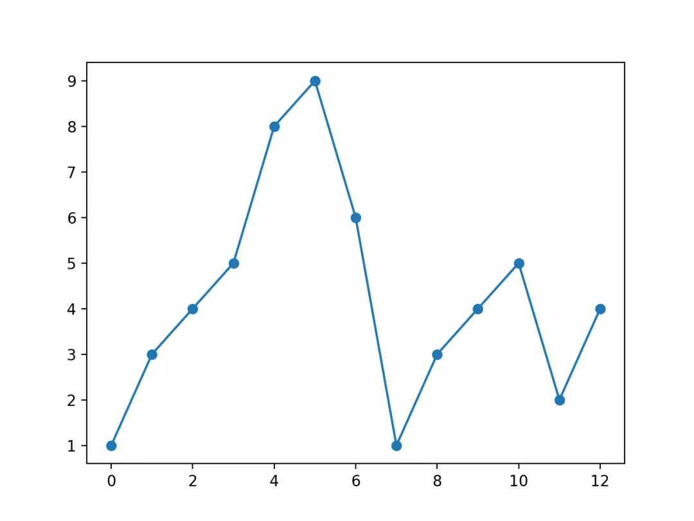
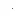
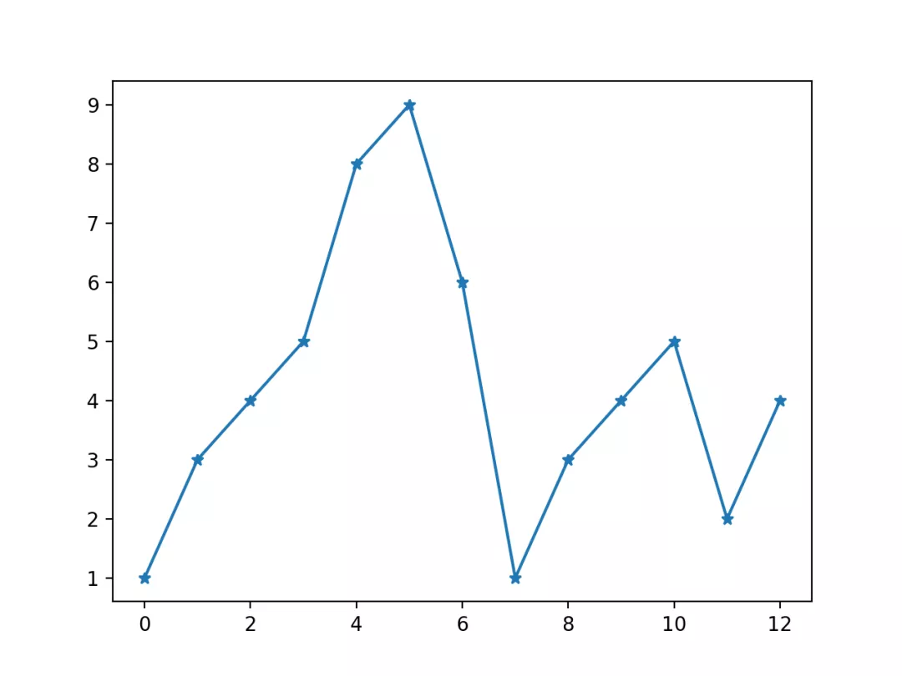
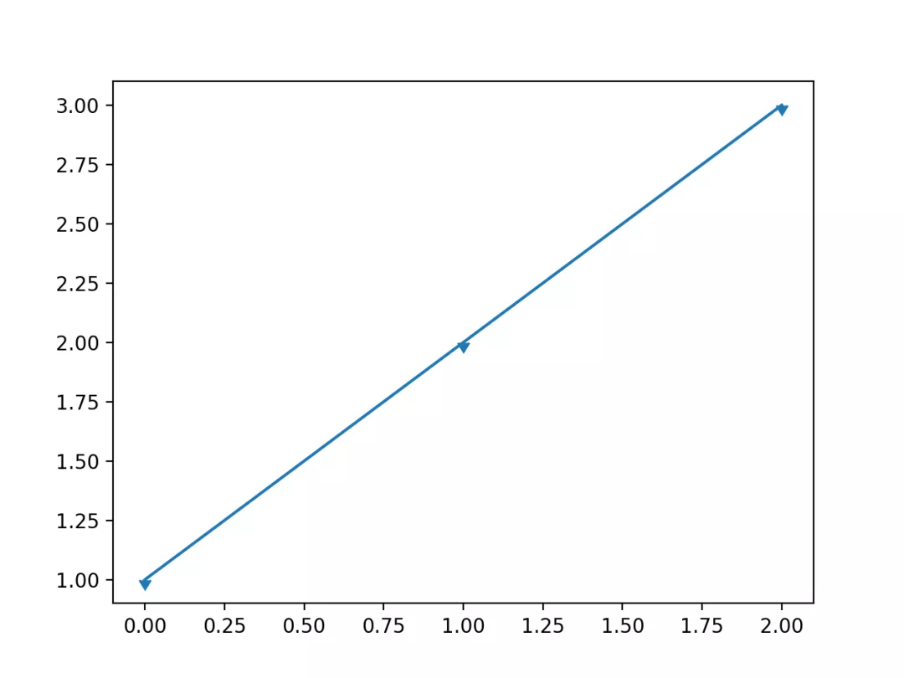
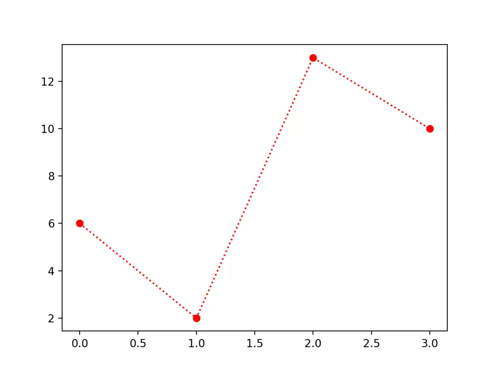
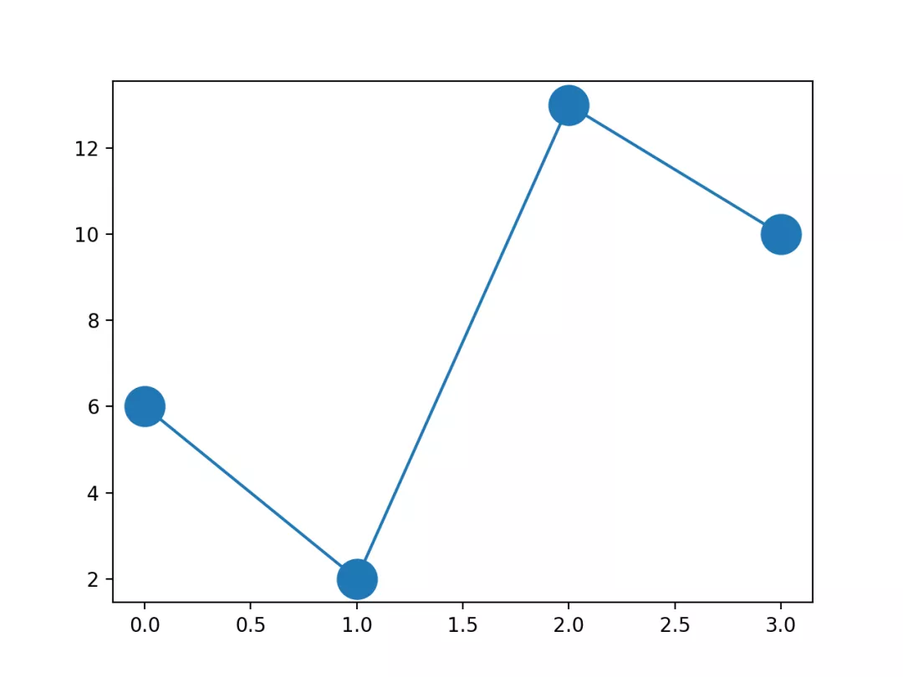
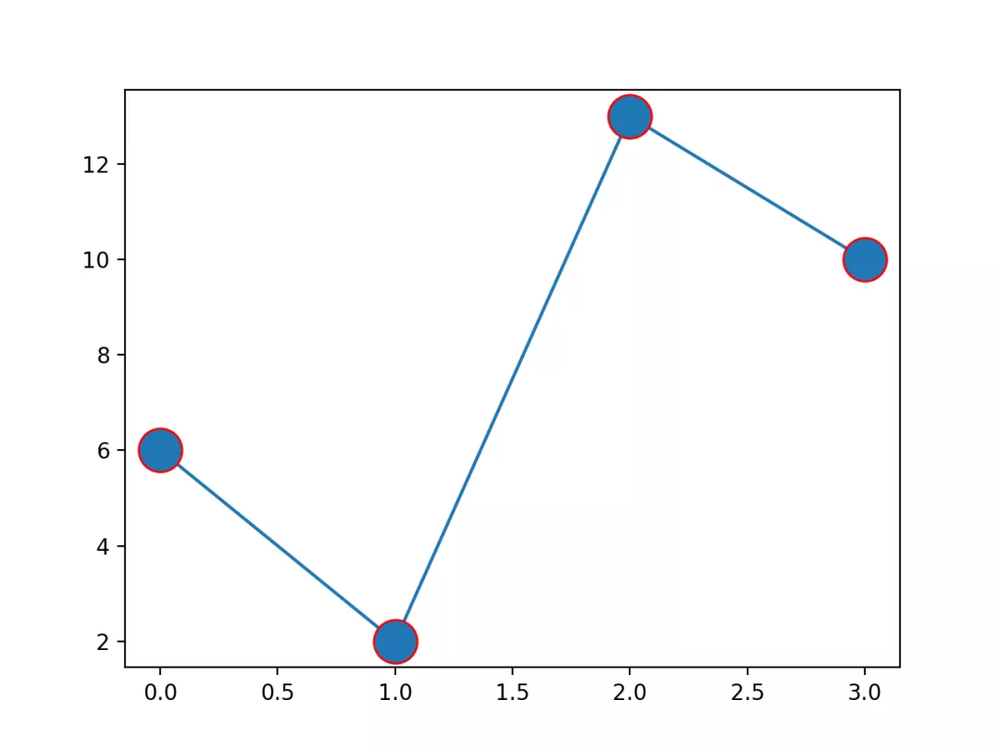
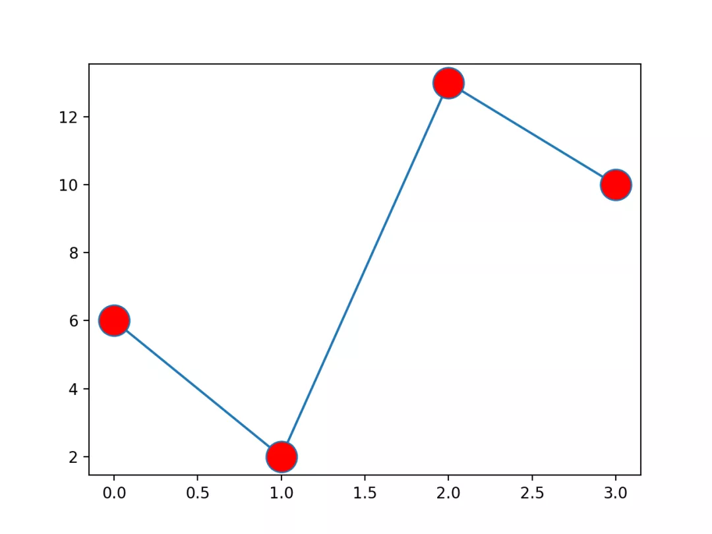
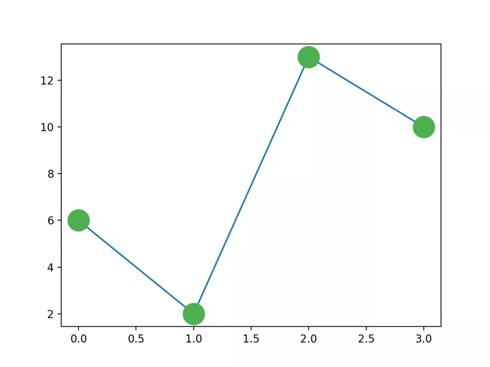

Python Matplotlib 可视化<br />绘图过程如果想要给坐标自定义一些不一样的标记，就可以使用 `plot()` 方法的 `marker` 参数来定义。
<a name="WjKu6"></a>
## 实心圆标记
```python
import matplotlib.pyplot as plt
import numpy as np
ypoints = np.array([1,3,4,5,8,9,6,1,3,4,5,2,4])
plt.plot(ypoints, marker = 'o')
plt.show()
```
显示结果如下：<br /><br />`marker` 可以定义的符号如下：

| 标记 | 符号 | 描述 |
| --- | --- | --- |
| "." |  | 点 |
| "," |  | 像素点 |
| "o" |  | 实心圆 |
| "v" |  | 下三角 |
| "^" |  | 上三角 |
| "<" |  | 左三角 |
| ">" |  | 右三角 |
| "1" |  | 下三叉 |
| "2" |  | 上三叉 |
| "3" |  | 左三叉 |
| "4" |  | 右三叉 |
| "8" |  | 八角形 |
| "s" |  | 正方形 |
| "p" |  | 五边形 |
| "P" |  | 加号（填充） |
| "*" |  | 星号 |
| "h" |  | 六边形 1 |
| "H" |  | 六边形 2 |
| "+" |  | 加号 |
| "x" |  | 乘号 x |
| "X" |  | 乘号 x (填充) |
| "D" |  | 菱形 |
| "d" |  | 瘦菱形 |
| "&#124;" |  | 竖线 |
| "_" |  | 横线 |
| 0 (TICKLEFT) |  | 左横线 |
| 1 (TICKRIGHT) |  | 右横线 |
| 2 (TICKUP) |  | 上竖线 |
| 3 (TICKDOWN) |  | 下竖线 |
| 4 (CARETLEFT) |  | 左箭头 |
| 5 (CARETRIGHT) |  | 右箭头 |
| 6 (CARETUP) |  | 上箭头 |
| 7 (CARETDOWN) |  | 下箭头 |
| 8 (CARETLEFTBASE) |  | 左箭头 (中间点为基准) |
| 9 (CARETRIGHTBASE) |  | 右箭头 (中间点为基准) |
| 10 (CARETUPBASE) |  | 上箭头 (中间点为基准) |
| 11 (CARETDOWNBASE) |  | 下箭头 (中间点为基准) |
| "None", " " or "" | <br /> | 没有任何标记 |
| '$...$' |  | 渲染指定的字符。例如 "$f$" 以字母 f 为标记。 |

<a name="rOVds"></a>
##  `*` 标记
```python
import matplotlib.pyplot as plt
import numpy as np
ypoints = np.array([1,3,4,5,8,9,6,1,3,4,5,2,4])
plt.plot(ypoints, marker = '*')
plt.show()
```
显示结果如下：<br />
<a name="YYry7"></a>
## 下箭头
```python
import matplotlib.pyplot as plt
import matplotlib.markers
plt.plot([1, 2, 3], marker=matplotlib.markers.CARETDOWNBASE)
plt.show()
```
显示结果如下：<br />
<a name="se2xu"></a>
## fmt 参数
fmt 参数定义了基本格式，如标记、线条样式和颜色。
```python
fmt = '[marker][line][color]'
```
例如 o:r，o 表示实心圆标记，: 表示虚线，r 表示颜色为红色。
<a name="dFn96"></a>
### 实例
```python
import matplotlib.pyplot as plt
import numpy as np
ypoints = np.array([6, 2, 13, 10])
plt.plot(ypoints, 'o:r')
plt.show()
```
显示结果如下：<br />
<a name="jphua"></a>
### 线类型
| 线类型标记 | 描述 |
| --- | --- |
| '-' | 实线 |
| ':' | 虚线 |
| '--' | 破折线 |
| '-.' | 点划线 |

<a name="m4R8y"></a>
### 颜色类型
| 颜色标记 | 描述 |
| --- | --- |
| 'r' | 红色 |
| 'g' | 绿色 |
| 'b' | 蓝色 |
| 'c' | 青色 |
| 'm' | 品红 |
| 'y' | 黄色 |
| 'k' | 黑色 |
| 'w' | 白色 |

<a name="ineSx"></a>
## 标记大小与颜色
可以自定义标记的大小与颜色，使用的参数分别是：

- `markersize`，简写为 ms：定义标记的大小。
- `markerfacecolor`，简写为 mfc：定义标记内部的颜色。
- `markeredgecolor`，简写为 mec：定义标记边框的颜色。
<a name="NCC8b"></a>
### 设置标记大小
```python
import matplotlib.pyplot as plt
import numpy as np
ypoints = np.array([6, 2, 13, 10])
plt.plot(ypoints, marker = 'o', ms = 20)
plt.show()
```
显示结果如下：<br />
<a name="QP7dk"></a>
### 设置标记外边框颜色
```python
import matplotlib.pyplot as plt
import numpy as np
ypoints = np.array([6, 2, 13, 10])
plt.plot(ypoints, marker = 'o', ms = 20, mec = 'r')
plt.show()
```
显示结果如下：<br />
<a name="h40Lh"></a>
### 设置标记内部颜色
```python
import matplotlib.pyplot as plt
import numpy as np
ypoints = np.array([6, 2, 13, 10])
plt.plot(ypoints, marker = 'o', ms = 20, mfc = 'r')
plt.show()
```
显示结果如下：<br />
<a name="zktv0"></a>
### 自定义标记内部与边框的颜色
```python
import matplotlib.pyplot as plt
import numpy as np
ypoints = np.array([6, 2, 13, 10])
plt.plot(ypoints, marker = 'o', ms = 20, mec = '#4CAF50', mfc = '#4CAF50')
plt.show()
```
显示结果如下：<br />
