Python Matplotlib 可视化<br />Matplotlib是一个用于生成出版级质量图表（通常是二维的）的桌面绘图包。该项目由John Hunter于2002年发起，目的在于在Python环境下进行MATLAB风格的绘图。Matplotlib和IPython社区合作简化了IPython shell（目前是 Jupyter笔记本）的交互式绘图。Matplotlib支持所有操作系统上的各种GUI后端，还可以将可视化导出为所有常见的矢量和光栅图形格式(PDF，SVG，JPG，PNG，BMP，GIF等)。<br />随着时间的推移，Matplotlib已经产生了一些数据可视化的附加工具包，使用matplotlib进行底层绘图。<br />学习以下示例代码最简单的方式就是在Jupyter notebook中使用交互式绘图。在进行设置时，需要在Jupyter notebook中执行以下语句：
```python
%matplotlib notebook 
```
<a name="k0vrc"></a>
## 1、简明matplotlib API入门
在使用Matplotlib时，使用以下的导入惯例：
```python
In [11]: import matplotlib.pyplot as plt
```
在Jupyter中运行`%matplotlib notebook` (或在IPython中运行`%matplotlib` )，就可以尝试生成一个简单的图形。如果所有的设置都正确，则一个像图1的图形就会出现：
```python
In [12]: import numpy as np
In [13]: data = np.arange(10)
In [14]: data
Out[14]: array([0, 1, 2, 3, 4, 5, 6, 7, 8, 9])
In [15]: plt.plot(data)
```
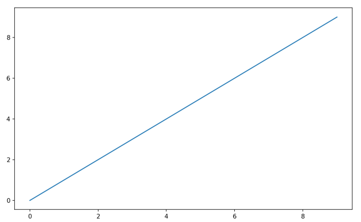<br />▲图1 简单的线性图<br />尽管seaborn等库和pandas内建的绘图函数可以处理大部分绘图的普通细节，但如果想在提供的函数选项之外进行定制则需要学习一些matplotlib的AIP<br />本文没有足够的篇幅来对Matplotlib的功能宽度和深度进行全面介绍。Matplotlib的可视化作品库和文档是学习高级功能的最佳资源。
<a name="wffDo"></a>
## 2、图片与子图
Matplotlib所绘制的图位于图片(Figure)对象中。可以使用`plt.figure`生成一个新的图片：
```python
In [16]: fig = plt.figure()
```
在IPython中，一个空白的绘图窗口就会出现，但在Jupyter中则没有任何显示，直到使用一些其他命令。plt.figure有一些选项，比如figsize是确保图片有一个确定的大小以及存储到硬盘时的长宽比。<br />不能使用空白的图片进行绘图。需要使用`add_subplot`创建一个或多个子图(subplot)：
```python
In [16]: fig = plt.figure()
In [17]: ax1 = fig.add_subplot(2, 2, 1)
```
上面代码的意思是图片应该是2*2的(最多四个图形)，并且选择了四个图形中的第一个(序号从1开始)。如果接着创建了两个子图，将会获得看上去类似图2的可视化：
```python
In [18]: ax2 = fig.add_subplot(2, 2, 2)
In [19]: ax3 = fig.add_subplot(2, 2, 3)
```
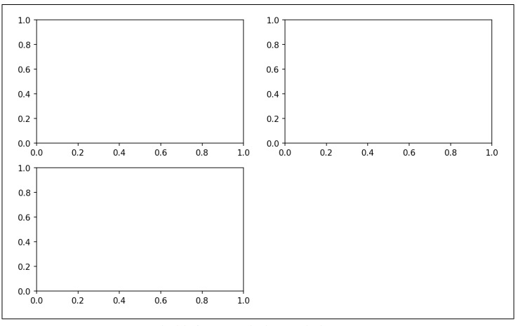<br />▲图2 一个带有三个子图的空白matplotlib图片<br />使用Jupyter notebook时有个细节需要注意，在每个单元格运行后，图表被重置，因此对于更复杂的图表，必须将所有的绘图命令放在单个的notebook单元格中。<br />将下面这些代码在同一个单元格中运行：
```python
fig = plt.figure()
ax1 = fig.add_subplot(2, 2, 1)
ax2 = fig.add_subplot(2, 2, 2)
ax3 = fig.add_subplot(2, 2, 3)
```
当输入绘图命令`plt.plot([1.5, 3.5, -2, 1.6])` ，Matplotlib会在最后一个图片和子图(如果需要的话就创建一个)上进行绘制，从而隐藏图片和子图的创建。因此，如果添加了下面的代码，会得到形如图3的可视化：
```python
In [20]: plt.plot(np.random.randn(50).cumsum(), 'k--')
```
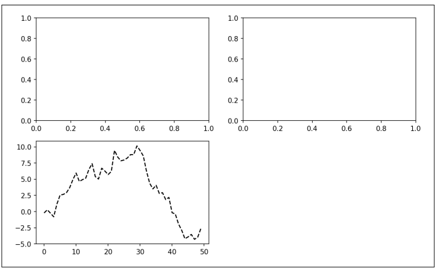<br />▲图3 单个子图绘制的数据可视化<br />`'k--'`是用于绘制黑色分段线的style选项。`fig.add_subplot`返回的对象是AxesSubplot对象，使用这些对象可以直接在其他空白的子图上调用对象的实例方法进行绘图(参考图4)：
```python
In [21]: _ = ax1.hist(np.random.randn(100), bins=20, color='k', alpha=0.3)
In [22]: ax2.scatter(np.arange(30), np.arange(30) + 3 * np.random.randn(30))
```
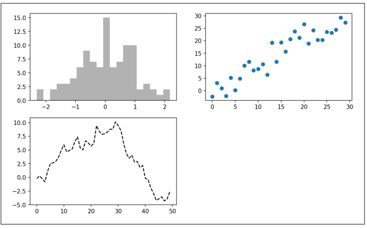<br />▲图4 增加子图后的数据可视化<br />可以在Matplotlib的官方文档中找到完整的图形类型。<br />使用子图网络创建图片是非常常见的任务，所以Matplotlib包含了一个便捷方法`plt.subplots`，它创建一个新的图片，然后返回要给包含了已生成子图对象的NumPy数组：
```python
In [24]: fig, axes = plt.subplots(2, 3)
In [25]: axes
Out[25]:
array([[<matplotlib.axes._subplots.AxesSubplot object at 0x7fb626374048>,
<matplotlib.axes._subplots.AxesSubplot object at 0x7fb62625db00>,
<matplotlib.axes._subplots.AxesSubplot object at 0x7fb6262f6c88>],
[<matplotlib.axes._subplots.AxesSubplot object at 0x7fb6261a36a0>,
<matplotlib.axes._subplots.AxesSubplot object at 0x7fb626181860>,
<matplotlib.axes._subplots.AxesSubplot object at 0x7fb6260fd4e0>]], dtype
=object)
```
| 参数 | 描述 |
| --- | --- |
| `nrows` | 子图的行数 |
| `ncols` | 子图的列数 |
| `sharex` | 所有子图使用相同的x轴刻度(调整xlim会影响所有子图) |
| `sharey` | 所有子图使用相同的y轴刻度(调整ylim会影响所有子图) |
| `subplot_kw` | 传入add_subplot的关键字参数字典，用于生成子图 |
| `**fig_kw` | 在生成图片时使用的额外关键字参数，例如`plt.subplots(2, 2,  figsize=(8,6))` |

▲表1 pyplot.subplots选项
<a name="o6X3A"></a>
### 调整子图周围的间距
默认情况下，Matplotlib会在子图的外部和子图之间留出一定的间距。这个间距都是相对于图的高度和宽度来指定的，所以如果通过编程或手动使用GUI窗口来调整图的大小，那么图就会自动调整。 可以使用图对象上的`subplots_adjust`方法更改间距，也可以用作顶层函数：
```python
subplots_adjust(left=None, bottom=None, right=None, top=None, wspace=None, hspace=None) 
```
wspace和hspace分别控制的是图片的宽度和高度百分比，以用作子图间的间距。下面是一个小例子，将这个间距一直缩小到零(见图5) ：
```python
fig, axes = plt.subplots(2, 2, sharex=True, sharey=True)
for i in range(2):
for j in range(2):
axes[i, j].hist(np.random.randn(500), bins=50, color='k', alpha=0.5)
plt.subplots_adjust(wspace=0, hspace=0)
```
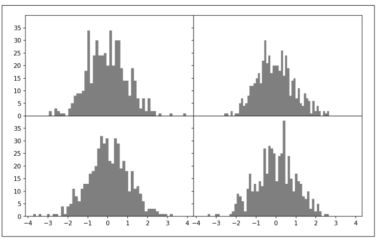<br />▲图5 没有内部子图间隔的数据可视化<br />可能会注意到轴标签是存在重叠的。Matplotlib并不检查标签是否重叠，因此在类似情况下需要通过显式指定刻度位置和刻度标签的方法来修复轴标签。
<a name="AY9jp"></a>
## 3、颜色、标记和线类型
Matplotlib的主函数`plot`接收带有`x`和`y`轴的数组以及一些可选的字符串缩写参数来指明颜色和线类型。例如，要用绿色破折号绘制x对y的线，需要执行：
```python
ax.plot(x, y, 'g--')
```
这种在字符串中指定颜色和线条样式的方式是方便的; 在实践中，如果以编程方式创建绘图，则可能不希望将字符串混合在一起以创建具有所需样式的图表。 同样的图表可以使用更为显式的方式来表达：
```python
ax.plot(x, y, 'g--')
ax.plot(x, y, linestyle='--', color='g')
```
有很多颜色缩写被用于常用颜色，但是可以通过指定十六进制颜色代码的方式来指定任何颜色(例如'#CECECE' )。参考plot函数的文档字符串可以看到全部的线类型(在IPython或Jupyter中使用plot? )。<br />折线图还可以有标记用来凸显实际的的数据点。由于matplotlib创建了一个连续性折线图，插入点之间有时并不清除点在哪。标记可以是样式字符串的一部分，样式字符串中线类型、标记类型必须跟在颜色后面(参考图6)：
```python
In [30]: from numpy.random import randn
In [31]: plt.plot(randn(30).cumsum(), 'ko--')
```
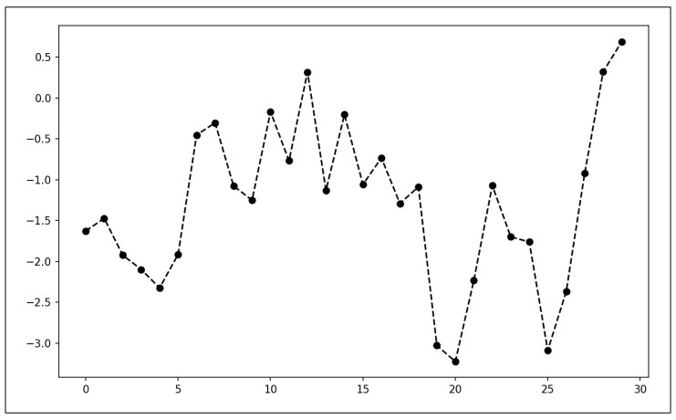<br />▲图6 带有标记的折线图<br />上面的代码可以写的更为显式：
```python
plot(randn(30).cumsum(), color='k', linestyle='dashed', marker='o')
```
对于折线图，注意到后续的点默认是线性内插的。可以通过`drawstyle`选项进行更改(图7)：
```python
In [33]: data = np.random.randn(30).cumsum()
In [34]: plt.plot(data, 'k--', label='Default')
Out[34]: [<matplotlib.lines.Line2D at 0x7fb624d86160>]
In [35]: plt.plot(data, 'k-', drawstyle='steps-post', label='steps-post')
Out[35]: [<matplotlib.lines.Line2D at 0x7fb624d869e8>]
In [36]: plt.legend(loc='best')
```
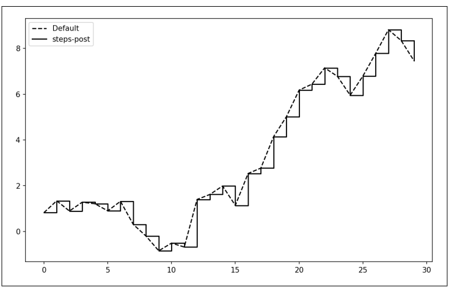<br />▲图7 不同drawstyle选项下的折线图<br />可能会注意到在运行代码后会有像 这样的输出。Matplotlib返回的对象引用了刚刚添加的图表子组件。很多时候可以安全地忽略这些输出。这里，由于向plot传递了label，可以使用`plt.lengend`为每条线生成一个用于区分的图例。<br />无论在用数据绘图时是否传递了lebel选项，都必须调用`plt.lengend`(如果有轴的引用，也可以用`ax.legend`)来生成图例来生成图例。
<a name="dnRn2"></a>
## 4、刻度、标签和图例
对于大多数图表修饰工作，有两种主要的方式：使用程序性的`pyplot`接口（即`matplotlib.pyplot`）和更多面向对象的原生Matplotlib API。<br />pyplot接口设计为交互式使用，包含了像`xllim`、`xtick`和`xtcklabels`等方法。这些方法分别控制了绘图范围、刻度位置以及刻度标签。可以在两种方式中使用：

- 在没有函数参数的情况下调用，返回当前的参数值(例如`plt.xlim()`返回当前的x轴绘图范围 )。
- 传入参数的情况下调用，并设置参数值(例如`plt.xlim([0, 10])`会将x轴的范围设置为0到10)。

所有的这些方法都会在当前活动的或最近创建的AxeSubplot上生效。这些方法中的每一个对应于子图自身的两个方法；比如xlim对应于`ax.get_lim`和`ax.set_lim`。更倾向于使用subplot的实例方法，因为这样更为显式(尤其是在处理多个子图时)，当然可以使用自己觉得更为方便的方式。
<a name="w2Jye"></a>
### 1. 设置标题、轴标签、刻度和刻度标签
为了讲解轴的自定义，生成一个简单图表，并绘制随机漫步(参考图8)：
```python
In [37]: fig = plt.figure()
In [38]: ax = fig.add_subplot(1, 1, 1)
In [39]: ax.plot(np.random.randn(1000).cumsum())
```
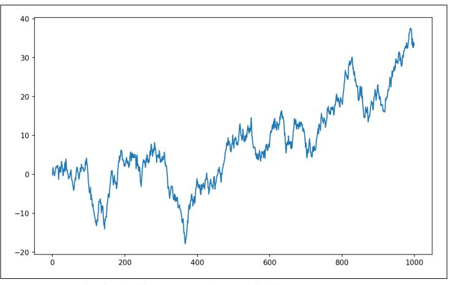<br />▲图8 表述x轴(以及轴标签)的简单图表<br />要改变x轴刻度，最简单的方式是使用`set_xticks`和`set_xticklebels`。`set_xticks`表示在数据范围内设定刻度的位置；默认情况下，这些刻度也有标签。但是可以使用`set_xticklabels`为标签赋值：
```python
In [40]: ticks = ax.set_xticks([0, 250, 500, 750, 1000])
In [41]: labels = ax.set_xticklabels(['one', 'two', 'three', 'four', 'five'],
....: rotation=30, fontsize='small')
```
`rotation`选项会将x轴刻度标签旋转30度。最后，`set_xlabel`会给`x`轴一个名称，`set_titel`会给子图一个标题(参考图9的结果图)：
```python
In [42]: ax.set_title('My first matplotlib plot')
Out[42]: <matplotlib.text.Text at 0x7fb624d055f8>
In [43]: ax.set_xlabel('Stages')
```
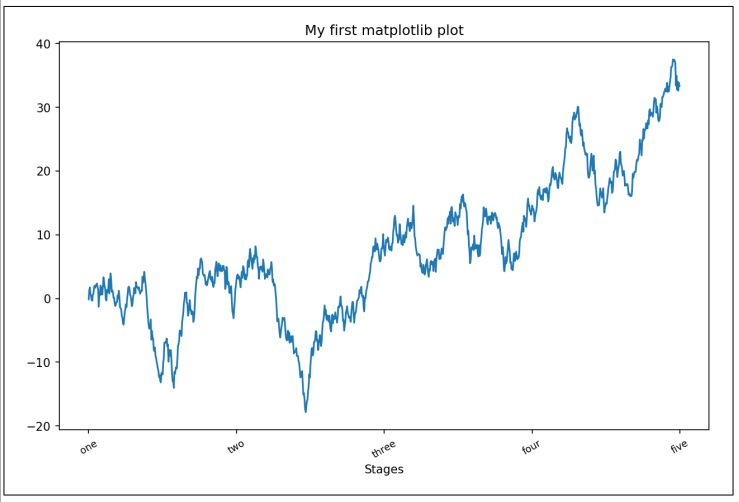<br />▲图9 x轴刻度的简单示例<br />修改y轴坐标是相同过程，将上面示例中的x替换成y即可。轴的类型拥有一个set方法，允许批量设置绘图属性。根据之前的示例，可以写如下代码：
```python
props = {
'title': 'My first matplotlib plot',
'xlabel': 'Stages'
}
ax.set(**props)
```
<a name="VYwdZ"></a>
### 2. 添加图例
图例是用来区分绘图元素的重要内容。有多种方式可以添加图例。最简单的方式是在添加每个图表时传递label参数：
```python
In [44]: from numpy.random import randn
In [45]: fig = plt.figure(); ax = fig.add_subplot(1, 1, 1)
In [46]: ax.plot(randn(1000).cumsum(), 'k', label='one')
Out[46]: [<matplotlib.lines.Line2D at 0x7fb624bdf860>]
In [47]: ax.plot(randn(1000).cumsum(), 'k--', label='two')
Out[47]: [<matplotlib.lines.Line2D at 0x7fb624be90f0>]
In [48]: ax.plot(randn(1000).cumsum(), 'k.', label='three')
Out[48]: [<matplotlib.lines.Line2D at 0x7fb624be9160>]
```
一旦运行了上面的代码，也可以调用`ax.legend()`或`plt.legend`自动生成图例。结果图表参见图10：
```python
In [49]: ax.legend(loc='best')
```
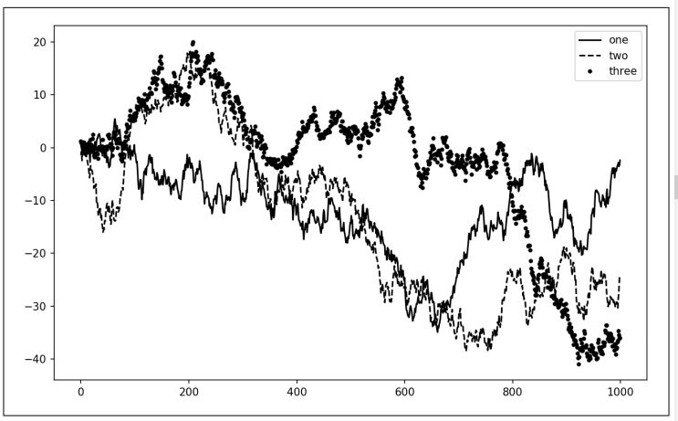<br />▲图10 有三根折线和图例的简单图表<br />`legend`方法有多个其他的位置参数loc。参考文档字符串(使用`ax.legend`?命令)获取更多信息。<br />loc参数告诉Matplotlib在哪里放置图表。如果不挑剔，`'best'`是一个好选项，它会自动选择最合适的位置。如果取消图例中的元素，不要传入label参数或者传入`label='_nolegend_'`。
<a name="rOWT8"></a>
## 5、注释与子图加工
除了标准的绘图类型，可能还会想在图表上绘制自己的注释，而且注释中可能会包含文本、箭头以及其他图形。可以使用`text`、`arrow`和`annote`方法来添加注释和文本。`text`在图表上给定的坐标(x, y)，根据可选的定制样式绘制文本：
```python
ax.text(x, y, 'Hello world!',
family='monospace', fontsize=10)
```
注释可以同时绘制文本和箭头。作为一个例子，绘制标普500指数从2007年来的收盘价(从雅虎财经获得数据)，并在图表中标注从2008到2009年金融危机中的重要日期。可以在Jupyter notebook的一个单元格中复现这些代码。参考图11的代码运行结果：
```python
from datetime import datetime
fig = plt.figure()
ax = fig.add_subplot(1, 1, 1)
data = pd.read_csv('examples/spx.csv', index_col=0, parse_dates=True)
spx = data['SPX']
spx.plot(ax=ax, style='k-')
crisis_data = [
    (datetime(2007, 10, 11), 'Peak of bull market'),
    (datetime(2008, 3, 12), 'Bear Stearns Fails'),
    (datetime(2008, 9, 15), 'Lehman Bankruptcy')
]
for date, label in crisis_data:
    ax.annotate(label, xy=(date, spx.asof(date) + 75),
                xytext=(date, spx.asof(date) + 225),
                arrowprops=dict(facecolor='black', headwidth=4, width=2,
                                headlength=4),
                horizontalalignment='left', verticalalignment='top')
    # 放大2007 - 2010年
    ax.set_xlim(['1/1/2007', '1/1/2011'])
    ax.set_ylim([600, 1800])
    ax.set_title('Important dates in the 2008-2009 financial crisis')
```
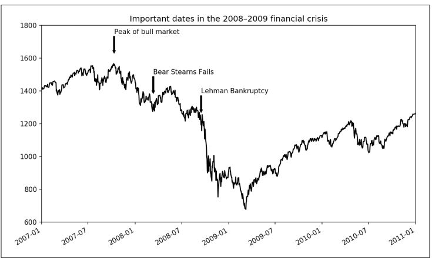<br />▲图11 2008-2009金融危机中的重要日期<br />在图表中有一些重要点需要凸显：`ax.annotate`方法可以在指定的x和y坐标上绘制标签。可以使用`set_xlim`和`set_ylim`方法手动设置图表的边界，而不是使用Matplotlib的默认设置。最后，`ax.set_title`会图表添加了一个主标题。<br />参考在线的Matplotlib展览馆，可以学习更多注释的范例。<br />绘制图形时有更多需要注意的地方。Matplotlib含有表示多种常见图形的对象，这些对象的引用是patches。一些图形，比如Rectangle(矩形)和Circle(圆形)，可以在`matplotlib.pyplot`中找到，但图形的全集位于`matplotlib.patches`。<br />想在图表中添加图形时，需要生成patch(补丁)对象shp，并调用`ax.add_patch(shp)`将它加入到子图中(参考图12)：
```python
fig = plt.figure()
ax = fig.add_subplot(1, 1, 1)
rect = plt.Rectangle((0.2, 0.75), 0.4, 0.15, color='k', alpha=0.3)
circ = plt.Circle((0.7, 0.2), 0.15, color='b', alpha=0.3)
pgon = plt.Polygon([[0.15, 0.15], [0.35, 0.4], [0.2, 0.6]],
color='g', alpha=0.5)
ax.add_patch(rect)
ax.add_patch(circ)
ax.add_patch(pgon)
```
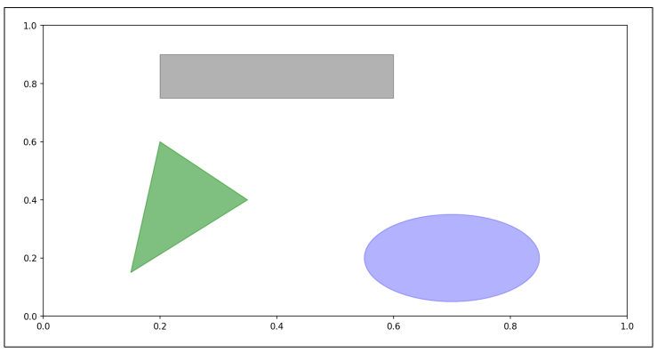<br />▲图12 三种个不同patch图形的可视化<br />当看到很多常见绘图类型的实现时，可以发现他们都是从patches中组装而来。
<a name="tY9hY"></a>
## 6、将图片保存到文件
可以使用`plt.savefig`将活动图片保存到文件。这个方法等价于图片对象的`savefig`实例方法。例如将图片保存为SVG，只需要输入以下代码：
```python
plt.savefig('figpath.svg')
```
文件类型是从文件扩展名中推断出来的。 所以如果使用`.pdf`，则会得到一个PDF。 使用几个重要的选项来发布图形：dpi，它控制每英寸点数的分辨率; `bbox_inches`，可以修剪实际图形的空白。 为了得到同样一个PNG图片，且使用最小的空白，拥有400 DPI，需要运行以下代码：
```python
plt.savefig('figpath.png', dpi=400, bbox_inches='tight')
```
`savefig`并一定是写到硬盘的，它可以将图片写入到所有的文件型对象中，例如`BytesIO`：
```python
from io import BytesIO
buffer = BytesIO()
plt.savefig(buffer)
plot_data = buffer.getvalue()
```
表2是`savefig`其他选项的列表：

| 参数 | 描述 |
| --- | --- |
| `fname` | 包含文件路径或Python文件型对象的字符串。 图片格式是从文件扩展名中推断出来的(例如PDF格式的.pdf或PNG的.png格式) |
| `dpi` | 每英寸点数的分辨率; 默认为100，但可以配置 |
| `facecolor,edgecolor` | 子图之外的图形背景的颜色;默认情况下是'w'(白色) |
| `format` | 文件格式( ('png', 'pdf', 'svg', 'ps', 'eps',  ... ) |
| `bbox_inches` | 要保存的图片范围；如果传递'pass'，将会去除掉图片周围空白的部分 |

▲表2 Figure.savefig选项
<a name="EOl26"></a>
## 7、Matplotlib设置
Matplotlib配置了配色方案和默认设置，主要用来准备用于发布的图片。 幸运的是，几乎所有的默认行为都可以通过广泛的全局参数来定制，包括图形大小、子图间距、颜色、字体大小和网格样式等等。使用`rc`方法是使用Python编程修改配置的一种方式; 例如，要将全局默认数字大小设置为10×10，可以输入：
```python
plt.rc('figure', figsize=(10, 10))
```
`rc`的第一个参数是想要自定义的组件，比如`'figure'`、`'axes'`、`'xtick'`、`'ytick'`、`'grid'`、`'legend'`等等。 之后，可以按照关键字参数的序列指定新参数。字典是一种在程序中设置选项的简单方式：
```python
font_options = {'family' : 'monospace',
'weight' : 'bold',
'size' : 'small'}
plt.rc('font', **font_options)
```
如果需要更深入的定制和参看全量选项，可以参考matplotlib的设置文件matplotlibrc，该文件位于matplotlib/mpl-data路径。如果定制了这个文件，并将他放置在home路径下并且文件名为.matplotlibrc，则每次使用Matplotlib时都会读取该文件。

