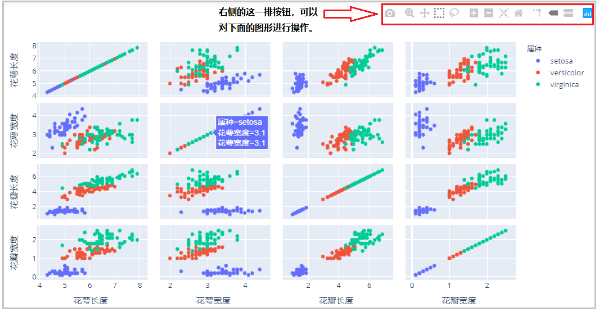
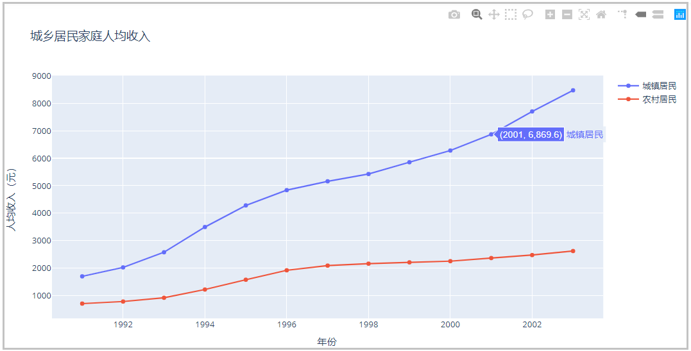
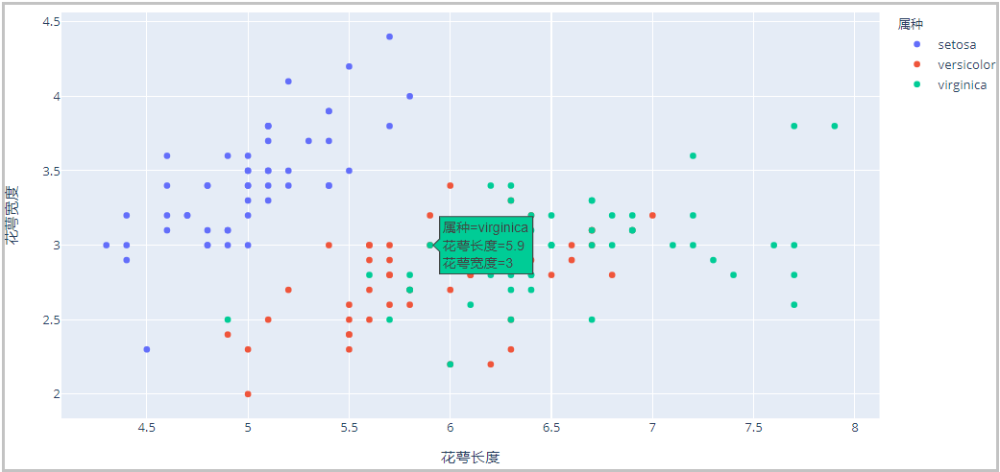
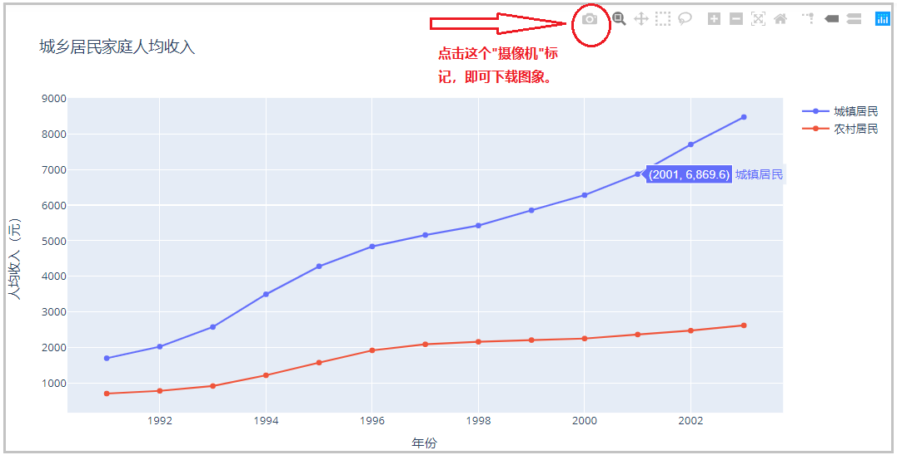
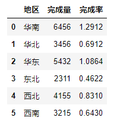
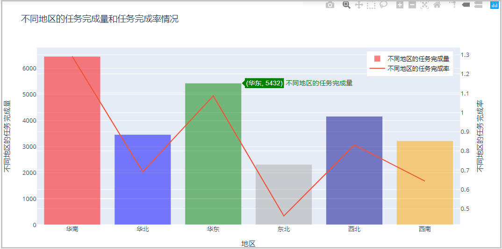
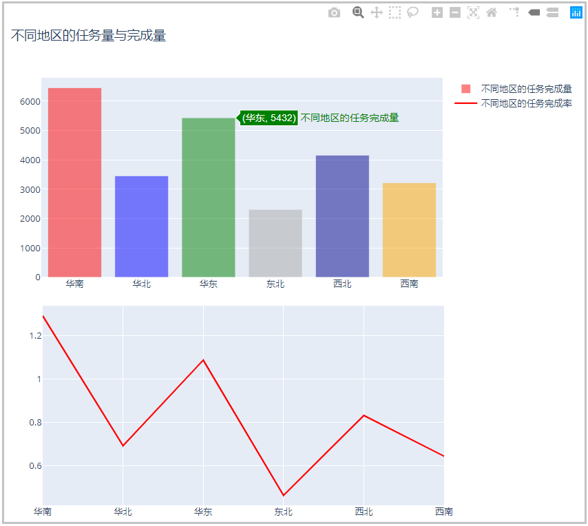

Python
<a name="Q3LQU"></a>
## 1、plotly库的相关介绍
<a name="bF7hA"></a>
### 1）相关说明

- plotly是一个基于JavaScript的绘图库，plotly绘图种类丰富，效果美观；
- 易于保存与分享plotly的绘图结果，并且可以与Web无缝集成；
- ploty默认的绘图结果，是一个HTML网页文件，通过浏览器可以直接查看；


<a name="x5vbN"></a>
### 2）plotly与matplotlib、seaborn的关系
需要注意的是，ployly绘图库与matplotlib绘图库、seaborn绘图库并没有什么关系。也就是说说plotly是一个单独的绘图库，有自己独特的绘图语法、绘图参数和绘图原理，因此需要单独学习它。
<a name="l8ijE"></a>
## 2、导入相关库
对于做数据分析的人员来说，一般用的都是离线绘图库。在线绘图库需要的话，可以自己百度研究。
```python
import os
import numpy as np
import pandas as pd

import plotly as py
import plotly.graph_objs as go
import plotly.expression as px
from plotly import tools

import warnings
warnings.filterwarnings("ignore")
```
<a name="LBD0C"></a>
## 3、plotly绘图原理
<a name="U2shV"></a>
### 1）ployly常用的两个绘图模块：graph_objs和expression
graph_objs和expression是plotly里面两个很常用的绘图库，graph_objs相当于matplotlib，在数据组织上比较费劲，但是仍然比起matplotlib绘图更简单、更好看。这里说的费劲是相对于expression库来说的。expression库相当于seaborn的地位，在数据组织上较为容易，绘图比起seaborn来说，也更加容易。这里有个印象即可。<br />对于graph_objs绘图库，常命名为go(`import plotly.graph_objs as go`)；对于expression绘图库，常命名为px(`import plotly.expression as px`)。
<a name="crD4i"></a>
### 2）`graph_objs("go")`库的绘图原理
<a name="dn4ys"></a>
#### ① 简单的案例说明
```python
df = pd.read_excel("plot.xlsx")
# 步骤一
trace0 = go.Scatter(x=df["年份"],y=df["城镇居民"],name="城镇居民")
trace1 = go.Scatter(x=df["年份"],y=df["农村居民"],name="农村居民")
# 步骤二
data = [trace0,trace1]
# 步骤三
fig = go.Figure(data)
# 步骤四
fig.update_layout(
    title="城乡居民家庭人均收入",
    xaxis_title="年份",
    yaxis_title="人均收入（元）"
)
# 步骤五
fig.show()
```
结果如下：<br />
<a name="naQjv"></a>
#### ② 原理说明

- 1、绘制图形轨迹，在ployly里面叫做trace，每一个轨迹是一个trace。
- 2、将轨迹包裹成一个列表，形成一个轨迹列表。一个轨迹放在一个列表中，多个轨迹也是放在一个列表中。
- 3、创建画布的同时，并将上述的轨迹列表，传入到Figure()中。
- 4、使用Layout添加其他的绘图参数，完善图形。
- 5、展示图形。
<a name="yjImy"></a>
### 3）`expression("px")`库的绘图原理
<a name="PTtaw"></a>
#### ① 简单的案例说明
```python
iris = pd.read_excel("iris.xlsx",sheet_name="Sheet2")

fig = px.scatter(iris,x="花萼长度",y="花萼宽度",color="属种")
fig.show()
```
结果如下：<br />
<a name="MushU"></a>
#### ② 原理说明

- 1、直接使用px调用某个绘图方法时，会自动创建画布，并画出图形。
- 2、展示图形。 
<a name="yiRrj"></a>
## 4、保存图形的两种方式
<a name="cQoNK"></a>
### 1）直接下载下来：保存成png静态图片

<a name="mqiOz"></a>
### 2）使用`py.offline.plot(fig,filename="XXX.html")`代码保存成html网页动态图片。
```python
iris = pd.read_excel("iris.xlsx",sheet_name="Sheet2")

fig = px.scatter(iris,x="花萼长度",y="花萼宽度",color="属种")
py.offline.plot(fig,filename="iris1.html")
```
结果如下：该文件是一个html文件，这里上传不了，自己下去尝试一下就知道了。
<a name="Bu3WY"></a>
### 3）总结说明
使用“照相机”那个下载按钮，可以直接将图片下载保存在本地，但是这个图片是一个静态图片，没有交互性。但是使用`py.offline.plot()`方法，可以将图片保存成一个html的网页格式，其他人可以在电脑上直接打开这个html网页，并且保留了图片的原始样式，具有交互性。 
<a name="gUyyX"></a>
## 5、绘制双y轴图
<a name="SAukC"></a>
### 1）数据集如下

<a name="mDI8H"></a>
### 2）绘制不同地区的“任务完成量”和“任务完成率”情况
```python
df = pd.read_excel("double_y.xlsx")

x = df["地区"]
y1 = df["完成量"]
y2 = df["完成率"]

trace0 = go.Bar(x=x,y=y1,
                marker=dict(color=["red","blue","green","darkgrey","darkblue","orange"]),
                opacity=0.5,
               name="不同地区的任务完成量")

trace1 = go.Scatter(x=x,y=y2,
                    mode="lines",
                    name="不同地区的任务完成率",
                    # 【步骤一】：使用这个参数yaxis="y2"，就是绘制双y轴图
                    yaxis="y2")

data = [trace0,trace1]

layout = go.Layout(title="不同地区的任务完成量和任务完成率情况",
                   xaxis=dict(title="地区"),
                   yaxis=dict(title="不同地区的任务完成量"),
                   # 【步骤二】：给第二个y轴，添加标题，指定第二个y轴，在右侧。
                   yaxis2=dict(title="不同地区的任务完成率",overlaying="y",side="right"),
                   legend=dict(x=0.78,y=0.98,font=dict(size=12,color="black")))

fig = go.Figure(data=data,layout=layout)
fig.show()
```
结果如下：<br />
<a name="tO6Tm"></a>
## 6、绘制多子图
<a name="PMt82"></a>
### 1）相关库和方法介绍

- 1、绘制多个子图，需要先导入tools库。`from plotly import tools`
- 2、`tools.make_subplots(rows= ,cols=)`用于指定绘图布局，rows和cols表示将画布布局成几行几列。
- 3、`fig.append_trace()`将每个图形轨迹trace，绘制在不同的位置上。
<a name="mZIAD"></a>
### 2）分别绘制不同地区的“任务完成量”和“任务完成率”情况
```python
# 步骤一：导入相关库
from plotly import tools
# 步骤二：指定绘图布局
fig = tools.make_subplots(rows=2,cols=1)
# 步骤三：绘制图形轨迹
trace0 = go.Bar(x=x,y=y1,
                marker=dict(color=["red","blue","green","darkgrey","darkblue","orange"]),
                opacity=0.5,
                name="不同地区的任务完成量")       
trace1 = go.Scatter(x=x,y=y2,
                    mode="lines",
                    name="不同地区的任务完成率",
                    line=dict(width=2,color="red"))
 # 步骤四：将第一个轨迹，添加到第1行的第1个位置
 #        将第二个轨迹，添加到第2行的第1个位置                  
fig.append_trace(trace0,1,1)
fig.append_trace(trace1,2,1)
# 步骤四：根据自己的需求，给图形添加标题。height、width参数用于指定图形的宽和高
fig.update_layout(title="不同地区的任务量与完成量",height=800,width=800)
# 步骤五：展示图形
fig.show()
```
结果如下：<br />
