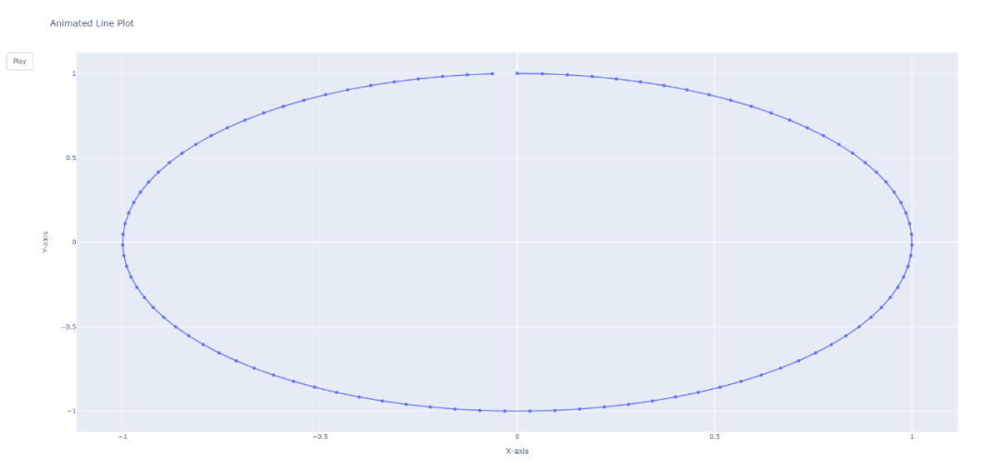

数据可视化是数据分析和探索的一个重要方面，它有助于深入了解数据集中的潜在模式、趋势和关系。 <br />Plotly则是一个功能强大且多功能的Python库，提供了广泛的工具来创建交互式且具有视觉吸引力的绘图。<br />它支持多种图表类型，包括散点图、折线图、条形图等。<br />Plotly的独特之处在于它能够生成交互式图表，允许用户动态缩放、平移数据并与数据交互。<br />使用pip命令进行安装。
```bash
pip install plotly
```
接下来，就来一起学习下~
<a name="bRSm8"></a>
## 1、基本线条图
```python
import plotly.graph_objects as go
import numpy as np

# 生成示例数据
x = np.linspace(0, 10, 100)
y = np.sin(x)

# 创建一个基本的线条图
fig = go.Figure(data=go.Scatter(x=x, y=y, mode='lines'))

# 添加标题和标签
fig.update_layout(title='Basic Line Plot', xaxis_title='X-axis', yaxis_title='Y-axis')

# 显示图表
fig.show()
```
<br />使用Plotly创建一个简单的线条图。<br />使用NumPy生成样本数据，然后使用Plotly的`go.Scatter`创建线条图。
<a name="rXeNE"></a>
## 2、带有颜色渐变的散点图
```python
import plotly.express as px
import pandas as pd
import numpy as np

# 生成示例数据
np.random.seed(42)
df = pd.DataFrame({'X': np.random.rand(50), 'Y': np.random.rand(50), 'Size': np.random.rand(50) * 30})

# 创建散点图带颜色渐变
fig = px.scatter(df, x='X', y='Y', size='Size', color='Size', title='Scatter Plot with Color Gradient')

# 显示图表
fig.show()
```
<br />使用Plotly Express创建带有渐变颜色的散点图。<br />size和color参数在图中表示第三个维度。
<a name="qsw2s"></a>
## 3、3D曲面图
```python
import plotly.graph_objects as go
import numpy as np

# 生成示例数据
x = np.linspace(-5, 5, 100)
y = np.linspace(-5, 5, 100)
x, y = np.meshgrid(x, y)
z = np.sin(np.sqrt(x**2 + y**2))

# 创建3D曲面图
fig = go.Figure(data=[go.Surface(z=z, x=x, y=y)])

# 添加标题和标签
fig.update_layout(title='3D Surface Plot', scene=dict(xaxis_title='X-axis', yaxis_title='Y-axis', zaxis_title='Z-axis'))

# 显示图表
fig.show()
```
<br />使用示例数据和go.Figure创建3D曲面图。
<a name="GzvwA"></a>
## 4、动画线条图
```python
import plotly.graph_objects as go
import numpy as np

# 生成动画数据
t = np.linspace(0, 2 * np.pi, 100)
x = np.sin(t)
y = np.cos(t)

# 创建动画线条图
fig = go.Figure(data=go.Scatter(x=[0], y=[0], mode='lines'), layout=go.Layout(updatemenus=[dict(type='buttons', showactive=False, buttons=[dict(label='Play', method='animate', args=[None, dict(frame=dict(duration=100, redraw=True), fromcurrent=True)])])]))

# 添加动画帧
frames = [go.Frame(data=go.Scatter(x=x[:i], y=y[:i], mode='lines+markers')) for i in range(2, len(t))]
fig.frames = frames

# 添加标题和标签
fig.update_layout(title='Animated Line Plot', xaxis_title='X-axis', yaxis_title='Y-axis', updatemenus=[dict(type='buttons', showactive=False, buttons=[dict(label='Play', method='animate', args=[None, dict(frame=dict(duration=100, redraw=True), fromcurrent=True)])])])

# 显示图表
fig.show()
```
<br /><br />这个例子演示了如何使用Plotly创建一个动画线条图。<br />动画由播放按钮控制，并随着时间的推移添加帧以更新情节。
<a name="dFwXp"></a>
## 5、气泡图
```python
import plotly.express as px

# 生成示例数据
df = px.data.gapminder().query("year == 2007")

# 创建气泡图
fig = px.scatter_geo(df, locations='iso_alpha', size='pop', hover_name='country', title='Bubble Map')

# 显示图表
fig.show()
```
<br />使用Plotly Express使用来自Gapminder数据集的数据创建一个气泡地图。<br />每个气泡的大小代表一个国家的人口。
<a name="hM513"></a>
## 6、小提琴图
```python
import plotly.express as px
import seaborn as sns

# 加载示例数据
tips = sns.load_dataset('tips')

# 创建小提琴图
fig = px.violin(tips, y='total_bill', x='day', box=True, points="all", title='Violin Plot')

# 显示图表
fig.show()
```
<br />使用Plotly Express创建小提琴图，数据集分布统计情况。<br />该图显示了每天总账单的分布情况。
<a name="tvCod"></a>
## 7、旭日图
```python
import plotly.express as px

# 生成示例数据
df = px.data.tips()

# 创建旭日图
fig = px.sunburst(df, path=['sex', 'day', 'time'], values='total_bill', title='Sunburst Chart')

# 显示图表
fig.show()
```
<br />旭日图的层次结构由path参数定义，值由分段的大小表示。
<a name="QLnSA"></a>
## 8、热力图
```python
import plotly.express as px
import numpy as np

# 生成示例数据
np.random.seed(42)
corr_matrix = np.random.rand(10, 10)

# 创建热力图
fig = px.imshow(corr_matrix, labels=dict(x="X-axis", y="Y-axis", color="Correlation"), title='Heatmap with Annotations')

# 显示图表
fig.show()
```
<br />labels参数允许自定义轴标签和colorbar标签。
<a name="dtudW"></a>
## 9、雷达图
```python
import plotly.graph_objects as go
import pandas as pd

# 生成示例数据
categories = ['Speed', 'Reliability', 'Comfort', 'Safety', 'Efficiency']
values = [90, 60, 85, 70, 80]

# 创建雷达图
fig = go.Figure()
fig.add_trace(go.Scatterpolar(
    r=values,
    theta=categories,
    fill='toself',
    name='Product A'
))

# 添加标题
fig.update_layout(title='Radar Chart')

# 显示图表
fig.show()
```
<br />图表表示单个数据点(产品a)的多个属性(类别)。
<a name="tVk0L"></a>
## 10、分级统计图
```python
import plotly.express as px

# 生成示例数据
df = px.data.gapminder().query("year == 2007")

# 创建分级统计图
fig = px.choropleth(df, locations='iso_alpha', color='gdpPercap', hover_name='country', title='Choropleth Map')

# 显示图表
fig.show()
```
<br />这个例子演示了如何使用Plotly Express创建一个choropleth地图。<br />颜色强度代表每个国家的人均GDP。
<a name="c0fSL"></a>
## 11、自定义布局
```python
import plotly.graph_objects as go

# 生成示例数据
x = [1, 2, 3, 4, 5]
y = [10, 11, 12, 13, 14]

# 创建自定义柱状图
fig = go.Figure(data=go.Bar(x=x, y=y, marker_color='orange'))

# 自定义配置
fig.update_layout(title='Customized Bar Chart', xaxis_title='X-axis', yaxis_title='Y-axis', font=dict(family='Arial', size=12))

# 显示图表
fig.show()
```
<br />这里创建了一个具有自定义布局的柱状图。更新布局方法允许设置标题、轴标签和字体样式。
<a name="uJFho"></a>
## 12、子图
```python
import plotly.subplots as sp
import plotly.graph_objects as go

# 生成示例数据
x = [1, 2, 3, 4, 5]
y1 = [10, 11, 12, 13, 14]
y2 = [14, 13, 12, 11, 10]

# 创建子图
fig = sp.make_subplots(rows=2, cols=1, shared_xaxes=True, subplot_titles=['Subplot 1', 'Subplot 2'])
fig.add_trace(go.Scatter(x=x, y=y1, mode='lines+markers', name='Trace 1'), row=1, col=1)
fig.add_trace(go.Scatter(x=x, y=y2, mode='lines+markers', name='Trace 2'), row=2, col=1)

# 自定义配置
fig.update_layout(title='Subplots', xaxis_title='X-axis', yaxis_title='Y-axis')

#显示图表
fig.show()
```
<br />使用Plotly的make_subplots来创建共享同一x轴的两个子图。<br />然后将迹线单独添加到每个子图中。
<a name="fWsz8"></a>
## 13、动态数据板
```python
import dash
from dash import html
from dash import dcc
from dash.dependencies import Input, Output
import plotly.express as px

# 生成示例数据
df = px.data.tips()

# 创建Dash app
app = dash.Dash(__name__)

# 参数设置
app.layout = html.Div([
    dcc.Graph(id='scatter-plot'),
    dcc.Slider(
        id='slider-tip',
        min=df['total_bill'].min(),
        max=df['total_bill'].max(),
        value=df['total_bill'].mean(),
        marks={str(i): str(i) for i in range(int(df['total_bill'].min()), int(df['total_bill'].max()) + 1, 5)},
        step=1
    )
])


# 定义回调更新散点图
@app.callback(
    Output('scatter-plot', 'figure'),
    [Input('slider-tip', 'value')]
)
def update_scatter_plot(selected_tip):
    filtered_df = df[df['total_bill'] <= selected_tip]
    fig = px.scatter(filtered_df, x='total_bill', y='tip', title='Scatter Plot with Dynamic Filter')
    return fig


# 运行
if __name__ == '__main__':
    app.run_server(debug=True)
```
<br />使用Dash创建一个动态仪表板，Dash是一个使用Plotly可视化构建web应用程序的框架。<br />散点图可以根据滑块中的选定值更新。
<a name="XT68e"></a>
## 14、3D散点图
```python
import plotly.graph_objects as go
import numpy as np

# 生成示例数据
np.random.seed(42)
x = np.random.rand(100)
y = np.random.rand(100)
z = np.random.rand(100)

# 创建3D散点图
fig = go.Figure(data=[go.Scatter3d(x=x, y=y, z=z, mode='markers', marker=dict(size=8, color=z, colorscale='Viridis'))])

# 添加标题和标签
fig.update_layout(title='3D Scatter Plot', scene=dict(xaxis_title='X-axis', yaxis_title='Y-axis', zaxis_title='Z-axis'))

# 显示图表
fig.show()
```
<br />每个点的颜色由z轴值决定，从而在视觉上吸引人的注意。
<a name="pZDBJ"></a>
## 15、漏斗图
```python
import plotly.graph_objects as go

# 生成示例数据
values = [500, 450, 350, 300, 200]

# 创建漏斗图
fig = go.Figure(go.Funnel(y=['Stage 1', 'Stage 2', 'Stage 3', 'Stage 4', 'Stage 5'], x=values, textinfo='value+percent initial'))

# 添加标题
fig.update_layout(title='Funnel Chart')

# 显示图表
fig.show()
```
<br />表示具有不同阶段的顺序过程。每个部分的大小代表相应的值。
