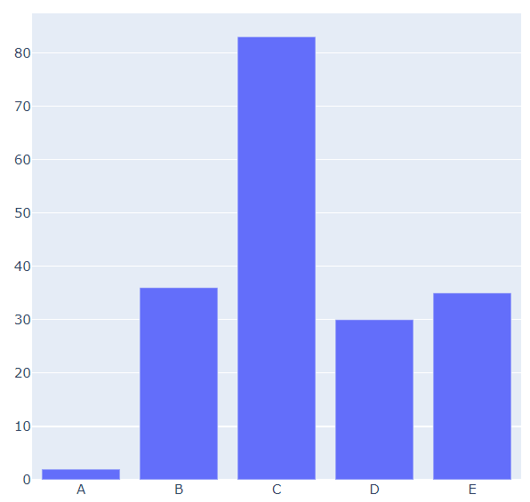
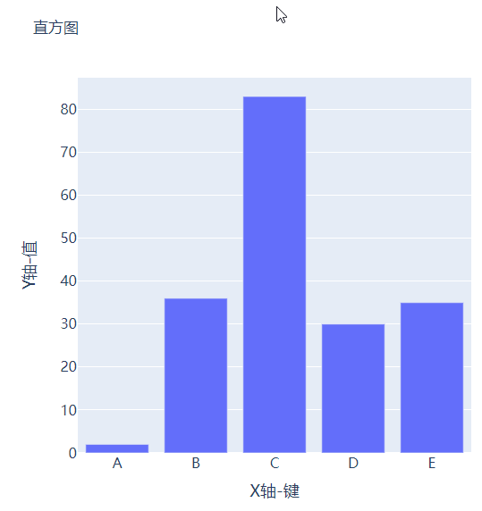
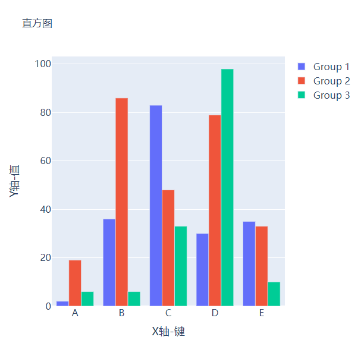
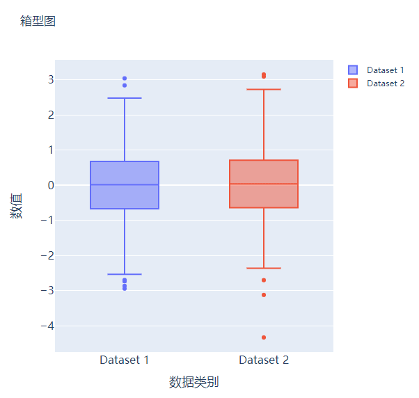
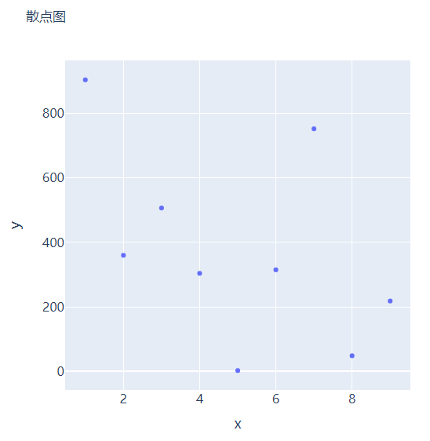
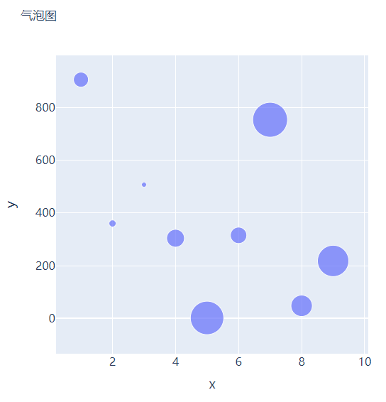
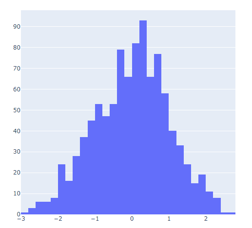
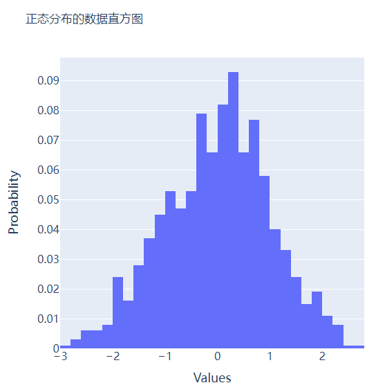
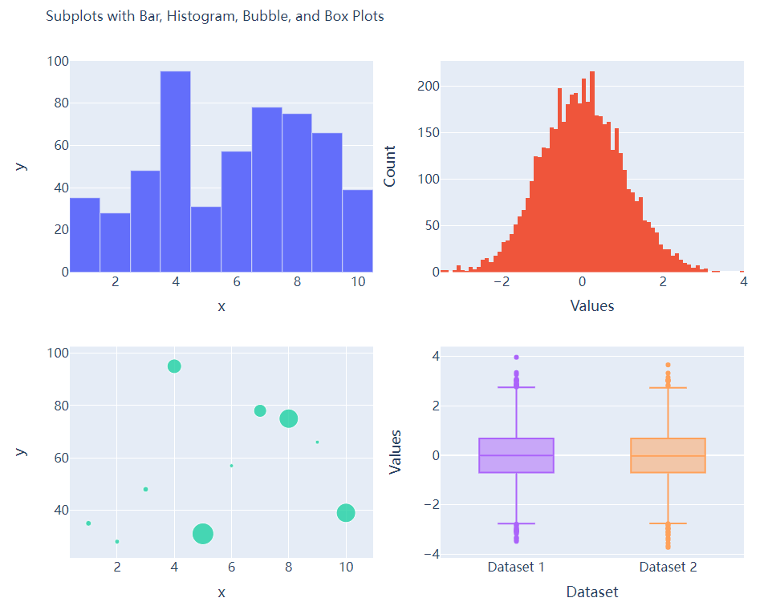

Python可视化Plotly<br />用Plotly模块会指出来的可视化图表有着很强的交互性。
<a name="vTm1F"></a>
## 柱状图
先导入后面需要用到的模块并且生成一批假数据，
```python
import numpy as np
import plotly.graph_objects as go

# create dummy data
vals = np.ceil(100 * np.random.rand(5)).astype(int)
keys = ["A", "B", "C", "D", "E"]
```
基于所生成的假数据来绘制柱状图，代码如下
```python
fig = go.Figure()
fig.add_trace(
 go.Bar(x=keys, y=vals)
)
fig.update_layout(height=600, width=600)
fig.show()
```
output<br /><br />绘制出来的图表略显简单，再来完善一下，添加上标题和注解，代码如下
```python
# create figure
fig = go.Figure()
# 绘制图表
fig.add_trace(
    go.Bar(x=keys, y=vals, hovertemplate="<b>Key:</b> %{x}<br><b>Value:</b> %{y}<extra></extra>")
)
# 更新完善图表
fig.update_layout(
    font_family="Averta",
    hoverlabel_font_family="Averta",
    title_text="直方图",
    xaxis_title_text="X轴-键",
    xaxis_title_font_size=18,
    xaxis_tickfont_size=16,
    yaxis_title_text="Y轴-值",
    yaxis_title_font_size=18,
    yaxis_tickfont_size=16,
    hoverlabel_font_size=16,
    height=600, 
    width=600
)
fig.show()
```
output<br />
<a name="FBi6m"></a>
## 分组条形图和堆积条形图
例如有多组数据想要绘制成柱状图的话，先来创建好数据集
```python
vals_2 = np.ceil(100 * np.random.rand(5)).astype(int)
vals_3 = np.ceil(100 * np.random.rand(5)).astype(int)

vals_array = [vals, vals_2, vals_3]
```
然后遍历获取列表中的数值并且绘制成条形图，代码如下
```python
# 生成画布
fig = go.Figure()
# 绘制图表
for i, vals in enumerate(vals_array):
    fig.add_trace(
        go.Bar(x=keys, y=vals, name=f"Group {i+1}", hovertemplate=f"<b>Group {i+1}</b><br><b>Key:</b> %{{x}}<br><b>Value:</b> %{{y}}<extra></extra>")
    )
# 完善图表
fig.update_layout(
    barmode="group",
    ......
)
fig.show()
```
output<br /><br />而想要变成堆积状的条形图，只需要修改代码中的一处即可，将`fig.update_layout(barmode="group")`修改成`fig.update_layout(barmode="group")`即可。
<a name="nq8lM"></a>
## 箱型图
箱型图在数据统计分析当中也是应用相当广泛的，先来创建两个假数据
```python
# create dummy data for boxplots
y1 = np.random.normal(size=1000)
y2 = np.random.normal(size=1000)
```
将上面生成的数据绘制成箱型图，代码如下
```python
# 生成画布
fig = go.Figure()
# 绘制图表
fig.add_trace(
    go.Box(y=y1, name="Dataset 1"),
)
fig.add_trace(
    go.Box(y=y2, name="Dataset 2"),
)
fig.update_layout(
    ......
)
fig.show()
```
output<br />
<a name="aqgG1"></a>
## 散点图和气泡图
接下来尝试来绘制一张散点图，也是一样的步骤，尝试生成一些假数据，代码如下
```python
x = [i for i in range(1, 10)]
y = np.ceil(1000 * np.random.rand(10)).astype(int)
```
然后来绘制散点图，调用的是`Scatter()`方法，代码如下
```python
# create figure
fig = go.Figure()

fig.add_trace(
    go.Scatter(x=x, y=y, mode="markers", hovertemplate="<b>x:</b> %{x}<br><b>y:</b> %{y}<extra></extra>")
)

fig.update_layout(
    .......
)
fig.show()
```
output<br /><br />那么气泡图的话就是在散点图的基础上，根据数值的大小来设定散点的大小，再来创建一些假数据用来设定散点的大小，代码如下
```python
s = np.ceil(30 * np.random.rand(5)).astype(int)
```
将上面用作绘制散点图的代码稍作修改，通过`marker_size`参数来设定散点的大小，如下所示
```python
fig = go.Figure()

fig.add_trace(
    go.Scatter(x=x, y=y, mode="markers", marker_size=s, text=s, hovertemplate="<b>x:</b> %{x}<br><b>y:</b> %{y}<br><b>Size:</b> %{text}<extra></extra>")
)
fig.update_layout(
    ......
)
fig.show()
```
output<br />
<a name="jfoGH"></a>
## 直方图
直方图相比较于上面提到的几种图表，总体上来说会稍微有点丑，但是通过直方图，读者可以更加直观地感受到数据的分布，先来创建一组假数据，代码如下
```python
## 创建假数据
data = np.random.normal(size=1000)
```
然后来绘制直方图，调用的是`Histogram()`方法，代码如下
```python
# 创建画布
fig = go.Figure()
# 绘制图表
fig.add_trace(
	go.Histogram(x=data, hovertemplate="<b>Bin Edges:</b> %{x}<br><b>Count:</b> %{y}<extra></extra>")
)
fig.update_layout(
	height=600,
	width=600
)
fig.show()
```
output<br /><br />再在上述图表的基础之上再进行进一步的格式优化，代码如下
```python
# 生成画布
fig = go.Figure()
# 绘制图表
fig.add_trace(
	go.Histogram(x=data, histnorm="probability", hovertemplate="<b>Bin Edges:</b> %{x}<br><b>Count:</b> %{y}<extra></extra>")
)
fig.update_layout(
	......
)
fig.show()
```
output<br />
<a name="D9Wla"></a>
## 多个子图拼凑到一块儿
相信大家都知道在matplotlib模块当中的`subplots()`方法可以将多个子图拼凑到一块儿，那么同样地在plotly当中也可以同样地将多个子图拼凑到一块儿，调用的是plotly模块当中`make_subplots`函数
```python
from plotly.subplots import make_subplots
## 2行2列的图表
fig = make_subplots(rows=2, cols=2)
## 生成一批假数据用于图表的绘制
x = [i for i in range(1, 11)]
y = np.ceil(100 * np.random.rand(10)).astype(int)
s = np.ceil(30 * np.random.rand(10)).astype(int)
y1 = np.random.normal(size=5000)
y2 = np.random.normal(size=5000)
```
接下来将所要绘制的图表添加到`add_trace()`方法当中，代码如下
```python
# 绘制图表
fig.add_trace(
    go.Bar(x=x, y=y, hovertemplate="<b>x:</b> %{x}<br><b>y:</b> %{y}<extra></extra>"),
    row=1, col=1
)
fig.add_trace(
    go.Histogram(x=y1, hovertemplate="<b>Bin Edges:</b> %{x}<br><b>Count:</b> %{y}<extra></extra>"),
    row=1, col=2
)
fig.add_trace(
    go.Scatter(x=x, y=y, mode="markers", marker_size=s, text=s, hovertemplate="<b>x:</b> %{x}<br><b>y:</b> %{y}<br><b>Size:</b> %{text}<extra></extra>"),
    row=2, col=1
)
fig.add_trace(
    go.Box(y=y1, name="Dataset 1"),
    row=2, col=2
)
fig.add_trace(
    go.Box(y=y2, name="Dataset 2"),
    row=2, col=2
)
fig.update_xaxes(title_font_size=18, tickfont_size=16)
fig.update_yaxes(title_font_size=18, tickfont_size=16)
fig.update_layout(
    ......
)
fig.show()
```
output<br />
