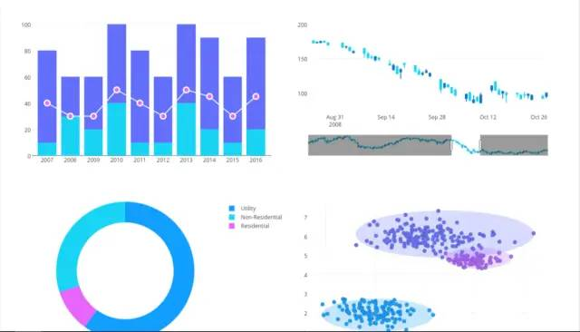
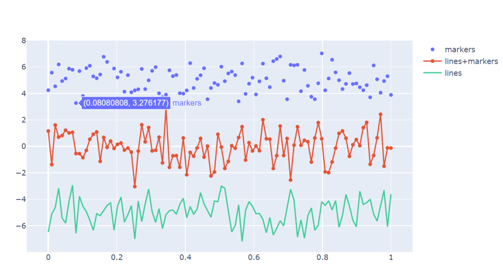
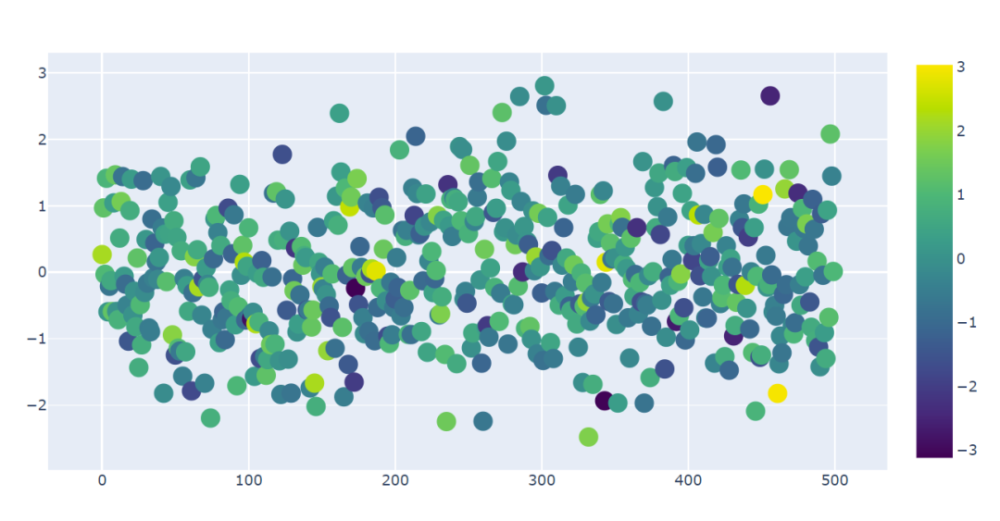
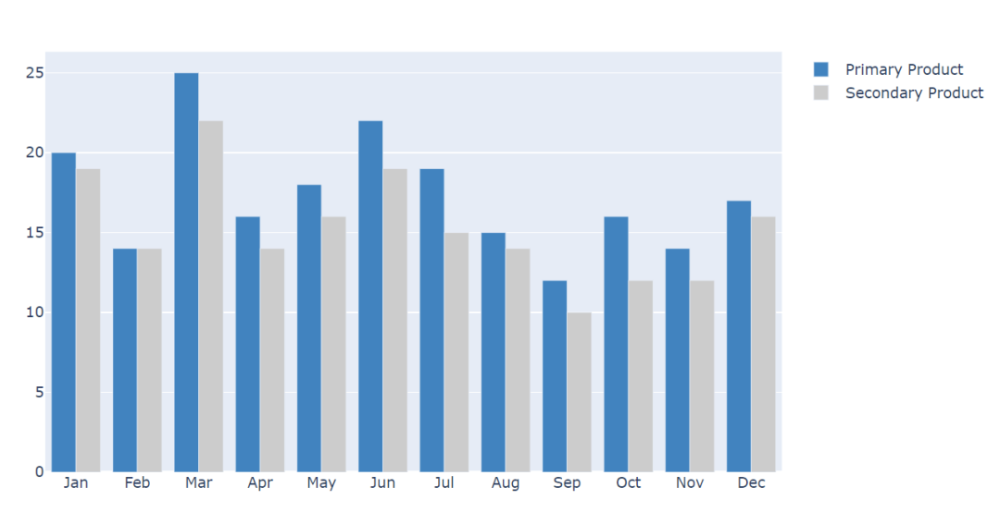

PythonPlotly
<a name="c9dLb"></a>
## Plotly
Plotly是一款用来做数据分析和可视化的在线平台，功能非常强大，可以在线绘制很多图形比如条形图、散点图、饼图、直方图等等。<br />而且还是支持在线编辑，以及多种语言Python、Javascript、Matlab、R等许多API。<br />它在Python中使用也很简单，直接用`pip install plotly`就可以了。<br />推荐最好在Jupyter notebook中使用，Pycharm操作不是很方便。<br />使用Plotly可以画出很多媲美Tableau的高质量图：<br /><br />尝试做了折线图、散点图和直方图，首先导入库：
```python
from plotly.graph_objs import Scatter,Layout
import plotly
import plotly.offline as py
import numpy as np
import plotly.graph_objs as go
#setting offilne 离线模式
plotly.offline.init_notebook_mode(connected=True)
```
上面几行代码主要是引用一些库，Plotly有在线和离线两种模式，在线模式需要有账号可以云编辑。<br />这里选用的离线模式，Plotly设置为Offline模式就可以直接在Notebook里面显示了。
<a name="wjUNx"></a>
### 制作折线图
```python
N = 100
random_x = np.linspace(0,1,N)
random_y0 = np.random.randn(N)+5
random_y1 = np.random.randn(N)
random_y2 = np.random.randn(N)-5

#Create traces
trace0 = go.Scatter(
    x = random_x,
    y = random_y0,
    mode = 'markers',
    name = 'markers'
)
trace1 = go.Scatter(
    x = random_x,
    y = random_y1,
    mode = 'lines+markers',
    name = 'lines+markers'
)
trace2 = go.Scatter(
    x = random_x,
    y = random_y2,
    mode = 'lines',
    name = 'lines'
)
data = [trace0,trace1,trace2]
py.iplot(data)
```
<br />随机设置4个参数，一个x轴的数字和三个y轴的随机数据，制作出三种不同类型的图。<br />Trace0是Markers，Trace1是Lines和Markers，Trace3是Lines。<br />然后把三种图放在Data这个列表里面，调用`py.iplot(data)`即可。绘制的图片系统默认配色也挺好看的~
<a name="vQLX0"></a>
### 制作散点图
```python
trace1 = go.Scatter(
     y = np.random.randn(500),
    mode = 'markers',
    marker = dict(
        size = 16,
        color = np.random.randn(500),
        colorscale = 'Viridis',
        showscale = True
    )
)
data = [trace1]
py.iplot(data)
```
把Mode设置为Markers就是散点图，然后Marker里面设置一组参数，比如颜色的随机范围，散点的大小，还有图例等等。<br />
<a name="jiSDX"></a>
### 直方图
```python
trace0 = go.Bar(
    x = ['Jan','Feb','Mar','Apr', 'May','Jun',
         'Jul','Aug','Sep','Oct','Nov','Dec'],
    y = [20,14,25,16,18,22,19,15,12,16,14,17],
    name = 'Primary Product',
    marker=dict(
        color = 'rgb(49,130,189)'
    )
)
trace1 = go.Bar(
    x = ['Jan','Feb','Mar','Apr', 'May','Jun',
         'Jul','Aug','Sep','Oct','Nov','Dec'],
    y = [19,14,22,14,16,19,15,14,10,12,12,16],
    name = 'Secondary Product',
    marker=dict(
        color = 'rgb(204,204,204)'
    )
)
data = [trace0,trace1]
py.iplot(data)
```
<br />直方图是比较常用的一种图形，Plotly绘制直方图的方式跟Pandas里面设置的有点类似，它们非常直观的体现了不同月份两个生产力之间的差异。<br />上面的制图只是Plotly的冰山一角，都是一些最基本的用法，它还有很多很酷的用法和图形，尤其是跟Pandas结合画的图非常漂亮。
