Python 可视化 
<a name="AN7qo"></a>
## Python可视化新秀
这个Python可视化新秀，在GitHub上是这样介绍的：<br />🎨 PyG2Plot 是@AntV/G2Plot在 Python3 上的封装。G2Plot 是一套简单、易用、并具备一定扩展能力和组合能力的统计图表库，基于图形语法理论搭建而成。<br />不过研究PyG2Plot还得先从G2开始讲，它是蚂蚁金服开源一个基于图形语法，面向数据分析的统计图表引擎。后来又在其基础上，封装出业务上常用的统计图表库——G2Plot。<br />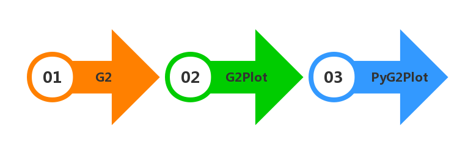<br />不过现在Python这么热，几乎每一个nb的前端可视化库，最终都会被用python开发一套生成相应html的库！它也不例外，封装出了Python可视化库——PyG2Plot。<br />在GitHub上，也提供了一张示例图。<br />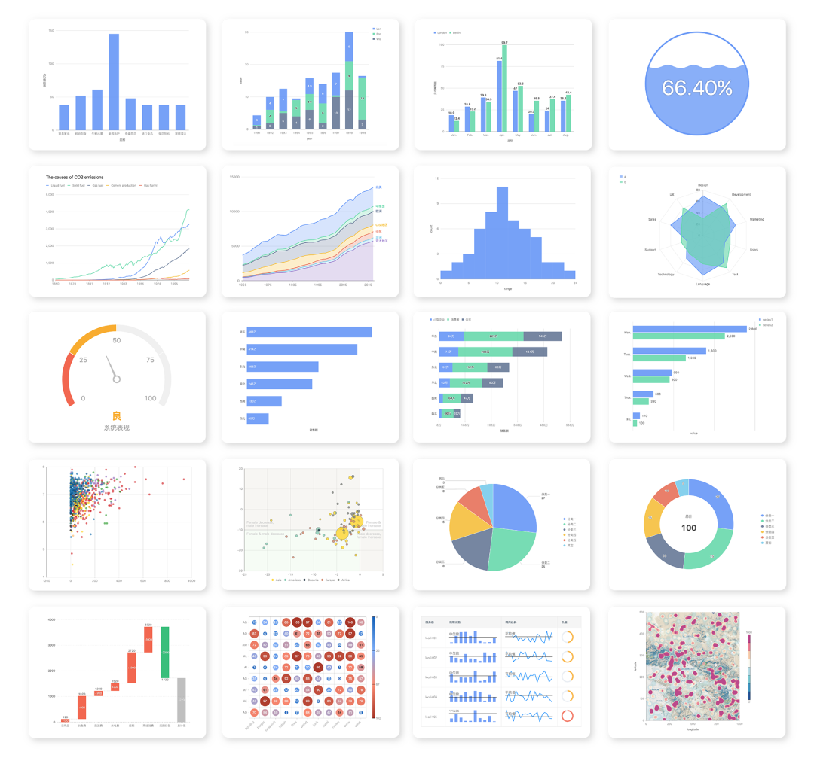
<a name="SFvRz"></a>
## 绘图示例
看来还是需要自己动手，那就先安装PyG2Plot库
```bash
pip install pyg2plot
```
目前目前`pyg2plot`只提供简单的一个 API，只列出需要的参数

- Plot
1. `Plot(plot_type: str)`: 获取`Plot`对应的类实例。
2. `plot.set_options(options: object)`: 给图表实例设置一个 G2Plot 图形的配置。文档可以直接参考 G2Plot 官网，未进行任何二次数据结构包装。
3. `plot.render(path, env, **kwargs)`: 渲染出一个 HTML 文件，同时可以传入文件的路径，以及 jinja2 env 和 kwargs 参数。
4. `plot.render_notebook(env, **kwargs)`: 将图形渲染到 jupyter 的预览。
5. `plot.render_jupyter_lab(env, **kwargs)`: 将图形渲染到 jupyter lab 的预览。
6. `plot.render_html(env, **kwargs)`: 渲染出 HTML 字符串，同时可以传入 jinja2 env 和 kwargs 参数。
7. `plot.dump_js_options(env, **kwargs)`: 输出 Javascript 的 option 配置结构，同时可以传入 jinja2 env 和 kwargs 参数，可以用于 Server 中的 HTTP 结构返回数据结构。

可以先导入Plot方法
```python
from pyg2plot import Plot
```
画散点图
```python
scatter = Plot("Scatter")
```
下一步就是要获取数据和设置参数`plot.set_options()`，这里获取数据直接利用`requset`解析案例json：
```python
import requests
#请求地址
url = "https://gw.alipayobjects.com/os/bmw-prod/0b37279d-1674-42b4-b285-29683747ad9a.json"

#发送get请求
a = requests.get(url)

#获取返回的json数据,并赋值给data
data = a.json()
```
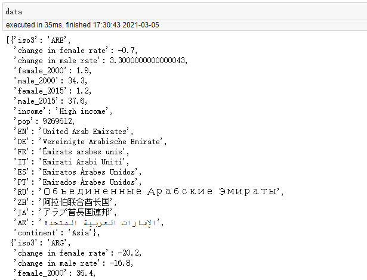<br />成功获取解析好的对象集合数据。<br />下面是对着参数：
```python
scatter.set_options(
{
    'appendPadding': 30,
    'data': data,
    'xField': 'change in female rate',
    'yField': 'change in male rate',
    'sizeField': 'pop',
    'colorField': 'continent',
    'color': ['#ffd500', '#82cab2', '#193442', '#d18768','#7e827a'],
    'size': [4, 30],
    'shape': 'circle',
    'pointStyle':{'fillOpacity': 0.8,'stroke': '#bbb'},
    'xAxis':{'line':{'style':{'stroke': '#aaa'}},},
    'yAxis':{'line':{'style':{'stroke': '#aaa'}},},
    'quadrant':{
        'xBaseline': 0,
        'yBaseline': 0,
        'labels': [
        {'content': 'Male decrease,\nfemale increase'},
        {'content': 'Female decrease,\nmale increase'},
        {'content': 'Female & male decrease'},
        {'content': 'Female &\n male increase'}, ],},
})
```
如果在Jupyter notebook中预览的话，则执行下方语句
```python
scatter.render_notebook()
```
如果想渲染出完整的`html`的话，则执行下方语句
```python
scatter.render("散点图.html")
```
看一下成果<br />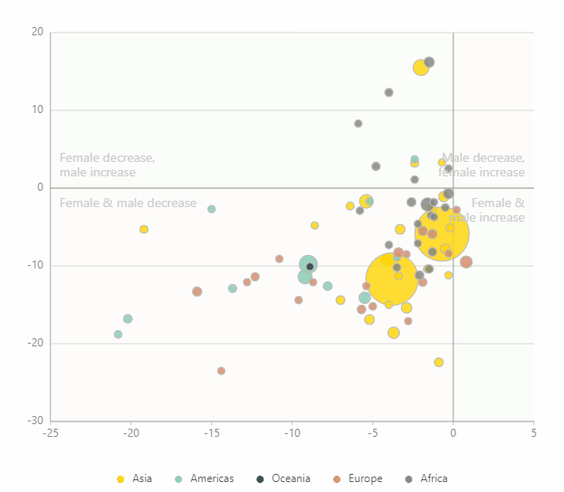
<a name="vSBC8"></a>
## 使用方法
<a name="ijlGW"></a>
### 渲染成 HTML
```python
from pyg2plot import Plot

line = Plot("Line")

line.set_options({
  "data": [
    { "year": "1991", "value": 3 },
    { "year": "1992", "value": 4 },
    { "year": "1993", "value": 3.5 },
    { "year": "1994", "value": 5 },
    { "year": "1995", "value": 4.9 },
    { "year": "1996", "value": 6 },
    { "year": "1997", "value": 7 },
    { "year": "1998", "value": 9 },
    { "year": "1999", "value": 13 },
  ],
  "xField": "year",
  "yField": "value",
})

# 1. 渲染成 html 文件
line.render("plot.html")
# 2. 渲染成 html 字符串
line.render_html()
```
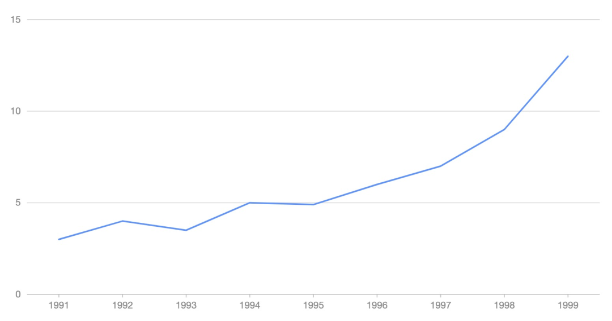
<a name="pLAfh"></a>
### 在 Jupyter 中使用
```python
from pyg2plot import Plot

line = Plot("Line")

line.set_options({
  "height": 400, # set a default height in jupyter preview
  "data": [
    { "year": "1991", "value": 3 },
    { "year": "1992", "value": 4 },
    { "year": "1993", "value": 3.5 },
    { "year": "1994", "value": 5 },
    { "year": "1995", "value": 4.9 },
    { "year": "1996", "value": 6 },
    { "year": "1997", "value": 7 },
    { "year": "1998", "value": 9 },
    { "year": "1999", "value": 13 },
  ],
  "xField": "year",
  "yField": "value",
})

# 1. 渲染到 notebook
line.render_notebook()

# 2. 渲染到 jupyter lab
line.render_jupyter_lab()
```
<a name="J5MHw"></a>
## 参数解析&完整代码
主要详解一下刚才`scatter.set_options()`里的参数，方便后续自己改造！<br />分成几个部分一点一点解释：
<a name="v08hZ"></a>
### 参数解释 一
```python
'appendPadding': 30, #①
'data': data, #②
'xField': 'change in female rate', #③
'yField': 'change in male rate', 
```
① 图表在上右下左的间距，加不加这个参数具体看下图<br />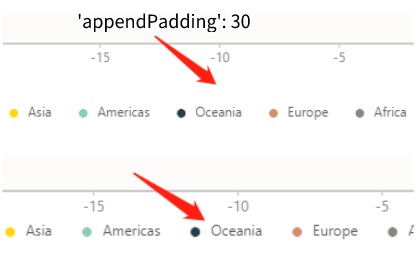<br />② 设置图表数据源（其中data在前面已经赋值了），这里的数据源为对象集合，例如：`[{ time: '1991'，value: 20 }, { time: '1992'，value: 20 }]`。<br />③`xField`和`yField`这两个参数分别是横/纵向的坐标轴对应的字段。
<a name="dOSnf"></a>
### 参数解释 二
```python
'sizeField': 'pop', #④
'colorField': 'continent', #⑤
'color': ['#ffd500', '#82cab2', '#193442', '#d18768','#7e827a'], #⑥
'size': [4, 30], #⑦
'shape': 'circle', #⑧
```
④ 指定散点大小对应的字段名，我们用的pop（人口）字段。<br />⑤ 指定散点颜色对应的字段名，我们用的continent（洲）字段。<br />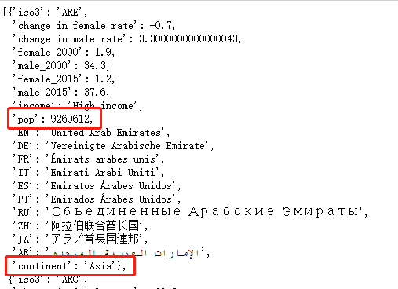<br />⑥ 设置散点的颜色，指定了系列色值。<br />⑦ 设置散点的大小，可以指定大小数组`[minSize, maxSize]`<br />⑧ 设置点的形状，比如`cicle`、`square`
<a name="FSnPS"></a>
### 参数解释 三
```python
'pointStyle':{'fillOpacity': 0.8,'stroke': '#bbb'}, #⑨
'xAxis':{'line':{'style':{'stroke': '#aaa'}},}, #⑩
'yAxis':{'line':{'style':{'stroke': '#aaa'}},},
```
⑨`pointStyle`是指折线样式，不过在散点图里，指的是散点的描边。另外`fillOpacity`是设置透明度，`stroke`是设置描边颜色。<br />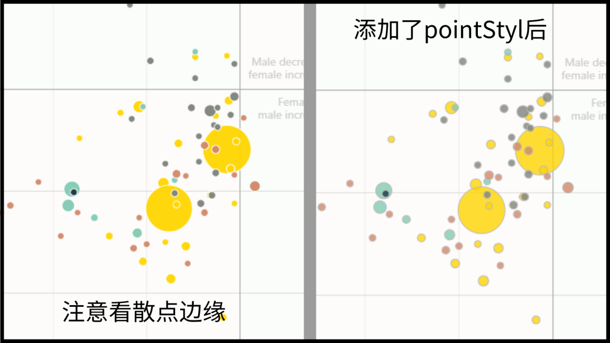<br />⑩ 这里只是设置了坐标轴线的颜色。
<a name="jdnbP"></a>
### 参数解释 四
```python
'quadrant':{
    'xBaseline': 0,
    'yBaseline': 0,
    'labels': [
    {'content': 'Male decrease,\nfemale increase'},
    {'content': 'Female decrease,\nmale increase'},
    {'content': 'Female & male decrease'},
    {'content': 'Female &\n male increase'}, ],
},
```
`quadrant`是四象限组件，具体细分配置如下：

| 细分配置 | 功能描述 |
| --- | --- |
| xBaseline | x 方向上的象限分割基准线，默认为 0 |
| yBaseline | y 方向上的象限分割基准线，默认为 0 |
| labels | 象限文本配置 |

PyG2Plot的介绍文档还不完善，上文中的很多参数是摸索的，大家作为参考就好。<br />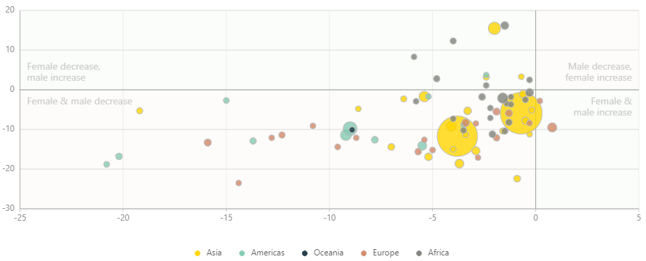<br />PyG2Plot 原理其实非常简单，其中借鉴了 pyecharts 的实现，但是因为蚂蚁金服的 G2Plot 完全基于可视分析理论的配置式结构，所以封装上比 pyecharts 简洁非常非常多。
<a name="dA3ZU"></a>
## 支持图表
pyg2plot 支持很多类型的图表，非常好用，效果图如下：<br />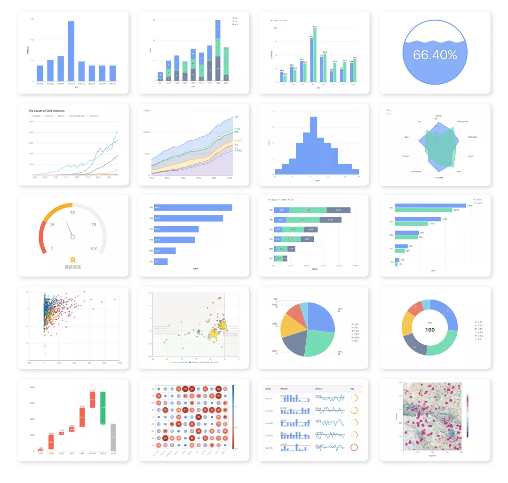<br />举几个例子，下面是分别是面积图、柱形图、双轴图，可以看到可视化效果是非常棒的。<br />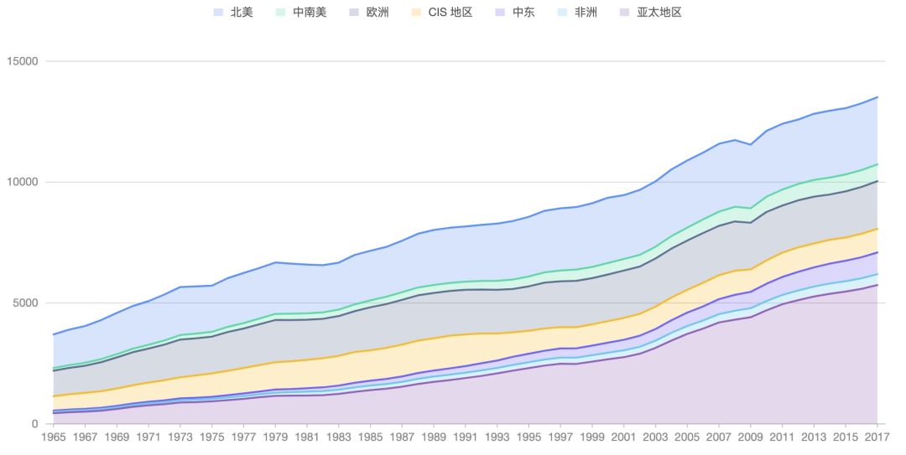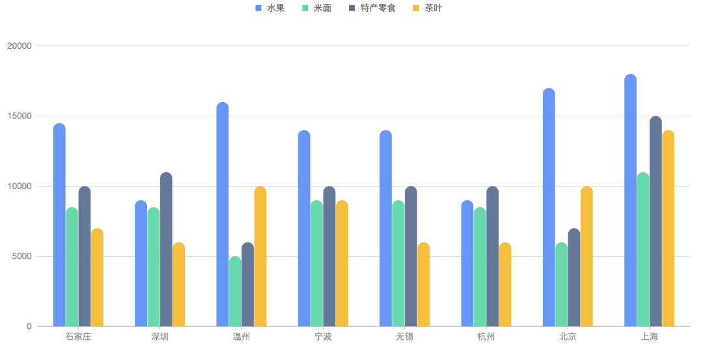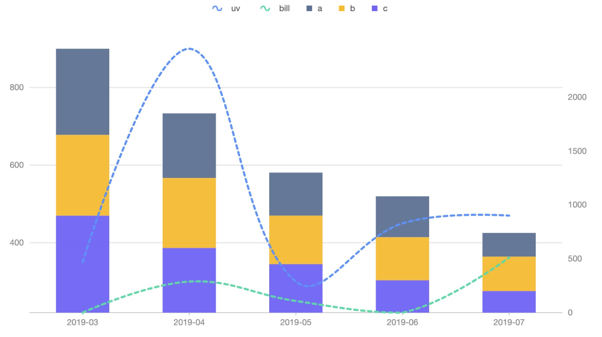<br />更多图表样式的绘制可参考：[https://github.com/hustcc/PyG2Plot/blob/main/docs/plot.md](https://github.com/hustcc/PyG2Plot/blob/main/docs/plot.md)
<a name="q02Uk"></a>
## 技术原理
PyG2Plot 原理其实非常简单，其中借鉴了** pyecharts** 的实现，但是因为蚂蚁金服的 G2Plot 完全基于可视分析理论的配置式结构，所以封装上比 pyecharts 简洁非常非常多。<br />**基本的原理，就是通过 Python 语法提供 API，然后在调用 render 的时候，生成最终的 G2Plot HTML 文本，而针对不同的环境，生成的 HTML 稍有区别。**

- 针对 HTML 生成，则直接使用正常的 html 模板，然后 script 引入 G2Plot 资源，生成 G2Plot 的 JavaScript 代码，渲染即可
- 针对 Jupyter 环境，生成的的内容中比较特殊的时候，使用 requireJS 去加载 G2Plot 资源，后续的逻辑一致

这个原理可以理解是所有的语种封装 JavaScript 模块的统一做法。<br />所以对于 PyG2Plot，**核心文件**是：

- plot.py：提供了 PyG2Plot 的几乎全部 API
- engine.py：提供了渲染 HTML 的能力，其实是基于 jinja2 这个模板引擎实现的
- templates：提供了所有的 jinja2 模板文件，对于模板怎么用，jinja2 的文档是非常非常详细的

开源项目地址：[https://github.com/hustcc/PyG2Plot](https://github.com/hustcc/PyG2Plot)
