Python 可视化<br />先梳理下G2、G2Plot、PyG2Plot三者关系，

- G2：一套由蚂蚁集团数据可视化团队（AntV）开发，基于图层图形语法（the grammar of graphics，同ggplot2底层语法）的可视化底层高交互引擎；
- G2Plot：基于G2封装，力求开箱即用、易于配置、具有良好交互体验的JavaScript统计图表库；
- PyG2Plot：基于G2Plot封装的Python统计图表库，借鉴Pyecharts图表实现形式，但比Pyecharts更简练。总之，G2Plot之于PyG2Plot就如同Pyecharts之于Echarts。

---

<a name="kjAhV"></a>
## 安装
```bash
pip install pyg2plot
```
<a name="srzlm"></a>
## 快速上手
PyG2Plot是完全基于G2Plot的封装，并且在数据结构上，完全不做任何二次封装，所以配置文档上完全可以参考G2Plot官方文档。<br />下面用几个案例来说明如何参考G2Plot官方文档，使用PyG2Plot，
<a name="pdZif"></a>
### 案例一、桑基图
G2Plot地址：[https://antv-g2plot.gitee.io/zh/examples/relation-plots/sankey#energy](https://antv-g2plot.gitee.io/zh/examples/relation-plots/sankey#energy)<br />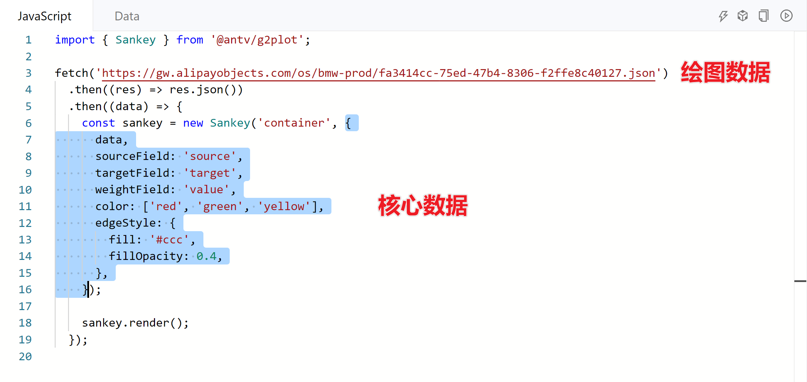<br />将上图绘图数据和核心代码照抄到PyG2Plot中即可实现相同功能👇
```python
#导入pyg2plot
from pyg2plot import Plot

# 获取上文G2Plot代码中的json数据，存入data
import requests
data = requests.get(
    "https://gw.alipayobjects.com/os/bmw-prod/fa3414cc-75ed-47b4-8306-f2ffe8c40127.json"
).json()


# 指定绘图类别Sankey
sankey = Plot("Sankey")


#下面set_options的{}中的代码完全照搬自G2Plot，关键字添加''即可，
sankey.set_options({
    'height':500,
    'data': data,
    'sourceField': 'source',
    'targetField': 'target',
    'weightField': 'value',
    'edgeStyle': {
        'fill': '#ccc',
        'fillOpacity': 0.4,
    },
})

# 图像渲染
# sankey.render_notebook()
sankey.render_jupyter_lab()
```
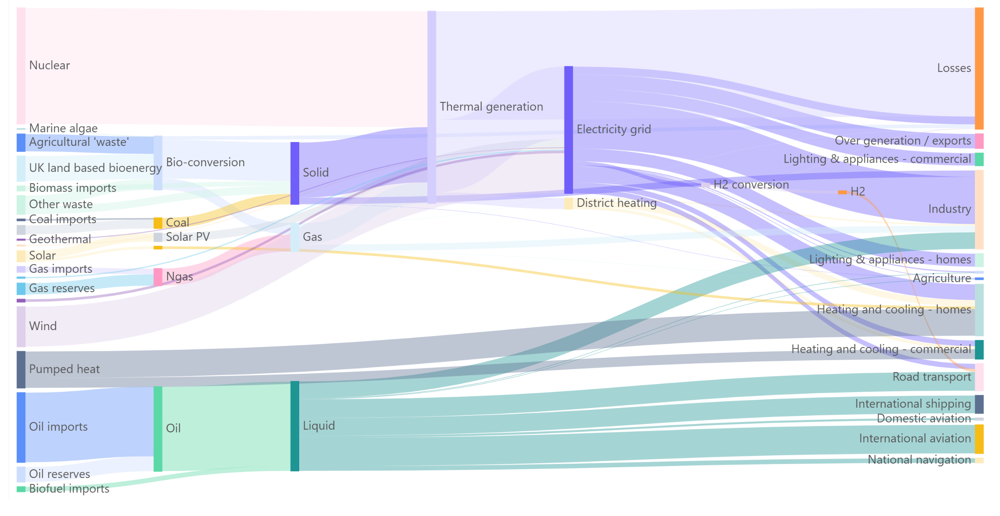重点参数都位于`set_options()`中，更多个性化设置参考G2Plot2文档：[https://antv-g2plot.gitee.io/zh/examples/relation-plots/sankey#energy](https://antv-g2plot.gitee.io/zh/examples/relation-plots/sankey#energy)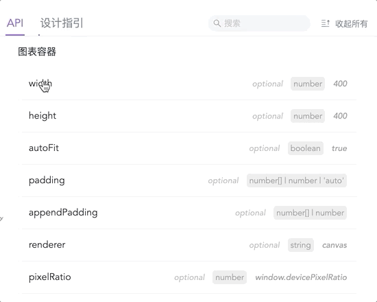<br />文档比Pyecharts的文档更人性化，👆API中罗列所有参数详细说明，设计指引中详细说明该图表的使用场景、数据要求及设计建议，因为G2Plot2目前还处于开发状态，有的图表设计指引为空。<br />以修改color参数为例，传入色号<br />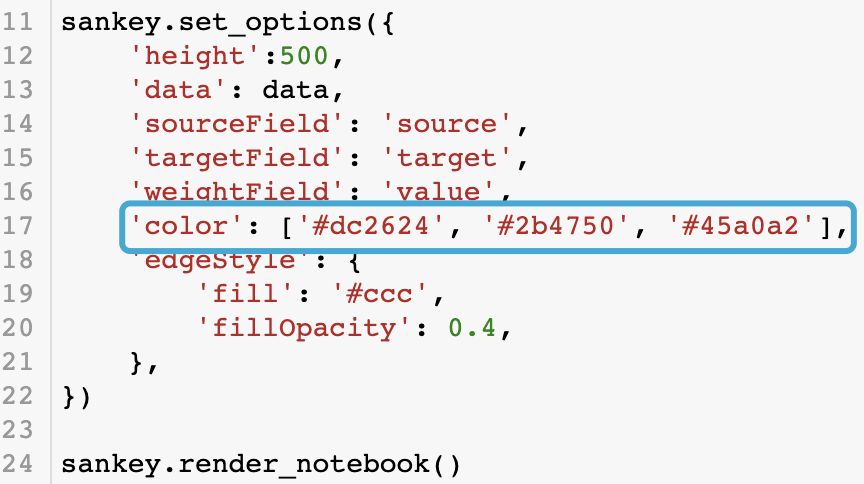<br />效果图，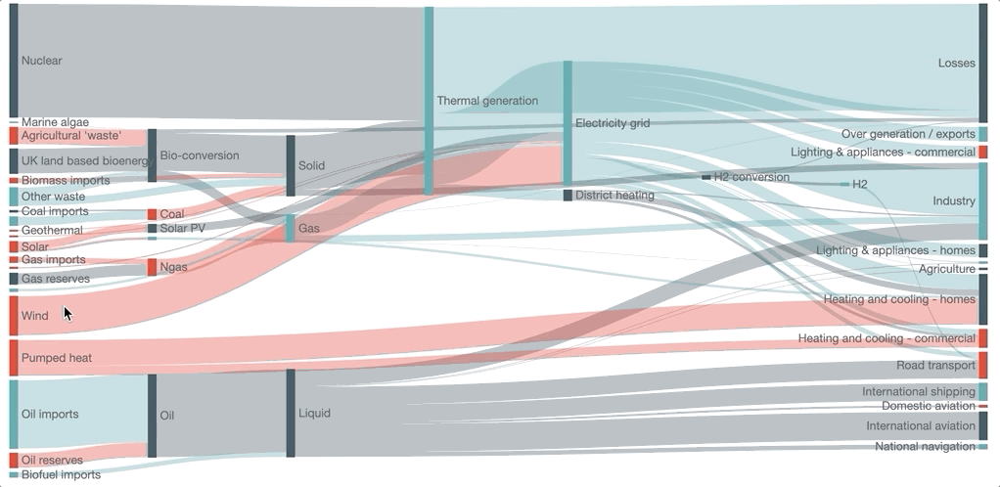
<a name="R1piQ"></a>
### 案例二、弦图
G2Plot地址：[https://antv-g2plot.gitee.io/zh/examples/relation-plots/chord#chord-population](https://antv-g2plot.gitee.io/zh/examples/relation-plots/chord#chord-population)<br />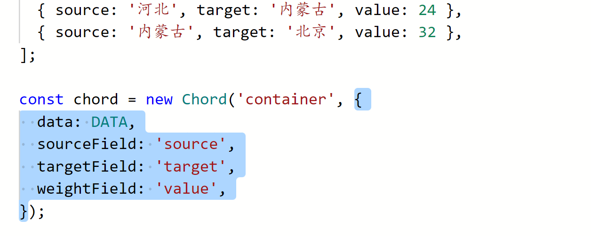<br />PyG2Plot中实现和案例一一样，直接贴上PyG2Plot实现代码，
```python
from pyg2plot import Plot

data = [
  { 'source': '北京', 'target': '天津', 'value': 30 },
  { 'source': '北京', 'target': '上海', 'value': 80 },
  { 'source': '北京', 'target': '河北', 'value': 46 },
  { 'source': '北京', 'target': '辽宁', 'value': 49 },
  { 'source': '北京', 'target': '黑龙江', 'value': 69 },
  { 'source': '北京', 'target': '吉林', 'value': 19 },
  { 'source': '天津', 'target': '河北', 'value': 62 },
  { 'source': '天津', 'target': '辽宁', 'value': 82 },
  { 'source': '天津', 'target': '上海', 'value': 16 },
  { 'source': '上海', 'target': '黑龙江', 'value': 16 },
  { 'source': '河北', 'target': '黑龙江', 'value': 76 },
  { 'source': '河北', 'target': '内蒙古', 'value': 24 },
  { 'source': '内蒙古',' target': '北京', 'value': 32 },
]

chord = Plot("Chord")

chord.set_options({
    'height':400,
  'data': data,
  'sourceField': 'source',
  'targetField': 'target',
  'weightField': 'value',
    'theme': {
    'colors10': ['#FF6B3B', '#626681', '#FFC100', '#9FB40F', '#76523B', '#DAD5B5', '#0E8E89', '#E19348', '#F383A2', '#247FEA']
}
})

chord.render_notebook()
```


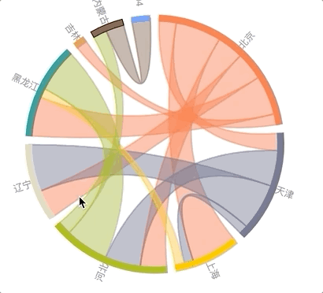
<a name="bhZCP"></a>
### 案例三、面积图
G2Plot地址：[https://antv-g2plot.gitee.io/zh/examples/area/stacked#basic-slider](https://antv-g2plot.gitee.io/zh/examples/area/stacked#basic-slider)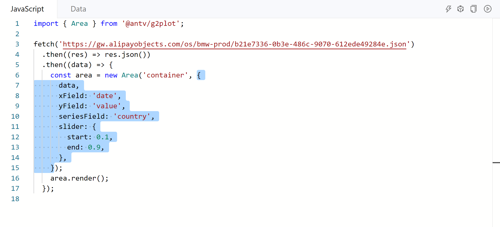PyG2Plot实现代码
```python
from pyg2plot import Plot
import requests

data = requests.get(
    "https://gw.alipayobjects.com/os/bmw-prod/b21e7336-0b3e-486c-9070-612ede49284e.json"
).json()

area = Plot("Area")

area.set_options({
    'height': 500,
    'width': 300,
    'data': data,
    'xField': 'date',
    'yField': 'value',
    'seriesField': 'country',
    'slider': {
        'start': 0.1,
        'end': 0.9,
    },
})

area.render_notebook()
```
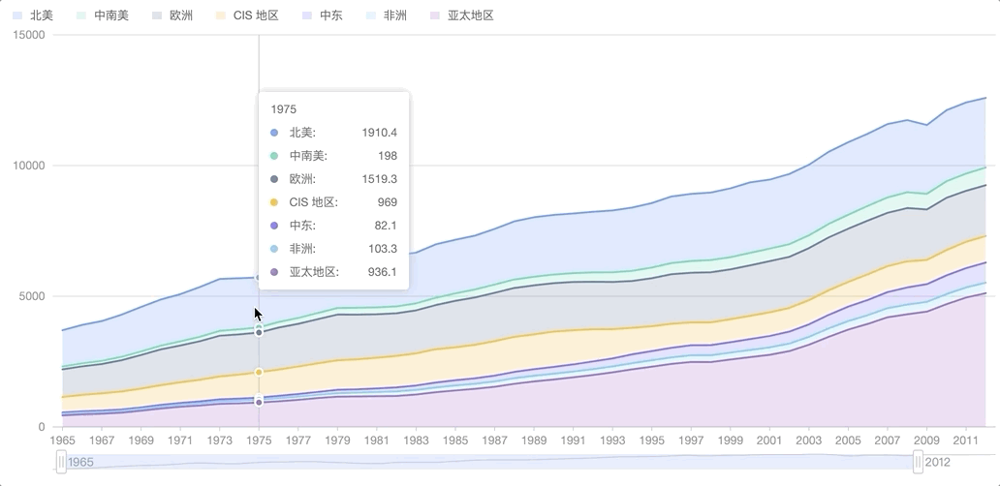

---

<a name="gG9Dt"></a>
## 更多案例
G2Plot包含大量案例，理论上PyG2Plot都可用，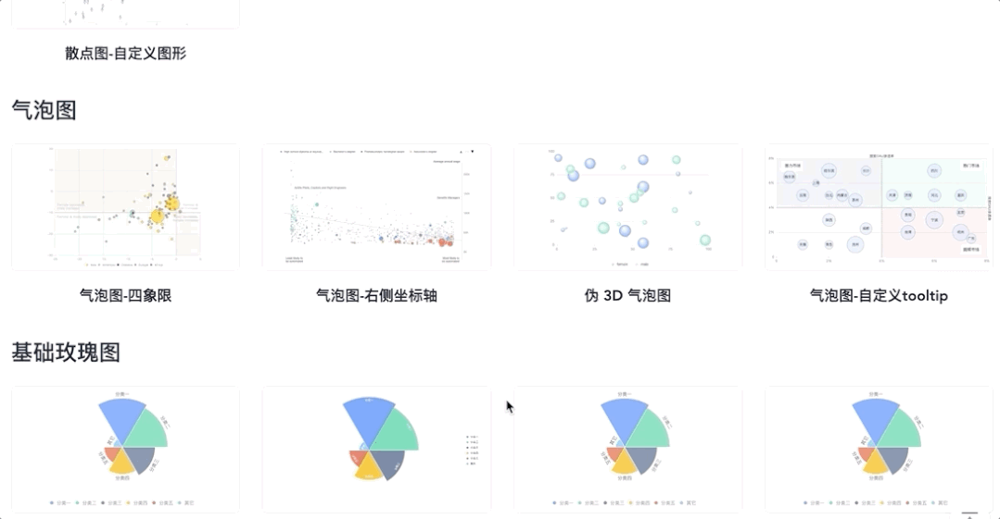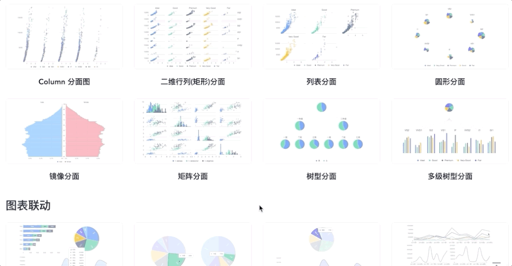

---

<a name="GHyVN"></a>
## 总结

- G2Plot还处于开发中，未来可期；
- G2Plot在地理图表方面很欠缺，官网几乎没有示例；
- 和Pyechart/Echarts相比，PyG2Plot还是太稚嫩
<a name="WPccV"></a>
## 进一步学习
[https://github.com/hustcc/PyG2Plot](https://github.com/hustcc/PyG2Plot)<br />[https://github.com/antvis/G2Plot](https://github.com/antvis/G2Plot)
