Python pyecharts
<a name="dsjqh"></a>
## 1、pyecharts简介
`Echarts`是一个由百度开源的数据可视化工具，凭借着良好的交互性，精巧的图表设计，得到了众多开发者的认可。而`python`是一门富有表达力的语言，很适合用于数据处理。当数据分析遇上了数据可视化时，`pyecharts`诞生了。<br />pyecharts分为`v0.5`和`v1`两个大版本，v0.5和v1两个版本不兼容，v1是一个全新的版本，学习尽量都是基于v1版本进行操作。<br />下面列出了echarts和pyecharts的官网，比较幸运的是，pyecharts是由一个中国人开发的，也存在一个中文网站，这样学习起来就方便多了。<br />echarts官网：<br />[**https://www.echartsjs.com/index.html**](https://www.echartsjs.com/index.html)<br />pyecharts官网：<br />[**https://pyecharts.org/#/zh-cn/intro**](https://pyecharts.org/#/zh-cn/intro)
<a name="olv8C"></a>
### 安装
```bash
pip install pyecharts
```
<a name="Lbg80"></a>
### 查看版本
```python
print(pyecharts.version)
```
<a name="YIrYn"></a>
## 2、pyecharts简单使用
pyecharts支持常用的基本图形展示，条形图、折线图、饼图、散点图、热力图、漏斗图、雷达图、箱型图、地图等，还能支持仪表盘，树形图的展示。
```python
from pyecharts.charts import Bar,Line
from pyecharts import options as opts
from pyecharts.globals import ThemeType

line = (
    Line(init_opts=opts.InitOpts(theme=ThemeType.LIGHT, width='1000px',height='300px' ))
    .add_xaxis(["衬衫", "羊毛衫", "雪纺衫", "裤子", "高跟鞋", "袜子"])
    .add_yaxis("商家A", [5, 20, 36, 10, 75, 90])
    .add_yaxis("商家B", [15, 6, 45, 20, 35, 66])
    .set_global_opts(title_opts=opts.TitleOpts(title="主标题", subtitle="副标题"),
                        datazoom_opts=opts.DataZoomOpts(is_show=True))
    .set_series_opts(label_opts=opts.LabelOpts(is_show=True))
)
line.render('test.html')
line.render_notebook()
```
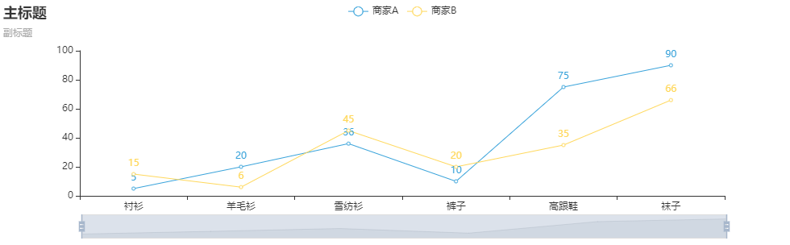<br />从上面简单事例可知，pyecharts的使用包括:

- 图标类型（Line）本身的初始化配置，如主题，大小
- 加载数据：如加载x轴数据，加载y轴数据（可以多个）
- 设置全局配置，如标题，区域缩放datazoom，工具箱等
- 设置系列配置项，如标签，线条，刻度文本展示等
- 图标显示：`render`保存成html文件，如果是jupyter notebook则直接通过render_notebook展示在notebook中
<a name="AJj3f"></a>
## 3、pyecharts绘图逻辑
<a name="YHYD6"></a>
### 1）pyecharts绘图逻辑说明
`pyecharts`是一个全新的可视化绘图工具，因此它的绘图逻辑完全不同于`matplotlib、seaborn、plotly`。pyecharts的绘图逻辑分为以下几步。

- ① 选择图表类型；
- ② 声明图形类并添加数据；
- ③ 选择全局变量；
- ④ 显示及保存图表；
<a name="8zZDO"></a>
#### 第一步是选择图表类型
基于自己的数据特点，选择想要绘制那种图形，需要什么图形就导入什么图形，下面简单列举了几个导入方法。
```python
from pyecharts.charts import Scatter  # 导入散点图
from pyecharts.charts import Line     # 导入折线图
from pyecharts.charts import Pie      # 导入饼图
from pyecharts.charts import Geo      # 导入地图
```
<a name="eCjkT"></a>
#### 第二步是声明图形类并添加数据
什么是图形类呢？其实每一个图形库都是被pyecharts作者封装成为了一个`类`，这就是所谓的面向对象，在使用这个类的时候，需要`实例化这个类`(观察下面代码)。声明类之后，相当于初始化了一个画布，之后的绘图就是在这个画布上进行。接下来要做的就是添加数据，pyecharts中添加数据共有2种方式，一种是`普通方式`添加数据，一种是`链式调用`(观察下面代码)来添加数据。
```python
"下面绘制的是：正弦曲线的散点图"
# 1.选择图表类型：这里使用的是散点图，就直接从charts模块中导入Scatter这个图形。
from pyecharts.charts import Scatter
import numpy as np
x = np.linspace(0,2 * np.pi,100)
y = np.sin(x)
(
 # 注意：使用什么图形，就要实例化该图形的类；
 # 2.绘制的是Scatter散点图，就需要实例化散点图类，直接Scatter() 即可；
 Scatter() 
 # 实例化类后，接着就是添加数据，下面这种方式就是使用“链式调用”的方式绘图；
 # 注意：散点图有X、Y轴，因此需要分别给X轴、Y轴添加数据；
 # 3.先给X轴添加数据；
 .add_xaxis(xaxis_data=x)
 # 4.再给Y轴添加数据；
 .add_yaxis(series_name="这个图是干嘛的",y_axis=y)
).render_notebook()
```
<a name="Ei63Y"></a>
#### 第三步就是设置全局变量
用通俗的话说就是：调节各种各样的参数，把图形变得更好看。常用的有`标题配置项`、`图例配置项`、`工具配置项`、`视觉映射配置项`、`提示框配置项`、`区域缩放配置项`。首先是学会了如何使用pyecharts绘图后，再慢慢学习这方面的内容。

- `默认情况下`图例配置项和提示框配置项是显示的，其它四个配置项默认情况下是不显示的，需要自己设置；


<a name="kgRWn"></a>
#### 第四步是显示及保存图表
这里介绍两种最常用的保存方式，如下所示。
```python
.render("C:\\Users\\fcant\\Desktop\\hello\\a.html")
# 如果不指定路径，就是直接保存在当前工作环境目录下；
# 如果指定了路径，就是保存到指定的目录下；
# 注意：最终都是以html格式展示，发给其他任何人都可以直接打开看的；
.render_notebook()
# 如果使用的是jupyter notebook，直接使用这行代码，可以直接显示图片；
```
<a name="eVGjM"></a>
## 4、选择图表类型
下面列举出现的所有图形都在`charts`字模块下，利用如下代码就可以导入各自对应的图形，在上面的叙述中，已经列举了部分图形的导入方式。

- `from pyecharts.charts import` 函数名
| 函数 | 说明 | 函数 | 说明 |
| --- | --- | --- | --- |
| Scatter | 散点图 | Funnel | 漏斗图 |
| Bar | 柱形图 | Gauge | 仪表盘 |
| Pie | 饼图 | Graph | 关系图 |
| Line | 折线图/面积图 | Liquid | 水球图 |
| Radar | 雷达图 | Parallel | 平行坐标系 |
| Sankey | 桑椹图 | Polar | 极坐标系 |
| WordCloud | 词云图 | HeatMap | 热力图 |

:::warning
注意：这里只列出了部分图形，包括后面绘制地图，也都是在pyecharts的子模块charts模块下，要记住这句导入相关图形库的代码。
:::
<a name="YtvVB"></a>
## 5、数据添加
<a name="926a406b"></a>
### 1）添加数据
像散点图、折线图等二维数据图形，它既有X轴，又有Y轴，所以不仅要为X轴添加数据，还要为Y轴添加数据。

- `.add_xaxis(xaxis_data=x)`为X轴添加数据；
- `.add_yaxis(series_name='', y_axis=y)`为Y轴添加数据；

像饼图、地图这样没有X轴、Y轴区分的图形，直接使用add()方法添加即可。

- `.add(series_name='', data_pair=[(i,j)for i,j in zip(lab,num)])`；
<a name="87d09bd3"></a>
### 2）pyecharts绘图的两种方式
pyecharts中绘图有2种方式。第一种方式：普通方式；第二种方式：链式调用。仔细观察下面的演示代码，看看区别在哪里。
<a name="obGqr"></a>
#### ① 链式调用的方式绘图
```python
from pyecharts.charts import Line
import pyecharts.options as opts
import numpy as np
x = np.linspace(0,2 * np.pi,100)
y = np.sin(x)
(Line(init_opts=opts.InitOpts(width="700px",height="300px"))
 .add_xaxis(xaxis_data=x)
 .add_yaxis(series_name="绘制线图",y_axis=y,label_opts=opts.LabelOpts(is_show=False))
 .set_global_opts(title_opts=opts.TitleOpts(title="我是标题",subtitle="我是副标题",title_link="https://www.baidu.com/"),
                  tooltip_opts=opts.TooltipOpts(axis_pointer_type="cross"))
).render_notebook()
```
结果如下：<br />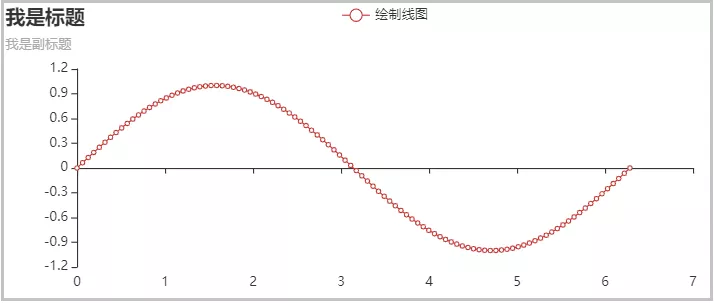
<a name="fh6WO"></a>
#### ② 普通方式绘图
```python
from pyecharts.charts import Pie
import pyecharts.options as opts
num = [110, 136, 108, 48, 111, 112, 103]
lab = ['哈士奇', '萨摩耶', '泰迪', '金毛', '牧羊犬', '吉娃娃', '柯基']
x = [(i, j)for i, j in zip(lab, num)]
print(x)
pie = Pie(init_opts=opts.InitOpts(width="700px",height="300px"))
pie.add(series_name='',data_pair=[(i, j)for i, j in zip(lab, num)])
pie.render_notebook()
```
结果如下：<br />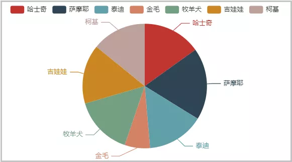
<a name="oF7Vv"></a>
### 3）关于series_name=""的说明
在添加数据时候，可以注意到`series_name参数`的存在，它是一个字符串。可以传递一个空字符串，也可以传递指定字符串，最终的作用有点类似于图例的效果，但这里并不是设置图例。不需要过多的注意这个参数，只需要牢记一点：这个参数必须有，必须写，哪怕传递一个空字符串，也要写，因为不写这个参数，会报错。
<a name="xPdyo"></a>
## 6、设置全局配置项
当学会了如何使用`pyecharts`绘图，并且已经绘制出来了某个图形，此时这个图形并不一定好看。这就需要会使用全局配置项，进行图形参数的调节与设置。<br />所有的全局配置项的使用，都是在`options`这个子模块下，在设置全局配置项的时候，记得导入这个模块。这部分涉及到的参数太多太杂，当某个图形需要怎么改的时候，一般肯定是有对应的参数进行处理的。

- `import pyecharts.options as opts`
- 使用options配置项，在 pyecharts中，一切皆Options。
- 全局配置项可通过调用`set_global_options()`方法进行设置。

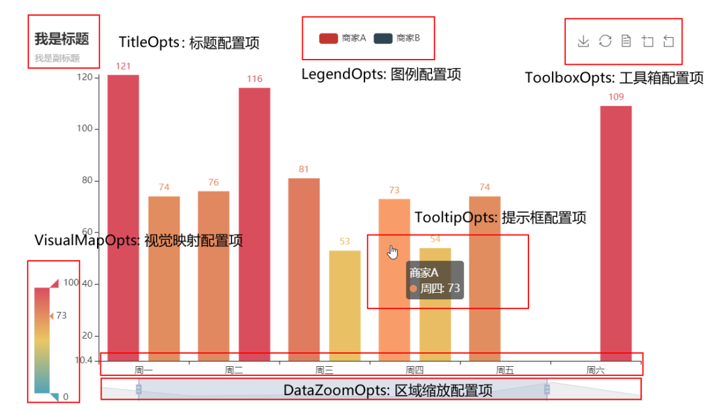

- `InitOpts`：各个图表类型初始配置
- `set_global_opts`：全局外观配置
- `set_series_opts`：系列配置

为了方便大家和自己，下面给出一个常用的组合，通常可视化足够用了，快收藏。

- `InitOpts`：主题，长宽，动画效果
- `DataZoomOpts`：区域收缩，这个对于数据特别多，如一天的时间序列数据，特别有用，可以拖动查看全局和局部的数据（可以设置是否显式显式还是可拖动`type_="inside"`）
- 标题配置TitleOpts：说明这个图表说明的是什么，必备的吧
- 图例配置LegendOpts：说明图表中的不同数据项（这个图例是可以点击的，可以单独查看某个图例的数据，很有用）
- 提示框配置`TooltipOpts`：显示图例具体某个点的数据
- x轴和y轴坐标轴标题说明`AxisOpts`
- 坐标刻度调整：特别适用于刻度说明比较多，可以显示角度变换等
- markpoint/markline: 对图表的特别标记，用于重点说明部分和标注区分线
:::tips
注意：默认情况下图例配置项和提示框配置项是显示的，其他四个配置项默认情况下是不显示的，需要自己设置。
:::
```python
from pyecharts.charts import Bar,Line
from pyecharts import options as opts
from pyecharts.globals import ThemeType

bar = (
    Bar(init_opts=opts.InitOpts(theme=ThemeType.LIGHT, 
                                 width='1000px',
                                 height='300px', 
                                 animation_opts=opts.AnimationOpts(animation_delay=1000, animation_easing="elasticOut")
                                )
        )
    .add_xaxis(["衬衫", "羊毛衫", "雪纺衫", "裤子", "高跟鞋", "袜子"])
    .add_yaxis("商家A", [5, 20, 36, 10, 75, 90])
    .add_yaxis("商家B", [15, 6, 45, 20, 35, 66])
    .set_global_opts(title_opts=opts.TitleOpts(title="主标题", subtitle="副标题"),
                     toolbox_opts=opts.ToolboxOpts(is_show=False),
                     # datazoom_opts=opts.DataZoomOpts(is_show=True)
                     datazoom_opts=[opts.DataZoomOpts(), opts.DataZoomOpts(type_="inside")],
                     legend_opts=opts.LegendOpts(type_="scroll", pos_left="50%", orient="vertical"),
                     xaxis_opts=opts.AxisOpts(axislabel_opts=opts.LabelOpts(rotate=-15), name="我是 X 轴"),
                     yaxis_opts=opts.AxisOpts(name="我是 Y 轴", axislabel_opts=opts.LabelOpts(formatter="{value} /月")),
                     tooltip_opts=opts.TooltipOpts(trigger="axis", axis_pointer_type="cross"),

                    )
    .set_series_opts(label_opts=opts.LabelOpts(is_show=False),
                    markpoint_opts=opts.MarkPointOpts(
                        data=[
                            opts.MarkPointItem(type_="max", name="最大值"),
                            opts.MarkPointItem(type_="min", name="最小值"),
                            opts.MarkPointItem(type_="average", name="平均值"),
                        ]
                        ),
                    )
)
# line.render('test.html')
bar.render_notebook()
```
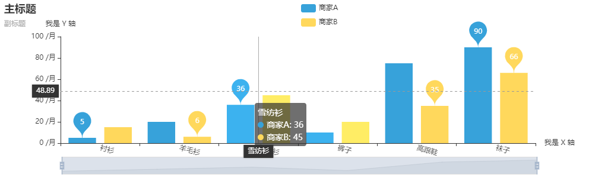
<a name="e7kcq"></a>
## 7、常用组合图表使用
常用组合图表有：

- 不同图表类型组合如柱状图和折线图组合在一张图中（双y轴），主要的看同一视角不同指标的差异和关联；pyecharts中是通过overlap实现
```python
from pyecharts.charts import Bar,Line
from pyecharts import options as opts
from pyecharts.globals import ThemeType

bar = (
    Bar(init_opts=opts.InitOpts(theme=ThemeType.LIGHT, 
                                 width='1000px',
                                 height='300px', 
                                 animation_opts=opts.AnimationOpts(animation_delay=1000, animation_easing="elasticOut")
                                )
        )
    .add_xaxis(["衬衫", "羊毛衫", "雪纺衫", "裤子", "高跟鞋", "袜子"])
    .add_yaxis("商家A", [5, 20, 36, 10, 75, 90])
    .add_yaxis("商家B", [15, 6, 45, 20, 35, 66])
    .set_global_opts(title_opts=opts.TitleOpts(title="主标题", subtitle="副标题"),
                     toolbox_opts=opts.ToolboxOpts(is_show=False),
                     # datazoom_opts=opts.DataZoomOpts(is_show=True)
                     datazoom_opts=[opts.DataZoomOpts(), opts.DataZoomOpts(type_="inside")],
                     legend_opts=opts.LegendOpts(type_="scroll", pos_left="50%", orient="vertical"),
                     xaxis_opts=opts.AxisOpts(axislabel_opts=opts.LabelOpts(rotate=-15), name="我是 X 轴"),
                     yaxis_opts=opts.AxisOpts(name="我是 Y 轴", axislabel_opts=opts.LabelOpts(formatter="{value} /月")),
                     tooltip_opts=opts.TooltipOpts(trigger="axis", axis_pointer_type="cross"),

                    )
    .set_series_opts(label_opts=opts.LabelOpts(is_show=False),
                    markpoint_opts=opts.MarkPointOpts(
                        data=[
                            opts.MarkPointItem(type_="max", name="最大值"),
                            opts.MarkPointItem(type_="min", name="最小值"),
                            opts.MarkPointItem(type_="average", name="平均值"),
                        ]
                        ),
                    )
)
# line.render('test.html')
bar.render_notebook()
```
从实现上，

   - `.extend_axis`增加一个纵坐标
   - 增加的折线图设置轴坐标时设置`yaxis_index`索引和前面的纵坐标对应
   - 然后两张叠加`overlapbar.overlap(line)`

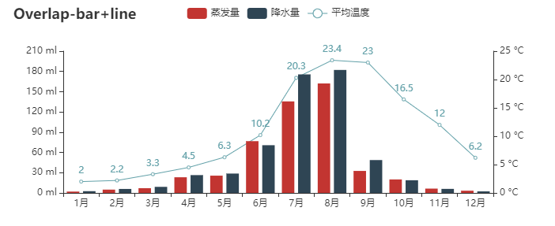

- 多图标以网格（GRID）方式组合，主要是对比；pyecharts中是通过grid组件实现、
```python
from pyecharts import options as opts
from pyecharts.charts import Bar, Grid, Line
from pyecharts.faker import Faker

bar = (
    Bar()
    .add_xaxis(Faker.choose())
    .add_yaxis("商家A", Faker.values())
    .add_yaxis("商家B", Faker.values())
    .set_global_opts(title_opts=opts.TitleOpts(title="Grid-Bar"))
)
line = (
    Line()
    .add_xaxis(Faker.choose())
    .add_yaxis("商家A", Faker.values())
    .add_yaxis("商家B", Faker.values())
    .set_global_opts(
        title_opts=opts.TitleOpts(title="Grid-Line", pos_top="48%"),
        legend_opts=opts.LegendOpts(pos_top="48%"),
    )
)

grid = (
    Grid(init_opts=opts.InitOpts(width="680px", height="500px"))
    .add(bar, grid_opts=opts.GridOpts(pos_bottom="60%"))
    .add(line, grid_opts=opts.GridOpts(pos_top="60%"))
)
grid.render_notebook()
```
从实现看

   - 主要通过`Grid`把各种图形放入其中
   - 各个图表的位置通过`GridOpts`来设置，上下左右的位置
   - 需要注意的是:grid中图表的title和图例需要根据所处位置来指定相对的位置（这个有点麻烦，多调调）

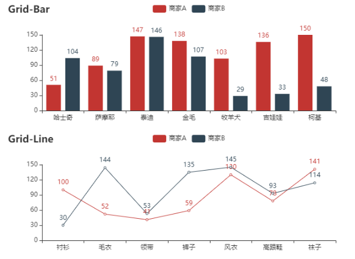
<a name="PRcwx"></a>
## 8、地图使用
地图可用在展示数据在地理位置上的分布情况，也是很常见的可视化的展示组件。pyecharts中是通过`Map`类来实现的。具体细节需要注意：

- map支持不同的maptype，如中国地图china(省级) china-cities（市级），世界地图world，还有中国各省市地图以及世界各国国家地图，参看[githubpyecharts/datasets/map_filename.json](githubpyecharts/datasets/map_filename.json)
- map的数据格式是（地理位置， value）， 如`[['广东', 76],['北京', 58]]`
- 可以通过`visualmap_opts`查看着重点
```python
from pyecharts import options as opts
from pyecharts.charts import Map
from pyecharts.faker import Faker

c1 = (
    Map()
    .add("商家A", [list(z) for z in zip(Faker.guangdong_city, Faker.values())], "广东")
    .set_global_opts(
        title_opts=opts.TitleOpts(title="Map-广东地图"), visualmap_opts=opts.VisualMapOpts()
    )
   
)

c2 = (
    Map()
    .add("商家A", [list(z) for z in zip(Faker.provinces, Faker.values())], "china")
    .set_global_opts(
        title_opts=opts.TitleOpts(title="Map-VisualMap（连续型）"),
        visualmap_opts=opts.VisualMapOpts(max_=200),
    )
)

# c1.render_notebook()
c2.render_notebook()
```
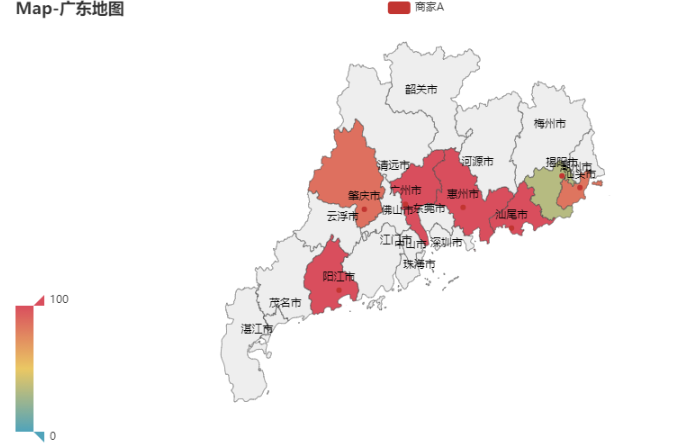
<a name="ys1kG"></a>
## 9、特色图表使用
在学习pyecharts时，看到一些比较有意思的（动态展示）组件，如随着时间动态展示图表数据的变化。这里做下介绍

- `Timeline`：时间线轮播多图 先声明一个`Timeline`, 按照展示的时间顺序，将图表`add`到`Timeline`上; 可以通过播放按钮循环按照时间顺序展示图表。
```python
from pyecharts import options as opts
from pyecharts.charts import Pie, Timeline
from pyecharts.faker import Faker

attr = Faker.choose()
tl = Timeline()
for i in range(2015, 2020):
    pie = (
        Pie()
        .add(
            "商家A",
            [list(z) for z in zip(attr, Faker.values())],
            rosetype="radius",
            radius=["30%", "55%"],
        )
        .set_global_opts(title_opts=opts.TitleOpts("某商店{}年营业额".format(i)))
    )
    tl.add(pie, "{}年".format(i))
tl.render_notebook()
```
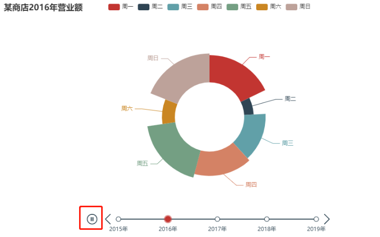

- 仪表盘
```python
from pyecharts import options as opts
from pyecharts.charts import Gauge

c = (
    Gauge()
    .add("", [("完成率", 30.6)], radius="70%",
        axisline_opts=opts.AxisLineOpts(
            linestyle_opts=opts.LineStyleOpts(
                color=[(0.3, "#67e0e3"), (0.7, "#37a2da"), (1, "#fd666d")], width=30)
            ),
            title_label_opts=opts.LabelOpts(
                font_size=20, color="blue", font_family="Microsoft YaHei"
            ),
        )
    .set_global_opts(title_opts=opts.TitleOpts(title="Gauge-基本示例"), legend_opts=opts.LegendOpts(is_show=False),)

)
c.render_notebook()
```
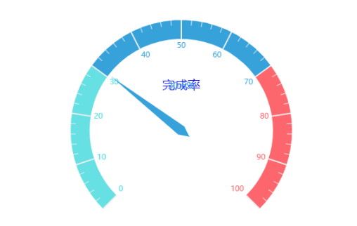
<a name="fxzXx"></a>
## 10、其他图表一览
从上面的实例看，已经展示地图，条形图，折线图，饼图，仪表盘。这里展示下pyecharts提供的更多的图表，

- 雷达图 Radar

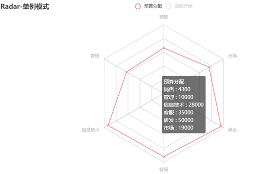

- 树形图 Tree

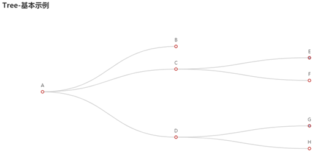

- 热力图 heatMap

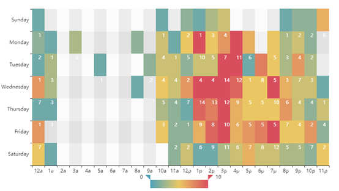

- 日历图 Calendar

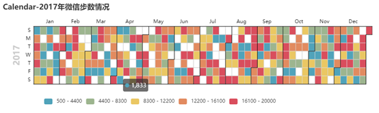

- 散点图 Scatter

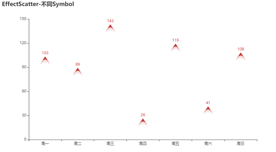

- 3D图 Bar3D

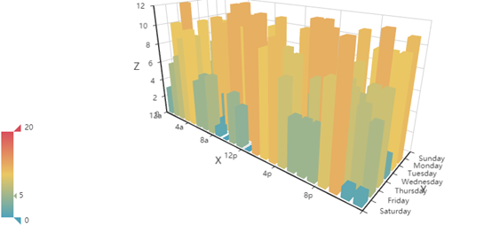

- 箱型图 Boxplot

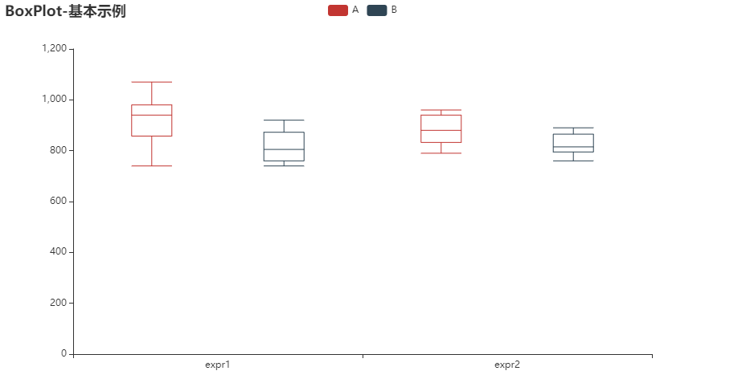
<a name="ScWk4"></a>
## 11、显示及保存图表

- `.render()`默认将会在当前工作目录下生成一个 render.html 的文件，支持path参数，进行自定义文件保存位置，最终文件可以可以发送给任何人，直接用浏览器打开，交互效果仍然存在。
- Jupyter Notebook中直接调用`.render_notebook()`随时随地渲染图表。

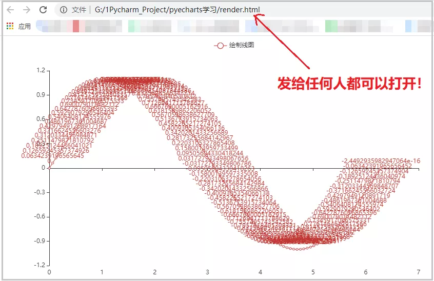
<a name="AtKTW"></a>
## 12、总结
本文介绍的基于echarts的Python动态图表展示组件pyecharts，除了提供众多常用的图表外，最重要的是支持动态操作数据。总结如下：

- pyecharts所有的图像属性设置都通过opts来设置，有图表初始属性/全局属性/系列属性
- 本文提供常用的配置，足够用了，拿走不谢，见常用配置使用
- pyecharts 支持多图表组合，如折线图和条形图 overlap， 多个图表grid展示
- pyecharts好用的map，可以展示中国省市，世界各国地图，请按照`[位置，value]`准备数据
- Timeline可以让你的图表按照时间轮播
- 更多图表参见官网[参考资料](https://pyecharts.org/#/zh-cn/quickstart)
