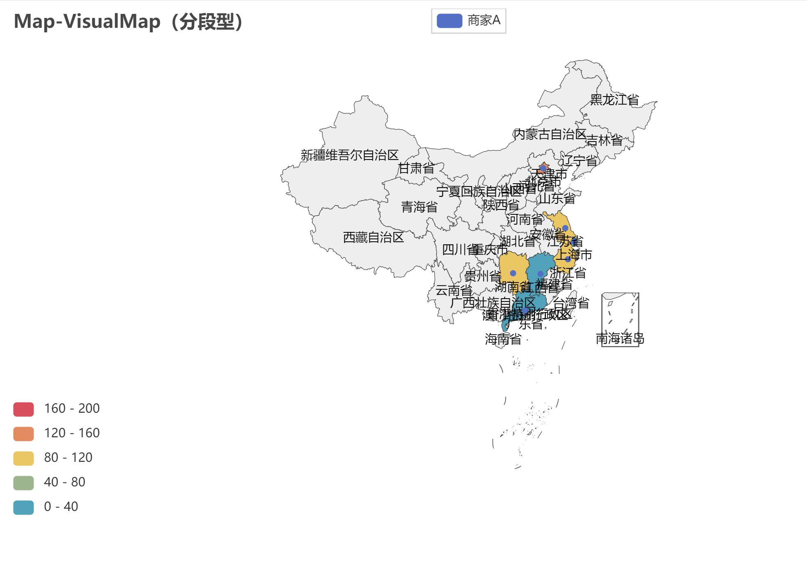
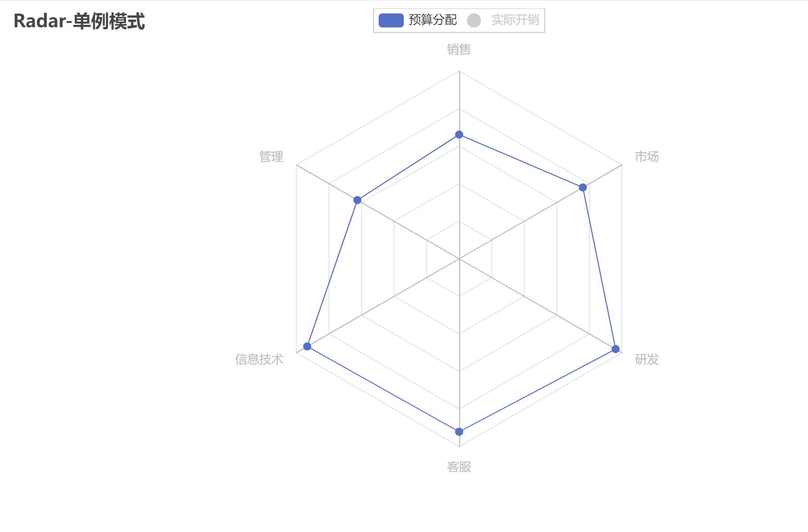

PythonPyecharts<br />官网：[https://pyecharts.org/#/](https://pyecharts.org/#/)<br />Echarts 是一个由百度开源的数据可视化，凭借着良好的交互性，精巧的图表设计，得到了众多开发者的认可。而 Python 是一门富有表达力的语言，很适合用于数据处理。当数据分析遇上数据可视化时，pyecharts 诞生了。<br />Pyecharts具有简洁的 API 设计，使用如丝滑般流畅，支持链式调用，囊括了 30+ 种常见图表，应有尽有，支持主流 Notebook 环境，Jupyter Notebook 和 JupyterLab，拥有高度灵活的配置项，可轻松搭配出精美的图表。<br />Pyecharts强大的数据交互功能，使数据表达信息更加生动，增加了人机互动效果，并且数据呈现效果可直接导出为html文件，增加数据结果交互的机会，使得信息沟通更加容易。<br />
<a name="rWM4C"></a>
## 绘制地图
Pyecharts有着丰富的图表素材，支持链式调用，如下是使用Pyecharts的地理图表功能，空间上直观显示数据可视化效果。
```python
from pyecharts import options as opts
from pyecharts.charts import Map
from pyecharts.faker import Faker

c = (
    Map()
    .add("商家A", [list(z) for z in zip(Faker.provinces, Faker.values())], "china")
    .set_global_opts(
        title_opts=opts.TitleOpts(title="Map-VisualMap（分段型）"),
        visualmap_opts=opts.VisualMapOpts(max_=200, is_piecewise=True),
    )
    .render("map_visualmap_piecewise.html")
)
```

<a name="SClXm"></a>
## 绘制雷达图
使用Radar命令绘制出雷达图，用来显示多变量数据的图形方法。
```python
from pyecharts import options as opts
from pyecharts.charts import Radar

v1 = [[4300, 10000, 28000, 35000, 50000, 19000]]
v2 = [[5000, 14000, 28000, 31000, 42000, 21000]]
c = (
    Radar()
    .add_schema(
        schema=[
            opts.RadarIndicatorItem(name="销售", max_=6500),
            opts.RadarIndicatorItem(name="管理", max_=16000),
            opts.RadarIndicatorItem(name="信息技术", max_=30000),
            opts.RadarIndicatorItem(name="客服", max_=38000),
            opts.RadarIndicatorItem(name="研发", max_=52000),
            opts.RadarIndicatorItem(name="市场", max_=25000),
        ]
    )
    .add("预算分配", v1)
    .add("实际开销", v2)
    .set_series_opts(label_opts=opts.LabelOpts(is_show=False))
    .set_global_opts(
        legend_opts=opts.LegendOpts(selected_mode="single"),
        title_opts=opts.TitleOpts(title="Radar-单例模式"),
    )
    .render("radar_selected_mode.html")
)
```

