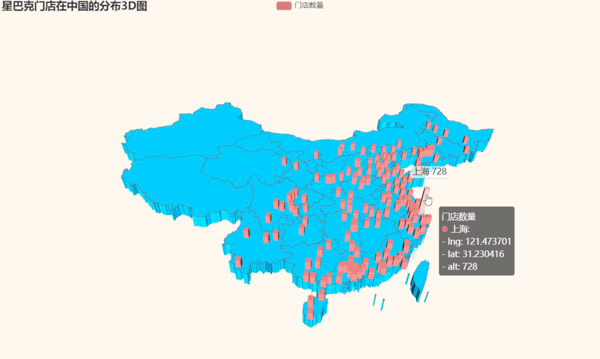

Python Pyecharts<br />Pyecharts 是一个用于生成 Echarts 图表的类库。Echarts 是百度开源的一个数据可视化 JS 库。用 Echarts 生成的图可视化效果非常棒，pyecharts 是为了与 Python 进行对接，方便在 Python 中直接使用数据生成图。<br />Pyecharts绘制地图如此轻松，几行代码搞定多种形式的数据地图。
<a name="oBwf8"></a>
## 安装
首先需要安装python第三方包 `--pyecharts`， 目前最新版本为1.8.1。
```bash
pip install pyecharts
```
自从v0.3.2开始，为了缩减项目本身的体积以及维持pyecharts项目的轻量化运行，pyecharts将不再自带地图js 文件。如用户需要用到地图图表，可自行安装对应的地图文件包。下面介绍如何安装。

- 全球国家地图:echarts-countries-pypkg (1.9MB): 世界地图和 213 个国家，包括中国地图
- 中国省级地图:echarts-china-provinces-pypkg (730KB)：23 个省，5 个自治区
- 中国市级地图:echarts-china-cities-pypkg (3.8MB)：370 个中国城市
- 中国县区级地图:echarts-china-counties-pypkg (4.1MB)：2882 个中国县·区
- 中国区域地图:echarts-china-misc-pypkg (148KB)：11 个中国区域地图，比如华南、华北

选择自己需要安装地图相关的扩展包。
```bash
pip install echarts-countries-pypkg
pip install echarts-china-provinces-pypkg
pip install echarts-china-cities-pypkg
pip install echarts-china-counties-pypkg
pip install echarts-china-misc-pypkg
pip install echarts-united-kingdom-pypkg
```
可以选择豆瓣源或清华源加速安装。
```bash
pip install pyecharts -i http://pypi.douban.com/simple 
pip install -i https://pypi.tuna.tsinghua.edu.cn/simple echarts-countries-pypkg
```
:::warning
pyecharts版本 v0.5.x 和 v1 间不兼容，v1 是一个全新的版本，语法也有很大不同。
:::
查看pyecharts版本。
```python
import pyecharts
print(pyecharts.__version__)         
```
做好准备后，就可以开始绘图了。如果是新手，对pyehcarts还有些陌生，可以参见官方5分钟上手:[https://pyecharts.org/#/zh-cn/quickstart?id=_5-分钟上手](https://pyecharts.org/#/zh-cn/quickstart?id=_5-分钟上手)
<a name="QnHZm"></a>
## 绘制地图
Pyehcarts共有有四种地理图表，

- Map：地图([https://pyecharts.org/#/zh-cn/geography_charts?id=map](https://pyecharts.org/#/zh-cn/geography_charts?id=map)：地图)以此为基础，熟悉绘图基本步骤及各个配置项。
- Geo：地理坐标系([https://pyecharts.org/#/zh-cn/geography_charts?id=geo](https://pyecharts.org/#/zh-cn/geography_charts?id=geo)：地理坐标系)本文重点介绍
- BMap：百度地图([https://pyecharts.org/#/zh-cn/geography_charts?id=bmap](https://pyecharts.org/#/zh-cn/geography_charts?id=bmap)：百度地图)百度地图需要申请开发者 AK，([https://lbsyun.baidu.com/](https://lbsyun.baidu.com/))。
- Map3D：三维地图 ([https://pyecharts.org/#/zh-cn/3d_charts?id=map3d](https://pyecharts.org/#/zh-cn/3d_charts?id=map3d)-三维地图)
<a name="NtUeU"></a>
### 一、Map
以星巴克门店在全球的分布为例。本例数据来源Kaggle星巴克数据：[https://www.kaggle.com/starbucks/store-locations](https://www.kaggle.com/starbucks/store-locations)<br /><br />数据样例：<br />
```python
from pyecharts.charts import Map
from pyecharts import options as opts
from pyecharts.globals import ThemeType, CurrentConfig

CurrentConfig.ONLINE_HOST = 'C:/python/pyecharts-assets-master/assets/'
# 参考 https://github.com/pyecharts/pyecharts-assets

df = starbuck['English']
data = df.value_counts()
datas = [(i, int(j)) for i, j in zip(data.index, data.values)]

# 实例化一个Map对象
map_ = Map(init_opts=opts.InitOpts(theme=ThemeType.PURPLE_PASSION))

# 世界地图
map_.add(series_name="门店数量", data_pair=datas, maptype="world")

# 设置系列配置项
map_.set_series_opts(label_opts=opts.LabelOpts(is_show=False))   # 不显示label
# 设置全局配置项
map_.set_global_opts(
     title_opts=opts.TitleOpts(title="星巴克门店数量在全球分布", 
                               pos_left='40%', 
                               pos_top='10'),   # 调整title位置
     legend_opts=opts.LegendOpts(is_show=False),
     visualmap_opts=opts.VisualMapOpts(
         max_=13608, 
         min_=1, 
         is_piecewise=True,
       pieces=[{"max": 9, "min": 1, "label": "1-9", "color": "#00FFFF"},
                 {"max": 99, "min": 10, "label": "10-99", "color": "#FF69B4"},
                 {"max": 499, "min": 100, "label": "100-499", "color": "#0000FF"},
                 {"max": 999, "min": 500, "label": "500-999", "color": "#00BFFF"},
                 {"max": 2000, "min": 1000, "label": "1000-2000", "color": "#228B22"},
                 {"max": 3000, "min": 2000, "label": "2000-3000", "color": "#FF0000"},
                 {"max": 20000, "min": 10000, "label": ">=10000", "color": "#FFD700"}
                ] # 分段  添加图例注释和颜色
     )
)
# 渲染在网页上   有交互性
map_.render('星巴克门店在全球的分布.html')
```
输出<br />
<a name="yMKOw"></a>
#### 绘图步骤：
<a name="GW56M"></a>
#### 1、创建实例
```python
Map(init_opts=opts.InitOpts(theme=ThemeType.PURPLE_PASSION))
```
**创建实例并初始化配置。**<br />可配置图表宽度、高度、渲染风格、标题、主题、背景颜色等，详情参见下面连接[https://pyecharts.org/#/zh-cn/global_options?id=initopts](https://pyecharts.org/#/zh-cn/global_options?id=initopts)：初始化配置项<br />theme：pyecharts内置提供了10+ 种不同的风格, 参见[https://pyecharts.org/#/zh-cn/themes](https://pyecharts.org/#/zh-cn/themes)
<a name="MKmjr"></a>
#### 2、添加数据
`.add()`添加了数据。

- `series_name`：系列名称，用于 tooltip 的显示，legend 的图例筛选。
- `data_pair`：数据项，每个数据项由一个个元组组成：(坐标点名称，坐标点值)    实际上一个是地区名称另一个是对应的数据。pyecharts绘制地图只需导入城市名称和数值即可，因为区县级以上城市的经纬度信息都已经在模块中存在，可以在[https://github.com/pyecharts/pyecharts/blob/master/pyecharts/datasets/city_coordinates.json](https://github.com/pyecharts/pyecharts/blob/master/pyecharts/datasets/city_coordinates.json)中找到。本实例中是国家名称与门店数量组成的数据项。`[('United States', 13608), ('China', 2734), ('Canada', 1468), ('Japan', 1237), ... ]`
- `maptype='world'`，这里是指地图类型，默认为china中国。地图类型请参见：[https://github.com/pyecharts/pyecharts/blob/master/pyecharts/datasets/map_filename.json](https://github.com/pyecharts/pyecharts/blob/master/pyecharts/datasets/map_filename.json)
<a name="hYkS9"></a>
#### 3、设置系列配置项
`.set_series_opts()`<br />[https://pyecharts.org/#/zh-cn/series_options](https://pyecharts.org/#/zh-cn/series_options)<br />除了在`.add()`中设置部分配置项外，就是使用`.set_series_opts()`配置图元样式、文字样式、标签样式、点线样式等。
<a name="RFx0g"></a>
#### 4、设置全局配置项
`.set_global_opts()`配置标题、动画、坐标轴、图例等。[https://pyecharts.org/#/zh-cn/global_options](https://pyecharts.org/#/zh-cn/series_options?id=effectopts)<br /><br />本实例中：

- `min_`：指定`visualMapPiecewise`组件的最小值。
- `max_`：指定`visualMapPiecewise`组件的最大值。
- `is_piecewise`：是否为分段型。
- `pieces`：自定义的每一段的范围，以及每一段的文字，以及每一段的特别的样式。
<a name="Pltas"></a>
#### 5、生成的地图以html格式保存
`.render()`将生成的地图以`html`格式保存。
<a name="hYTmL"></a>
### 二、Geo
Geo 图类型，使用`type_: str = "scatter"`参数控制。<br />有`scatter`, `effectScatter`, `heatmap`, `lines`4 种。
```python
from pyecharts.globals import GeoType    
GeoType.GeoType.EFFECT_SCATTER，GeoType.HEATMAP，GeoType.LINES
```
<a name="l4Lnk"></a>
#### 1、动态涟漪散点图 effectScatter
V1 版本开始支持链式调用。<br />数据样例：<br />
```python
import pandas as pd
from pyecharts.globals import ThemeType, CurrentConfig, GeoType
from pyecharts import options as opts
from pyecharts.charts import Geo

CurrentConfig.ONLINE_HOST = 'C:/python/pyecharts-assets-master/assets/'
# pandas读取csv文件数据
df = pd.read_csv('directory2.csv', encoding='utf-8')['城市']
data = df.value_counts()
#自定义各城市的经纬度
# geo_cities_coords = {df.iloc[i]['城市']:[df.iloc[i]['经度'],df.iloc[i]['纬度']] for i in range(len(df))}

datas = [(i, int(j)) for i, j in zip(data.index, data.values)]
print(datas)

geo = (Geo(init_opts=opts.InitOpts(width='1000px', 
                                   height='600px', 
                                   theme=ThemeType.PURPLE_PASSION),
           is_ignore_nonexistent_coord = True)
       .add_schema(maptype='china', 
                   label_opts=opts.LabelOpts(is_show=True))   # 显示label  省名
       .add('门店数量', 
            data_pair=datas, 
            type_=GeoType.EFFECT_SCATTER, 
            symbol_size=8,
            # geo_cities_coords=geo_cities_coords
           )
       .set_series_opts(label_opts=opts.LabelOpts(is_show=False))
       .set_global_opts(
           title_opts=opts.TitleOpts(title='星巴克门店在中国的分布'),
           visualmap_opts=opts.VisualMapOpts(max_=550,
                                             is_piecewise=True,
                                             pieces=[
                     {"max": 50, "min": 0, "label": "0-50", "color": "#708090"},
                     {"max": 100, "min": 51, "label": "51-100", "color": "#00FFFF"},
                     {"max": 200, "min": 101, "label": "101-200", "color": "#FF69B4"},
                     {"max": 400, "min": 201, "label": "201-400", "color": "#FFD700"},
                     {"max": 800, "min": 600, "label": "600-800", "color": "#FF0000"},])
       )
      )

geo.render("星巴克门店在中国的分布.html")
```
输出<br /><br />Geo新增坐标点
```python
# 新增一个坐标点
.add_coordinate(    
    # 坐标地点名称    
    name: str,     
    # 经度    
    longitude: Numeric,     
    # 纬度    
    latitude: Numeric, )
# 新增 json 文件格式的坐标数据
.add_coordinate_json(
    # json 文件格式的坐标数据
    # 格式如下
    # {
    #   "阿城": [126.58, 45.32],
    #   "阿克苏": [80.19, 41.09]
    # }
    json_file: str # 坐标文件路径
)
```
<a name="BBeG4"></a>
#### 2、热力图heatmap
```python
from pyecharts import options as opts
from pyecharts.charts import Geo
from pyecharts.globals import ChartType
CurrentConfig.ONLINE_HOST = 'C:/python/pyecharts-assets-master/assets/'

# pandas读取csv文件数据
df = pd.read_csv('directory2.csv', encoding='utf-8')['城市']
data = df.value_counts()

datas = [(i, int(j)) for i, j in zip(data.index, data.values)]
print(datas)
geo = (
    Geo(init_opts=opts.InitOpts(width='1000px', 
                                height='600px', 
                                theme=ThemeType.DARK),
        is_ignore_nonexistent_coord=True)
    .add_schema(maptype="china")                       #maptype选择地图种类
    .add(series_name="门店数量",      # 系列名称
         data_pair=datas,          # 数据项 (坐标点名称，坐标点值)
         blur_size=20,
         symbol_size= 5,
         type_=ChartType.HEATMAP  #类型选为热力图
         )
    .set_series_opts(label_opts=opts.LabelOpts(is_show=False))
    .set_global_opts(
        visualmap_opts=opts.VisualMapOpts(max_=800,is_piecewise=True),
        title_opts=opts.TitleOpts(title="星巴克门店在中国的分布热力图"))
)
geo.render( '星巴克门店在中国的分布热力图.html')
```
输出<br />
<a name="dTMTI"></a>
### 3、动态轨迹图lines
pyecharts可以生成地理空间流动图，用来表示航班数量、人口流动等等。
```python
from pyecharts import options as opts
from pyecharts.charts import Geo
from pyecharts.faker import Faker
from pyecharts.globals import ChartType, SymbolType, CurrentConfig
import  random

datas = []
for _ in range(6):
    datas.append(tuple(random.sample(Faker.provinces, 2)))
    
CurrentConfig.ONLINE_HOST = 'C:/python/pyecharts-assets-master/assets/'
geo = (
    Geo(init_opts=opts.InitOpts(width='1000px', 
                                height='600px', 
                                theme=ThemeType.CHALK))
    .add_schema(
        maptype="china",
        itemstyle_opts=opts.ItemStyleOpts(color="#323c48", border_color="#111"),
        label_opts=opts.LabelOpts(is_show=True)
    )
    .add(
        "",
        [list(z) for z in zip(Faker.provinces, Faker.values())],
        type_=ChartType.EFFECT_SCATTER,
        color="white",
    )
    .add(
        "出差",
        data_pair = datas,
        type_=ChartType.LINES,
        effect_opts=opts.EffectOpts(
            symbol=SymbolType.DIAMOND, symbol_size=6, color="blue"
        ),
        linestyle_opts=opts.LineStyleOpts(curve=0.2),
    )
    .set_series_opts(label_opts=opts.LabelOpts(is_show=False))
    .set_global_opts(title_opts=opts.TitleOpts(title="动态轨迹图"))
    .render("动态轨迹图.html")
)
```
输出<br /><br />如果需要再添加一个其他类别的动态轨迹，只需在链式中添加：
```python
.add('旅游',
     [('上海','拉萨'),('拉萨','大理'),('大理','成都'),('成都','海口')],
     type_=ChartType.LINES,
     effect_opts=opts.EffectOpts(
         symbol=SymbolType.ARROW, symbol_size=6, color="orange"),
     linestyle_opts=opts.LineStyleOpts(curve=0.5)
    )
```
输出如下，可以点击图例来筛选类别。<br /><br />这边用到两个配置项：

- `effect_opts= opts.EffectOpts(symbol)`涟漪特效配置项[https://pyecharts.org/#/zh-cn/series_options?id=effectopts](https://pyecharts.org/#/zh-cn/series_options?id=effectopts)：涟漪特效配置项symbol：特效图形的标记。ECharts 提供的标记类型包括'circle', 'rect', 'roundRect', 'triangle', diamond', 'pin', 'arrow', 'none'，可以通过 'image://url' 设置为图片，其中 URL 为图片的链接，或者 dataURI。
- `linestyle_opts=opts.LineStyleOpts(curve=0.2)`线样式配置项[https://pyecharts.org/#/zh-cn/series_options?id=linestyleopts](https://pyecharts.org/#/zh-cn/series_options?id=linestyleopts)：线样式配置项curve：线的弯曲度，0 表示完全不弯曲。
<a name="pfCQr"></a>
### 4、三维地图
```python
from pyecharts import options as opts
from pyecharts.charts import Map3D
from pyecharts.globals import ChartType
from pyecharts.commons.utils import JsCode

c = (
    Map3D(init_opts=opts.InitOpts(width='1000px', 
                                height='600px', 
                                theme=ThemeType.VINTAGE))
    # 地图类型
    .add_schema(
        itemstyle_opts=opts.ItemStyleOpts( # 图形的颜色
            color="#00BFFF", # 或 'rgb(128, 128, 128)'
            opacity=1, # 图形透明度
            border_width=0.8, # 描边宽度
            border_color="#708090", # 描边颜色
        ),
        # Map3D 的 Label 设置
        map3d_label=opts.Map3DLabelOpts(
            is_show=False,
            formatter=JsCode("function(data){return data.name + " " + data.value[2];}"),
        ),
        
        # 高亮标签配置项
        emphasis_label_opts=opts.LabelOpts(
            is_show=False,
            color="#fff",
            font_size=10,
            background_color="rgba(0,23,11,0)",
        ),
        
        # 光照相关的设置。
        light_opts=opts.Map3DLightOpts(
            main_color="#fff",
            main_intensity=1.2,
            main_shadow_quality="high",
            is_main_shadow=False,
            main_beta=10,
            ambient_intensity=0.3,
        ),
    )
    .add(
        series_name="门店数量",
        data_pair=datas,
        # 叠加图的类型
        type_=ChartType.BAR3D,
        bar_size=1,
        
        # 三维地图中三维图形的着色效果。
        shading="lambert",
        label_opts=opts.LabelOpts(
            is_show=False,
            formatter=JsCode("function(data){return data.name + ' ' + data.value[2];}"),
        ),
    )
    .set_global_opts(title_opts=opts.TitleOpts(title="星巴克门店在中国的分布3D图"))
    .render("map3d_with_bar3d.html")
)
```
输出<br /><br />本例中的主要参数说明：
<a name="yCYOm"></a>
#### `.add_schema()`
地图类型设置，参考pyecharts.datasets.map_filenames.json 文件

- `itemstyle_opts=opts.ItemStyleOpts()`图形的颜色
- `map3d_label=opts.Map3DLabelOpts()`Map3D 的 Label 设置
- `emphasis_label_opts=opts.LabelOpts()`高亮标签配置项参考 `series_options.LabelOpts`
- `light_opts=opts.Map3DLightOpts()`光照相关的设置。在 shading 为 'color' 的时候无效。
<a name="J2yKr"></a>
#### `.add()`

- `type_=ChartType.BAR3D`, 叠加图的类型（目前只支持Bar3D，Line3D，Lines3D，Scatter3D）
- `shading="lambert"`三维地图中三维图形的着色效果。ECharts GL 中使用了基于物理的渲染（PBR）来表现真实感材质。echarts-gl 中支持下面三种着色方式：
   - `color`:只显示颜色，不受光照等其它因素的影响。
   - `lambert`:通过经典的 lambert 着色表现光照带来的明暗。
   - `realistic`:真实感渲染，配合 `light.ambientCubemap` 和 `postEffect` 使用可以让展示的画面效果和质感有质的提升。
<a name="UpG23"></a>
### 5、Globe地图
数据来源是pyecharts自带的全球人口数据。
```python
import pyecharts.options as opts
from pyecharts.charts import MapGlobe
from pyecharts.faker import POPULATION
from pyecharts.globals import ThemeType

data = [x for _, x in POPULATION[1:]]
low, high = min(data), max(data)

c = (
    MapGlobe(init_opts=opts.InitOpts(theme=ThemeType.DARK))
    .add_schema()
    .add(
        maptype="world",
        series_name="World Population",
        data_pair=POPULATION[1:],
        is_map_symbol_show=False,
        label_opts=opts.LabelOpts(is_show=False),
    )
    .set_global_opts(
        visualmap_opts=opts.VisualMapOpts(
            min_=low,
            max_=high,
            range_text=["max", "min"],
            is_calculable=True,
            range_color=["lightskyblue", "yellow", "orangered"],
        )
    )
    .render("map_globe_base.html")
)
```
输出<br />
