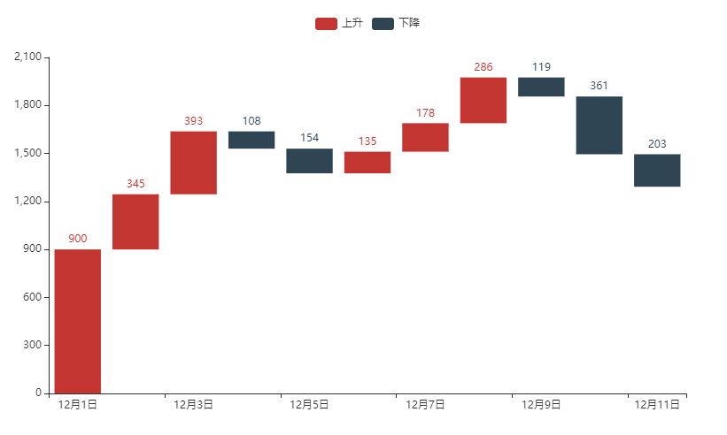
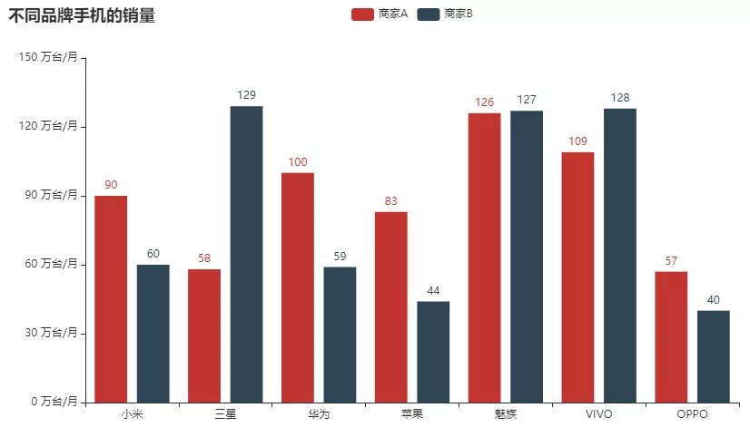
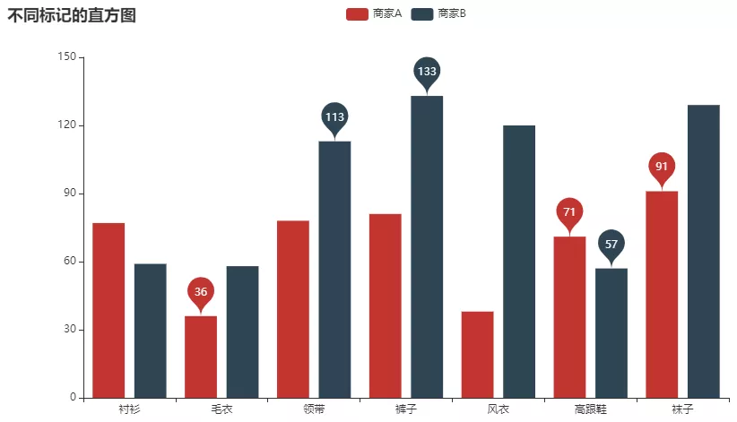
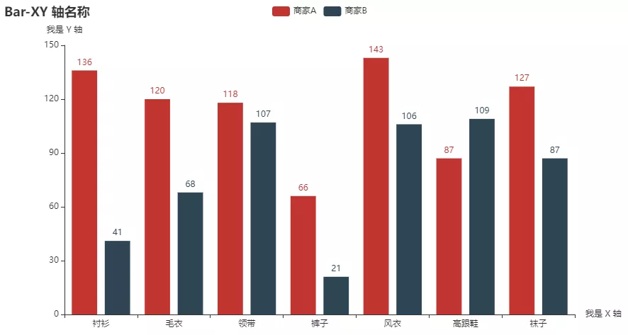
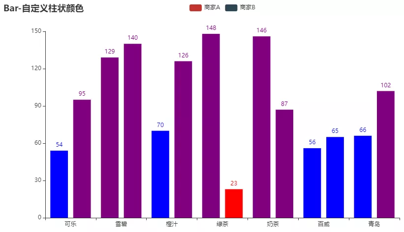
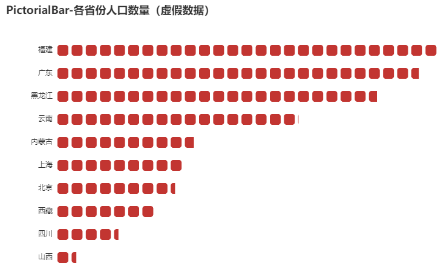
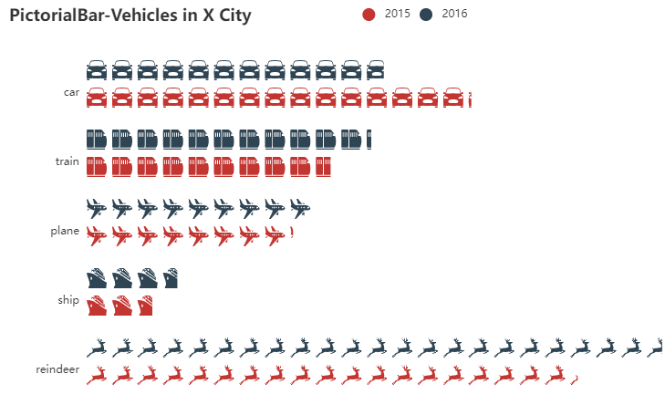

Python Pyecherts<br />首先需要导入相应的所要用到的模块
```python
from pyecharts import options as opts
from pyecharts.charts import Bar, Timeline, Map, Pie, Line
from pyecharts.faker import Faker
from pyecharts.globals import ThemeType
from pyecharts.commons.utils import JsCode
```
<a name="b3gt5"></a>
### 不一样的柱状图
先从柱状图着手，来绘制一张瀑布形状的柱状图，代码如下
```python
x_data = [f"12月{str(i)}日" for i in range(1, 12)]
y_total = [0, 900, 1245, 1530, 1376, 1376, 1511, 1689, 1856, 1495, 1292]
y_in = [900, 345, 393, "-", "-", 135, 178, 286, "-", "-", "-"]
y_out = ["-", "-", "-", 108, 154, "-", "-", "-", 119, 361, 203]


bar = (
    Bar()
    .add_xaxis(x_data)
    .add_yaxis(
        series_name="",
        y_axis=y_total,
        stack="总量",
        itemstyle_opts=opts.ItemStyleOpts(color="rgba(0,0,0,0)"),
    )
    .add_yaxis(series_name="上升", y_axis=y_in, stack="总量")
    .add_yaxis(series_name="下降", y_axis=y_out, stack="总量")
    .set_global_opts(yaxis_opts=opts.AxisOpts(type_="value"))
    .render("bar_waterfall_plot.html")
)
```
output<br /><br />从上面绘制出来的图表中可以看出，红色代表的是上升而藏青色代表的是下降，在前三天上升的趋势之后便迎来了两天的下降走势，然后又是连续三天的上升与下降，这张图可以直观的看出**随着时间的推移数据总体是呈现上升还是下降**，用处非常的大！
<a name="He5cU"></a>
### 柱状图Y轴上面的个性化标记
还可以自己设定Y轴上面的标记，代码如下
```python
c = (
    Bar()
    .add_xaxis(['小米', '三星', '华为', '苹果', '魅族', 'VIVO', 'OPPO'])
    .add_yaxis("商家A", Faker.values())
    .add_yaxis("商家B", Faker.values())
    .set_global_opts(
        title_opts=opts.TitleOpts(title="不同商店的销量"),
        yaxis_opts=opts.AxisOpts(axislabel_opts=opts.LabelOpts(formatter="{value} 万台/月")),
    )
    .render("bar_yaxis_formatter.html")
)
```
output<br /><br />上图当中的Y轴上的标记后面添加了万台/月的注释，这样就可以更加地让人明白图中数据的深意了
<a name="ldhx7"></a>
### 柱状图中做出标记
还能够对柱状图中的某些特殊的值做出标记，例如是最大/最小值、平均值等等，代码如下
```python
c = (
    Bar()
    .add_xaxis(Faker.choose())
    .add_yaxis("商家A", Faker.values())
    .add_yaxis("商家B", Faker.values())
    .set_global_opts(title_opts=opts.TitleOpts(title="不同标记的直方图"))
    .set_series_opts(
        label_opts=opts.LabelOpts(is_show=False),
        markpoint_opts=opts.MarkPointOpts(
            data=[
                opts.MarkPointItem(type_="max", name="最大值"),
                opts.MarkPointItem(type_="min", name="最小值"),
                opts.MarkPointItem(type_="average", name="平均值"),
            ]
        ),
    )
    .render("bar_markpoint_type.html")
)
```
output<br /><br />可以看到直方图当中的指定的数值被标了出来，变得更加的直观，可读性更高。
<a name="w64ag"></a>
### 对X轴和Y轴标上名字
同时还可以对X轴和Y轴标上名字，告诉用户X轴以及Y轴代表的是什么数据，具备更强的可读性和直观性，代码如下
```python
c = (
    Bar()
    .add_xaxis(Faker.choose())
    .add_yaxis("商家A", Faker.values())
    .add_yaxis("商家B", Faker.values())
    .set_global_opts(
        title_opts=opts.TitleOpts(title="Bar-XY 轴名称"),
        yaxis_opts=opts.AxisOpts(name="我是 Y 轴"),
        xaxis_opts=opts.AxisOpts(name="我是 X 轴"),
    )
    .render("bar_xyaxis_name.html")
)
```
output<br />
<a name="cIQZz"></a>
### Pyecharts和JavaScript的联用
在Pyecharts代码当中加入JS代码，倒是并不少见，例如可以在当中添加JS代码来改变可视化图表的颜色，代码如下
```python
color_function = """
        function (params) {
            if (params.value > 0 && params.value < 30) {
                return 'red';
            } else if (params.value > 30 && params.value < 80) {
                return 'blue';
            }
            return 'purple';
        }
        """
c = (
    Bar()
    .add_xaxis(Faker.choose())
    .add_yaxis(
        "商家A",
        Faker.values(),
        itemstyle_opts=opts.ItemStyleOpts(color=JsCode(color_function)),
    )
    .add_yaxis(
        "商家B",
        Faker.values(),
        itemstyle_opts=opts.ItemStyleOpts(color=JsCode(color_function)),
    )
    .set_global_opts(title_opts=opts.TitleOpts(title="Bar-自定义柱状颜色"))
    .render("bar_custom_bar_color.html")
)
```
output<br /><br />在对于不同数值进行了不同的处理方式，0-30这个范围的是红色、30-80的是蓝色，而其余数值的则是紫色。以上都是通过JS代码来实现然后再添加到Pyecharts代码当中
<a name="Tim93"></a>
### 象形柱状图
象形柱状图是普通柱状图的一种衍生，普通的柱状图是由一根一根的柱子形成的，而象形柱状图则是对这个柱子的形状又做了进一步的优化，显得更加的可爱<br />代码如下
```python
c = (
    PictorialBar()
    .add_xaxis(location)
    .add_yaxis(
        "",
        values,
        label_opts=opts.LabelOpts(is_show=False),
        symbol_size=18,
        symbol_repeat="fixed",
        symbol_offset=[0, 0],
        is_symbol_clip=True,
        symbol=SymbolType.ROUND_RECT,
    )
    .reversal_axis()
    .set_global_opts(
        title_opts=opts.TitleOpts(title="PictorialBar-各省份人口数量（虚假数据）"),
        xaxis_opts=opts.AxisOpts(is_show=False),
        yaxis_opts=opts.AxisOpts(
            axistick_opts=opts.AxisTickOpts(is_show=False),
            axisline_opts=opts.AxisLineOpts(
                linestyle_opts=opts.LineStyleOpts(opacity=0)
            ),
        ),
    )
    .render("pictorialbar_base.html")
)
```
output<br /><br />当然还能够对样式自定义，如下图所示，<br /><br />整个代码的实现和上面的基本一致，这些自定义样式的数据放置在json文件当中，然后从该文件中读取里面的内容
```python
with open("symbol.json", "r", encoding="utf-8") as f:
    symbols = json.load(f)
    
.add_yaxis(
        "2015",
        [
            {"value": 157, "symbol": symbols["reindeer"]},
            {"value": 21, "symbol": symbols["ship"]},
            {"value": 66, "symbol": symbols["plane"]},
            {"value": 78, "symbol": symbols["train"]},
            {"value": 123, "symbol": symbols["car"]},
        ],
        label_opts=opts.LabelOpts(is_show=False),
        symbol_size=22,
        symbol_repeat="fixed",
        symbol_offset=[0, 5],
        is_symbol_clip=True,
    )
```
