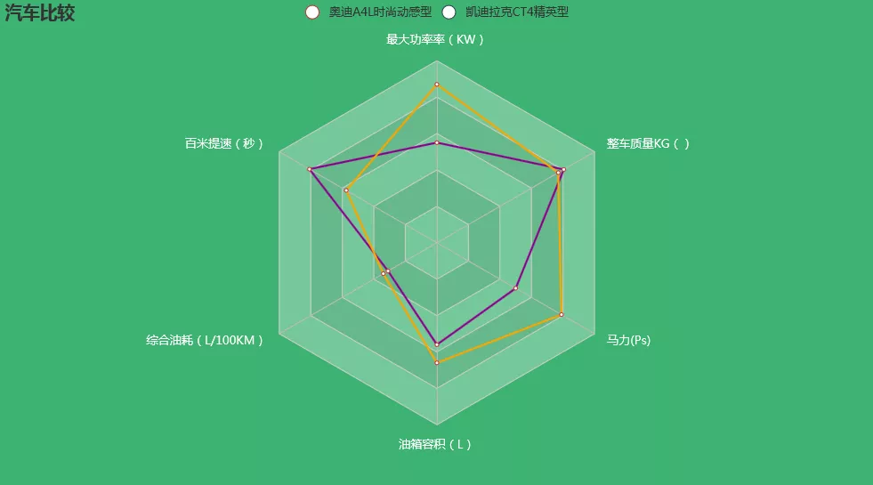
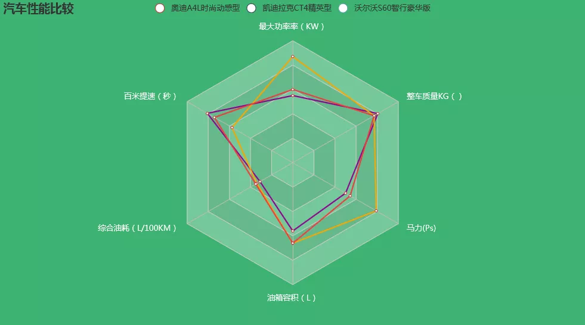
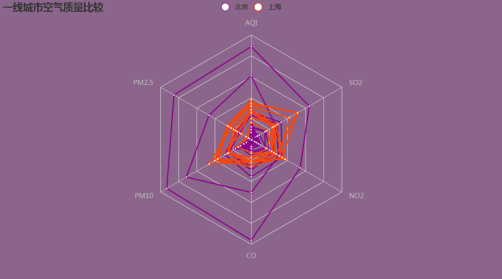

Python 雷达图<br />雷达图是以从同一点开始的轴上表示的三个或更多个定量变量的二维图表的形式显示多变量数据的图形方法,雷达图通常用于综合分析多个指标，具有完整，清晰和直观的优点。<br /><br />下面以实际例子给大家讲解一下雷达图的应用场景和绘制方法：
<a name="Q4ioO"></a>
## 一、比较汽车性能
这类雷达图一般用于比较同类事物不同纬度性能的优劣，以奥迪A4L时尚动感型和凯迪拉克CT4精英型为例，来画一下这两种汽车的雷达图，代码如下：
```python
import pyecharts.options as opts
from pyecharts.charts import Radar
v1 = [[110, 9.7, 6.2, 56, 150, 1610]]
v2 = [[174, 6.9, 6.8, 66, 237, 1540]]
c=(
    Radar(init_opts=opts.InitOpts(bg_color="#3CB371"))   #设置背景颜色
    .add_schema(
        schema=[
            opts.RadarIndicatorItem(name="最大功率率（KW）", max_=200),
            opts.RadarIndicatorItem(name="百米提速（秒）", max_=12),
            opts.RadarIndicatorItem(name="综合油耗（L/100KM）", max_=20),
            opts.RadarIndicatorItem(name="油箱容积（L）", max_=100),
            opts.RadarIndicatorItem(name="马力(Ps)", max_=300),
            opts.RadarIndicatorItem(name="整车质量KG（）", max_=2000),
        ],
        splitarea_opt=opts.SplitAreaOpts(
            is_show=True, areastyle_opts=opts.AreaStyleOpts(opacity=1)  #是否显示分隔区域，透明度设置为1
        ),
        textstyle_opts=opts.TextStyleOpts(color="#fff"),
    )
    .add(
        series_name="奥迪A4L时尚动感型",
        data=v1,
        linestyle_opts=opts.LineStyleOpts(color="#8B008B",width=2),   #线的颜色、宽度
    )
    .add(
        series_name="凯迪拉克CT4精英型",
        data=v2,
        linestyle_opts=opts.LineStyleOpts(color="#FFA500",width=2),   #线的颜色、宽度
    )
    .set_series_opts(label_opts=opts.LabelOpts(is_show=False))  #不显示数字
    .set_global_opts(
        title_opts=opts.TitleOpts(title="汽车性能比较"), legend_opts=opts.LegendOpts()
    )
)
c.render_notebook()
```
<br />**参数介绍**：<br />1.通过设置`InitOpts`的`bg_color`参数，可以改变背景颜色<br />2.通过设置`add_schema`的`schema`参数，可以添加更多纬度变量<br />3.通过设置`LineStyleOpts`的`color`参数，可以设置线的颜色和宽度<br />通过雷达图，可以清晰的比较两种汽车性能指标的好坏，非常直观<br />如果感觉两台车不过瘾，可以再加1台：<br />
<a name="koKC6"></a>
## 二、比较不同城市近期天气状况
```python
from pyecharts import options as opts
from pyecharts.charts import Radar

value_bj = [
    [55, 9, 56, 0.46, 18, 6, 1],
    [25, 11, 21, 0.65, 34, 9, 2],
    [56, 7, 63, 0.3, 14, 5, 3],
    [33, 7, 29, 0.33, 16, 6, 4],
    [42, 24, 44, 0.76, 40, 16, 5],
    [82, 58, 90, 1.77, 68, 33, 6],
    [74, 49, 77, 1.46, 48, 27, 7],
    [78, 55, 80, 1.29, 59, 29, 8],
    [267, 216, 280, 4.8, 108, 64, 9],
    [185, 127, 216, 2.52, 61, 27, 10],
    [39, 19, 38, 0.57, 31, 15, 11],
    [41, 11, 40, 0.43, 21, 7, 12],
]
value_sh = [
    [91, 45, 125, 0.82, 34, 23, 1],
    [65, 27, 78, 0.86, 45, 29, 2],
    [83, 60, 84, 1.09, 73, 27, 3],
    [109, 81, 121, 1.28, 68, 51, 4],
    [106, 77, 114, 1.07, 55, 51, 5],
    [109, 81, 121, 1.28, 68, 51, 6],
    [106, 77, 114, 1.07, 55, 51, 7],
    [89, 65, 78, 0.86, 51, 26, 8],
    [53, 33, 47, 0.64, 50, 17, 9],
    [80, 55, 80, 1.01, 75, 24, 10],
    [117, 81, 124, 1.03, 45, 24, 11],
    [99, 71, 142, 1.1, 62, 42, 12],
]
c_schema = [
    {"name": "AQI", "max": 300, "min": 5},
    {"name": "PM2.5", "max": 250, "min": 20},
    {"name": "PM10", "max": 300, "min": 5},
    {"name": "CO", "max": 5},
    {"name": "NO2", "max": 200},
    {"name": "SO2", "max": 100},
]
c = (
    Radar(init_opts=opts.InitOpts(bg_color="#8B658B"))
    .add_schema(schema=c_schema, shape="polygon")
    .add("北京", value_bj,color="#8B008B",linestyle_opts=opts.LineStyleOpts(width=2))
    .add("上海", value_sh,color="#FF4500",linestyle_opts=opts.LineStyleOpts(width=2))
    .set_series_opts(label_opts=opts.LabelOpts(is_show=False))
    .set_global_opts(title_opts=opts.TitleOpts(title="一线城市空气质量比较"))
)
c.render_notebook()
```
<br />通过增加数据种类，可以比较同一纬度、不同时间下的差距，如上图，通过展示北京、上海两座城市12天的天气情况，可以清晰的看出上海的天气要比北京好。
