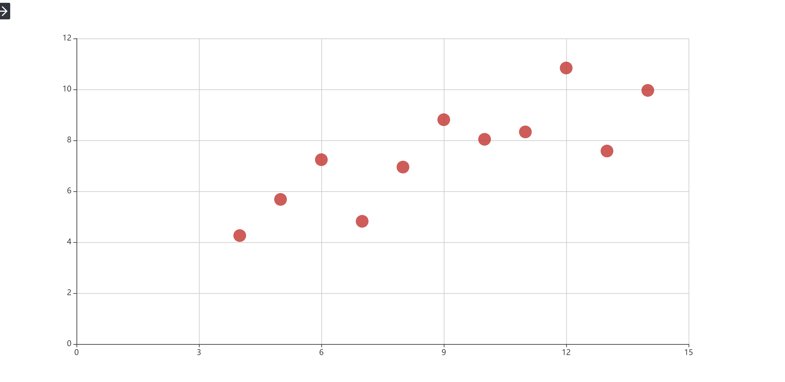
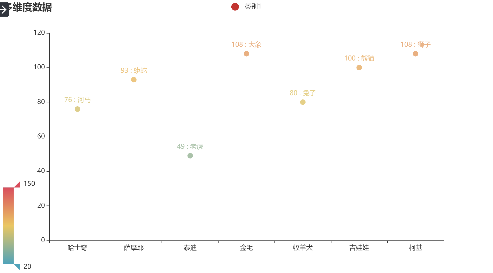
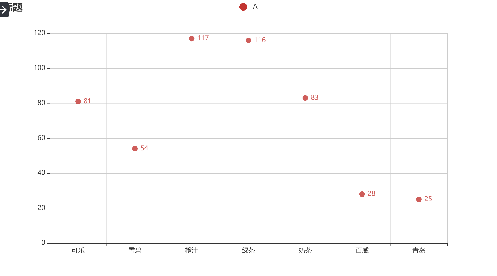
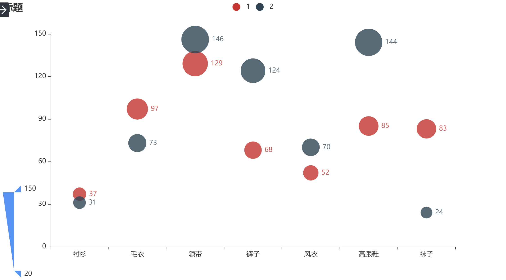
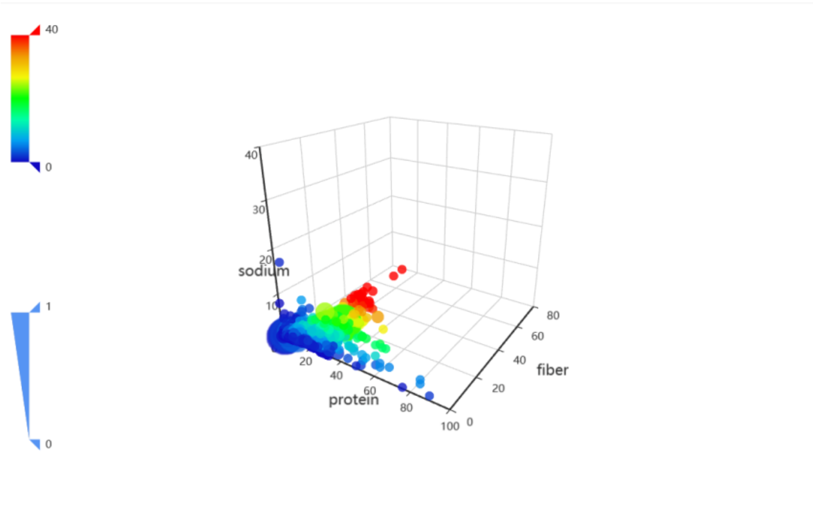
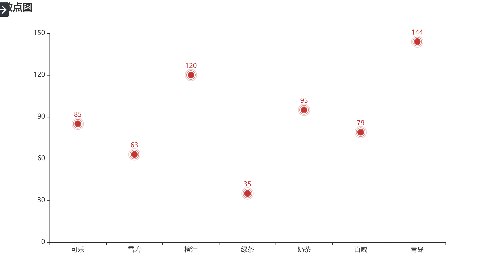
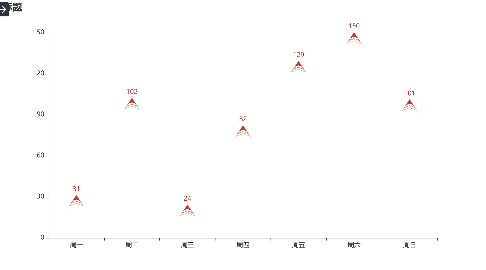

Python pyecharts
<a name="O2XGt"></a>
## 1、散点图概述
<a name="b3ILa"></a>
### 一、什么是散点图？
散点图是指在数理统计回归分析中，数据点在直角坐标系平面上的分布图，散点图表示因变量随自变量而变化的大致趋势，由此趋势可以选择合适的函数进行经验分布的拟合，进而找到变量之间的函数关系。
<a name="YfRux"></a>
### 二、散点图有什么用处？
1、数据用图表来展示，显然比较直观，在工作汇报等场合能起到事半功倍的效果，让听者更容易接受，理解所处理的数据。<br />2、散点图更偏向于研究型图表，能发现变量之间隐藏的关系为决策作出重要的引导作用。<br />3、散点图核心的价值在于发现变量之间的关系，千万不要简单地将这个关系理解为线性回归关系。变量间的关系有很多，如线性关系、指数关系、对数关系等等，当然，没有关系也是一种重要的关系。<br />4、散点图经过回归分析之后，可以对相关对象进行预测分析，进而做出科学的决策，而不是模棱两可。比如说：医学里的白细胞散点图可以在医学检测方面为健康提供精确的分析，为医生后续的判断做出重要的技术支持。
<a name="EWI29"></a>
### 三、散点图的基本构成要素
散点图主要的构成元素有：数据源，横纵坐标轴，变量名，研究的对象。而基本的要素就是点，也就是统计的数据，由这些点的分布才能观察出变量之间的关系。<br />而散点图一般研究的是两个变量之间的关系，往往满足不了日常的需求。因此，气泡图的诞生就是为散点图增加变量，提供更加丰富的信息，点的大小或者颜色可以定义为第三个变量，因为，做出来的散点图类似气泡，也由此得名为气泡图。
<a name="AgPJK"></a>
## 2、散点图绘制
<a name="sTJii"></a>
### 一、简单散点图
数据越多散点图呈现的效果就越明显。这也就是平时在进行建模的时候，采用回归拟合的原则，如果数据是遵循某种函数关系，可以通过机器进行训练，不断的迭代达到最优效果。
```python
import pyecharts.options as opts
from pyecharts.charts import Scatter

data = [
    [10.0, 8.04],
    [8.0, 6.95],
    [13.0, 7.58],
    [9.0, 8.81],
    [11.0, 8.33],
    [14.0, 9.96],
    [6.0, 7.24],
    [4.0, 4.26],
    [12.0, 10.84],
    [7.0, 4.82],
    [5.0, 5.68],
]
data.sort(key=lambda x: x[0])
x_data = [d[0] for d in data]
y_data = [d[1] for d in data]

(
    Scatter(init_opts=opts.InitOpts(width="1200px", height="600px"))
    .add_xaxis(xaxis_data=x_data)
    .add_yaxis(
        series_name="",
        y_axis=y_data,
        symbol_size=20,
        label_opts=opts.LabelOpts(is_show=False),
    )
    .set_series_opts()
    .set_global_opts(
        xaxis_opts=opts.AxisOpts(
            type_="value", splitline_opts=opts.SplitLineOpts(is_show=True)
        ),
        yaxis_opts=opts.AxisOpts(
            type_="value",
            axistick_opts=opts.AxisTickOpts(is_show=True),
            splitline_opts=opts.SplitLineOpts(is_show=True),
        ),
        tooltip_opts=opts.TooltipOpts(is_show=False),
    )
    .render("简单散点图.html")
)
```

<a name="QFJ86"></a>
### 二、多维数据散点图
平时的运用场景中，发现散点图太多呈现的效果图太密集了，只需要知道某一个区域它分布的数量，本来柱状图可以解决，但是这个散点图一个更好，可以反映区域的分布，主要可以看见它的数量趋势变化，根据自己的业务需求来使用吧。
```python
from pyecharts import options as opts
from pyecharts.charts import Scatter
from pyecharts.commons.utils import JsCode
from pyecharts.faker import Faker

c = (
    Scatter()
    .add_xaxis(Faker.choose())
    .add_yaxis(
        "类别1",
        [list(z) for z in zip(Faker.values(), Faker.choose())],
        label_opts=opts.LabelOpts(
            formatter=JsCode(
                "function(params){return params.value[1] +' : '+ params.value[2];}"
            )
        ),
    )
    .set_global_opts(
        title_opts=opts.TitleOpts(title="多维度数据"),
        tooltip_opts=opts.TooltipOpts(
            formatter=JsCode(
                "function (params) {return params.name + ' : ' + params.value[2];}"
            )
        ),
        visualmap_opts=opts.VisualMapOpts(
            type_="color", max_=150, min_=20, dimension=1
        ),
    )
    .render("多维数据散点图.html")
)
print([list(z) for z in zip(Faker.values(), Faker.choose())])
```

<a name="ej135"></a>
### 三、散点图显示分割线
显示分割线，其实和之前的没有异样。
```python
from pyecharts import options as opts
from pyecharts.charts import Scatter
from pyecharts.faker import Faker

c = (
    Scatter()
    .add_xaxis(Faker.choose())
    .add_yaxis("A", Faker.values())
    .set_global_opts(
        title_opts=opts.TitleOpts(title="标题"),
        xaxis_opts=opts.AxisOpts(splitline_opts=opts.SplitLineOpts(is_show=True)),
        yaxis_opts=opts.AxisOpts(splitline_opts=opts.SplitLineOpts(is_show=True)),
    )
    .render("分割线.html")
)
```

<a name="pOomn"></a>
### 四、散点图凸出大小（二维）
用二维的数据来展示每个类别的分布状况，图表可显示多个类别，这样极大的增强了解释的效果。
```python
from pyecharts import options as opts
from pyecharts.charts import Scatter
from pyecharts.faker import Faker

c = (
    Scatter()
    .add_xaxis(Faker.choose())
    .add_yaxis("1", Faker.values())
    .add_yaxis("2", Faker.values())
    .set_global_opts(
        title_opts=opts.TitleOpts(title="标题"),
        visualmap_opts=opts.VisualMapOpts(type_="size", max_=150, min_=20),
    )
    .render("凸出大小散点图.html")
)
```

<a name="r7gPi"></a>
### 五、3D散点图展示

<a name="qCSWN"></a>
### 六、动态涟漪散点图
之前的散点都是静态的，下面来看看动态的散点图。
```python
from pyecharts import options as opts
from pyecharts.charts import EffectScatter
from pyecharts.faker import Faker

c = (
    EffectScatter()
    .add_xaxis(Faker.choose())
    .add_yaxis("", Faker.values())
    .set_global_opts(title_opts=opts.TitleOpts(title="散点图"))
    .render("动态散点图.html")
)
```

<a name="x2H9u"></a>
### 七、箭头标志散点图
```python
from pyecharts import options as opts
from pyecharts.charts import EffectScatter
from pyecharts.faker import Faker
from pyecharts.globals import SymbolType

c = (
    EffectScatter()
    .add_xaxis(Faker.choose())
    .add_yaxis("", Faker.values(), symbol=SymbolType.ARROW)
    .set_global_opts(title_opts=opts.TitleOpts(title="标题"))
    .render("箭头动态散点图.html")
)
```

