Python 可视化 pygal<br />pygal绘制动态图表的模块，使用起来也是非常的便捷，而且绘制出来的图表也是十分的精湛好看，相比较seaborn等常用的模块相比，该模块的优点有：

- 高度可定制，而且用法简单
- 图表可交互性强
- 图像可导出SVG格式（矢量图形）
- 与Django、Flask等Web框架高度集成

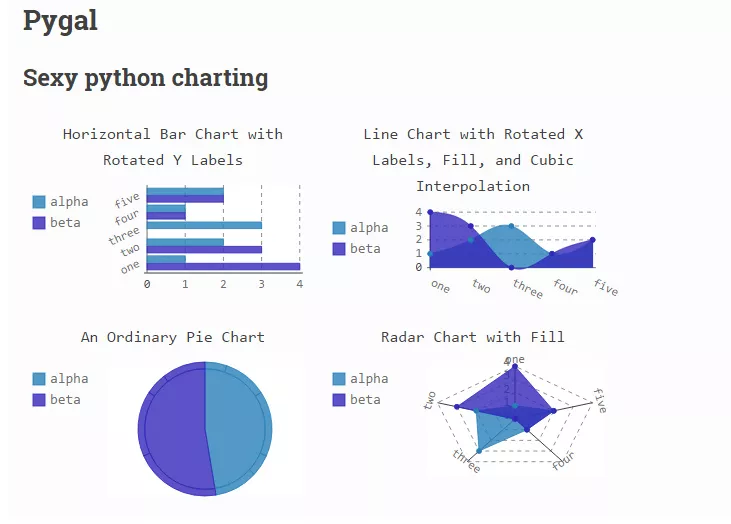<br />因此，pygal模块小编以为还是值得拿出来讲讲的，大致会说这些内容：

- pygal模块的安装
- 柱状图的绘制
- 折线图的绘制
- 饼图的绘制
- 雷达图的绘制
- 箱型图
- 仪表盘
- 树形图
- 地图
<a name="IJMcP"></a>
## 模块的安装
模块的安装十分的简单，通过`pip install`就能够实现，
```bash
pip install pygal
```
当然国内的小伙伴要是觉得下载的速度慢，也可以通过加入第三方的镜像来提速
```bash
pip install -i http://pypi.douban.com/simple/ pygal
```
<a name="Za956"></a>
## 柱状图
来看柱状图的绘制，先看单列柱状图的例子
```python
view = pygal.Bar()
#图表名
view.title = '柱状图'
#添加数据
view.add('数据', [1,3,5,7,9,11])
#在浏览器中查看
#view.render_in_browser()
view.render_to_file('bar.svg')
```
output<br /><br />既可以通过`render_to_file()`方法来导出成文件，也可以通过`render_in_browser()`方法在浏览器中查看<br />，再来看多列柱状图的绘制，代码如下
```python
view.add('奇数', [1,3,5,7,9,11])
view.add('偶数', [2,4,6,8,10,12])
```
output<br />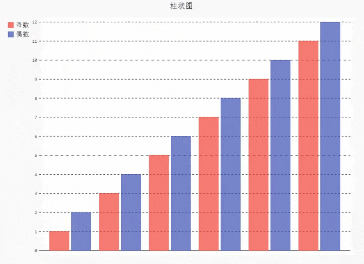<br />要是想将柱状图横过来看，将上述代码当中的一小部分替换成
```python
view = pygal.HorizontalBar()
```
output<br />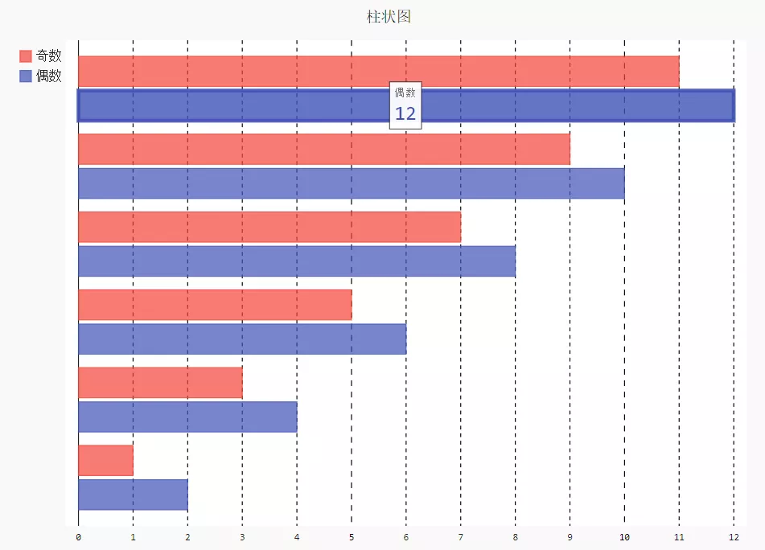<br />而要是想要堆叠形式的柱状图，则需要将上述代码当中的一小部分替换成
```python
view = pygal.HorizontalStackedBar()
```
output<br />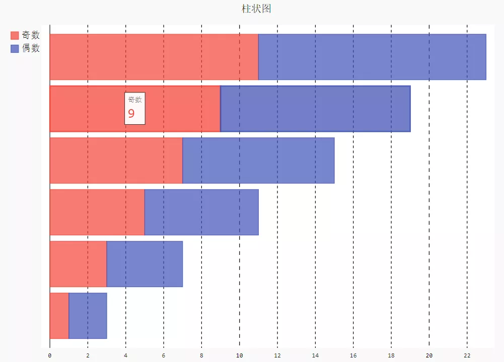
<a name="ALLXD"></a>
## 折线图
对于折线图的绘制，其实与上面柱状图的绘制基本一致，直接来看代码
```python
view = pygal.Line()
#图表名
view.title = '折线图'
#添加数据
view.add('奇数', [1,3,5,7,9,11])
view.add('偶数', [2,4,6,8,10,12])
#在浏览器中查看
view.render_in_browser()
```
output<br />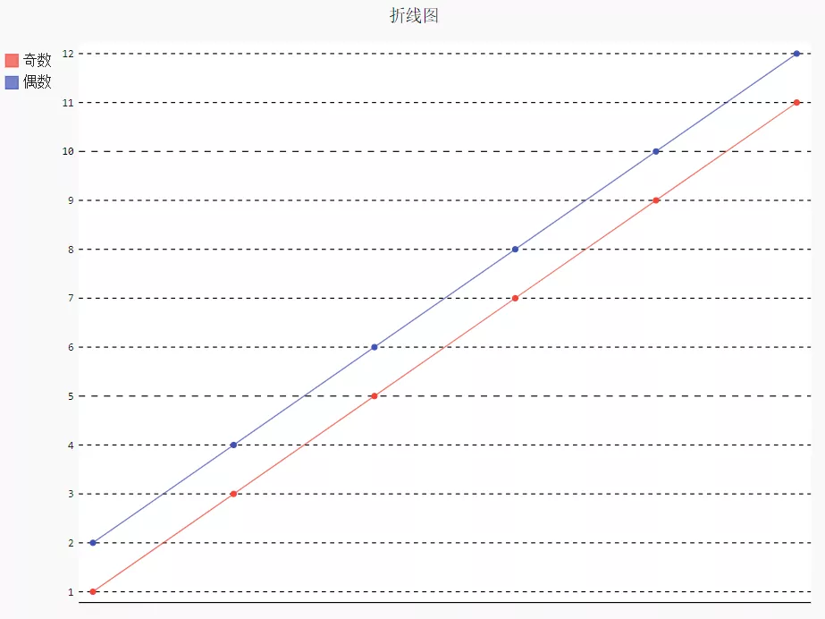<br />也和上面柱状图的代码逻辑保持一致，折线图中也有堆叠式的折线图，只需要将上面的代码当中的一部分替换成
```python
view = pygal.StackedLine(fill=True)
```
<a name="FmTcJ"></a>
## 饼图
同样，饼图的绘制也是相似的代码逻辑
```python
view = pygal.Pie()
#图表名
view.title = '饼状图'
#添加数据
view.add('A', 23)
view.add('B', 40)
view.add('C', 15)

view.render_to_file('pie.svg')
```
output<br />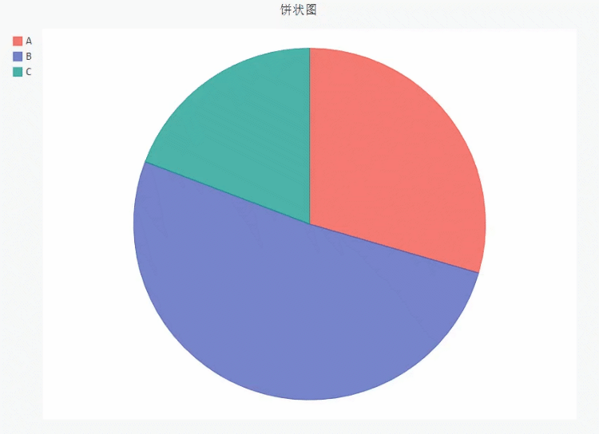<br />同时也可以绘制圆环图，在饼图的中心掏空出来一块，代码大致相同，只是需要将上面的一小部分替换成
```python
#设置空心圆半径
view = pygal.Pie(inner_radius=0.4)
```
output<br />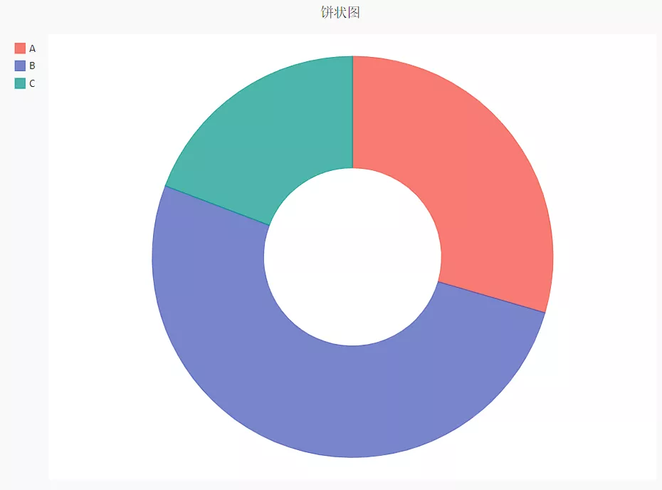<br />当每个类当中不止只有一个数字的时候，可以绘制多级饼图，代码如下
```python
view = pygal.Pie()
#图表名
view.title = '多级饼图'
#添加数据
view.add('A', [20, 25, 30, 45])
view.add('B', [15, 19, 25, 50])
view.add('C', [18, 22, 28, 35])

view.render_to_file('pie_multi.svg')
```
output<br />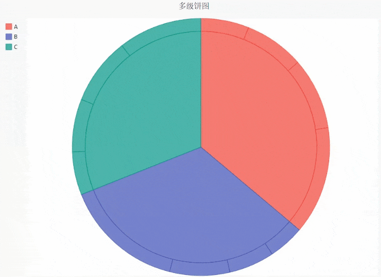
<a name="ztNOn"></a>
## 雷达图
雷达图可以从多个维度来分析数据，例如分析运动员的运动能力的时候，就会从多个维度来综合看待，这个时候雷达图就变得非常有用，代码如下
```python
radar_chart = pygal.Radar()
radar_chart.title = 'NBA 各球员能力比拼'
radar_chart.x_labels = ['得分', '防守', '助攻', '失误', '篮板']
radar_chart.add('库里', [70, 98, 96, 85, 97])
radar_chart.add('詹姆斯', [60, 95, 50, 75, 99])
radar_chart.add('杜兰特', [94, 45, 88, 91, 98])
radar_chart.render_to_file('radar_nba.svg')
```
output<br />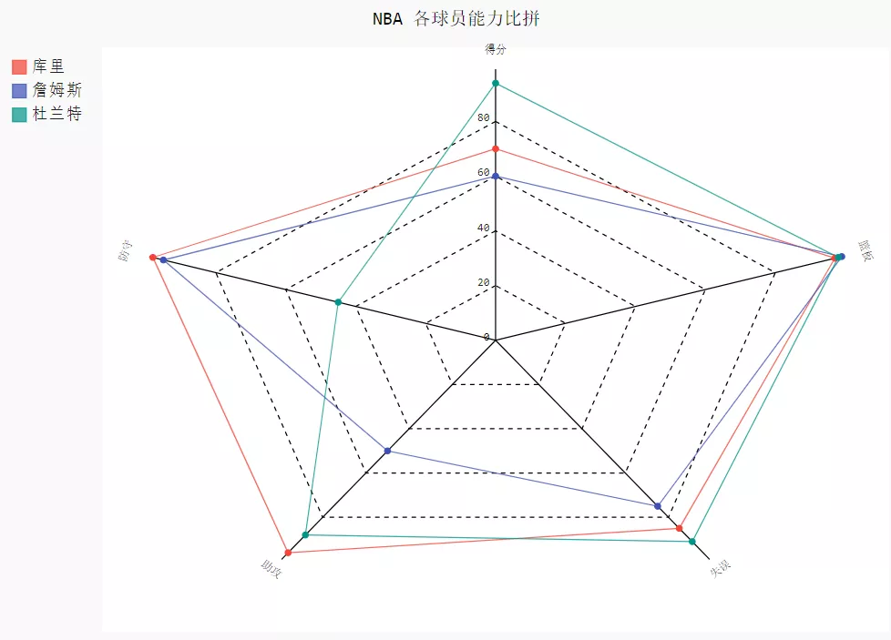<br />当然上面的数据都是瞎编的。
<a name="Wja5g"></a>
## 箱型图
可以从箱型图快速地了解数据的分布，查看是否存在极值。在pygal模块当中也提供了绘制箱型图的方法，代码如下
```python
box_plot = pygal.Box()
box_plot.title = '各浏览器的使用量'
box_plot.add('Chrome', [6395, 8212, 7520, 7218, 12464, 1660, 2123, 8607])
box_plot.add('Firefox', [7512, 8099, 11700, 2651, 6361, 1044, 8502, 9450])
box_plot.add('360安全卫士', [3472, 2933, 4203, 5510, 5810, 1828, 9013, 4669])
box_plot.add('Edge', [4310, 4109, 5935, 7902, 14404, 13608, 34004, 10210])
box_plot.render_to_file("box.svg")
```
output<br />
<a name="d9HNk"></a>
## 仪表盘
仪表盘可以量化指标的好坏，代码如下
```python
gauge_chart = pygal.Gauge(human_readable=True)
gauge_chart.title = '不同浏览器的性能差异'
gauge_chart.range = [0, 10000]
gauge_chart.add('Chrome', 8212)
gauge_chart.add('Firefox', 8099)
gauge_chart.add('360安全卫士', 2933)
gauge_chart.add('Edge', 2530)
gauge_chart.render_to_file('gauge_1.svg')
```
output<br />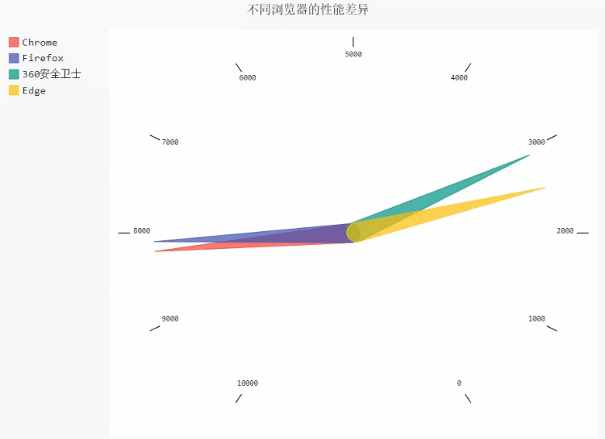
<a name="qxRf5"></a>
## 热力图
热力图可以更加直观的观测每个区域当中数据的分布，代码如下
```python
treemap = pygal.Treemap()
treemap.title = 'Binary TreeMap'
treemap.add('A', [12, 15, 12, 40, 2, 10, 10, 13, 12, 13, 40, None, 19])
treemap.add('B', [4, 2, 5, 10, 30, 4, 2, 7, 4, -10, None, 8, 30, 10])
treemap.add('C', [3, 8, 3, 3, 5, 15, 3, 5, 4, 12])
treemap.add('D', [23, 18])
treemap.add('E', [11, 2, 1, 12, 3, 13, 1, 2, 13,
      14, 3, 1, 2, 10, 1, 10, 12, 1])
treemap.add('F', [31])
treemap.add('G', [15, 9.3, 8.1, 12, 4, 34, 2])
treemap.add('H', [12, 13, 3])
treemap.render_in_browser()
```
output<br />
<a name="zsvpW"></a>
## 地图
首先来看世界地图的绘制，在这之前，还要下载绘制整个世界地图所需要的插件
```bash
pip install pygal_maps_world
```
代码如下
```python
worldmap_chart = pygal.maps.world.World()
worldmap_chart.title = 'Some countries'
worldmap_chart.add('A countries', ['国家名称的缩写'])
worldmap_chart.add('B countries', ['国家名称的缩写'])
worldmap_chart.add('C countries', ['国家名称的缩写'])
worldmap_chart.render_in_browser()
```
output<br />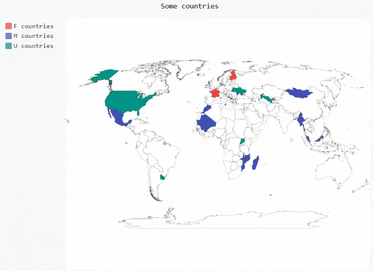<br />也可以针对不同国家的计数来进行地图的绘制，例如不同国家重大疾病的死亡人数，代码如下
```python
worldmap_chart = pygal.maps.world.World()
worldmap_chart.title = 'Minimum deaths by capital punishement (source: Amnesty International)'
worldmap_chart.add('In 2012', {
  '国家名称的缩写': 数量,
  '国家名称的缩写': 数量,
  .....
})
worldmap_chart.render_in_browser()
```
output<br />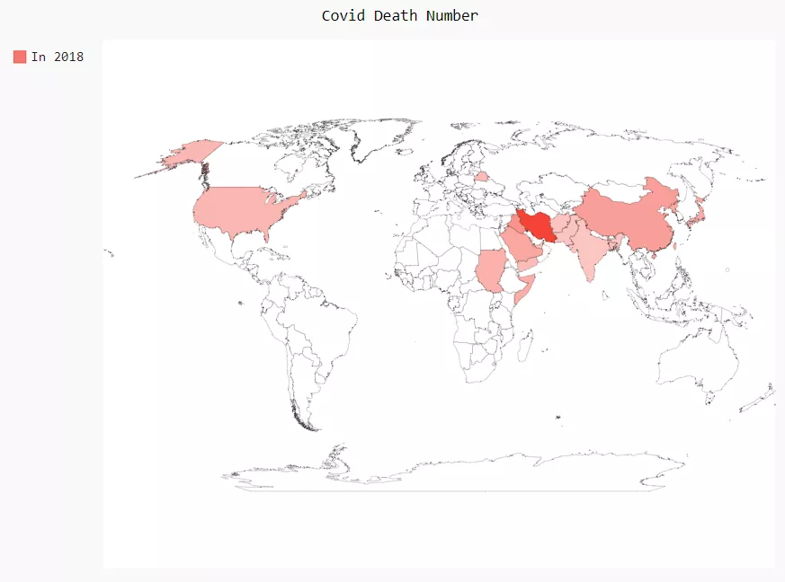<br />也可以绘制以五大洲为主的世界地图，代码如下
```python
worldmap_continent = pygal.maps.world.SupranationalWorld()
worldmap_continent.add('Asia', [('asia', 1)])
worldmap_continent.add('Europe', [('europe', 1)])
worldmap_continent.add('Africa', [('africa', 1)])
worldmap_continent.add('North america', [('north_america', 1)])
worldmap_continent.add('South america', [('south_america', 1)])
worldmap_continent.add('Oceania', [('oceania', 1)])
worldmap_continent.add('Antartica', [('antartica', 1)])
worldmap_continent.render_in_browser()
```
output<br />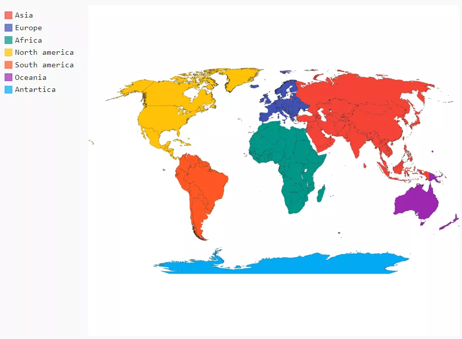<br />当然也可以将某个国家作为绘制，例如以法国为例，首先需要下载绘制单独某个国家的地图所依赖的插件
```bash
pip install pygal_maps_fr
```
代码如下
```python
fr_chart = pygal.maps.fr.Regions()
fr_chart.title = '法国区域图'
fr_chart.add('区域名称', ['数量'])
fr_chart.render_in_browser()
```
output<br />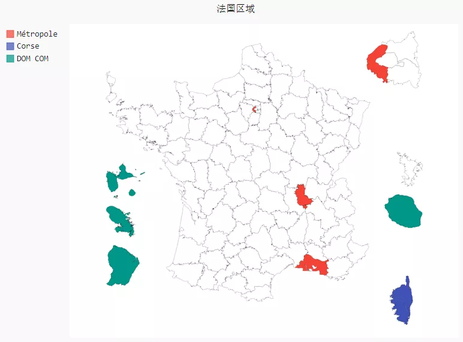<br />但是提及绘制某个国家的地图而言，目前支持的国家的数量并不多，在官网上面也只罗列法国和瑞士这两个国家，其他国家的插件下载了一下，都下载不了，后面就等官方的更新与优化吧。
