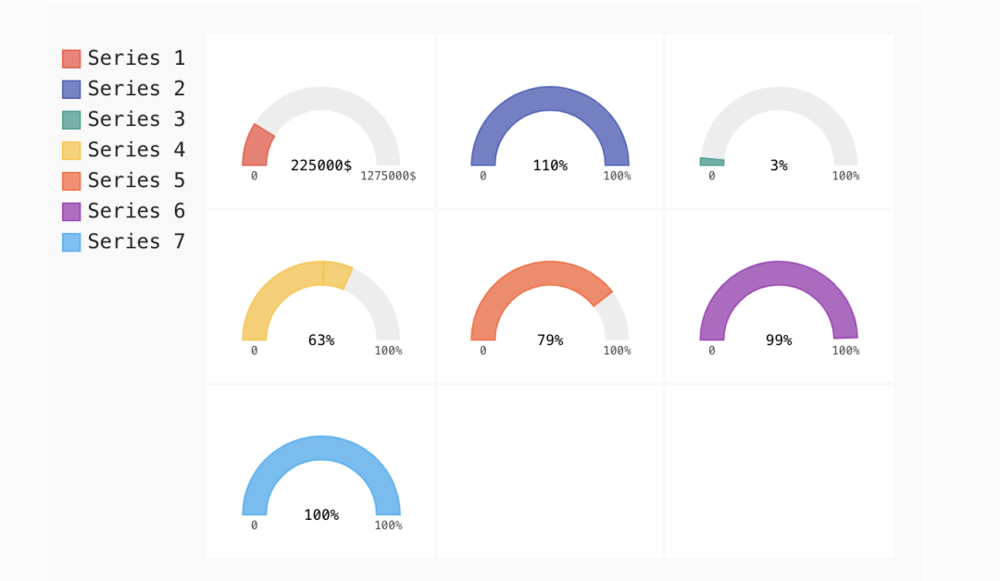

Python Pygal<br />当使用Python可视化数据时，大多数数据科学家会选择使用著名的Matplotlib、Seaborn或Bokeh。Matplotlib 以其强大的功能而闻名，Seaborn 以其易用性而闻名，Bokeh 以其交互性而闻名，Plotly 以其协作而闻名，其实Pygal也很惊艳，Pygal允许用户创建漂亮的交互式图，这些图可以以最佳的分辨率转换成svg，以便使用Flask或Django打印或显示在网页上。<br />Pygal是制作漂亮的即用图表的优选绘图库，它只需要编写很少的代码。每种表格都被打包成一个类函数（如：`pygal.Histogram()`制作柱状图， `pygal.Box()` 制作箱型图），并且它有各种色彩默认风格。如果想要更多掌控，可以配置各种图表元素——包括大小、标题、标签和渲染。<br />
<a name="hl0Tm"></a>
## Pygal优势

- 它有三个独立的地图包，这样可保持模块的小尺寸和易于用户使用。
- 它为大多数图形提供了交互性，这些图形提供数据探索、过滤某些特性、放大/缩小等功能。
- 它经过了优化，具有丰富的支持和活跃的社区，允许用户创建和使用SVG图像。
- 它提供三个主要概念——**数据、布局和图形对象**，使用这些概念，可以轻松地解决多个复杂的可视化问题。
<a name="jihgP"></a>
## 安装
一般会在jupyter notebook 使用该矢量库，实时查看绘图结果，也能实时交互。
```bash
!pip install pygal 
import pygal
```
接下来具体欣赏下这14种图表绘制案例！
<a name="EGaZe"></a>
## 1、折线图
使用 pygal 自带的不同折线图，绘制起来很简单。<br />导入 pygal 库，然后创建一个图表类型的对象。例如，在一个简单的折线图中，使用 `pygal.Line()` 或 pygal 作为水平线 `pygal.HorizontalLine()`。
<a name="OJGFx"></a>
### 普通折线图
```python
Line_Chart = pygal.Line() 
Line_Chart.title = ' Line Chart' 
Line_Chart.x_labels = map(str, range(2005, 2016)) 
Line_Chart.add('A', [None, None, 0, 16.1, 22, 30, 36.9, 45.1, 46.1, 42.33, 37.11]) 
Line_Chart.add('B', [None, None, None, None, None, None, 0, 3.5, 10.1, 23.1, 35.2]) 
Line_Chart.add('C', [85.1, 84.1, 84.1, 74.1, 64, 58.0, 54.1, 44.3, 36.9, 26.5, 20.4]) 
Line_Chart.add('D', [14.1, 15.8, 15.1, 8.8, 8, 10.1, 8.4, 5.1, 6.6, 6.1, 7.4]) 
Line_Chart.render_to_file('Line_Chart.svg')
```

<a name="Ki3P6"></a>
### 水平折线图
```python
Line_Chart = pygal.HorizontalLine() 
Line_Chart.title = 'Horizontal Line Bar' 
Line_Chart.x_labels = map(str, range(20005, 2016)) 
Line_Chart.add() 
Line_Chart.range = [0, 100] 
Line_Chart.render_to_file('Line_Chart_hori.svg')
```

<a name="mI3Qt"></a>
### 堆叠折线图
相同的图表，但具有堆叠值和填充渲染。
```python
Line_Chart = pygal.StackedLine(fill=True) 
Line_Chart.title = 'Stacked line Chart'
Line_Chart.x_labels = map(str, range(2005, 2016))
Line_Chart.add()
```

<a name="PSjxv"></a>
### 时间折线
对于与时间相关的图，只需格式化标签或使用xy 图表的一种变体。
```python
from datetime import datetime, timedelta
date_chart = pygal.Line(x_label_rotation=20)
date_chart.x_labels = map(lambda d: d.strftime('%Y-%m-%d'), [
 datetime(2013, 1, 2),
 datetime(2013, 1, 12),
 datetime(2013, 2, 2),
 datetime(2013, 2, 22)])
date_chart.add("Visits", [300, 412, 823, 672])
date_chart.render()
```

<a name="OdMx6"></a>
## 2、条形图
使用 pygal 自带的不同条形图，绘制它们简单易行。<br />导入 pygal 库后创建一个图表类型的对象。例如，在一个简单的条形图中，使用 `pygal.Bar()` 或 pygal 用于水平条 `pygal.HorizontalLine()`。
<a name="SZ7fB"></a>
### 普通条形图
```python
Bar_Chart = pygal.Bar() 
Bar_Chart.title = ' Bar Graph ' 
Bar_Chart.x_labels = map(str, range(2005, 2016)) 
Bar_Chart.add('A', [None, None, 0, 16.1, 22, 30, 36.9, 45.1, 46.1, 42.33, 37.11]) 
Bar_Chart.add('B', [None, None, None, None, None, None, 0, 3.5, 10.1, 23.1, 35.2]) 
Bar_Chart.add('C', [85.1, 84.1, 84.1, 74.1, 64, 58.0, 54.1, 44.3, 36.9, 26.5, 20.4]) 
Bar_Chart.add('D', [14.1, 15.8, 15.1, 8.8, 8, 10.1, 8.4, 5.1, 6.6, 6.1, 7.4]) 
Bar_Chart.render_to_file('Bar_Chart.svg')
```

<a name="aryNx"></a>
### 水平条形图
```python
Bar_Chart = pygal.HorizontalBar() 
Bar_Chart.title = 'Horizontal Bar Graph' 
Bar_Chart.x_labels = map(str, range(2005, 2016)) 
Bar_Chart.add()
```

<a name="HqzCv"></a>
### 堆叠条形图
```python
Bar_Chart = pygal.StackedBar() 
Bar_Chart.title = 'Stacked bar Graph' 
Bar_Chart.x_labels = map(str, range(2006, 2017)) 
Bar_Chart.add()
```

<a name="nLDmi"></a>
## 3、直方图
直方图是一种特殊的柱状图，每个柱状图有三个值：纵坐标高度、横坐标开始和横坐标结束。
```python
hist = pygal.Histogram()
hist.add('Wide bars', [(5, 0, 10), (4, 5, 13), (2, 0, 15)])
hist.add('Narrow bars',  [(10, 1, 2), (12, 4, 4.5), (8, 11, 13)])
hist.render()
```

<a name="Rpnqh"></a>
## 4、XY平面图
可以借助内置方法在 XY 平面上设计图表。在下面画出余弦。
```python
from math import cos   
XY_chart = pygal.XY()   
XY_chart.title = 'XY Chart'   
XY_chart.add('x = cos(y)', [(cos(x / 20.), x / 20.) for x in range(-40, 40, 4)])   
XY_chart.add('y = cos(x)', [(x / 20., cos(x / 20.)) for x in range(-40, 40, 4 )])   
XY_chart.add('x = 1', [(2, -4), (2, 4)])   
XY_chart.add('x = -1', [(-1, -4), (- 1, 4)])   
XY_chart.add('y = 1', [(-4, 1), (4, 1)])   
XY_chart.add('y = -1', [(-4, -1) , (4, -1)])
```
<br />对于散点图，禁用 XY 对象中的stroke。
```python
XY_chart = pygal.XY(stroke=False)   
XY_chart.title = 'XY Scatter Plot' 
XY_chart.add()
```

<a name="ILwly"></a>
## 5、饼图
pygal 中不同类型的饼图有半饼图、甜甜圈或多系列饼图。
<a name="zJPtW"></a>
### 普通饼图
```python
Pie_Chart = pygal.Pie() 
Pie_Chart.title = 'PIE Chart' 
Pie_Chart.add('C', 19.1) 
Pie_Chart.add('A', 36.1) 
Pie_Chart.add('B', 36.2) 
Pie_Chart.add('D', 4.4) 
Pie_Chart.add('E', 2.5) 
Pie_Chart.render_to_file('PC.svg')
```

<a name="iphzD"></a>
### 甜甜圈图
可以指定内半径来获得甜甜圈。
```python
Pie_Chart = pygal.Pie(inner_radius=.4) 
Pie_Chart.title = 'PIE Chart :Donut'
```

<a name="P2laV"></a>
### 半饼图
```python
Pie_Chart = pygal.Pie(half_pie=True) 
Pie_Chart.title = 'PIE Chart: Half Donut'
```

<a name="FcLd5"></a>
### 多系列饼图
```python
pie_chart = pygal.Pie()
pie_chart.title = 'Browser usage by version in February 2012 (in %)'
pie_chart.add('IE', [5.7, 10.2, 2.6, 1])
pie_chart.add('Firefox', [.6, 16.8, 7.4, 2.2, 1.2, 1, 1, 1.1, 4.3, 1])
pie_chart.add('Chrome', [.3, .9, 17.1, 15.3, .6, .5, 1.6])
pie_chart.add('Safari', [4.4, .1])
pie_chart.add('Opera', [.1, 1.6, .1, .5])
pie_chart.render()
```

<a name="p20Mp"></a>
## 6、雷达图
雷达图非常适合比较两组或更多组的多个特征或特性，Pygal 可以非常轻松地绘制 Kiviat 图。
```python
Radar_Chart = pygal.Radar() 
Radar_Chart.title = 'Radar' 
Radar_Chart.x_labels = ['R', 'D', 'C', 'X', 'E', 'H', 'S', 'N' ] 
Radar_Chart.add('B', [6392, 8211, 7521, 7228, 12434, 1640, 2143, 8637]) 
Radar_Chart.add('A', [7474, 8089, 11701, 2631, 6351, 1042, 3697, 9410]) 
Radar_Chart.add('D', [3471, 2932, 4103, 5219, 5811, 1818, 9011, 4668]) 
Radar_Chart.add('C', [41, 42, 58, 78, 143, 126, 31, 132]) 
Radar_Chart.render_to_file('Radar.svg')
```

<a name="r1poc"></a>
## 7、箱线图
箱线图基于五个因素提供有关数据分布的高级概念：最小值、最大值、中值、第一四分位数 (Q1) 和第三四分位数 (Q3)。pygal 中默认情况，可以绘制一个以胡须为数据集极值的箱形图，该箱形图从 Q1 到 Q3，中间的线表示给定特征的中值。
<a name="WPYxj"></a>
### 基本箱线图
```python
box_plot = pygal.Box()
box_plot.title = 'V8 benchmark results'
box_plot.add('Chrome', [6395, 8212, 7520, 7218, 12464, 1660, 2123, 8607])
box_plot.add('Firefox', [7473, 8099, 11700, 2651, 6361, 1044, 3797, 9450])
box_plot.add('Opera', [3472, 2933, 4203, 5229, 5810, 1828, 9013, 4669])
box_plot.add('IE', [43, 41, 59, 79, 144, 136, 34, 102])
box_plot.render()
```

<a name="TCF1O"></a>
### 1.5 四分位距
与上述相同，除了胡须是第一个四分位数减去四分位数范围的 1.5 倍和第三个四分位数加上四分位数范围的 1.5 倍。
```python
box_plot = pygal.Box(box_mode="1.5IQR")
```

<a name="sSOzI"></a>
### 图基
胡须是下四分位数的 1.5 IQR 范围内的最低基准，而仍在上四分位数 1.5 IQR 范围内的最高基准。异常值也显示出来。
```python
box_plot = pygal.Box(box_mode="tukey")
```

<a name="G9kkw"></a>
### 标准差
晶须在这里由数据的标准偏差定义。
```python
box_plot = pygal.Box(box_mode="stdev")
```

<a name="Hf6Qg"></a>
### 总体标准差
晶须在这里由数据的总体标准偏差定义。
```python
box_plot = pygal.Box(box_mode="pstdev")
```

<a name="lLoqQ"></a>
## 8、点图
一个简单的点图或条形图由在图表上绘制为点的数据点组成。检查特定的数据趋势或聚类模式很有帮助。Pygal 提供了在正数据点和负数据点上绘制类似打孔卡的图表的选项。
```python
Dot_Chart = pygal.Dot(x_label_rotation=35) 
Dot_Chart.title = 'Dot Chart' 
Dot_Chart.x_labels = ['Ri', 'De', 'Cr', 'Ra', 'Ea', 'Re', 'Sp' , 'Na'] 
Dot_Chart.add('B', [6396, 8222, 7530, 7217, 12364, 1661, 2223, 8617]) 
Dot_Chart.add('A', [7471, 8091, 11701, 2631, 6362, 1043, 3787, 9440]) 
Dot_Chart.add('D', [3471, 2931, 4201, 5221, 5811, 1821, 9011, 4662]) 
Dot_Chart.add('C', [45, 42, 56, 73, 142, 131, 31, 101]) 
Dot_Chart.render_to_file('Dot.svg')
```
<br />还支持负值，将点绘制为空。
```python
dot_chart = pygal.Dot(x_label_rotation=30)
dot_chart.add('Normal', [10, 50, 76, 80, 25])
dot_chart.add('With negatives', [0, -34, -29, 39, -75])
dot_chart.render()
```

<a name="Hq4kI"></a>
## 9、漏斗
漏斗图是代表任何会议或流程阶段的好方法。
```python
Funnel_Chart = pygal.Funnel() 
Funnel_Chart.title = 'Funnel Chart' 
Funnel_Chart.x_labels = ['Ri', 'De', 'Cr', 'Ra', 'Ea', 'Re', 'Sp', 'Na '] 
Funnel_Chart.add('Opera', [3478, 2833, 4233, 5329, 5910, 1838, 9023, 4679]) 
Funnel_Chart.add('A', [7471, 8091, 11701, 2641, 6362, 1042, 3787 , 9440]) 
Funnel_Chart.add('B', [6391, 8211, 7521, 7211, 12463, 1661, 2124, 8609]) 
Funnel_Chart.render_to_file('Funnel.svg')
```

<a name="VM3au"></a>
## 10、实心仪表图
实心仪表图表是用于现实世界仪表或仪表板的最流行的角度仪表图表，因为它们可以一目了然地可视化范围内的数字。
```python
gauge = pygal.SolidGauge(inner_radius=0.70)
percent_formatter = lambda x: '{:.10g}%'.format(x)
dollar_formatter = lambda x: '{:.10g}$'.format(x)
gauge.value_formatter = percent_formatter

gauge.add('Series 1', [{'value': 225000, 'max_value': 1275000}],
          formatter=dollar_formatter)
gauge.add('Series 2', [{'value': 110, 'max_value': 100}])
gauge.add('Series 3', [{'value': 3}])
gauge.add(
    'Series 4', [
        {'value': 51, 'max_value': 100},
        {'value': 12, 'max_value': 100}])
gauge.add('Series 5', [{'value': 79, 'max_value': 100}])
gauge.add('Series 6', 99)
gauge.add('Series 7', [{'value': 100, 'max_value': 100}])
gauge.render()
```

```python
gauge = pygal.SolidGauge(
    half_pie=True, inner_radius=0.70,
    style=pygal.style.styles['default'](value_font_size=10 "'default'"))
```

<a name="KYE6U"></a>
## 11、仪表图
仪表图是一种最常用于具有定量上下文的单个数据值的图，它跟踪 KPI 的进度。
```python
Gauge_chart = pygal.Gauge(human_readable=True) 
Gauge_chart.title = 'Gauge Plot' 
Gauge_chart.range = [0, 15000] 
Gauge_chart.add('X', 8219) 
Gauge_chart.add('Y', 8091) 
Gauge_chart.add ('Z', 2953) 
Gauge_chart.add('V', 42) 
Gauge_chart.render_to_file('Gauge.svg')
```

<a name="Da6Zl"></a>
## 12、金字塔
人口金字塔。
```python
ages = [(364381, ...), (346205,  ...),
      (0, ...), (0, ...),
      (0, ...), (0, ...),
      (0, ...), (0, ...)]

types = ['Males single', 'Females single',
         'Males married', 'Females married',
         'Males widowed', 'Females widowed',
         'Males divorced', 'Females divorced']

pyramid_chart = pygal.Pyramid(human_readable=True, legend_at_bottom=True)
pyramid_chart.title = 'England population by age in 2010 (source: ons.gov.uk)'
pyramid_chart.x_labels = map(lambda x: str(x) if not x % 5 else '', range(90))
for type, age in zip(types, ages):
    pyramid_chart.add(type, age)
pyramid_chart.render()
```

<a name="H6eQv"></a>
## 13、树状图
树形图是一种基本图表，它提供数据的分层视图并经常显示销售数据。
```python
treemap = pygal.Treemap()
treemap.title = 'Binary TreeMap'
treemap.add('A', [2, 1, 12, 4, 2, 1, 1, 3, 12, 3, 4, None, 9])
treemap.add('B', [4, 2, 5, 10, 3, 4, 2, 7, 4, -10, None, 8, 3, 1])
treemap.add('C', [3, 8, 3, 3, 5, 3, 3, 5, 4, 12])
treemap.add('D', [23, 18])
treemap.add('E', [1, 2, 1, 2, 3, 3, 1, 2, 3,
      4, 3, 1, 2, 1, 1, 1, 1, 1])
treemap.add('F', [31])
treemap.add('G', [5, 9.3, 8.1, 12, 4, 3, 2])
treemap.add('H', [12, 3, 3])
treemap.render()
```

<a name="fvsCx"></a>
## 14、地图
地图显示不同地区或国家之间的符号表示和关系。Pygal 提供了绘制世界地图、法国地图和瑞士地图的选项。地图现在单独打包以保持 pygal 包的体积小，下面是根项目安装和配置它们的链接。[https://www.pygal.org/en/stable/documentation/types/maps/index.html](https://www.pygal.org/en/stable/documentation/types/maps/index.html)<br />如世界地图插件可以通过以下方式安装。
```bash
pip install pygal_maps_world
```
绘制各大洲地图。
```python
supra = pygal.maps.world.SupranationalWorld()
supra.add('Asia', [('asia', 1)])
supra.add('Europe', [('europe', 1)])
supra.add('Africa', [('africa', 1)])
supra.add('North america', [('north_america', 1)])
supra.add('South america', [('south_america', 1)])
supra.add('Oceania', [('oceania', 1)])
supra.add('Antartica', [('antartica', 1)])
supra.render()
```

<a name="s2tYQ"></a>
## 一些附加功能
除了不同风格的图表外，它还提供了一些在下面讨论的额外功能。
<a name="SUavV"></a>
### 样式
Pygal 为用户提供了不同的选项来设置图形和图表的样式。有内置样式可以更改图表的颜色模式，例如霓虹灯、红色、蓝色、绿松石色、深绿色、Light Solarized 等。您还可以导入自定义 CSS 样式以在图表中使用。
<a name="MZpts"></a>
### 图表配置
它提供更改图表配置的选项，例如更改标题、x 标签、y 标签、大小调整、图例、轴、数据等等。
<a name="L1RjO"></a>
### 嵌入网页
它提供了为保存的 SVG 图表设置 URL 条目的选项，以便在 HTML 代码中放置标签。
<a name="wwgqI"></a>
### 参考资料
样式: [https://www.pygal.org/en/stable/documentation/styles.html](https://www.pygal.org/en/stable/documentation/styles.html)<br />图表配置: [https://www.pygal.org/en/stable/documentation/configuration/chart.html](https://www.pygal.org/en/stable/documentation/configuration/chart.html)<br />嵌入网页: [https://www.pygal.org/en/stable/documentation/web.html](https://www.pygal.org/en/stable/documentation/web.html)<br />参考: [https://www.pygal.org/en/stable/documentation/index.html](https://www.pygal.org/en/stable/documentation/index.html)
