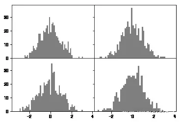
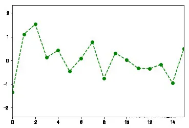
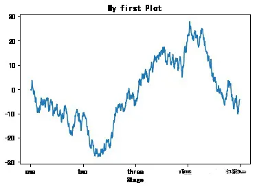
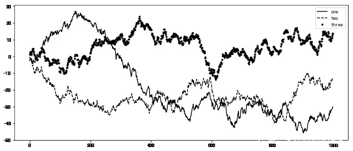
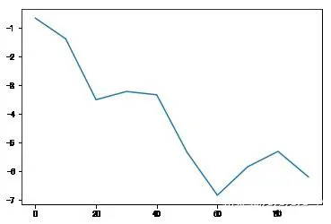

Python 可视化
<a name="9u6cI"></a>
## Python实现可视化的三个步骤

- 确定问题，选择图形
- 转换数据，应用函数
- 参数设置，一目了然
<a name="tTQVy"></a>
## Python中的画图的库
<a name="uhETg"></a>
### matplotlib
python中最基本的作图库就是matplotlib，是一个最基础的Python可视化库，一般都是从matplotlib上手Python数据可视化，然后开始做纵向与横向拓展。
<a name="Pp86P"></a>
### Seaborn
是一个基于matplotlib的高级可视化效果库，针对的点主要是数据挖掘和机器学习中的变量特征选取，seaborn可以用短小的代码去绘制描述更多维度数据的可视化效果图
<a name="43e1775e"></a>
### 其他库
Bokeh（是一个用于做浏览器端交互可视化的库，实现分析师与数据的交互）；Mapbox（处理地理数据引擎更强的可视化工具库）等等
<a name="ATGpr"></a>
## 第一步：确定问题，选择图形
业务可能很复杂，但是经过拆分，找到想通过图形表达什么具体问题。<br />在python中，可以总结为以下四种基本视觉元素来展现图形：

- 点：scatter plot 二维数据，适用于简单二维关系；
- 线：line plot 二维数据，适用于时间序列；
- 柱状：bar plot 二维数据，适用于类别统计；
- 颜色：heatmap 适用于展示第三维度；

数据间存在分布，构成，比较，联系以及变化趋势等关系。对应不一样的关系，选择相应的图形进行展示。
<a name="HwyBO"></a>
## 第二步：转换数据，应用函数
数据分析和建模方面的大量编程工作都是用在数据准备的基础上的：加载、清理、转换以及重塑。可视化步骤也需要对数据进行整理，转换成需要的格式再套用可视化方法完成作图。<br />下面是一些常用的数据转换方法：

- 合并：merge，concat，combine_frist(类似于数据库中的全外连接)
- 重塑：reshape；轴向旋转：pivot（类似excel数据透视表）
- 去重：drop_duplicates
- 映射：map
- 填充替换：fillna,replace
- 重命名轴索引：rename

将分类变量转换‘哑变量矩阵’的get_dummies函数以及在df中对某列数据取限定值等等。<br />函数则根据第一步中选择好的图形，去找python中对应的函数。
<a name="G3uPz"></a>
## 第三步：参数设置，一目了然
原始图形画完后，可以根据需求修改颜色（color），线型（linestyle），标记（maker）或者其他图表装饰项标题（Title），轴标签（xlabel，ylabel），轴刻度（set_xticks），还有图例（legend）等，让图形更加直观。<br />第三步是在第二步的基础上,为了使图形更加清晰明了，做的修饰工作。具体参数都可以在制图函数中找到。
<a name="W7Qt1"></a>
## 可视化作图基础
<a name="FEwVS"></a>
### Matplotlib作图基础
```python
#导入包
import numpy as np
import pandas as pd
import matplotlib.pyplot as plt
```
<a name="odaw1"></a>
### Figure和Subplot
matplotlib的图形都位于Figure（画布）中，Subplot创建图像空间。不能通过figure绘图，必须用add_subplot创建一个或多个subplot。
<a name="IbqQe"></a>
#### figsize可以指定图像尺寸
```python
#创建画布
fig = plt.figure()
<Figure size 432x288 with 0 Axes>
#创建subplot，221表示这是2行2列表格中的第1个图像。
ax1 = fig.add_subplot(221)
#但现在更习惯使用以下方法创建画布和图像，2,2表示这是一个2*2的画布，可以放置4个图像
fig , axes = plt.subplots(2,2,sharex=True,sharey=True)
#plt.subplot的sharex和sharey参数可以指定所有的subplot使用相同的x，y轴刻度。
```

<a name="Ctg89"></a>
#### 利用Figure的subplots_adjust方法可以调整间距
```python
subplots_adjust(left=None,bottom=None,right=None,top=None,wspace=None,hspace=None)
```
<br />颜色color，标记marker，和线型linestyle<br />matplotlib的plot函数接受一组X和Y坐标，还可以接受一个表示颜色和线型的字符串缩写：'g--'，表示颜色是绿色green，线型是'--'虚线。也可以使用参数明确的指定。<br />线型图还可以加上一些标记（marker），来突出显示数据点的位置。标记也可以放在格式字符串中，但标记类型和线型必须放在颜色后面。
```
plt.plot(np.random.randn(30),color='g',linestyle='--',marker='o')
[<matplotlib.lines.Line2D at 0x8c919b0>]
```


<a name="4Z1UQ"></a>
### 刻度，标签和图例
plt的xlim、xticks和xtickslabels方法分别控制图表的范围和刻度位置和刻度标签。<br />调用方法时不带参数，则返回当前的参数值；调用时带参数，则设置参数值。
```python
plt.plot(np.random.randn(30),color='g',linestyle='--',marker='o')
plt.xlim() #不带参数调用，显示当前参数；
#可将xlim替换为另外两个方法试试
(-1.4500000000000002, 30.45)
```

```python
plt.plot(np.random.randn(30),color='g',linestyle='--',marker='o')
plt.xlim([0,15]) #横轴刻度变成0-15
(0, 15)
```
<br />设置标题，轴标签，刻度以及刻度标签
```python
fig = plt.figure();ax = fig.add_subplot(1,1,1)
ax.plot(np.random.randn(1000).cumsum())
ticks = ax.set_xticks([0,250,500,750,1000]) #设置刻度值
labels = ax.set_xticklabels(['one','two','three','four','five']) #设置刻度标签
ax.set_title('My first Plot') #设置标题
ax.set_xlabel('Stage') #设置轴标签
Text(0.5,0,'Stage')
```

<a name="jGugu"></a>
### 添加图例
图例legend是另一种用于标识图标元素的重要工具。可以在添加subplot的时候传入label参数。
```python
fig = plt.figure(figsize=(12,5));ax = fig.add_subplot(111)
ax.plot(np.random.randn(1000).cumsum(),'k',label='one') #传入label参数，定义label名称
ax.plot(np.random.randn(1000).cumsum(),'k--',label='two')
ax.plot(np.random.randn(1000).cumsum(),'k.',label='three')
#图形创建完后，只需要调用legend参数将label调出来即可。
ax.legend(loc='best') #要求不是很严格的话，建议使用loc=‘best’参数来让它自己选择最佳位置
<matplotlib.legend.Legend at 0xa8f5a20>
```

<a name="mpQI4"></a>
### 注解
除标准的图表对象之外，还可以自定义添加一些文字注解或者箭头。<br />注解可以通过text，arrow和annotate等函数进行添加。text函数可以将文本绘制在指定的x，y坐标位置，还可以进行自定义格式
```
plt.plot(np.random.randn(1000).cumsum())
plt.text(600,10,'test ',family='monospace',fontsize=10)
#中文注释在默认环境下并不能正常显示，需要修改配置文件，使其支持中文字体。具体步骤请自行搜索。
```
<a name="LNaEz"></a>
### 保存图表到文件
利用plt.savefig可以将当前图表保存到文件。例如，要将图表保存为png文件，可以执行<br />文件类型是根据拓展名而定的。其他参数还有：

- fname：含有文件路径的字符串，拓展名指定文件类型
- dpi：分辨率，默认100 facecolor,edgcolor 图像的背景色，默认‘w’白色
- format：显示设置文件格式（'png','pdf','svg','ps','jpg'等）
- bbox_inches：图表需要保留的部分。如果设置为“tight”，则将尝试剪除图像周围的空白部分
```python
plt.savefig('./plot.jpg') #保存图像为plot名称的jpg格式图像
<Figure size 432x288 with 0 Axes>
```
<a name="x2ygI"></a>
## Pandas中的绘图函数
<a name="1cae8c09"></a>
### Matplotlib作图
matplotlib是最基础的绘图函数，也是相对较低级的工具。组装一张图表需要单独调用各个基础组件才行。Pandas中有许多基于matplotlib的高级绘图方法，原本需要多行代码才能搞定的图表，使用pandas只需要短短几行。<br />使用的就调用了pandas中的绘图包。
```python
import matplotlib.pyplot as plt
```
<a name="xwHID"></a>
### 线型图
Series和DataFrame都有一个用于生成各类图表的plot方法。默认情况下，他们生成的是线型图。
```python
s = pd.Series(np.random.randn(10).cumsum(),index=np.arange(0,100,10))
s.plot() #Series对象的索引index会传给matplotlib用作绘制x轴。
<matplotlib.axes._subplots.AxesSubplot at 0xf553128>
```

```python
df = pd.DataFrame(np.random.randn(10,4).cumsum(0),columns=['A','B','C','D'])
df.plot() #plot会自动为不同变量改变颜色，并添加图例
<matplotlib.axes._subplots.AxesSubplot at 0xf4f9eb8>
```
<br />`Series.plot`方法的参数

- label：用于图表的标签
- style：风格字符串，'g--'
- alpha：图像的填充不透明度（0-1）
- kind：图表类型（bar，line，hist，kde等）
- xticks：设定x轴刻度值
- yticks：设定y轴刻度值
- xlim，ylim：设定轴界限，[0,10]
- grid：显示轴网格线，默认关闭
- rot：旋转刻度标签
- use_index：将对象的索引用作刻度标签
- logy：在Y轴上使用对数标尺

DataFrame.plot方法的参数<br />DataFrame除了Series中的参数外，还有一些独有的选项。

- subplots：将各个DataFrame列绘制到单独的subplot中
- sharex，sharey：共享x，y轴
- figsize：控制图像大小
- title：图像标题
- legend：添加图例，默认显示
- sort_columns：以字母顺序绘制各列，默认使用当前顺序
<a name="BNtzw"></a>
### 柱状图
在生成线型图的代码中加上`kind='bar'`或者`kind='barh'`，可以生成柱状图或水平柱状图。
```python
fig,axes = plt.subplots(2,1)
data = pd.Series(np.random.rand(10),index=list('abcdefghij'))
data.plot(kind='bar',ax=axes[0],rot=0,alpha=0.3)
data.plot(kind='barh',ax=axes[1],grid=True)
<matplotlib.axes._subplots.AxesSubplot at 0xfe39898>
```
<br />柱状图有一个非常实用的方法：<br />利用`value_counts`图形化显示Series或者DF中各值的出现频率。<br />比如`df.value_counts().plot(kind='bar')`<br />其他图形的绘制方法大同小异。

