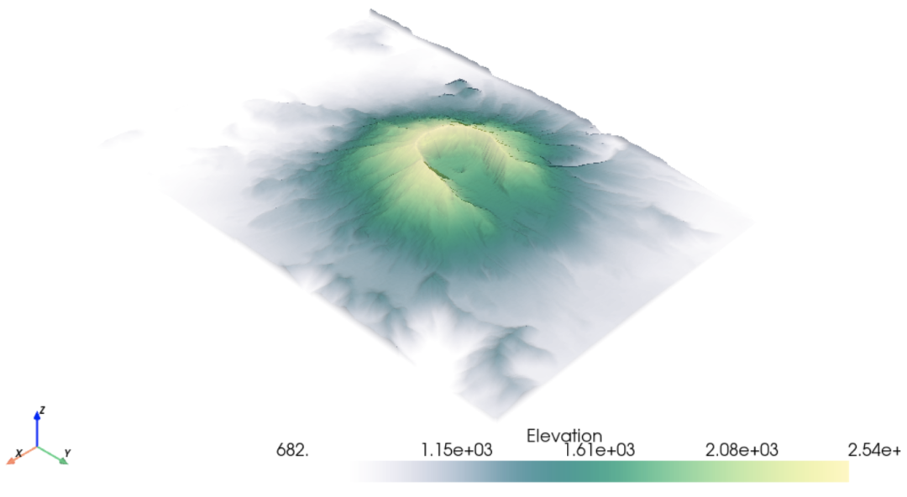
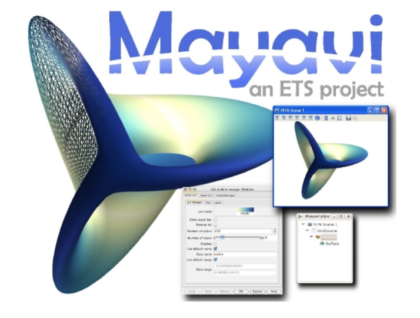

Python

- Python拥有很多优秀的三维图像可视化工具，主要基于图形处理库WebGL、OpenGL或者VTK。
- 这些工具主要用于大规模空间标量数据、向量场数据、张量场数据等等的可视化，实际运用场景主要在海洋大气建模、飞机模型设计、桥梁设计、电磁场分析等等。
- 工具背后的算法逻辑非常复杂，由于小编是非专业的，不敢造次 。
- 这里简单介绍几个Python三维图像可视化工具，工具都有大量demo、完善的使用文档、功能非常强大，系统学习请戳文中链接。

## pyvista
专注于3D可视化和mesh分析，底层是VTK         

- 进一步学习：[https://github.com/pyvista/pyvista](https://github.com/pyvista/pyvista)

---

## Glumpy
作者为Nicolas P. Rougier，Glumpy是Python、Numpy和OpenGL的完美结合，支持GPU加速，让可视化变得快速、美观、动态、可交互等。   

- 进一步学习：[https://github.com/glumpy/glumpy](https://github.com/glumpy/glumpy)

---

## itkwidgets
itkwidgets是Jupyter的一个交互式小部件，主要运用于可视化图像、点集和mesh。 

- 进一步学习：[https://github.com/InsightSoftwareConsortium/itkwidgets](https://github.com/InsightSoftwareConsortium/itkwidgets)

---

## vedo
几行代码实现3D point clouds, meshes and volumes  

- 进一步学习：[https://github.com/marcomusy/vedo](https://github.com/marcomusy/vedo)

---

## ipyvolume
可在Jupyter Notebook中渲染3D图，基于WebGL，功能较少。  进一步学习：[https://github.com/widgetti/ipyvolume](https://github.com/widgetti/ipyvolume)

---

## mayavi
mayavi主要有两大部分功能：

- `mayavi.mlab`用于处理图形可视化和图形操作，类似于matlab和matplotlib；
- `mayavi.tools.pipeline`用于操作管线对象窗口对象。

  

- 进一步学习：[http://docs.enthought.com/mayavi/mayavi/index.html](http://docs.enthought.com/mayavi/mayavi/index.html)
