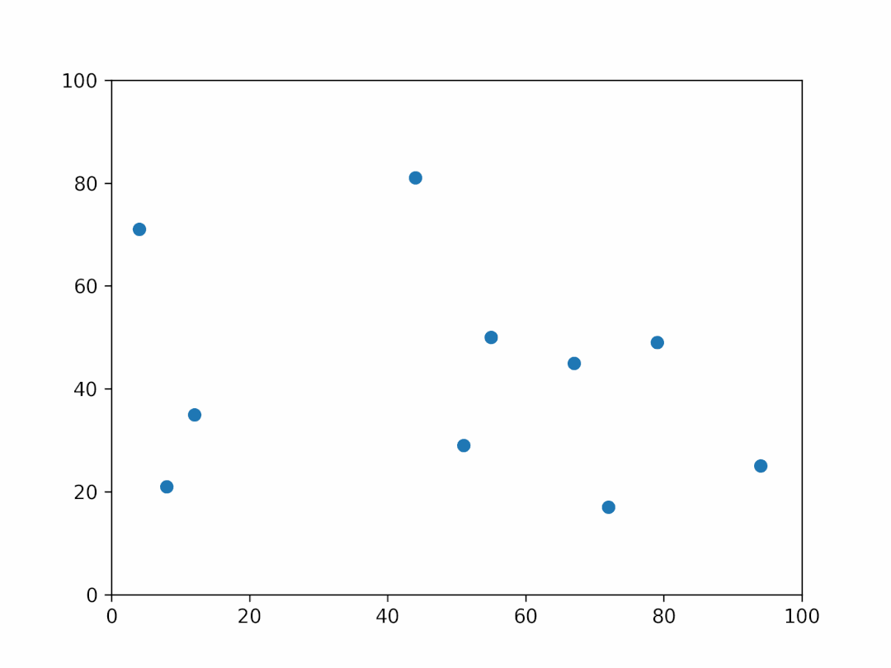
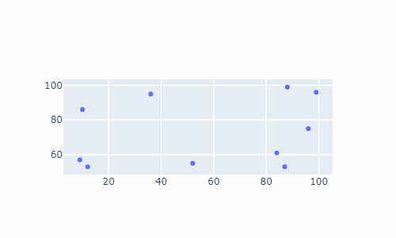
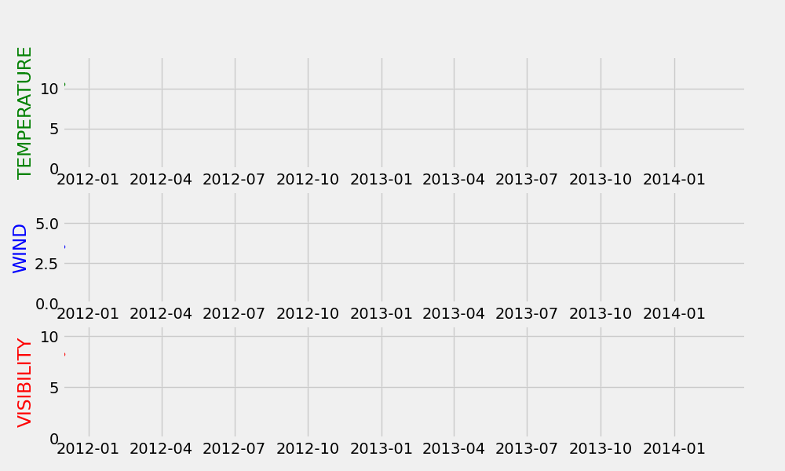
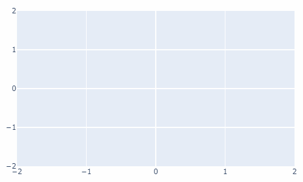

Python 可视化
<a name="BqwXg"></a>
### 安装相关的模块
首先第一步的话需要安装相关的模块，通过pip命令来安装
```bash
pip install gif
```
另外由于`gif`模块之后会被当做是装饰器放在绘制可视化图表的函数上，主要依赖的还是Python当中绘制可视化图表的matplotlib、plotly、以及altair这些模块，因此我们还需要下面这几个库
```bash
pip install "gif[altair]"     
pip install "gif[matplotlib]"
pip install "gif[plotly]"
```
<a name="h7gdF"></a>
### gif和matplotlib的结合
先来看gif和matplotlib模块的结合，先来看一个简单的例子，代码如下
```python
import random
from matplotlib import pyplot as plt
import gif

x = [random.randint(0, 100) for _ in range(100)]
y = [random.randint(0, 100) for _ in range(100)]

gif.options.matplotlib["dpi"] = 300

@gif.frame
def plot(i):
    xi = x[i*10:(i+1)*10]
    yi = y[i*10:(i+1)*10]
    plt.scatter(xi, yi)
    plt.xlim((0, 100))
    plt.ylim((0, 100))

frames = []
for i in range(10):
    frame = plot(i)
    frames.append(frame)

gif.save(frames, 'example.gif', duration=3.5, unit="s", between="startend")
```
output<br /><br />代码的逻辑并不难理解，首先需要定义一个函数来绘制图表并且带上gif装饰器，接着需要一个空的列表，通过`for`循环将绘制出来的对象放到这个空列表当中然后保存成gif格式的文件即可。
<a name="uFKbC"></a>
### gif和plotly的结合
除了和matplotlib的联用之外，`gif`和`plotly`之间也可以结合起来用，代码如下
```python
import random
import plotly.graph_objects as go
import pandas as pd
import gif

df = pd.DataFrame({
    't': list(range(10)) * 10,
    'x': [random.randint(0, 100) for _ in range(100)],
    'y': [random.randint(0, 100) for _ in range(100)]
})

@gif.frame
def plot(i):
    d = df[df['t'] == i]
    fig = go.Figure()
    fig.add_trace(go.Scatter(
        x=d["x"],
        y=d["y"],
        mode="markers"
    ))
    fig.update_layout(width=500, height=300)
    return fig

frames = []
for i in range(10):
    frame = plot(i)
    frames.append(frame)

gif.save(frames, 'example_plotly.gif', duration=100)
```
output<br /><br />整体的代码逻辑和上面的相似，这里也就不做具体的说明了
<a name="DJyFX"></a>
### matplotlib多子图动态可视化
上面绘制出来的图表都是在单张图表当中进行的，那当然了我们还可以在多张子图中进行动态可视化的展示，代码如下
```python
# 读取数据
df = pd.read_csv('weather_hourly_darksky.csv')
df = df.rename(columns={"time": "date"})

@gif.frame
def plot(df, date):
    df = df.loc[df.index[0]:pd.Timestamp(date)]

    fig, (ax1, ax2, ax3) = plt.subplots(3, figsize=(10, 6), dpi=100)

    ax1.plot(df.temperature, marker='o', linestyle='--', linewidth=1, markersize=3, color='g')
    maxi = round(df.temperature.max() + 3)
    ax1.set_xlim([START, END])
    ax1.set_ylim([0, maxi])
    ax1.set_ylabel('TEMPERATURE', color='green')

    ax2.plot(df.windSpeed, marker='o', linestyle='--', linewidth=1, markersize=3, color='b')
    maxi = round(df.windSpeed.max() + 3)
    ax2.set_xlim([START, END])
    ax2.set_ylim([0, maxi])
    ax2.set_ylabel('WIND', color='blue')

    ax3.plot(df.visibility, marker='o', linestyle='--', linewidth=1, markersize=3, color='r')
    maxi = round(df.visibility.max() + 3)
    ax3.set_xlim([START, END])
    ax3.set_ylim([0, maxi])
    ax3.set_ylabel('VISIBILITY', color='red')

frames = []
for date in pd.date_range(start=df.index[0], end=df.index[-1], freq='1M'):
    frame = plot(df, date)
    frames.append(frame)

gif.save(frames, "文件名称.gif", duration=0.5, unit='s')
```
output<br />
<a name="k7Cbq"></a>
### 动态气泡图
最后用plotly模块来绘制一个动态的气泡图，代码如下
```python
import gif
import plotly.graph_objects as go
import numpy as np
np.random.seed(1)

N = 100
x = np.random.rand(N)
y = np.random.rand(N)
colors = np.random.rand(N)
sz = np.random.rand(N) * 30

layout = go.Layout(
    xaxis={'range': [-2, 2]},
    yaxis={'range': [-2, 2]},
    margin=dict(l=10, r=10, t=10, b=10)
)

@gif.frame
def plot(i):
    fig = go.Figure(layout=layout)
    fig.add_trace(go.Scatter(
        x=x[:i],
        y=y[:i],
        mode="markers",
        marker=go.scatter.Marker(
            size=sz[:i],
            color=colors[:i],
            opacity=0.6,
            colorscale="Viridis"
        )
    ))
    fig.update_layout(width=500, height=300)
    return fig

frames = []
for i in range(100):
    frame = plot(i)
    frames.append(frame)

gif.save(frames, "bubble.gif")
```
output<br />
