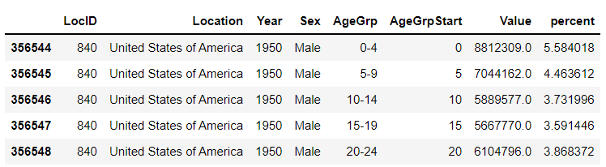
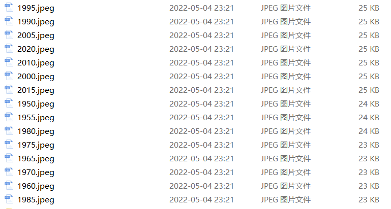
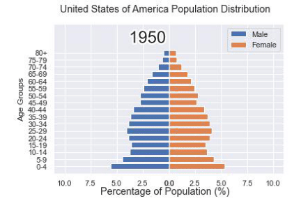
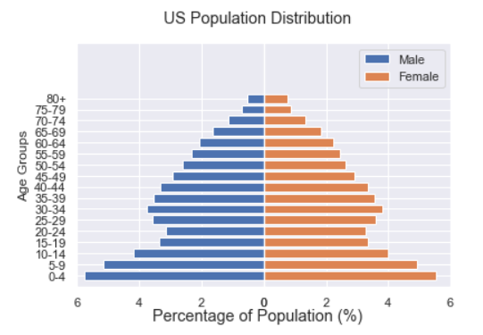
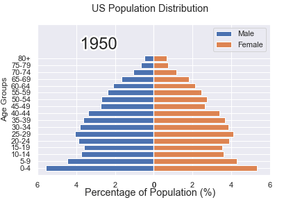
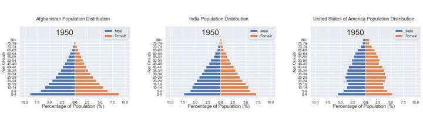

Python可视化<br />介绍一种制作gif格式图表的新方法，调用的是matplotlib的相关模块，其中的步骤与方法也是相当地简单易懂。
<a name="ogRf7"></a>
### 下载和导入数据库
这次用到的数据集是bokeh模块自带的数据集，通过下面这一行代码直接就可以下载
```python
import bokeh
bokeh.sampledata.download()
```
然后导入后面要用到的数据集挑选的是指定国家的1950年至今不同年龄阶段的人口所占比重的数据
```python
from bokeh.sampledata.population import data
import numpy as np

data = filter_loc('United States of America')
data.head()
```
output<br />
<a name="VtvqD"></a>
### 先绘制若干张静态的图表
可以先绘制若干张静态的图表，然后将这几张图表合成一张gif格式的动图即可，代码如下
```python
import seaborn as sns
import matplotlib.pyplot as plt
import matplotlib.patheffects as fx

# 绘制图表的函数
def make_plot(year):
    
    # 根据年份来筛选出数据
    df = data[data.Year == year]
        
    # 制作图表
    fig, (ax1, ax2) = plt.subplots(1, 2, sharey = True)
    ax1.invert_xaxis()
    fig.subplots_adjust(wspace = 0) 
    
    ax1.barh(df[df.Sex == 'Male'].AgeGrp, df[df.Sex == 'Male'].percent, label = 'Male')
    ax2.barh(df[df.Sex == 'Female'].AgeGrp, df[df.Sex == 'Female'].percent, label = 'Female', color = 'C1')
    
    country = df.Location.iloc[0]
    if country == 'United States of America': country == 'US'
        
    fig.suptitle(f'......')
    fig.supxlabel('......')
    fig.legend(bbox_to_anchor = (0.9, 0.88), loc = 'upper right')
    ax1.set_ylabel('Age Groups')
    
    return fig
```
自定义了一个绘制图表的函数，其中的参数是年份，逻辑很简单，想根据年份来筛选出数据，然后根据筛选出的数据来绘制图表，每一年的图表不尽相同
```python
years = [i for i in set(data.Year) if i < 2022]
years.sort()

for year in years:
    fig = make_plot(year)
    fig.savefig(f'{year}.jpeg',bbox_inches = 'tight')
```
output<br /><br />这样就生成了若干张静态的图表，然后集合成gif格式的图表几个，代码如下
```python
import matplotlib.animation as animation
fig, ax = plt.subplots()
ims = []

for year in years:
    im = ax.imshow(plt.imread(f'{year}.jpeg'), animated = True)
    ims.append([im])

ani = animation.ArtistAnimation(fig, ims, interval=600)
ani.save('us_population.gif')
```
output<br />
<a name="iCoSI"></a>
### 还有另外一种思路
可能看到这儿，有人会觉得上面提到的方法稍显麻烦，毕竟需要先生成数十张静态的图表，要是电脑的磁盘空间有点紧张的话，或者还没有这样的一个地方来存放这数十张的图表。于是乎就会疑问道，是不是可以一步到位的来。<br />当然也是可以的，例如打算绘制1950年到2020年不同年龄阶段的人口比例分布图，首先第一步在于先要绘制1950年，也就是起始年，该年不同年龄阶段的人口比例分布图，代码如下
```python
fig, (ax1, ax2) = plt.subplots(1, 2, sharey = True)
   
df = data[data.Year == 1955]

y_pos = [i for i in range(len(df[df.Sex == 'Male']))]
male = ax1.barh(y_pos, df[df.Sex == 'Male'].percent, label = 'Male',
               tick_label = df[df.Sex == 'Male'].AgeGrp)
female = ax2.barh(y_pos, df[df.Sex == 'Female'].percent, label = 'Female', 
                  color = 'C1', tick_label = df[df.Sex == 'Male'].AgeGrp)

ax1.invert_xaxis()
fig.suptitle('.......')
fig.supxlabel('....... (%)')
fig.legend(bbox_to_anchor = (0.9, 0.88), loc = 'upper right')
ax1.set_ylabel('Age Groups')
```
output<br /><br />然后自定义一个绘制图表的函数，其中参数为年份，目的在于通过年份来筛选出相对应的数据并且绘制出相对应的图表
```python
def run(year):
    # 通过年份来筛选出数据
    df = data[data.Year == year]
    # 针对不同地性别来绘制
    total_pop = df.Value.sum()
    df['percent'] = df.Value / total_pop * 100
    male.remove()
    y_pos = [i for i in range(len(df[df.Sex == 'Male']))]
    male.patches = ax1.barh(y_pos, df[df.Sex == 'Male'].percent, label = 'Male', 
                     color = 'C0', tick_label = df[df.Sex == 'Male'].AgeGrp)
    female.remove()
    female.patches = ax2.barh(y_pos, df[df.Sex == 'Female'].percent, label = 'Female',
                 
                 color = 'C1', tick_label = df[df.Sex == 'Female'].AgeGrp)

    text.set_text(year)
    return male#, female
```
然后调用`animation.FuncAnimation()`方法，
```python
ani = animation.FuncAnimation(fig, run, years, blit = True, repeat = True, 
                              interval = 600)
ani.save('文件名.gif')
```
output<br /><br />这样就可以一步到位生成gif格式的图表，避免生成数十张繁多地静态图片了。
<a name="wnwuG"></a>
### 将若干张gif动图放置在一张大图当中
最后可以将若干张gif动图放置在一张大的图表当中，代码如下
```python
import matplotlib.animation as animation

# 创建一个新的画布
fig, (ax, ax2, ax3) = plt.subplots(1, 3, figsize = (10, 3))

ims = []
for year in years:
    im = ax.imshow(plt.imread(f'文件1{year}.jpeg'), animated = True)
    im2 = ax2.imshow(plt.imread(f'文件2{year}.jpeg'), animated = True)
    im3 = ax3.imshow(plt.imread(f'文件3{year}.jpeg'), animated = True)
    ims.append([im, im2, im3])

ani = animation.ArtistAnimation(fig, ims, interval=600)
ani.save('comparison.gif')
```
output<br />
